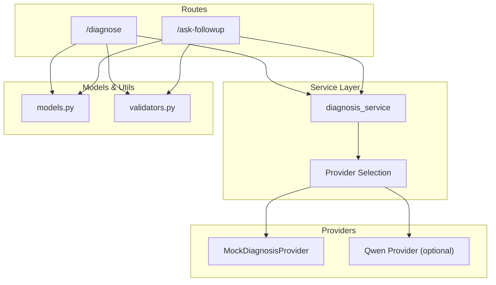
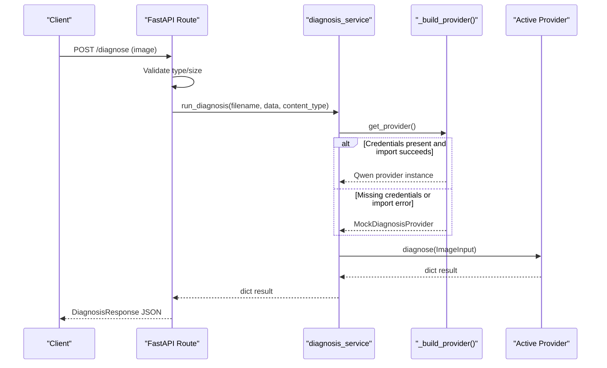
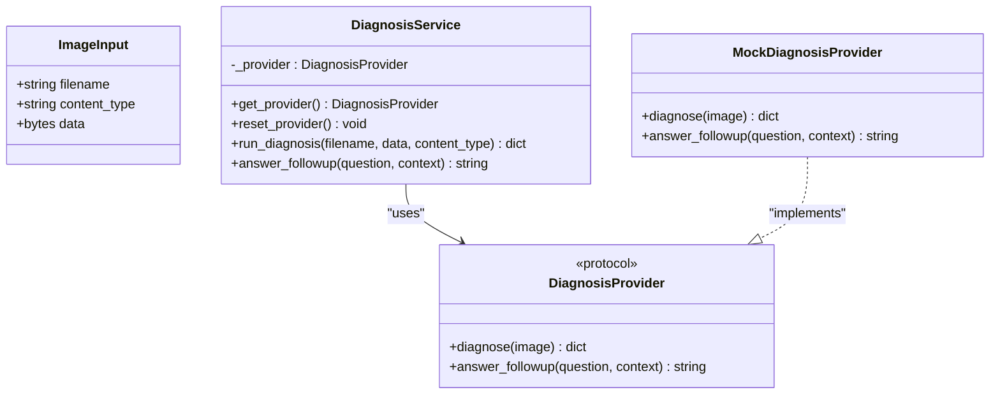
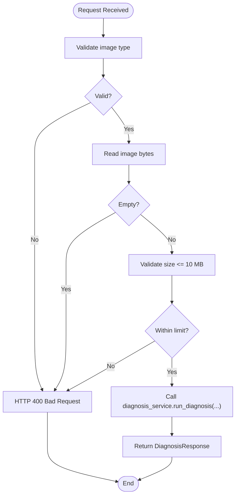
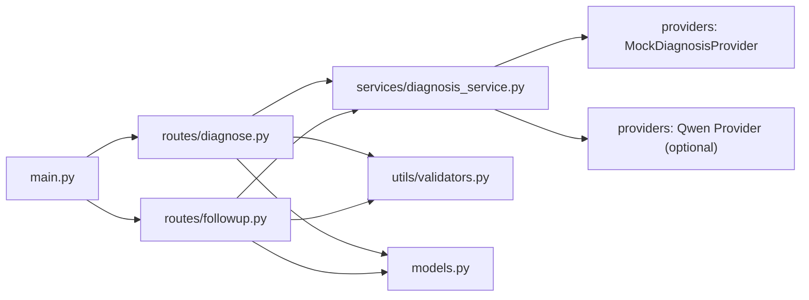

# AI Integration Guide

<cite>
**Referenced Files in This Document**
- [diagnosis_service.py](file://backend/services/diagnosis_service.py)
- [diagnose.py](file://backend/routes/diagnose.py)
- [followup.py](file://backend/routes/followup.py)
- [models.py](file://backend/models.py)
- [main.py](file://backend/main.py)
- [validators.py](file://backend/utils/validators.py)
- [test_api.py](file://tests/test_api.py)
</cite>

## Table of Contents
1. [Introduction](#introduction)
2. [Project Structure](#project-structure)
3. [Core Components](#core-components)
4. [Architecture Overview](#architecture-overview)
5. [Detailed Component Analysis](#detailed-component-analysis)
6. [Dependency Analysis](#dependency-analysis)
7. [Performance Considerations](#performance-considerations)
8. [Troubleshooting Guide](#troubleshooting-guide)
9. [Conclusion](#conclusion)
10. [Appendices](#appendices)

## Introduction
This guide explains FasalDoc’s provider architecture for integrating real AI services behind a stable interface. The backend is designed so that routes never hardcode AI logic; instead, they call a service layer that selects an active provider at runtime. When credentials are configured, the system attempts to load a Qwen/Alibaba Cloud DashScope provider; otherwise it falls back to a mock provider that returns deterministic responses. This design enables pluggable AI backends and safe offline operation.

## Project Structure
The relevant parts of the backend are organized into:
- Routes: HTTP endpoints for diagnosis and follow-up questions
- Services: Provider abstraction and selection logic
- Models: Request/response contracts used by routes and tests
- Utils: Input validation helpers
- Tests: Offline API tests validating behavior without external AI calls

**Diagram sources**
- [diagnose.py:13-59](file://backend/routes/diagnose.py#L13-L59)
- [followup.py:10-39](file://backend/routes/followup.py#L10-L39)
- [diagnosis_service.py:40-128](file://backend/services/diagnosis_service.py#L40-L128)
- [models.py:10-58](file://backend/models.py#L10-L58)
- [validators.py:1-19](file://backend/utils/validators.py#L1-L19)

**Section sources**
- [diagnose.py:13-59](file://backend/routes/diagnose.py#L13-L59)
- [followup.py:10-39](file://backend/routes/followup.py#L10-L39)
- [diagnosis_service.py:40-128](file://backend/services/diagnosis_service.py#L40-L128)
- [models.py:10-58](file://backend/models.py#L10-L58)
- [validators.py:1-19](file://backend/utils/validators.py#L1-L19)

## Core Components
- DiagnosisProvider protocol: A stable interface with two methods—diagnose(image) and answer_followup(question, context). All providers must implement this contract so routes remain unchanged when swapping backends.
- MockDiagnosisProvider: An offline fallback returning deterministic, contract-valid responses. It ensures the app works without network or cloud access.
- Provider factory: A module-level builder that selects the active provider once per process. It checks environment configuration and dynamically imports the optional Qwen provider; on missing credentials or construction errors, it falls back to the mock.
- Service helpers: run_diagnosis and answer_followup wrap provider calls and are used by routes.
- Models: Pydantic models define the response shape for diagnosis and follow-up endpoints, ensuring consistent contracts between backend and frontend.
- Validators: Helpers enforce allowed image types, size limits, and non-empty questions.

**Section sources**
- [diagnosis_service.py:31-128](file://backend/services/diagnosis_service.py#L31-L128)
- [models.py:10-58](file://backend/models.py#L10-L58)
- [validators.py:1-19](file://backend/utils/validators.py#L1-L19)

## Architecture Overview
The runtime flow uses a provider factory to select either a real AI provider or the mock based on environment variables. Routes delegate to the service layer, which calls the selected provider. Errors from routes are normalized to user-friendly HTTP responses, while internal/AI errors are not leaked to clients.

**Diagram sources**
- [diagnose.py:13-59](file://backend/routes/diagnose.py#L13-L59)
- [diagnosis_service.py:75-128](file://backend/services/diagnosis_service.py#L75-L128)

**Section sources**
- [diagnose.py:13-59](file://backend/routes/diagnose.py#L13-L59)
- [diagnosis_service.py:75-128](file://backend/services/diagnosis_service.py#L75-L128)

## Detailed Component Analysis

### DiagnosisProvider Protocol and Provider Selection
- Protocol definition: Defines the contract for any provider implementing diagnose and answer_followup.
- Mock implementation: Provides deterministic responses for both methods, enabling full offline testing and development.
- Factory logic: Checks for a configured API key, attempts to import and instantiate the Qwen provider, and falls back to the mock if unavailable. The provider is cached after first use and can be reset for tests.

**Diagram sources**
- [diagnosis_service.py:31-128](file://backend/services/diagnosis_service.py#L31-L128)

**Section sources**
- [diagnosis_service.py:31-128](file://backend/services/diagnosis_service.py#L31-L128)

### Routes and Error Handling
- Diagnose route: Validates image type and size, reads file bytes, delegates to service, and normalizes exceptions to HTTP 500 with a user-friendly message.
- Follow-up route: Validates question, delegates to service, and wraps exceptions similarly.
- CORS: Configured via environment variable to allow local frontend origins.

**Diagram sources**
- [diagnose.py:13-59](file://backend/routes/diagnose.py#L13-L59)
- [validators.py:1-19](file://backend/utils/validators.py#L1-L19)

**Section sources**
- [diagnose.py:13-59](file://backend/routes/diagnose.py#L13-L59)
- [followup.py:10-39](file://backend/routes/followup.py#L10-L39)
- [validators.py:1-19](file://backend/utils/validators.py#L1-L19)

### Environment Configuration and Credential Setup
- Environment variable: DASHSCOPE_API_KEY controls whether the Qwen provider is attempted.
- Placeholder detection: The factory treats empty or placeholder keys as unconfigured and falls back to the mock.
- CORS: CORS_ALLOW_ORIGINS configures allowed frontend origins.

Configuration steps:
1. Set DASHSCOPE_API_KEY to a valid key before starting the server.
2. If the key is missing or a placeholder, the service automatically uses the mock provider.
3. Optionally set CORS_ALLOW_ORIGINS to allow your frontend origin during development.

**Section sources**
- [diagnosis_service.py:75-95](file://backend/services/diagnosis_service.py#L75-L95)
- [main.py:19-35](file://backend/main.py#L19-L35)

### Creating a Custom Provider (Qwen/Alibaba Cloud DashScope)
To integrate a real AI backend:
1. Create a new provider module under backend/services named qwen_provider.py.
2. Implement a factory function create_provider() that returns an object satisfying the DiagnosisProvider protocol.
3. Ensure the provider implements:
   - diagnose(image: ImageInput) -> dict
   - answer_followup(question: str, context: Optional[dict] = None) -> str
4. Return dictionaries conforming to the DiagnosisResponse model fields for diagnose results.
5. The existing factory will detect DASHSCOPE_API_KEY and import your provider automatically.

Integration checklist:
- Provide robust error handling inside the provider (network timeouts, rate limits, invalid responses).
- Map provider errors to meaningful diagnostics or fallbacks where appropriate.
- Keep authentication and configuration within the provider module; do not modify routes.

**Section sources**
- [diagnosis_service.py:7-19](file://backend/services/diagnosis_service.py#L7-L19)
- [diagnosis_service.py:75-95](file://backend/services/diagnosis_service.py#L75-L95)

### Testing Provider Implementations
Use the provided test utilities to validate behavior without external dependencies:
- Use FastAPI TestClient to exercise endpoints and assert status codes and response shapes.
- Reset the provider cache between tests using reset_provider() to ensure isolation.
- Verify fallback behavior by removing DASHSCOPE_API_KEY and asserting the mock provider is used.

Recommended tests:
- Endpoint validation: invalid types, empty uploads, oversized images, missing fields.
- Response contracts: ensure fields match DiagnosisResponse and FollowupResponse.
- Provider selection: confirm mock usage when credentials are absent.

**Section sources**
- [test_api.py:1-129](file://tests/test_api.py#L1-L129)

## Dependency Analysis
The following diagram shows how components depend on each other and where the provider selection occurs.

**Diagram sources**
- [diagnose.py:1-59](file://backend/routes/diagnose.py#L1-L59)
- [followup.py:1-40](file://backend/routes/followup.py#L1-L40)
- [diagnosis_service.py:1-128](file://backend/services/diagnosis_service.py#L1-L128)
- [models.py:1-58](file://backend/models.py#L1-L58)
- [validators.py:1-19](file://backend/utils/validators.py#L1-L19)
- [main.py:1-45](file://backend/main.py#L1-L45)

**Section sources**
- [diagnose.py:1-59](file://backend/routes/diagnose.py#L1-L59)
- [followup.py:1-40](file://backend/routes/followup.py#L1-L40)
- [diagnosis_service.py:1-128](file://backend/services/diagnosis_service.py#L1-L128)
- [models.py:1-58](file://backend/models.py#L1-L58)
- [validators.py:1-19](file://backend/utils/validators.py#L1-L19)
- [main.py:1-45](file://backend/main.py#L1-L45)

## Performance Considerations
- Provider caching: The active provider is instantiated once and reused for all requests, reducing overhead.
- Early input validation: Reject invalid or oversized images before calling the provider to minimize unnecessary work.
- Graceful degradation: When the real provider is unavailable, the mock ensures responsiveness and predictable performance.
- Network calls: Real providers should implement retries and timeouts internally to avoid blocking requests excessively.

## Troubleshooting Guide
Common issues and resolutions:
- Missing or placeholder API key: The service falls back to the mock provider. Set DASHSCOPE_API_KEY to a valid value to enable the real provider.
- Import errors for the Qwen provider: If the provider module cannot be imported, the service logs a warning and uses the mock. Check module path and dependencies.
- Unexpected HTTP 500: Routes catch exceptions and return a generic error. Inspect server logs for details and ensure the provider handles errors gracefully.
- CORS errors: Configure CORS_ALLOW_ORIGINS to include your frontend origin during development.

Validation and testing tips:
- Use the test suite to verify endpoint behavior and provider fallback.
- Reset the provider cache between tests to avoid state leakage.
- Confirm response schemas match the models to prevent frontend mismatches.

**Section sources**
- [diagnosis_service.py:75-95](file://backend/services/diagnosis_service.py#L75-L95)
- [diagnose.py:45-59](file://backend/routes/diagnose.py#L45-L59)
- [followup.py:25-34](file://backend/routes/followup.py#L25-L34)
- [test_api.py:114-129](file://tests/test_api.py#L114-L129)

## Conclusion
FasalDoc’s provider architecture provides a clean separation between HTTP routes and AI backends through a stable protocol and a dynamic factory. With environment-based configuration, the system seamlessly switches between a real Qwen/Alibaba Cloud provider and a reliable mock fallback. This design simplifies integration, testing, and maintenance while ensuring robust operation across environments.

## Appendices

### Step-by-Step: Integrating a New AI Service
1. Create backend/services/qwen_provider.py.
2. Implement create_provider() returning an object that satisfies DiagnosisProvider.
3. Ensure diagnose returns a dictionary with fields matching DiagnosisResponse.
4. Ensure answer_followup returns a string suitable for FollowupResponse.
5. Set DASHSCOPE_API_KEY to a valid key.
6. Restart the server; the factory will load your provider automatically.
7. Run tests to validate behavior and fallback paths.

**Section sources**
- [diagnosis_service.py:7-19](file://backend/services/diagnosis_service.py#L7-L19)
- [diagnosis_service.py:75-95](file://backend/services/diagnosis_service.py#L75-L95)
- [models.py:10-58](file://backend/models.py#L10-L58)

### Example Patterns for Error Handling, Retries, and Fallbacks
- Error handling: Catch network exceptions and translate them into user-friendly messages or retry flags.
- Retry logic: Implement exponential backoff for transient failures (timeouts, rate limits).
- Fallback mechanisms: If the primary provider fails repeatedly, degrade to a secondary provider or return a graceful error to the client.

Note: These patterns should be implemented inside your custom provider module to keep routes simple and resilient.