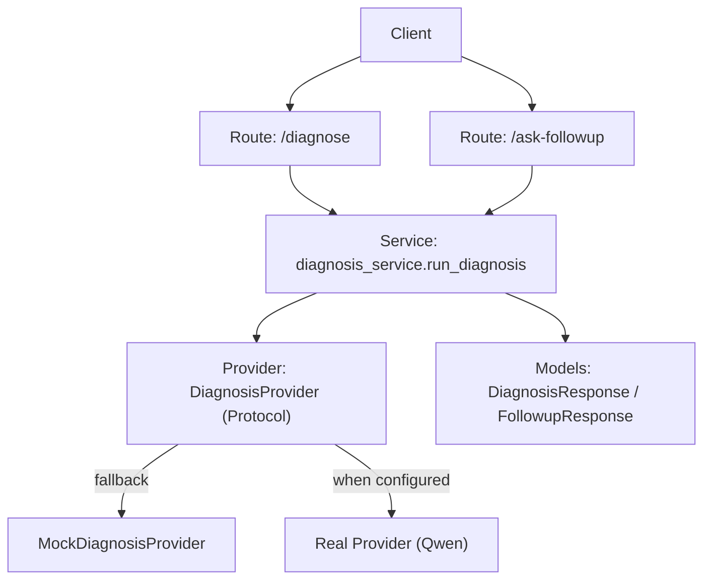
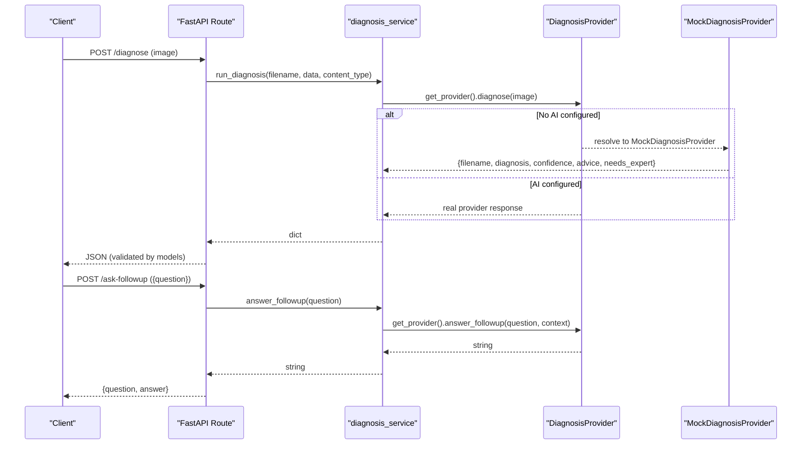
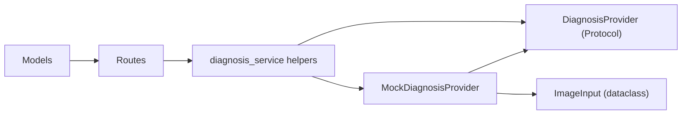

# Mock Provider Implementation

<cite>
**Referenced Files in This Document**
- [diagnosis_service.py](file://backend/services/diagnosis_service.py)
- [models.py](file://backend/models.py)
- [diagnose.py](file://backend/routes/diagnose.py)
- [followup.py](file://backend/routes/followup.py)
- [validators.py](file://backend/utils/validators.py)
- [test_api.py](file://tests/test_api.py)
</cite>

## Table of Contents
1. [Introduction](#introduction)
2. [Project Structure](#project-structure)
3. [Core Components](#core-components)
4. [Architecture Overview](#architecture-overview)
5. [Detailed Component Analysis](#detailed-component-analysis)
6. [Dependency Analysis](#dependency-analysis)
7. [Performance Considerations](#performance-considerations)
8. [Troubleshooting Guide](#troubleshooting-guide)
9. [Conclusion](#conclusion)
10. [Appendices](#appendices)

## Introduction
This document explains the MockDiagnosisProvider class, which acts as the offline fallback when no AI service is configured. It provides deterministic, contract-valid responses for both diagnosis and follow-up functionality so that the application and tests can run without external dependencies. You will learn the mock response structure, how to extend it with additional scenarios, simulate different confidence levels, create realistic failure scenarios, and use it effectively in unit tests and development workflows.

## Project Structure
The mock provider lives in the service layer and is selected automatically by the provider factory when credentials are missing or unavailable. Routes call service helpers that delegate to the active provider (mock or real). Models define the API contracts used by routes and validated by Pydantic.

**Diagram sources**
- [diagnose.py:13-59](file://backend/routes/diagnose.py#L13-L59)
- [followup.py:10-40](file://backend/routes/followup.py#L10-L40)
- [diagnosis_service.py:40-127](file://backend/services/diagnosis_service.py#L40-L127)
- [models.py:10-58](file://backend/models.py#L10-L58)

**Section sources**
- [diagnose.py:13-59](file://backend/routes/diagnose.py#L13-L59)
- [followup.py:10-40](file://backend/routes/followup.py#L10-L40)
- [diagnosis_service.py:40-127](file://backend/services/diagnosis_service.py#L40-L127)
- [models.py:10-58](file://backend/models.py#L10-L58)

## Core Components
- DiagnosisProvider protocol: Stable interface with diagnose(image) returning a dict and answer_followup(question, context) returning a string.
- MockDiagnosisProvider: Offline fallback implementing the protocol deterministically.
- Provider factory: Selects the real provider if configured; otherwise returns the mock.
- Service helpers: run_diagnosis and answer_followup route calls to the active provider.
- Models: Define the expected response shapes for diagnosis and follow-up.

Key responsibilities:
- Provide consistent, valid responses even without network access.
- Enforce the same contract as the real provider to keep routes unchanged.
- Allow tests to assert behavior without external services.

**Section sources**
- [diagnosis_service.py:40-73](file://backend/services/diagnosis_service.py#L40-L73)
- [diagnosis_service.py:80-127](file://backend/services/diagnosis_service.py#L80-L127)
- [models.py:10-58](file://backend/models.py#L10-L58)

## Architecture Overview
The system uses a provider abstraction to decouple routes from AI implementation details. When no AI key is present, the mock provider is used transparently.

**Diagram sources**
- [diagnose.py:13-59](file://backend/routes/diagnose.py#L13-L59)
- [followup.py:10-40](file://backend/routes/followup.py#L10-L40)
- [diagnosis_service.py:80-127](file://backend/services/diagnosis_service.py#L80-L127)
- [models.py:10-58](file://backend/models.py#L10-L58)

## Detailed Component Analysis

### MockDiagnosisProvider
Responsibilities:
- Implement the DiagnosisProvider protocol.
- Return deterministic, contract-compliant responses for diagnosis and follow-up.
- Ensure confidence is within bounds and fields match the model expectations.

Behavior:
- diagnose(image): Returns a dictionary containing filename, diagnosis, confidence, advice, and needs_expert. The values are fixed and deterministic.
- answer_followup(question, context=None): Returns a placeholder string indicating temporary behavior.

Contract alignment:
- Response fields mirror DiagnosisResponse schema: filename (string), diagnosis (string), confidence (float in [0,1]), advice (string), needs_expert (bool).
- Follow-up answer is a string, wrapped into FollowupResponse by the route.

Extensibility guidance:
- To simulate different confidence levels, vary the returned confidence value based on input characteristics (e.g., hash of filename or content type).
- To simulate expert escalation, set needs_expert conditionally based on inputs.
- To simulate varied diagnoses and advice, branch on image metadata or question keywords.

Failure simulation:
- For testing error paths, raise exceptions inside the mock methods to exercise route-level error handling and client-side error messages.
- Use reset_provider() to swap providers during tests.

Usage in tests:
- Tests verify that without credentials, the provider resolves to MockDiagnosisProvider.
- Tests assert that run_diagnosis returns a dict matching the model shape and constraints.
- Tests assert that answer_followup returns a non-empty string.

**Section sources**
- [diagnosis_service.py:55-73](file://backend/services/diagnosis_service.py#L55-L73)
- [models.py:10-31](file://backend/models.py#L10-L31)
- [test_api.py:114-128](file://tests/test_api.py#L114-L128)

### Provider Factory and Selection Logic
Responsibilities:
- Determine whether a real provider should be used based on environment configuration.
- Fall back to MockDiagnosisProvider when credentials are missing or construction fails.

Selection logic:
- If DASHSCOPE_API_KEY is present and not a placeholder, attempt to import and instantiate the real provider.
- On any exception, log a warning and return the mock provider.
- Cache the selected provider for subsequent calls; reset via reset_provider().

Implications:
- Ensures robust operation without external dependencies.
- Enables seamless integration of the real provider later without changing routes.

**Section sources**
- [diagnosis_service.py:75-111](file://backend/services/diagnosis_service.py#L75-L111)

### Service Helpers
Responsibilities:
- Provide simple entry points for routes: run_diagnosis and answer_followup.
- Construct ImageInput and delegate to the active provider.

Flow:
- run_diagnosis builds an ImageInput and calls provider.diagnose.
- answer_followup calls provider.answer_followup with optional context.

**Section sources**
- [diagnosis_service.py:116-127](file://backend/services/diagnosis_service.py#L116-L127)

### Route Integration and Validation
Responsibilities:
- Validate inputs before calling the service.
- Handle errors and return appropriate HTTP status codes.
- Serialize responses using Pydantic models.

Validation:
- Image type and size checks via validators.
- Question validation ensures non-empty input.

Error handling:
- Catch internal exceptions and convert to user-friendly HTTP 500 responses.
- Preserve HTTPException instances raised by validation.

**Section sources**
- [diagnose.py:13-59](file://backend/routes/diagnose.py#L13-L59)
- [followup.py:10-40](file://backend/routes/followup.py#L10-L40)
- [validators.py:1-19](file://backend/utils/validators.py#L1-L19)

### Data Contracts (Models)
Responsibilities:
- Define strict schemas for API payloads and responses.
- Provide examples and constraints (e.g., confidence range).

Contracts:
- DiagnosisResponse: filename, diagnosis, confidence (0..1), advice, needs_expert.
- FollowupRequest: question (non-empty).
- FollowupResponse: question, answer.

These contracts ensure that the mock provider’s outputs are always valid from the perspective of the API layer.

**Section sources**
- [models.py:10-58](file://backend/models.py#L10-L58)

## Dependency Analysis
The mock provider depends only on Python standard library types and the module’s own definitions. It has no external runtime dependencies.

**Diagram sources**
- [diagnosis_service.py:31-73](file://backend/services/diagnosis_service.py#L31-L73)
- [diagnose.py:1-59](file://backend/routes/diagnose.py#L1-L59)
- [followup.py:1-40](file://backend/routes/followup.py#L1-L40)
- [models.py:10-58](file://backend/models.py#L10-L58)

**Section sources**
- [diagnosis_service.py:31-73](file://backend/services/diagnosis_service.py#L31-L73)
- [diagnose.py:1-59](file://backend/routes/diagnose.py#L1-L59)
- [followup.py:1-40](file://backend/routes/followup.py#L1-L40)
- [models.py:10-58](file://backend/models.py#L10-L58)

## Performance Considerations
- The mock provider performs constant-time operations with negligible overhead.
- No I/O or network calls occur, making it ideal for fast unit tests and local development.
- Provider caching avoids repeated selection logic after first use.

[No sources needed since this section provides general guidance]

## Troubleshooting Guide
Common issues and resolutions:
- Unexpected provider selection: Ensure DASHSCOPE_API_KEY is absent or set to a placeholder to force mock usage; call reset_provider() between tests to clear cached state.
- Assertion failures on response shape: Verify that your extended mock still returns all required fields and respects model constraints (e.g., confidence in [0,1]).
- Route errors: Check that input validation passes (image type/size, non-empty question) before reaching the provider.

Testing tips:
- Use reset_provider() to isolate tests that change provider behavior.
- Assert both status codes and response bodies to validate contract compliance.
- Introduce controlled exceptions in the mock to test error handling paths.

**Section sources**
- [diagnosis_service.py:80-111](file://backend/services/diagnosis_service.py#L80-L111)
- [test_api.py:114-128](file://tests/test_api.py#L114-L128)
- [diagnose.py:21-59](file://backend/routes/diagnose.py#L21-L59)
- [followup.py:18-34](file://backend/routes/followup.py#L18-L34)

## Conclusion
The MockDiagnosisProvider offers a reliable, deterministic offline fallback that satisfies the DiagnosisProvider protocol and aligns with the API models. It enables full-stack testing and development without external services, while keeping the path to integrate a real AI provider clean and isolated. By extending the mock thoughtfully, you can simulate diverse scenarios, confidence levels, and failure modes to strengthen test coverage and improve resilience.

[No sources needed since this section summarizes without analyzing specific files]

## Appendices

### How to Extend the Mock Provider
- Vary confidence: Compute a deterministic value from filename or content type to simulate high/low confidence cases.
- Toggle expert escalation: Set needs_expert based on keyword detection in the question or image metadata.
- Simulate failures: Raise exceptions in diagnose or answer_followup to exercise route-level error handling.

Example patterns (conceptual):
- Branch on hash of filename to choose among multiple diagnoses and advice texts.
- Return needs_expert=True for edge-case conditions to test escalation flows.
- Inject randomness deterministically for repeatable tests.

[No sources needed since this section provides conceptual guidance]

### Using the Mock Provider in Unit Tests
- Ensure no AI key is set or explicitly remove it in tests to guarantee mock usage.
- Call reset_provider() before each test to avoid cross-test contamination.
- Assert response structure and field constraints to maintain contract compliance.
- Test both happy paths and error paths by raising exceptions in the mock where needed.

**Section sources**
- [test_api.py:114-128](file://tests/test_api.py#L114-L128)

### Development Workflow Tips
- Run the backend locally without credentials to validate UI interactions against the mock.
- Use the OpenAPI docs to explore endpoints and example payloads.
- Switch to the real provider by setting DASHSCOPE_API_KEY and restarting the service; the routes remain unchanged.

**Section sources**
- [README.md:80-106](file://README.md#L80-L106)