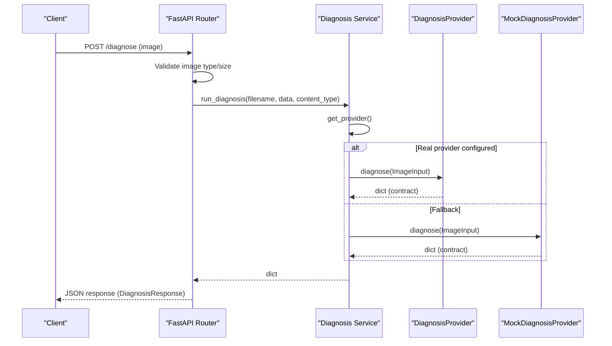
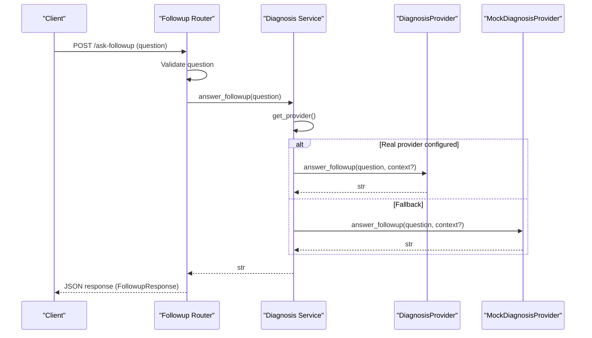
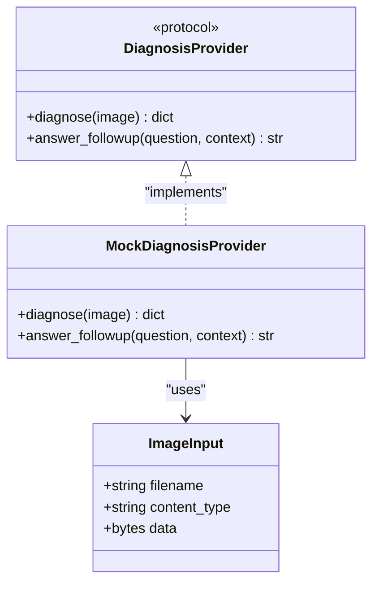
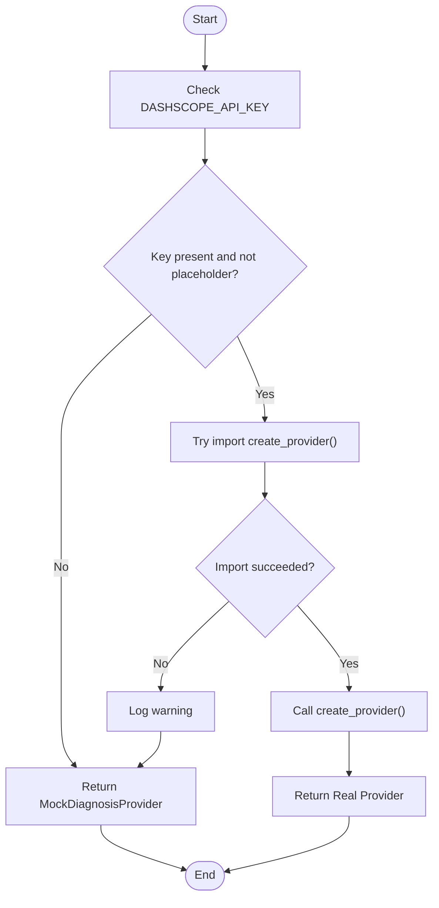
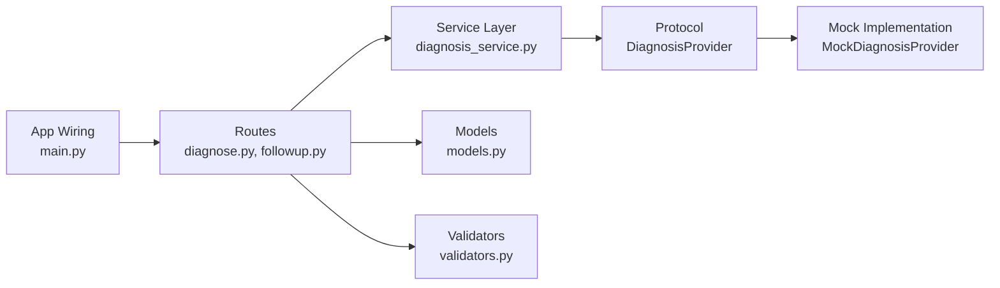

# Provider Architecture

<cite>
**Referenced Files in This Document**
- [diagnosis_service.py](file://backend/services/diagnosis_service.py)
- [diagnose.py](file://backend/routes/diagnose.py)
- [followup.py](file://backend/routes/followup.py)
- [models.py](file://backend/models.py)
- [validators.py](file://backend/utils/validators.py)
- [main.py](file://backend/main.py)
- [test_api.py](file://tests/test_api.py)
</cite>

## Table of Contents
1. [Introduction](#introduction)
2. [Project Structure](#project-structure)
3. [Core Components](#core-components)
4. [Architecture Overview](#architecture-overview)
5. [Detailed Component Analysis](#detailed-component-analysis)
6. [Dependency Analysis](#dependency-analysis)
7. [Performance Considerations](#performance-considerations)
8. [Troubleshooting Guide](#troubleshooting-guide)
9. [Conclusion](#conclusion)
10. [Appendices](#appendices)

## Introduction
This document explains FasalDoc’s provider architecture centered on the DiagnosisProvider protocol. The design decouples API routes from AI backend implementation by defining a stable interface and a factory that selects between a real AI provider (when configured) and an offline mock provider. Routes remain unchanged when switching backends, enabling pluggable AI integration without touching route code.

## Project Structure
The provider abstraction lives in the service layer and is consumed by FastAPI routes. The application wires routers into the main app and uses validators for input validation. Tests exercise both HTTP endpoints and service-layer behavior to ensure the fallback mechanism works reliably.

```mermaid
graph TB
Client["Client"]
Main["FastAPI App<br/>main.py"]
DiagnoseRoute["/diagnose<br/>routes/diagnose.py"]
FollowupRoute["/ask-followup<br/>routes/followup.py"]
Service["Diagnosis Service<br/>services/diagnosis_service.py"]
Provider["DiagnosisProvider Protocol<br/>services/diagnosis_service.py"]
Mock["MockDiagnosisProvider<br/>services/diagnosis_service.py"]
Models["Pydantic Models<br/>models.py"]
Validators["Validators<br/>utils/validators.py"]
Client --> Main
Main --> DiagnoseRoute
Main --> FollowupRoute
DiagnoseRoute --> Service
FollowupRoute --> Service
Service --> Provider
Provider --> Mock
DiagnoseRoute --> Validators
FollowupRoute --> Validators
DiagnoseRoute --> Models
FollowupRoute --> Models
```

**Diagram sources**
- [main.py:1-45](file://backend/main.py#L1-L45)
- [diagnose.py:1-59](file://backend/routes/diagnose.py#L1-L59)
- [followup.py:1-40](file://backend/routes/followup.py#L1-L40)
- [diagnosis_service.py:1-128](file://backend/services/diagnosis_service.py#L1-L128)
- [models.py:1-58](file://backend/models.py#L1-L58)
- [validators.py:1-19](file://backend/utils/validators.py#L1-L19)

**Section sources**
- [main.py:1-45](file://backend/main.py#L1-L45)
- [diagnose.py:1-59](file://backend/routes/diagnose.py#L1-L59)
- [followup.py:1-40](file://backend/routes/followup.py#L1-L40)
- [diagnosis_service.py:1-128](file://backend/services/diagnosis_service.py#L1-L128)
- [models.py:1-58](file://backend/models.py#L1-L58)
- [validators.py:1-19](file://backend/utils/validators.py#L1-L19)

## Core Components
- DiagnosisProvider protocol: Defines the contract for diagnosis and follow-up capabilities with two methods: diagnose() and answer_followup().
- MockDiagnosisProvider: A fully compliant offline implementation returning deterministic responses.
- Factory and caching: _build_provider() dynamically chooses the real provider if credentials are present; otherwise returns the mock. get_provider() caches the instance for reuse. reset_provider() allows tests or runtime reconfiguration.
- Route helpers: run_diagnosis() and answer_followup() delegate to the active provider while keeping routes free of backend-specific logic.
- Input models and validators: Pydantic models define request/response contracts; validators enforce image type, size, and question constraints.

Key responsibilities:
- Routes validate inputs and delegate to services.
- Services abstract AI backends behind a stable protocol.
- Factory ensures graceful fallback to mock when real provider is unavailable.
- Tests verify end-to-end behavior and provider selection.

**Section sources**
- [diagnosis_service.py:31-128](file://backend/services/diagnosis_service.py#L31-L128)
- [diagnose.py:1-59](file://backend/routes/diagnose.py#L1-L59)
- [followup.py:1-40](file://backend/routes/followup.py#L1-L40)
- [models.py:1-58](file://backend/models.py#L1-L58)
- [validators.py:1-19](file://backend/utils/validators.py#L1-L19)

## Architecture Overview
The provider architecture isolates AI backend concerns from HTTP routing. Routes call service helpers that obtain a provider via a factory. If environment configuration indicates a real provider is available, it is loaded; otherwise, the mock provider is used. This enables seamless swapping of backends without modifying route code.

**Diagram sources**
- [diagnose.py:13-59](file://backend/routes/diagnose.py#L13-L59)
- [diagnosis_service.py:80-128](file://backend/services/diagnosis_service.py#L80-L128)
- [models.py:10-31](file://backend/models.py#L10-L31)

**Diagram sources**
- [followup.py:10-40](file://backend/routes/followup.py#L10-L40)
- [diagnosis_service.py:101-128](file://backend/services/diagnosis_service.py#L101-L128)
- [models.py:34-58](file://backend/models.py#L34-L58)

## Detailed Component Analysis

### DiagnosisProvider Protocol and Interface Contract
- Purpose: Stable interface that routes depend on, ensuring no changes are required when swapping AI backends.
- Methods:
  - diagnose(image: ImageInput) -> dict
    - Parameters:
      - image: An object containing filename, content_type, and raw bytes.
    - Return: A dictionary conforming to the DiagnosisResponse model fields: filename, diagnosis, confidence (0..1), advice, needs_expert.
    - Behavior: Performs disease diagnosis on the provided image and returns structured results.
  - answer_followup(question: str, context: Optional[dict] = None) -> str
    - Parameters:
      - question: User’s follow-up question string.
      - context: Optional additional context for richer answers.
    - Return: A human-readable string answer.
    - Behavior: Provides contextual guidance based on prior diagnosis or conversation context.

Implementation notes:
- The protocol guarantees consistent method signatures across providers.
- The mock provider satisfies the protocol and returns deterministic outputs suitable for testing and offline operation.

**Section sources**
- [diagnosis_service.py:31-73](file://backend/services/diagnosis_service.py#L31-L73)
- [models.py:10-58](file://backend/models.py#L10-L58)

#### Class Diagram

**Diagram sources**
- [diagnosis_service.py:31-73](file://backend/services/diagnosis_service.py#L31-L73)

### Factory Pattern in _build_provider()
- Selection logic:
  - Checks for a non-placeholder API key via environment variable.
  - Attempts to import and instantiate the real provider module.
  - On success, returns the real provider; on failure or absence of config, returns the mock provider.
- Caching:
  - get_provider() lazily builds and caches the provider instance.
  - reset_provider() clears the cache to allow reconfiguration or test isolation.

Behavioral guarantees:
- Routes never need to know which provider is active.
- Application remains functional without external dependencies.

**Section sources**
- [diagnosis_service.py:75-111](file://backend/services/diagnosis_service.py#L75-L111)

#### Flowchart: Provider Selection

**Diagram sources**
- [diagnosis_service.py:75-111](file://backend/services/diagnosis_service.py#L75-L111)

### Route Integration and Error Handling
- /diagnose:
  - Validates image type and size using validators.
  - Reads image bytes and delegates to diagnosis_service.run_diagnosis().
  - Catches internal exceptions and converts them to user-friendly HTTP 500 errors.
- /ask-followup:
  - Validates question content.
  - Delegates to diagnosis_service.answer_followup().
  - Converts unexpected errors to HTTP 500 responses.

Error handling strategy:
- Input validation errors return HTTP 400 or 422.
- Internal/AI errors are masked from clients with generic messages.
- Providers should raise exceptions on unrecoverable failures; routes translate these to appropriate HTTP status codes.

**Section sources**
- [diagnose.py:13-59](file://backend/routes/diagnose.py#L13-L59)
- [followup.py:10-40](file://backend/routes/followup.py#L10-L40)
- [validators.py:1-19](file://backend/utils/validators.py#L1-L19)

### Data Contracts
- DiagnosisResponse:
  - Fields: filename, diagnosis, confidence (0..1), advice, needs_expert.
  - Used as the response model for /diagnose.
- FollowupRequest/FollowupResponse:
  - Request contains a non-empty question.
  - Response echoes the question and provides an answer string.

These contracts ensure frontend compatibility and provide clear expectations for providers’ output shapes.

**Section sources**
- [models.py:10-58](file://backend/models.py#L10-L58)

### Testing Approaches
- End-to-end tests use FastAPI TestClient to exercise routes without network calls.
- Service-level tests assert provider fallback behavior and response contracts.
- Environment manipulation (e.g., removing API keys) verifies mock fallback activation.
- Assertions cover status codes, field presence, value ranges, and CORS headers.

Recommended practices:
- Always reset provider state before tests that change environment variables.
- Validate both happy paths and error paths (invalid types, empty uploads, oversized files).
- Keep tests offline to avoid flakiness and external dependencies.

**Section sources**
- [test_api.py:1-129](file://tests/test_api.py#L1-L129)

## Dependency Analysis
The following diagram shows how components depend on each other and where the provider abstraction sits within the stack.

**Diagram sources**
- [diagnose.py:1-59](file://backend/routes/diagnose.py#L1-L59)
- [followup.py:1-40](file://backend/routes/followup.py#L1-L40)
- [diagnosis_service.py:1-128](file://backend/services/diagnosis_service.py#L1-L128)
- [models.py:1-58](file://backend/models.py#L1-L58)
- [validators.py:1-19](file://backend/utils/validators.py#L1-L19)
- [main.py:1-45](file://backend/main.py#L1-L45)

**Section sources**
- [diagnose.py:1-59](file://backend/routes/diagnose.py#L1-L59)
- [followup.py:1-40](file://backend/routes/followup.py#L1-L40)
- [diagnosis_service.py:1-128](file://backend/services/diagnosis_service.py#L1-L128)
- [models.py:1-58](file://backend/models.py#L1-L58)
- [validators.py:1-19](file://backend/utils/validators.py#L1-L19)
- [main.py:1-45](file://backend/main.py#L1-L45)

## Performance Considerations
- Lazy provider initialization: The provider is built only once and cached, minimizing overhead per request.
- Minimal validation cost: Lightweight validators prevent unnecessary processing early in the pipeline.
- Graceful degradation: Fallback to mock avoids expensive or failing network calls when credentials are missing.
- Recommendations:
  - Ensure real provider implementations also cache any heavy resources (clients, sessions).
  - Avoid synchronous blocking calls inside provider methods; prefer async where possible.
  - Monitor logs around provider construction to detect misconfigurations quickly.

## Troubleshooting Guide
Common issues and resolutions:
- Missing or placeholder API key:
  - Symptom: Requests succeed but return mock responses.
  - Resolution: Set a valid DASHSCOPE_API_KEY environment variable and restart the service.
- ImportError when loading real provider:
  - Symptom: Warning logged and fallback to mock occurs.
  - Resolution: Ensure the real provider module exists and exports create_provider(); fix import paths or dependencies.
- Unexpected HTTP 500 errors:
  - Cause: Exceptions raised by providers or internal logic.
  - Resolution: Inspect server logs; ensure providers handle invalid inputs gracefully and map errors to meaningful diagnostics.
- Test failures due to stale provider:
  - Cause: Cached provider persists across tests.
  - Resolution: Call reset_provider() before tests that modify environment or swap providers.

**Section sources**
- [diagnosis_service.py:75-111](file://backend/services/diagnosis_service.py#L75-L111)
- [diagnose.py:45-59](file://backend/routes/diagnose.py#L45-L59)
- [followup.py:25-34](file://backend/routes/followup.py#L25-L34)
- [test_api.py:114-129](file://tests/test_api.py#L114-L129)

## Conclusion
FasalDoc’s provider architecture cleanly separates AI backend concerns from HTTP routing through a stable protocol and a robust factory pattern. The design supports pluggable backends, resilient fallbacks, and straightforward testing. By adhering to the DiagnosisProvider interface and leveraging the service layer, teams can integrate new AI providers without altering route code, ensuring maintainability and flexibility.

## Appendices

### Implementing a Custom Provider
Steps:
- Create a module under backend/services implementing the DiagnosisProvider protocol.
- Expose a factory function create_provider() that returns an instance of your provider.
- Ensure diagnose() returns a dict matching DiagnosisResponse fields and answer_followup() returns a string.
- Configure environment variables so _build_provider() can locate and instantiate your provider.

Validation tips:
- Verify return types match models.
- Handle edge cases like unsupported image formats or malformed questions.
- Add logging for diagnostics and errors.

**Section sources**
- [diagnosis_service.py:7-19](file://backend/services/diagnosis_service.py#L7-L19)
- [diagnosis_service.py:80-95](file://backend/services/diagnosis_service.py#L80-L95)
- [models.py:10-58](file://backend/models.py#L10-L58)

### Example Scenarios
- Offline development:
  - Without DASHSCOPE_API_KEY, the system uses MockDiagnosisProvider automatically.
- Production deployment:
  - Provide a valid API key; the real provider will be selected at first use.
- Testing:
  - Use reset_provider() and environment manipulation to assert correct provider selection and behavior.

**Section sources**
- [diagnosis_service.py:75-111](file://backend/services/diagnosis_service.py#L75-L111)
- [test_api.py:114-129](file://tests/test_api.py#L114-L129)