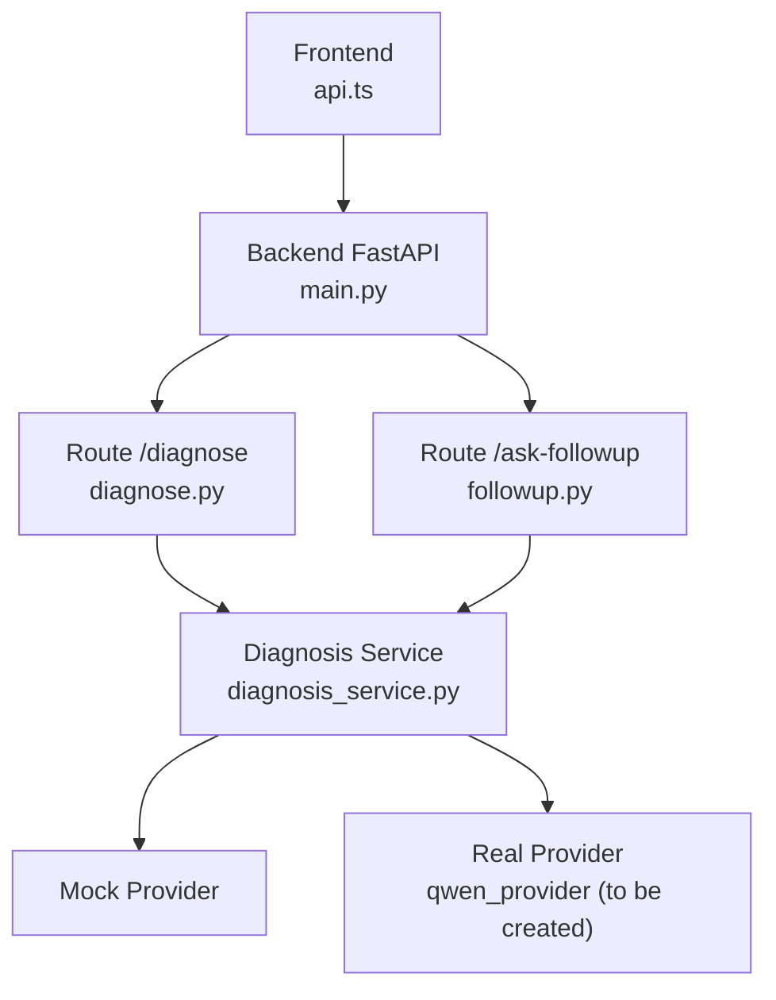
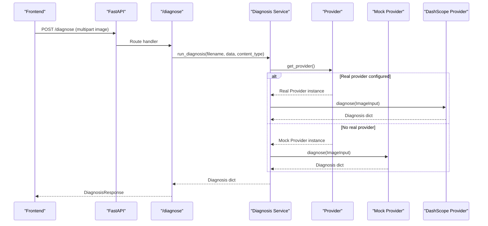
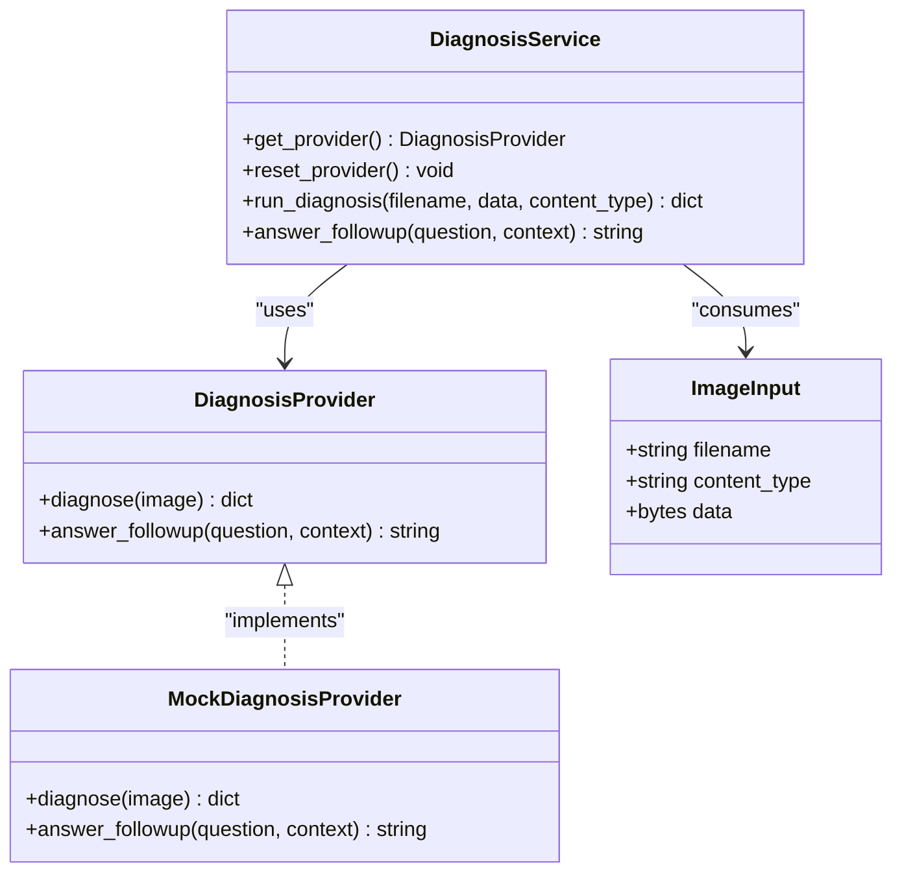
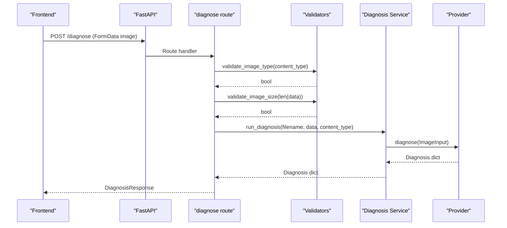
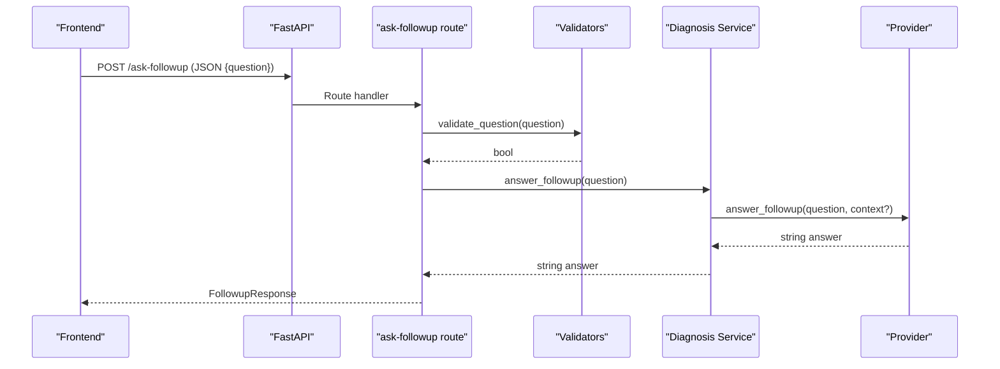
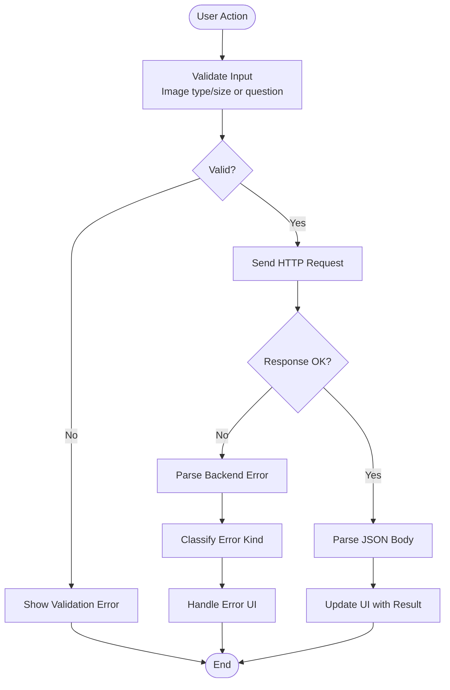
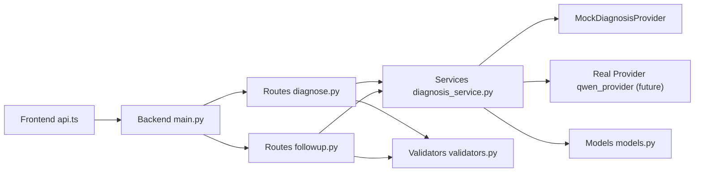

# Authentication and API Integration

<cite>
**Referenced Files in This Document**
- [diagnosis_service.py](file://backend/services/diagnosis_service.py)
- [diagnose.py](file://backend/routes/diagnose.py)
- [followup.py](file://backend/routes/followup.py)
- [models.py](file://backend/models.py)
- [validators.py](file://backend/utils/validators.py)
- [main.py](file://backend/main.py)
- [api.ts](file://frontend/src/services/api.ts)
- [auth.ts](file://frontend/src/services/auth.ts)
- [api.ts types](file://frontend/src/types/api.ts)
- [test_api.py](file://tests/test_api.py)
</cite>

## Table of Contents
1. [Introduction](#introduction)
2. [Project Structure](#project-structure)
3. [Core Components](#core-components)
4. [Architecture Overview](#architecture-overview)
5. [Detailed Component Analysis](#detailed-component-analysis)
6. [Dependency Analysis](#dependency-analysis)
7. [Performance Considerations](#performance-considerations)
8. [Troubleshooting Guide](#troubleshooting-guide)
9. [Conclusion](#conclusion)
10. [Appendices](#appendices)

## Introduction
This document explains how to implement authentication and API integration with Alibaba Cloud DashScope services for the FasalDoc application. It covers:
- The provider abstraction that enables switching between a mock offline implementation and a real DashScope-backed provider.
- The complete request/response flow for image diagnosis and follow-up questions.
- How to integrate Alibaba Cloud DashScope via an environment-based configuration, including API key validation and graceful fallback when credentials are missing or the service is unavailable.
- Error handling strategies for network timeouts, rate limits, authentication failures, and service unavailability.
- Frontend HTTP client usage and JSON payload construction aligned with backend contracts.

The current codebase provides a robust, testable foundation with a mock provider and clear extension points for integrating the real DashScope provider without changing route logic.

## Project Structure
At a high level:
- Backend (FastAPI):
  - Routes expose endpoints for diagnosis and follow-up.
  - A service layer defines a stable protocol for AI providers and selects either a real provider or a mock fallback based on environment configuration.
  - Models define request/response schemas used by both backend and frontend.
- Frontend (React + TypeScript):
  - Centralized API client handles HTTP calls, error parsing, and input validation.
  - Local session management persists user sessions using localStorage until backend auth endpoints are available.

**Diagram sources**
- [main.py:1-45](file://backend/main.py#L1-L45)
- [diagnose.py:1-59](file://backend/routes/diagnose.py#L1-L59)
- [followup.py:1-40](file://backend/routes/followup.py#L1-L40)
- [diagnosis_service.py:1-128](file://backend/services/diagnosis_service.py#L1-L128)

**Section sources**
- [main.py:1-45](file://backend/main.py#L1-L45)
- [diagnose.py:1-59](file://backend/routes/diagnose.py#L1-L59)
- [followup.py:1-40](file://backend/routes/followup.py#L1-L40)
- [diagnosis_service.py:1-128](file://backend/services/diagnosis_service.py#L1-L128)

## Core Components
- DiagnosisProvider Protocol: Defines the contract for AI providers with methods diagnose and answer_followup.
- MockDiagnosisProvider: Offline fallback returning deterministic responses when no real provider is configured.
- Provider Factory: Selects the active provider at runtime based on environment variables; falls back to mock if credentials are missing or provider creation fails.
- Routes: Validate inputs and delegate to the service layer; wrap errors into consistent HTTP responses.
- Models: Pydantic models defining DiagnosisResponse, FollowupRequest, and FollowupResponse.
- Validators: Shared constraints for image type, size, and question content.
- Frontend API Client: Encapsulates fetch calls, error parsing, and mirrors backend validation rules.
- Frontend Auth: Local session persistence using localStorage; ready to be wired to backend auth endpoints later.

**Section sources**
- [diagnosis_service.py:40-128](file://backend/services/diagnosis_service.py#L40-L128)
- [models.py:10-58](file://backend/models.py#L10-L58)
- [validators.py:1-19](file://backend/utils/validators.py#L1-L19)
- [api.ts:1-99](file://frontend/src/services/api.ts#L1-L99)
- [auth.ts:1-126](file://frontend/src/services/auth.ts#L1-L126)

## Architecture Overview
The system uses a provider abstraction to decouple routes from AI implementation details. When DASHSCOPE_API_KEY is present and valid, the service attempts to load a real provider; otherwise it uses the mock provider. This ensures continuous operation even when Alibaba Cloud services are unavailable.

**Diagram sources**
- [diagnose.py:13-59](file://backend/routes/diagnose.py#L13-L59)
- [diagnosis_service.py:80-128](file://backend/services/diagnosis_service.py#L80-L128)

**Section sources**
- [diagnose.py:13-59](file://backend/routes/diagnose.py#L13-L59)
- [diagnosis_service.py:80-128](file://backend/services/diagnosis_service.py#L80-L128)

## Detailed Component Analysis

### Provider Abstraction and Selection
- DiagnosisProvider protocol specifies two methods:
  - diagnose(image: ImageInput) -> dict
  - answer_followup(question: str, context: Optional[dict] = None) -> str
- MockDiagnosisProvider implements these methods to return deterministic results suitable for development and testing.
- Provider selection:
  - Checks environment variable DASHSCOPE_API_KEY for presence and non-placeholder values.
  - Attempts to import and instantiate a real provider via create_provider().
  - On any exception during provider construction, logs a warning and falls back to MockDiagnosisProvider.
- Singleton caching:
  - get_provider() caches the selected provider to avoid repeated initialization overhead.
  - reset_provider() clears the cache for tests or dynamic reconfiguration.

**Diagram sources**
- [diagnosis_service.py:31-128](file://backend/services/diagnosis_service.py#L31-L128)

**Section sources**
- [diagnosis_service.py:31-128](file://backend/services/diagnosis_service.py#L31-L128)

### Request Flow: Image Diagnosis
- Frontend constructs FormData with field name "image" and sends POST to /diagnose.
- Backend validates image type and size; rejects empty uploads early.
- Service layer builds ImageInput and delegates to the active provider.
- Response conforms to DiagnosisResponse schema.

**Diagram sources**
- [diagnose.py:13-59](file://backend/routes/diagnose.py#L13-L59)
- [validators.py:1-19](file://backend/utils/validators.py#L1-L19)
- [diagnosis_service.py:116-128](file://backend/services/diagnosis_service.py#L116-L128)

**Section sources**
- [diagnose.py:13-59](file://backend/routes/diagnose.py#L13-L59)
- [validators.py:1-19](file://backend/utils/validators.py#L1-L19)
- [diagnosis_service.py:116-128](file://backend/services/diagnosis_service.py#L116-L128)

### Request Flow: Follow-up Question
- Frontend sends JSON body with field "question" to /ask-followup.
- Backend validates that the question is non-empty after trimming.
- Service layer delegates to the active provider’s answer_followup method.
- Response echoes the question and includes the assistant’s answer.

**Diagram sources**
- [followup.py:10-40](file://backend/routes/followup.py#L10-L40)
- [validators.py:18-19](file://backend/utils/validators.py#L18-L19)
- [diagnosis_service.py:126-128](file://backend/services/diagnosis_service.py#L126-L128)

**Section sources**
- [followup.py:10-40](file://backend/routes/followup.py#L10-L40)
- [validators.py:18-19](file://backend/utils/validators.py#L18-L19)
- [diagnosis_service.py:126-128](file://backend/services/diagnosis_service.py#L126-L128)

### Data Contracts
- DiagnosisResponse fields: filename, diagnosis, confidence (0..1), advice, needs_expert.
- FollowupRequest field: question (non-empty).
- FollowupResponse fields: question (echo), answer (assistant response).

These contracts are mirrored in the frontend types to ensure consistency across layers.

**Section sources**
- [models.py:10-58](file://backend/models.py#L10-L58)
- [api.ts types:6-25](file://frontend/src/types/api.ts#L6-L25)

### Frontend HTTP Client and Error Handling
- Centralized API module:
  - Validates images locally before upload (type and size).
  - Constructs FormData for diagnosis and JSON for follow-up.
  - Parses backend errors into typed ApiError instances with kind classification (validation, network, server).
  - Throws network errors on fetch exceptions; maps HTTP status codes to appropriate error kinds.
- Session management:
  - Uses localStorage to persist user sessions.
  - Provides login/signup functions currently backed by local storage; ready to be replaced with backend auth endpoints.

**Diagram sources**
- [api.ts:34-99](file://frontend/src/services/api.ts#L34-L99)

**Section sources**
- [api.ts:1-99](file://frontend/src/services/api.ts#L1-L99)
- [auth.ts:17-41](file://frontend/src/services/auth.ts#L17-L41)

### Environment Configuration and Graceful Degradation
- Environment variable:
  - DASHSCOPE_API_KEY must be set to enable the real provider.
  - Placeholder values like empty strings or specific placeholders are treated as missing.
- Provider selection:
  - If credentials are present, attempts to load the real provider.
  - Any exception during provider construction triggers a fallback to the mock provider.
- Benefits:
  - Ensures application continuity when Alibaba Cloud services are down or credentials are misconfigured.
  - Simplifies testing and development without requiring external dependencies.

**Section sources**
- [diagnosis_service.py:75-95](file://backend/services/diagnosis_service.py#L75-L95)

## Dependency Analysis
The following diagram shows how components depend on each other and where the real provider would integrate.

**Diagram sources**
- [main.py:1-45](file://backend/main.py#L1-L45)
- [diagnose.py:1-59](file://backend/routes/diagnose.py#L1-L59)
- [followup.py:1-40](file://backend/routes/followup.py#L1-L40)
- [diagnosis_service.py:1-128](file://backend/services/diagnosis_service.py#L1-L128)
- [models.py:1-58](file://backend/models.py#L1-L58)
- [validators.py:1-19](file://backend/utils/validators.py#L1-L19)

**Section sources**
- [main.py:1-45](file://backend/main.py#L1-L45)
- [diagnose.py:1-59](file://backend/routes/diagnose.py#L1-L59)
- [followup.py:1-40](file://backend/routes/followup.py#L1-L40)
- [diagnosis_service.py:1-128](file://backend/services/diagnosis_service.py#L1-L128)
- [models.py:1-58](file://backend/models.py#L1-L58)
- [validators.py:1-19](file://backend/utils/validators.py#L1-L19)

## Performance Considerations
- Provider caching:
  - The active provider is cached once per process lifecycle to avoid repeated initialization costs.
- Input validation:
  - Early rejection of invalid or oversized images reduces unnecessary processing and network calls.
- Error boundaries:
  - Routes wrap service calls to prevent internal errors from leaking to clients, improving stability.
- CORS configuration:
  - Configurable origins allow efficient local development without cross-origin issues.

[No sources needed since this section provides general guidance]

## Troubleshooting Guide
Common issues and resolutions:
- Missing or placeholder API key:
  - Ensure DASHSCOPE_API_KEY is set to a non-empty, non-placeholder value.
  - Without a valid key, the system automatically falls back to the mock provider.
- Network errors:
  - Frontend classifies network errors separately; handle retries or show user-friendly messages.
- Rate limits and service unavailability:
  - Implement retry logic with exponential backoff in the real provider when integrating DashScope.
  - Catch timeout and connection errors; degrade gracefully to mock responses if necessary.
- Authentication failures:
  - For future backend auth endpoints, map 401/403 responses to user-facing messages and clear local sessions.
- Validation errors:
  - Frontend mirrors backend validation rules; ensure consistent checks to reduce 4xx responses.

**Section sources**
- [diagnosis_service.py:75-95](file://backend/services/diagnosis_service.py#L75-L95)
- [api.ts:46-99](file://frontend/src/services/api.ts#L46-L99)
- [test_api.py:114-117](file://tests/test_api.py#L114-L117)

## Conclusion
The FasalDoc backend provides a clean, extensible architecture for integrating Alibaba Cloud DashScope services through a provider abstraction. With environment-based configuration, automatic fallback to a mock provider, and robust error handling, the application remains functional regardless of external service availability. The frontend centralizes API interactions and session management, ensuring consistent behavior and easy upgrades when backend auth endpoints become available.

[No sources needed since this section summarizes without analyzing specific files]

## Appendices

### Integrating the Real DashScope Provider
To integrate the real Alibaba Cloud DashScope provider:
- Create backend/services/qwen_provider.py exposing create_provider() that returns an object implementing DiagnosisProvider.
- Set DASHSCOPE_API_KEY in the environment to a valid key.
- Implement request signing and session management within the provider according to DashScope’s API specifications.
- Add retry logic with exponential backoff for transient errors (timeouts, rate limits).
- Map DashScope-specific errors to standardized exceptions handled by the service layer.

[No sources needed since this section provides general guidance]

### Example Requests and Responses
- POST /diagnose:
  - Content-Type: multipart/form-data
  - Field: image (binary file)
  - Response: DiagnosisResponse
- POST /ask-followup:
  - Content-Type: application/json
  - Body: { "question": "string" }
  - Response: FollowupResponse

**Section sources**
- [models.py:10-58](file://backend/models.py#L10-L58)
- [api.ts:64-99](file://frontend/src/services/api.ts#L64-L99)