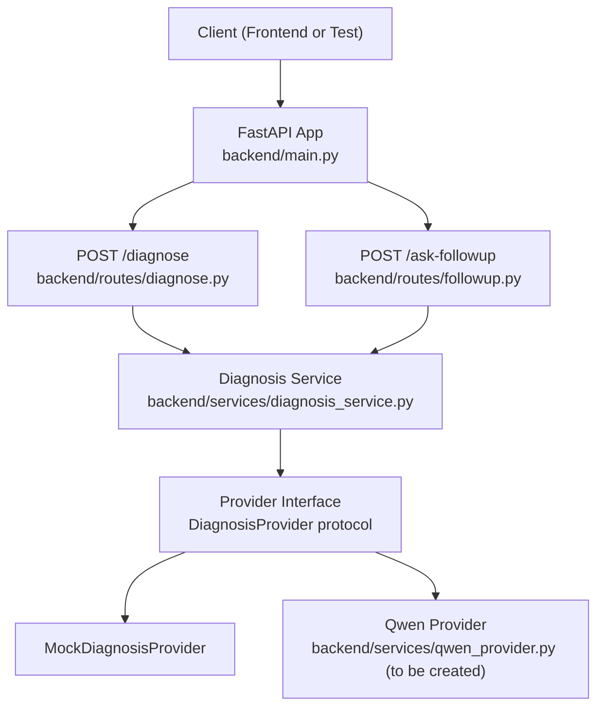
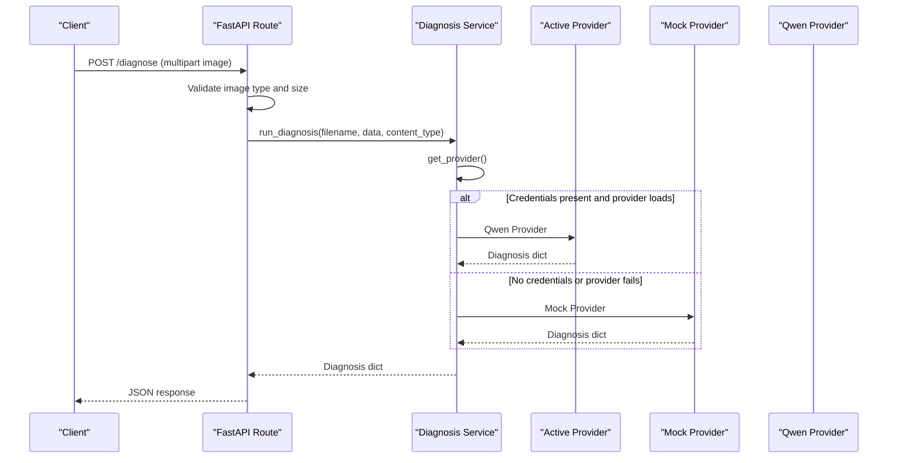
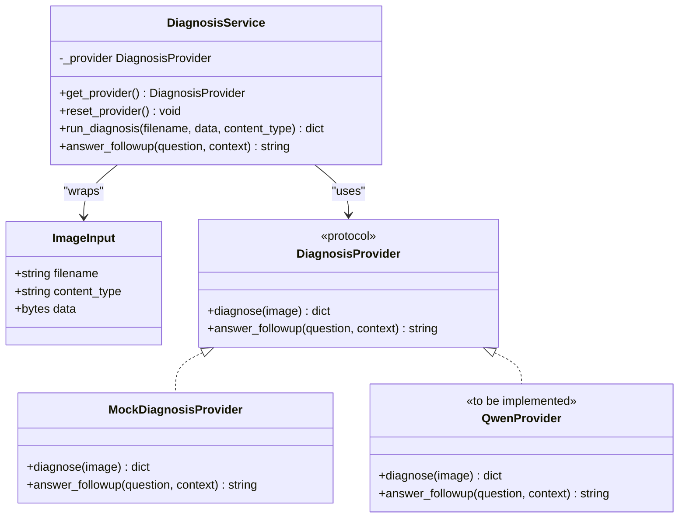
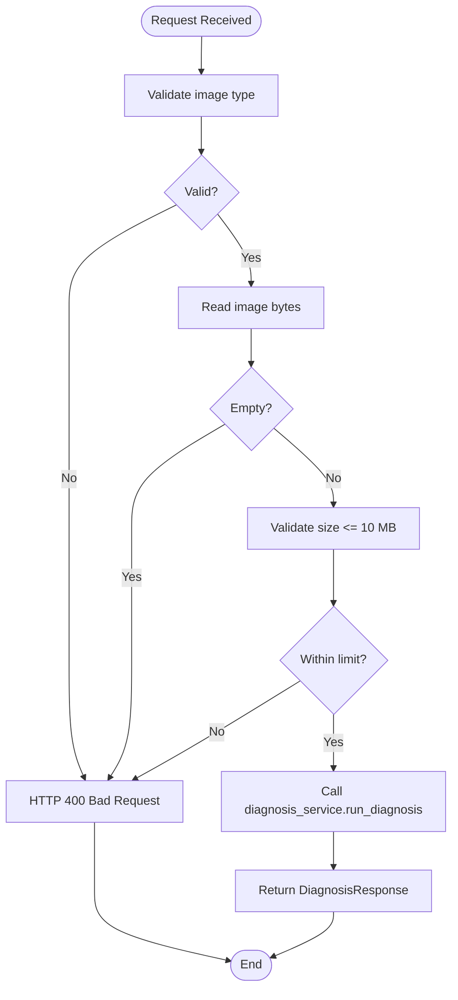
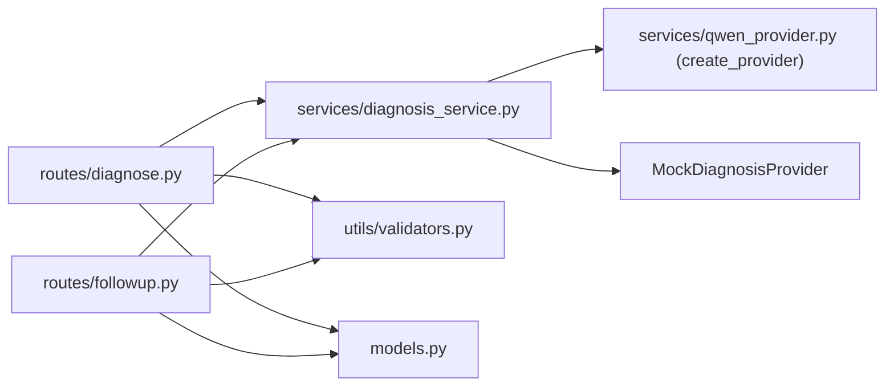

# Qwen/Alibaba Cloud Integration

<cite>
**Referenced Files in This Document**
- [diagnosis_service.py](file://backend/services/diagnosis_service.py)
- [diagnose.py](file://backend/routes/diagnose.py)
- [followup.py](file://backend/routes/followup.py)
- [models.py](file://backend/models.py)
- [main.py](file://backend/main.py)
- [validators.py](file://backend/utils/validators.py)
- [README.md](file://README.md)
</cite>

## Table of Contents
1. [Introduction](#introduction)
2. [Project Structure](#project-structure)
3. [Core Components](#core-components)
4. [Architecture Overview](#architecture-overview)
5. [Detailed Component Analysis](#detailed-component-analysis)
6. [Dependency Analysis](#dependency-analysis)
7. [Performance Considerations](#performance-considerations)
8. [Troubleshooting Guide](#troubleshooting-guide)
9. [Conclusion](#conclusion)
10. [Appendices](#appendices)

## Introduction
This document provides integration guidance for connecting FasalDoc with Qwen/Alibaba Cloud DashScope AI services. It explains the existing provider abstraction, environment configuration, authentication flow, request/response contracts, and error handling strategies. It also includes step-by-step instructions to obtain API keys, configure environment variables, test the integration, and troubleshoot common issues. Where applicable, it outlines patterns for retry logic, rate limiting, and graceful degradation when the AI service is unavailable.

## Project Structure
The backend exposes two primary endpoints:
- POST /diagnose: Accepts an image and returns a diagnosis.
- POST /ask-followup: Accepts a question and returns an answer.

The routes delegate to a service layer that abstracts the AI provider. When configured, the service attempts to load a real Qwen/Alibaba provider; otherwise, it falls back to a mock provider so the application remains fully functional offline.

**Diagram sources**
- [main.py:1-45](file://backend/main.py#L1-L45)
- [diagnose.py:1-59](file://backend/routes/diagnose.py#L1-L59)
- [followup.py:1-40](file://backend/routes/followup.py#L1-L40)
- [diagnosis_service.py:1-128](file://backend/services/diagnosis_service.py#L1-L128)

**Section sources**
- [main.py:1-45](file://backend/main.py#L1-L45)
- [diagnose.py:1-59](file://backend/routes/diagnose.py#L1-L59)
- [followup.py:1-40](file://backend/routes/followup.py#L1-L40)
- [diagnosis_service.py:1-128](file://backend/services/diagnosis_service.py#L1-L128)

## Core Components
- DiagnosisProvider protocol: Defines the stable interface for AI providers with methods diagnose(image) and answer_followup(question, context).
- MockDiagnosisProvider: Offline fallback returning deterministic responses when no AI credentials are present.
- Provider selection: The service lazily builds the active provider once per process, preferring the real Qwen provider if DASHSCOPE_API_KEY is set and valid; otherwise, it uses the mock.
- Routes: Validate inputs and delegate to the service layer; they do not implement AI logic directly.
- Models: Pydantic models define request/response contracts for clients.

Key responsibilities:
- Input validation occurs at the route level (image type, size, question content).
- Business logic and AI calls are encapsulated in the service layer.
- Environment-driven provider selection ensures robustness without code changes.

**Section sources**
- [diagnosis_service.py:31-128](file://backend/services/diagnosis_service.py#L31-L128)
- [models.py:1-58](file://backend/models.py#L1-L58)
- [diagnose.py:1-59](file://backend/routes/diagnose.py#L1-L59)
- [followup.py:1-40](file://backend/routes/followup.py#L1-L40)

## Architecture Overview
The system follows a layered architecture:
- Presentation layer: FastAPI routes handle HTTP requests and validations.
- Service layer: Orchestrates provider selection and delegates to the active provider.
- Provider layer: Implements DiagnosisProvider; currently includes a mock and a placeholder for Qwen/Alibaba.

**Diagram sources**
- [diagnose.py:13-59](file://backend/routes/diagnose.py#L13-L59)
- [diagnosis_service.py:75-128](file://backend/services/diagnosis_service.py#L75-L128)

## Detailed Component Analysis

### Provider Abstraction and Selection
- Protocol definition: DiagnosisProvider specifies diagnose(image) -> dict and answer_followup(question, context=None) -> str.
- Mock implementation: Returns deterministic fields matching the expected contract.
- Lazy build: _build_provider checks for a non-placeholder DASHSCOPE_API_KEY and dynamically imports create_provider from qwen_provider. On any exception, it logs a warning and falls back to the mock.
- Singleton caching: get_provider caches the selected provider for reuse; reset_provider clears the cache for tests or runtime reconfiguration.

**Diagram sources**
- [diagnosis_service.py:31-128](file://backend/services/diagnosis_service.py#L31-L128)

**Section sources**
- [diagnosis_service.py:31-128](file://backend/services/diagnosis_service.py#L31-L128)

### Routes and Validation
- POST /diagnose: Validates image type and size, reads bytes, delegates to diagnosis_service.run_diagnosis, and wraps exceptions into HTTP 500 responses to avoid leaking internal errors.
- POST /ask-followup: Validates question content, delegates to diagnosis_service.answer_followup, and wraps exceptions similarly.

**Diagram sources**
- [diagnose.py:13-59](file://backend/routes/diagnose.py#L13-L59)
- [validators.py:1-19](file://backend/utils/validators.py#L1-L19)

**Section sources**
- [diagnose.py:13-59](file://backend/routes/diagnose.py#L13-L59)
- [validators.py:1-19](file://backend/utils/validators.py#L1-L19)

### Data Contracts
- DiagnosisResponse: Fields include filename, diagnosis, confidence (0..1), advice, needs_expert.
- FollowupRequest: Contains question (non-empty).
- FollowupResponse: Echoes question and returns answer.

These models ensure consistent client-server communication and enable automatic OpenAPI schema generation.

**Section sources**
- [models.py:10-58](file://backend/models.py#L10-L58)

### Environment Configuration and Provider Activation
- DASHSCOPE_API_KEY: Required to activate the real Qwen provider. If missing or set to a placeholder, the service falls back to the mock.
- Optional settings mentioned in documentation: DASHSCOPE_BASE_URL and DASHSCOPE_MODEL can be used by the Qwen provider to configure endpoint and model selection.
- CORS_ALLOW_ORIGINS: Controls allowed origins for local development.

When DASHSCOPE_API_KEY is present and valid, the service dynamically imports create_provider from backend/services/qwen_provider.py and instantiates the provider. Any construction error triggers a safe fallback to the mock.

**Section sources**
- [diagnosis_service.py:75-95](file://backend/services/diagnosis_service.py#L75-L95)
- [README.md:88-99](file://README.md#L88-L99)
- [main.py:19-35](file://backend/main.py#L19-L35)

## Dependency Analysis
- Routes depend on validators and the diagnosis service.
- The diagnosis service depends on the DiagnosisProvider protocol and selects between Mock and Qwen implementations based on environment configuration.
- Models are shared across routes for request/response serialization.

**Diagram sources**
- [diagnose.py:1-59](file://backend/routes/diagnose.py#L1-L59)
- [followup.py:1-40](file://backend/routes/followup.py#L1-L40)
- [diagnosis_service.py:1-128](file://backend/services/diagnosis_service.py#L1-L128)
- [validators.py:1-19](file://backend/utils/validators.py#L1-L19)
- [models.py:1-58](file://backend/models.py#L1-L58)

**Section sources**
- [diagnose.py:1-59](file://backend/routes/diagnose.py#L1-L59)
- [followup.py:1-40](file://backend/routes/followup.py#L1-L40)
- [diagnosis_service.py:1-128](file://backend/services/diagnosis_service.py#L1-L128)
- [validators.py:1-19](file://backend/utils/validators.py#L1-L19)
- [models.py:1-58](file://backend/models.py#L1-L58)

## Performance Considerations
- Lazy provider initialization: The provider is built once and cached, reducing overhead on subsequent requests.
- Input validation early exit: Rejecting invalid images before calling the provider avoids unnecessary network calls.
- Graceful degradation: If the Qwen provider cannot be constructed or is unavailable, the mock ensures continued operation without downtime.

[No sources needed since this section provides general guidance]

## Troubleshooting Guide
Common issues and resolutions:
- Missing or placeholder API key:
  - Symptom: Requests return mock responses instead of AI-powered results.
  - Resolution: Ensure DASHSCOPE_API_KEY is set to a valid key and not a placeholder.
- Provider import failure:
  - Symptom: Logs indicate provider unavailability; app falls back to mock.
  - Resolution: Verify backend/services/qwen_provider.py exists and exports create_provider(). Check for syntax/import errors.
- Network or rate-limit errors:
  - Symptom: Intermittent failures or throttling responses.
  - Resolution: Implement retry with exponential backoff and respect rate limits in the Qwen provider. Add circuit breaker behavior to degrade gracefully to the mock when the service is down.
- CORS issues:
  - Symptom: Frontend blocked from calling backend during development.
  - Resolution: Configure CORS_ALLOW_ORIGINS to include your frontend origin(s).

Operational tips:
- Use the health endpoint GET / to verify the server is running.
- Use Swagger UI at /docs to inspect endpoints and test requests interactively.
- Reset the provider in tests via reset_provider() to isolate runs.

**Section sources**
- [diagnosis_service.py:75-95](file://backend/services/diagnosis_service.py#L75-L95)
- [main.py:19-35](file://backend/main.py#L19-L35)
- [README.md:88-99](file://README.md#L88-L99)

## Conclusion
FasalDoc’s backend is designed to integrate seamlessly with Qwen/Alibaba Cloud DashScope through a clean provider abstraction. By setting DASHSCOPE_API_KEY and implementing create_provider() in backend/services/qwen_provider.py, you can plug in the real AI while maintaining full offline functionality via the mock. The service layer handles provider selection, input validation, and error wrapping to ensure reliability and a smooth user experience.

[No sources needed since this section summarizes without analyzing specific files]

## Appendices

### Step-by-Step Setup for Qwen/Alibaba Cloud Integration
1. Obtain API Key:
   - Create an account on Alibaba Cloud and access DashScope/Qwen services.
   - Generate an API key for programmatic access.
2. Configure Environment Variables:
   - Set DASHSCOPE_API_KEY to your generated key.
   - Optionally set DASHSCOPE_BASE_URL and DASHSCOPE_MODEL if your deployment requires custom endpoints or model selection.
3. Implement Provider:
   - Create backend/services/qwen_provider.py exposing create_provider() that returns an object implementing DiagnosisProvider.
   - In diagnose(image):
     - Encode or send the image according to the DashScope API requirements.
     - Authenticate using the API key (e.g., Authorization header or SDK configuration).
     - Parse the response to produce a dict with fields compatible with DiagnosisResponse.
   - In answer_followup(question, context):
     - Format the prompt including context if provided.
     - Call the text completion endpoint and parse the result into a string.
4. Restart the Backend:
   - Ensure the server reloads to pick up environment changes.
5. Test Integration:
   - Upload an image to POST /diagnose and verify the response contains diagnosis, confidence, advice, and needs_expert.
   - Send a follow-up question to POST /ask-followup and confirm a coherent answer.
6. Monitor and Tune:
   - Add retries with exponential backoff for transient errors.
   - Respect rate limits and implement queuing or backpressure if necessary.
   - Implement graceful degradation to fall back to mock responses when the AI service is unavailable.

[No sources needed since this section provides procedural guidance]

### Authentication Flow and API Request Formatting
- Authentication:
  - Use DASHSCOPE_API_KEY to authenticate requests to the DashScope API (via headers or SDK configuration).
- Request formatting:
  - For image-based diagnosis, encode the image payload as required by the API (e.g., base64 or multipart) and include metadata such as model name and parameters.
  - For follow-up questions, construct a prompt that includes the question and optional context to guide the model’s response.
- Response parsing:
  - Map the API’s response structure to the DiagnosisProvider contract, ensuring field names and types align with DiagnosisResponse and expected strings for answers.

[No sources needed since this section provides conceptual guidance]

### Retry Logic, Rate Limiting, and Graceful Degradation
- Retry logic:
  - Implement exponential backoff with jitter for transient network errors and temporary server errors.
  - Limit maximum retries to prevent long-running requests.
- Rate limiting:
  - Observe API rate limits and implement token bucket or sliding window algorithms to throttle requests.
  - Queue or batch requests if appropriate to reduce peak load.
- Graceful degradation:
  - Detect persistent failures and switch to the mock provider automatically to maintain availability.
  - Log warnings and metrics to aid monitoring and alerting.

[No sources needed since this section provides conceptual guidance]