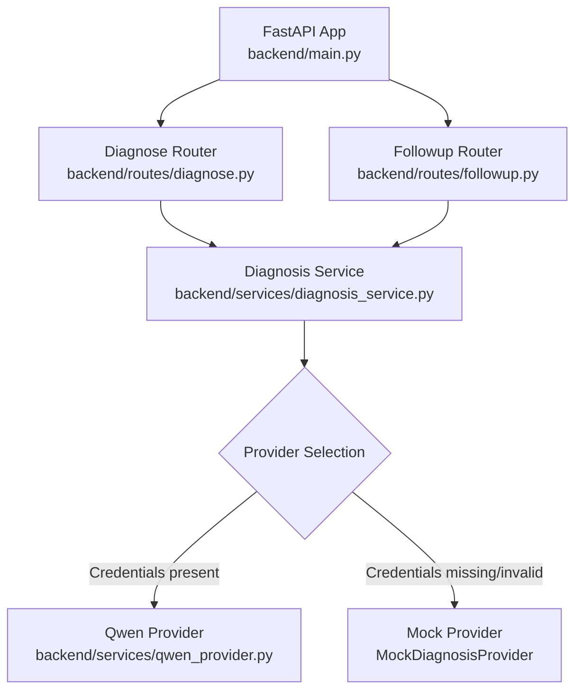
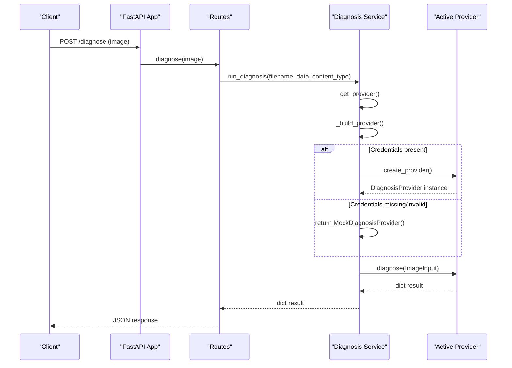
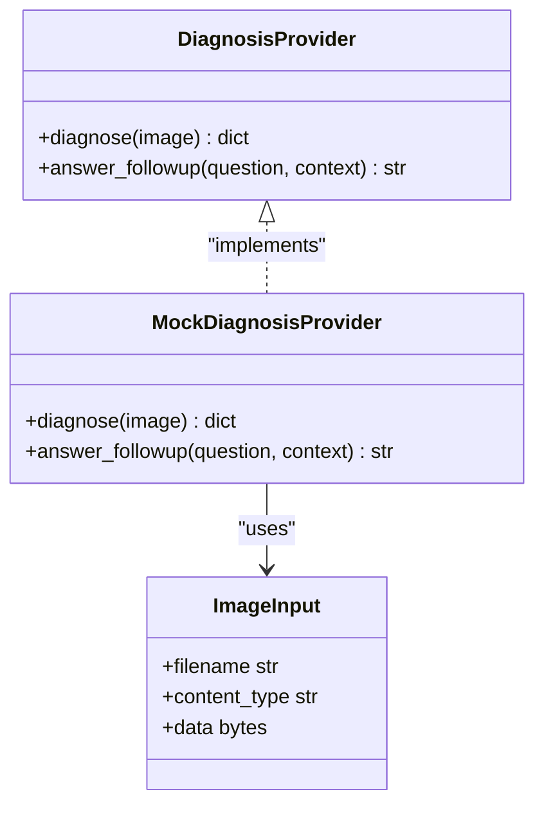
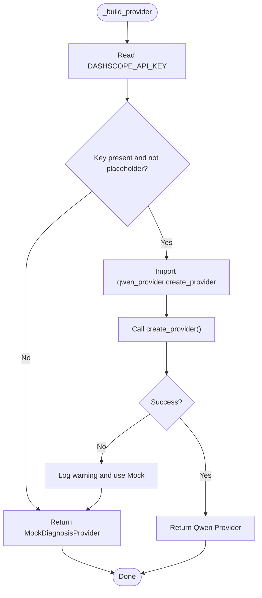
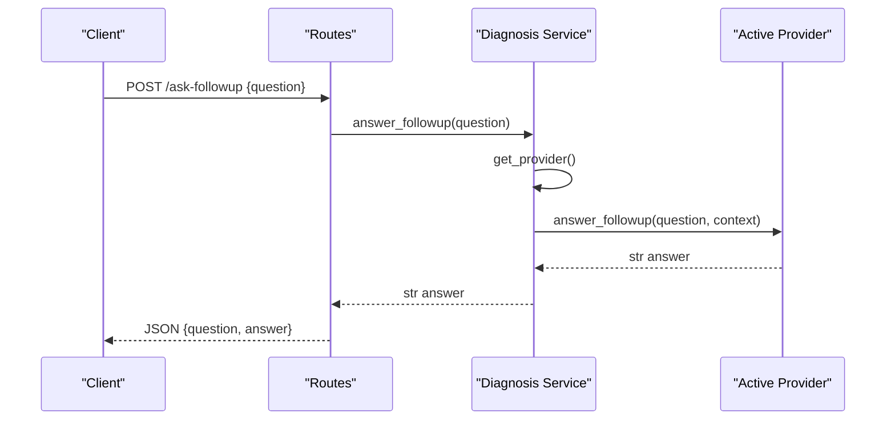
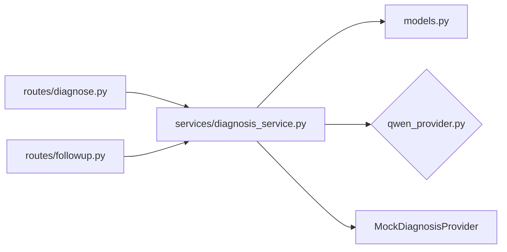

# Setup and Configuration

<cite>
**Referenced Files in This Document**
- [diagnosis_service.py](file://backend/services/diagnosis_service.py)
- [diagnose.py](file://backend/routes/diagnose.py)
- [followup.py](file://backend/routes/followup.py)
- [main.py](file://backend/main.py)
- [models.py](file://backend/models.py)
- [test_api.py](file://tests/test_api.py)
</cite>

## Table of Contents
1. [Introduction](#introduction)
2. [Project Structure](#project-structure)
3. [Core Components](#core-components)
4. [Architecture Overview](#architecture-overview)
5. [Detailed Component Analysis](#detailed-component-analysis)
6. [Dependency Analysis](#dependency-analysis)
7. [Performance Considerations](#performance-considerations)
8. [Troubleshooting Guide](#troubleshooting-guide)
9. [Conclusion](#conclusion)
10. [Appendices](#appendices)

## Introduction
This document explains how to set up and configure FasalDoc to integrate with Qwen/Alibaba Cloud DashScope AI services. It focuses on creating the backend provider module, configuring environment variables (especially DASHSCOPE_API_KEY), understanding the automatic fallback behavior when credentials are missing or invalid, and troubleshooting common setup issues. The system is designed to run fully offline using a mock provider until real credentials are configured.

## Project Structure
The integration point for the AI provider lives under the backend service layer. Routes call into the diagnosis service, which selects either the real Qwen provider or an offline mock based on environment configuration.

**Diagram sources**
- [main.py:1-45](file://backend/main.py#L1-L45)
- [diagnose.py:1-59](file://backend/routes/diagnose.py#L1-L59)
- [followup.py:1-40](file://backend/routes/followup.py#L1-L40)
- [diagnosis_service.py:1-128](file://backend/services/diagnosis_service.py#L1-L128)

**Section sources**
- [main.py:1-45](file://backend/main.py#L1-L45)
- [diagnose.py:1-59](file://backend/routes/diagnose.py#L1-L59)
- [followup.py:1-40](file://backend/routes/followup.py#L1-L40)
- [diagnosis_service.py:1-128](file://backend/services/diagnosis_service.py#L1-L128)

## Core Components
- DiagnosisProvider protocol: Stable interface that routes depend on for diagnosis and follow-up responses.
- MockDiagnosisProvider: Offline fallback that returns deterministic, contract-valid responses when no AI is configured.
- _build_provider(): Factory that chooses between the real Qwen provider and the mock based on environment configuration.
- get_provider() and reset_provider(): Lazy initialization and test-time reconfiguration helpers.
- run_diagnosis() and answer_followup(): Route-facing helpers that delegate to the active provider.

Key responsibilities:
- Provide a stable contract so routes never need to change when swapping providers.
- Ensure graceful degradation to mock responses if credentials are absent or invalid.
- Centralize environment-based selection logic in one place.

**Section sources**
- [diagnosis_service.py:31-52](file://backend/services/diagnosis_service.py#L31-L52)
- [diagnosis_service.py:55-73](file://backend/services/diagnosis_service.py#L55-L73)
- [diagnosis_service.py:75-105](file://backend/services/diagnosis_service.py#L75-L105)
- [diagnosis_service.py:116-128](file://backend/services/diagnosis_service.py#L116-L128)

## Architecture Overview
The runtime flow starts at the FastAPI app, passes through routers, and delegates to the diagnosis service. The service lazily builds and caches the provider once per process. If DASHSCOPE_API_KEY is present and valid, it attempts to load the Qwen provider; otherwise, it uses the mock provider.

**Diagram sources**
- [diagnose.py:13-59](file://backend/routes/diagnose.py#L13-L59)
- [diagnosis_service.py:75-128](file://backend/services/diagnosis_service.py#L75-L128)

**Section sources**
- [diagnose.py:13-59](file://backend/routes/diagnose.py#L13-L59)
- [diagnosis_service.py:75-128](file://backend/services/diagnosis_service.py#L75-L128)

## Detailed Component Analysis

### Provider Protocol and Mock Implementation
- DiagnosisProvider defines two methods: diagnose and answer_followup.
- MockDiagnosisProvider implements both methods to satisfy the protocol and ensure the application works without external dependencies.

**Diagram sources**
- [diagnosis_service.py:31-52](file://backend/services/diagnosis_service.py#L31-L52)
- [diagnosis_service.py:55-73](file://backend/services/diagnosis_service.py#L55-L73)

**Section sources**
- [diagnosis_service.py:31-73](file://backend/services/diagnosis_service.py#L31-L73)

### Provider Selection Mechanism (_build_provider)
- Reads DASHSCOPE_API_KEY from the environment.
- Validates that the key is present and not a placeholder value.
- Attempts to import and instantiate the Qwen provider via create_provider().
- On any error during construction, logs a warning and falls back to MockDiagnosisProvider.
- Caches the selected provider for subsequent calls.

**Diagram sources**
- [diagnosis_service.py:75-105](file://backend/services/diagnosis_service.py#L75-L105)

**Section sources**
- [diagnosis_service.py:75-105](file://backend/services/diagnosis_service.py#L75-L105)

### Environment Variable Configuration
- Required variable: DASHSCOPE_API_KEY
- Behavior:
  - If unset or empty: the system uses the mock provider.
  - If set to a placeholder string: treated as missing; uses the mock provider.
  - If set to a non-empty, non-placeholder value: attempts to load the Qwen provider.

Best practices:
- Store secrets in your platform’s secret manager (e.g., Docker secrets, Kubernetes Secrets, cloud provider secret stores).
- Never commit secrets to version control; use .env files locally only and ensure they are ignored by VCS.
- Rotate keys regularly and restrict permissions to the minimum required scope.
- Validate key format early in deployment pipelines to fail fast.

Example configurations by environment:
- Development: Set DASHSCOPE_API_KEY to a local development key or leave unset to exercise mock mode.
- Staging: Set DASHSCOPE_API_KEY to a staging key with limited quotas and monitoring enabled.
- Production: Set DASHSCOPE_API_KEY to a production key with appropriate rate limits, logging, and alerting.

Note: These examples describe where and how to set the variable; do not include actual secret values in code or documentation.

**Section sources**
- [diagnosis_service.py:75-95](file://backend/services/diagnosis_service.py#L75-L95)
- [test_api.py:114-118](file://tests/test_api.py#L114-L118)

### Creating backend/services/qwen_provider.py
You must create this file to implement the real AI integration. Requirements:
- Expose a factory function named create_provider() that returns an object implementing DiagnosisProvider.
- Read configuration from environment variables (at minimum DASHSCOPE_API_KEY).
- Initialize the Qwen/DashScope client with the provided credentials.
- Implement:
  - diagnose(image): Accepts ImageInput and returns a dict conforming to the expected structure used by routes and models.
  - answer_followup(question, context=None): Returns a string answer.
- Handle errors gracefully and surface meaningful exceptions; the service layer will catch and fall back to mock if needed.

Expected contract details:
- diagnose should return fields compatible with DiagnosisResponse model (filename, diagnosis, confidence, advice, needs_expert).
- answer_followup should return a human-readable string.

Integration points:
- The service layer imports create_provider() dynamically when credentials are detected.
- Any exception during provider construction triggers a safe fallback to the mock provider.

Validation:
- Tests assert that without credentials, the mock provider is used.
- When you add the real provider, ensure tests still pass and consider adding tests for successful provider creation and error paths.

**Section sources**
- [diagnosis_service.py:7-19](file://backend/services/diagnosis_service.py#L7-L19)
- [diagnosis_service.py:80-95](file://backend/services/diagnosis_service.py#L80-L95)
- [models.py:10-31](file://backend/models.py#L10-L31)
- [test_api.py:114-118](file://tests/test_api.py#L114-L118)

### Route Integration and Data Flow
- POST /diagnose validates image type, size, and emptiness, then calls diagnosis_service.run_diagnosis.
- POST /ask-followup validates the question and calls diagnosis_service.answer_followup.
- Both endpoints rely on the active provider returned by get_provider(), ensuring consistent behavior whether using mock or real AI.

**Diagram sources**
- [followup.py:10-39](file://backend/routes/followup.py#L10-L39)
- [diagnosis_service.py:116-128](file://backend/services/diagnosis_service.py#L116-L128)

**Section sources**
- [followup.py:10-39](file://backend/routes/followup.py#L10-L39)
- [diagnosis_service.py:116-128](file://backend/services/diagnosis_service.py#L116-L128)

## Dependency Analysis
- Routes depend on the diagnosis service, not directly on any AI provider.
- The diagnosis service depends on environment configuration to select the provider.
- Models define the response contracts used by routes and validated by the frontend.

**Diagram sources**
- [diagnose.py:1-59](file://backend/routes/diagnose.py#L1-L59)
- [followup.py:1-40](file://backend/routes/followup.py#L1-L40)
- [diagnosis_service.py:1-128](file://backend/services/diagnosis_service.py#L1-L128)
- [models.py:1-58](file://backend/models.py#L1-L58)

**Section sources**
- [diagnose.py:1-59](file://backend/routes/diagnose.py#L1-L59)
- [followup.py:1-40](file://backend/routes/followup.py#L1-L40)
- [diagnosis_service.py:1-128](file://backend/services/diagnosis_service.py#L1-L128)
- [models.py:1-58](file://backend/models.py#L1-L58)

## Performance Considerations
- Provider is built once and cached per process; avoid expensive initialization inside create_provider().
- Prefer lazy loading of heavy dependencies inside create_provider() to keep startup time low.
- Ensure network timeouts and retries are configured appropriately in the Qwen provider to prevent slow requests from blocking the service.
- Keep error handling efficient; failures should quickly fall back to mock to maintain availability.

[No sources needed since this section provides general guidance]

## Troubleshooting Guide
Common issues and resolutions:
- Missing DASHSCOPE_API_KEY:
  - Symptom: Application runs with mock responses.
  - Resolution: Set DASHSCOPE_API_KEY in your environment before starting the service.
- Placeholder or invalid key format:
  - Symptom: Logs indicate provider unavailable; mock fallback is used.
  - Resolution: Replace placeholder values with a valid key from Alibaba Cloud DashScope.
- Network connectivity problems:
  - Symptom: Requests to DashScope fail or timeout.
  - Resolution: Verify outbound network access, firewall rules, DNS resolution, and proxy settings. Add appropriate timeouts and retries in the provider implementation.
- Permission or quota errors:
  - Symptom: API returns permission denied or quota exceeded.
  - Resolution: Check account permissions, API key scopes, and usage quotas in the Alibaba Cloud console. Adjust policies or request quota increases.
- CORS issues during local development:
  - Symptom: Frontend cannot reach backend due to CORS restrictions.
  - Resolution: Configure CORS_ALLOW_ORIGINS in the environment to include your frontend origin.

Verification steps:
- Confirm provider selection by checking logs for warnings about provider unavailability.
- Run tests to ensure mock fallback works when credentials are absent.
- Temporarily remove or invalidate DASHSCOPE_API_KEY to verify fallback behavior.

**Section sources**
- [diagnosis_service.py:75-95](file://backend/services/diagnosis_service.py#L75-L95)
- [test_api.py:114-118](file://tests/test_api.py#L114-L118)
- [main.py:19-35](file://backend/main.py#L19-L35)

## Conclusion
FasalDoc’s architecture cleanly separates route logic from AI provider implementation. By creating backend/services/qwen_provider.py with a create_provider() factory and setting DASHSCOPE_API_KEY, you enable real AI-powered diagnosis while maintaining robust offline operation via the mock provider. Follow the security best practices for credential management and use the troubleshooting guide to resolve common setup issues.

[No sources needed since this section summarizes without analyzing specific files]

## Appendices

### Quick Checklist
- Create backend/services/qwen_provider.py exposing create_provider().
- Implement DiagnosisProvider methods: diagnose and answer_followup.
- Set DASHSCOPE_API_KEY in your environment.
- Restart the service to apply environment changes.
- Verify behavior with tests and local requests.

[No sources needed since this section provides general guidance]