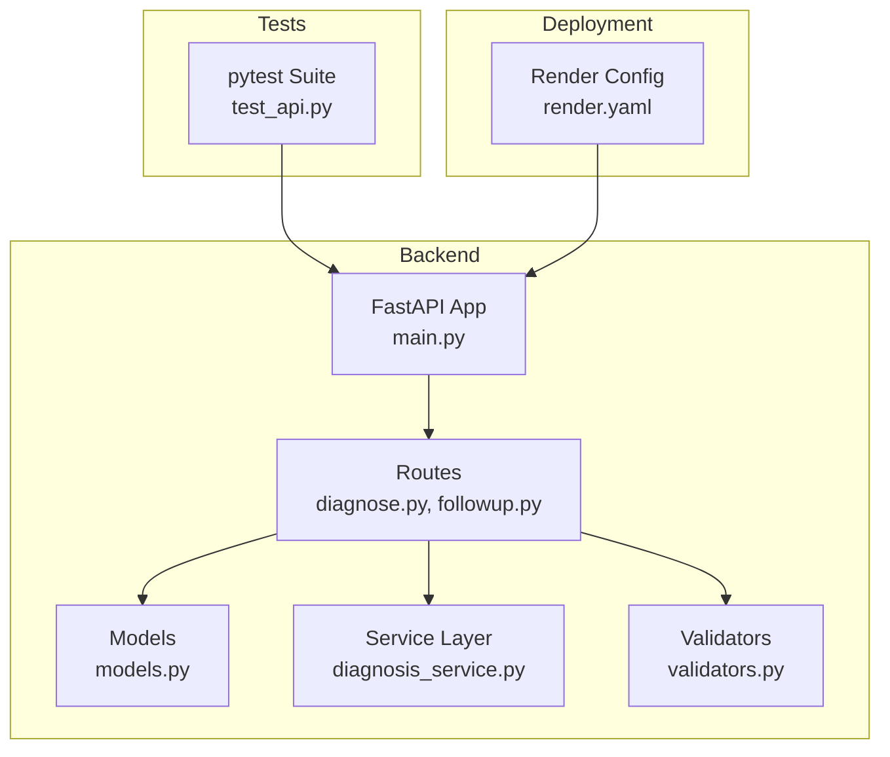
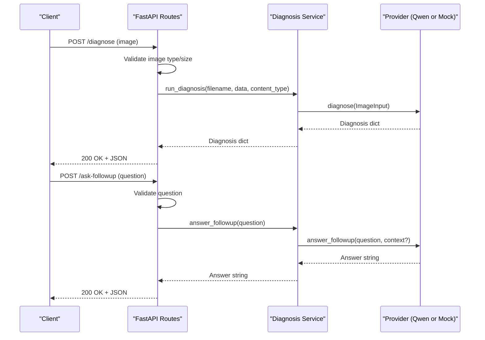
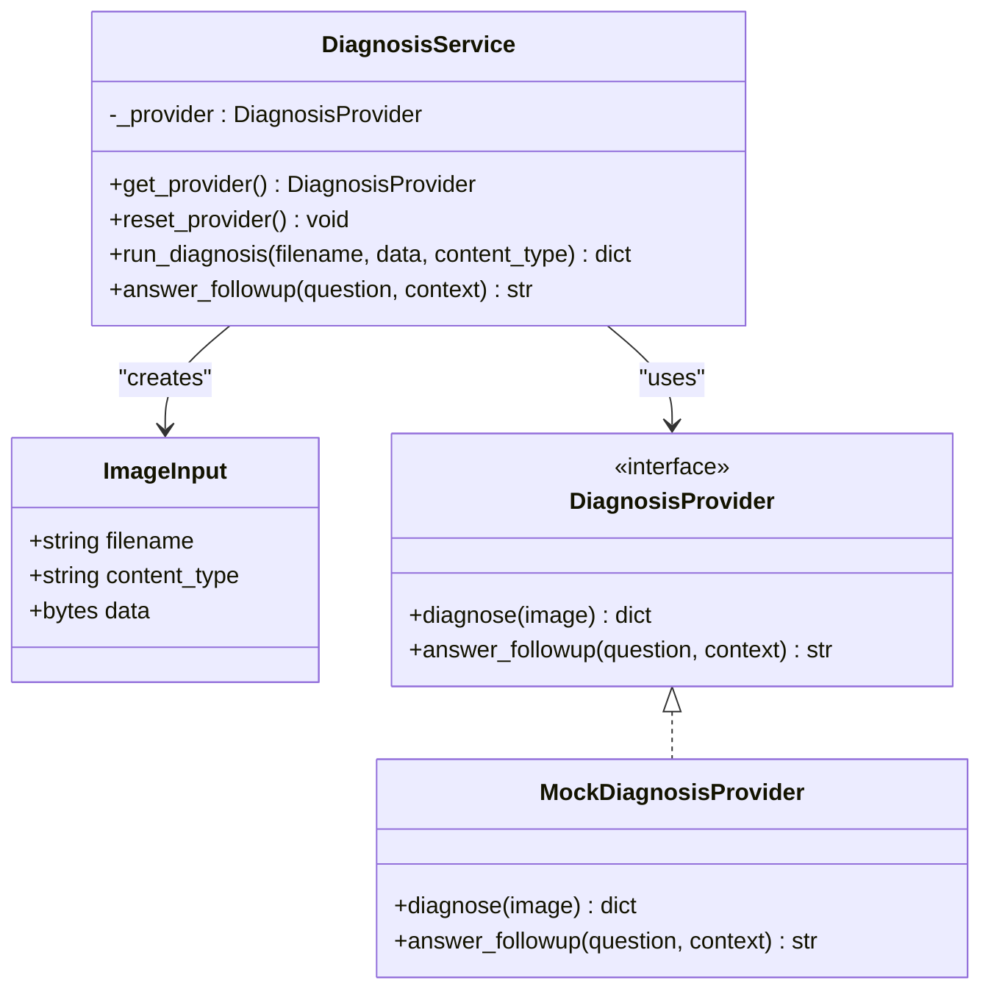
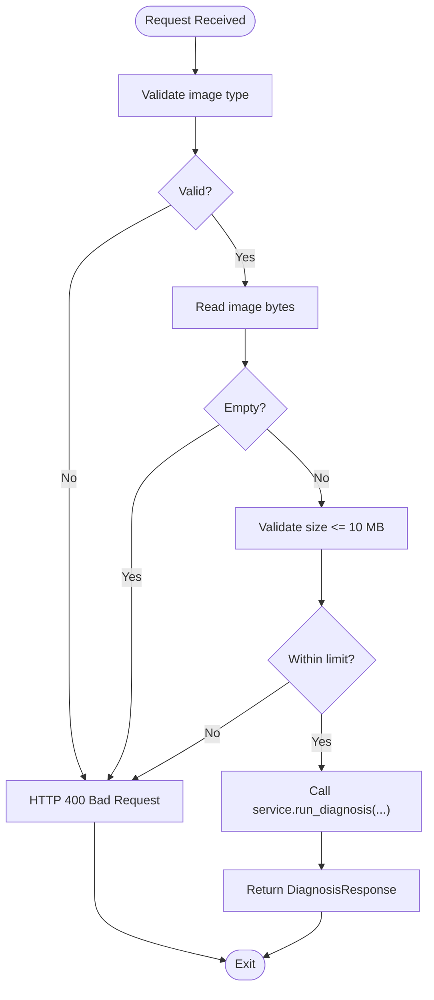
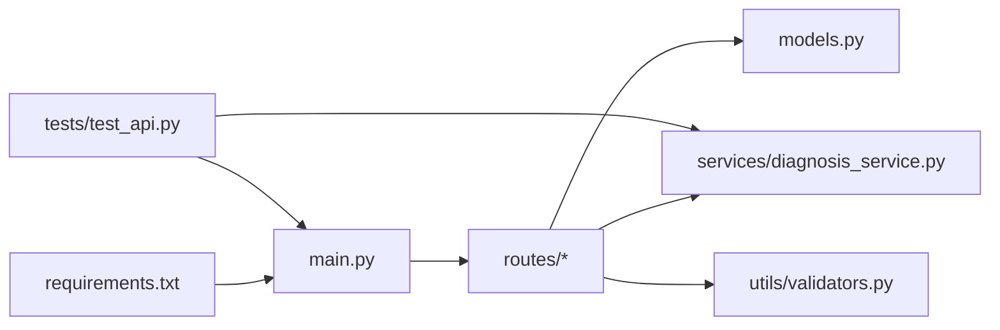

# Testing and Deployment

<cite>
**Referenced Files in This Document**
- [README.md](file://README.md)
- [requirements.txt](file://requirements.txt)
- [backend/main.py](file://backend/main.py)
- [backend/models.py](file://backend/models.py)
- [backend/services/diagnosis_service.py](file://backend/services/diagnosis_service.py)
- [backend/routes/diagnose.py](file://backend/routes/diagnose.py)
- [backend/routes/followup.py](file://backend/routes/followup.py)
- [backend/utils/validators.py](file://backend/utils/validators.py)
- [tests/test_api.py](file://tests/test_api.py)
- [demo_backup/render.yaml](file://demo_backup/render.yaml)
</cite>

## Table of Contents
1. [Introduction](#introduction)
2. [Project Structure](#project-structure)
3. [Core Components](#core-components)
4. [Architecture Overview](#architecture-overview)
5. [Detailed Component Analysis](#detailed-component-analysis)
6. [Dependency Analysis](#dependency-analysis)
7. [Performance Considerations](#performance-considerations)
8. [Troubleshooting Guide](#troubleshooting-guide)
9. [Conclusion](#conclusion)
10. [Appendices](#appendices)

## Introduction
This document provides comprehensive testing and deployment guidance for the FasalDoc backend with a focus on integrating Qwen/Alibaba Cloud (DashScope). The backend currently runs fully offline using a mock provider until real credentials are configured. It exposes endpoints for image-based diagnosis and follow-up Q&A, with robust validation and error handling. The integration point is isolated in the service layer so that routes remain unchanged when the real AI provider is implemented.

## Project Structure
The repository is organized into:
- Backend: FastAPI application with routes, models, service layer, and validators
- Frontend: React + Vite app (not covered here)
- Tests: Offline pytest suite using FastAPI TestClient
- Configuration: Environment variables for CORS and optional AI credentials
- Deployment: Example Render configuration for hosting the backend

**Diagram sources**
- [backend/main.py:1-45](file://backend/main.py#L1-L45)
- [backend/routes/diagnose.py:1-59](file://backend/routes/diagnose.py#L1-L59)
- [backend/routes/followup.py:1-40](file://backend/routes/followup.py#L1-L40)
- [backend/models.py:1-58](file://backend/models.py#L1-L58)
- [backend/services/diagnosis_service.py:1-128](file://backend/services/diagnosis_service.py#L1-L128)
- [backend/utils/validators.py:1-19](file://backend/utils/validators.py#L1-L19)
- [tests/test_api.py:1-129](file://tests/test_api.py#L1-L129)
- [demo_backup/render.yaml:1-6](file://demo_backup/render.yaml#L1-L6)

**Section sources**
- [README.md:1-106](file://README.md#L1-L106)
- [backend/main.py:1-45](file://backend/main.py#L1-L45)
- [requirements.txt:1-6](file://requirements.txt#L1-L6)

## Core Components
- FastAPI application with CORS middleware and health endpoint
- Routes for diagnosis and follow-up Q&A
- Service layer with a stable protocol for AI providers and an offline mock fallback
- Pydantic models defining request/response contracts
- Validators for image type, size, and question content
- Offline tests validating endpoints, CORS, and service behavior without network calls

Key responsibilities:
- Route handlers validate inputs and delegate to the service layer
- Service layer selects between a real Qwen provider (when configured) and a mock provider
- Models ensure consistent API contracts
- Validators enforce input constraints early

**Section sources**
- [backend/main.py:1-45](file://backend/main.py#L1-L45)
- [backend/routes/diagnose.py:1-59](file://backend/routes/diagnose.py#L1-L59)
- [backend/routes/followup.py:1-40](file://backend/routes/followup.py#L1-L40)
- [backend/models.py:1-58](file://backend/models.py#L1-L58)
- [backend/services/diagnosis_service.py:1-128](file://backend/services/diagnosis_service.py#L1-L128)
- [backend/utils/validators.py:1-19](file://backend/utils/validators.py#L1-L19)
- [tests/test_api.py:1-129](file://tests/test_api.py#L1-L129)

## Architecture Overview
The system follows a layered architecture:
- Presentation: FastAPI routes handle HTTP requests and responses
- Domain: Service layer encapsulates business logic and AI provider abstraction
- Data: Models define contracts; validators enforce input rules
- Infrastructure: Provider selection based on environment configuration; mock fallback ensures offline operation

**Diagram sources**
- [backend/routes/diagnose.py:13-59](file://backend/routes/diagnose.py#L13-L59)
- [backend/routes/followup.py:10-40](file://backend/routes/followup.py#L10-L40)
- [backend/services/diagnosis_service.py:40-128](file://backend/services/diagnosis_service.py#L40-L128)

## Detailed Component Analysis

### Service Layer and Provider Abstraction
The service layer defines a stable protocol for diagnosis providers and implements a mock provider for offline use. Provider selection is automatic based on environment configuration.

**Diagram sources**
- [backend/services/diagnosis_service.py:31-128](file://backend/services/diagnosis_service.py#L31-L128)

**Section sources**
- [backend/services/diagnosis_service.py:1-128](file://backend/services/diagnosis_service.py#L1-L128)

### Routes and Validation
Routes perform input validation and delegate to the service layer. Errors are converted to appropriate HTTP status codes.

**Diagram sources**
- [backend/routes/diagnose.py:13-59](file://backend/routes/diagnose.py#L13-L59)
- [backend/utils/validators.py:1-19](file://backend/utils/validators.py#L1-L19)

**Section sources**
- [backend/routes/diagnose.py:1-59](file://backend/routes/diagnose.py#L1-L59)
- [backend/routes/followup.py:1-40](file://backend/routes/followup.py#L1-L40)
- [backend/utils/validators.py:1-19](file://backend/utils/validators.py#L1-L19)

### Models and Contracts
Pydantic models define the API contracts for diagnosis and follow-up responses, ensuring consistency across frontend and backend.

**Section sources**
- [backend/models.py:1-58](file://backend/models.py#L1-L58)

### Application Setup and CORS
The FastAPI app configures CORS for local development and includes routers for diagnosis and follow-up endpoints. A health check endpoint is exposed at the root path.

**Section sources**
- [backend/main.py:1-45](file://backend/main.py#L1-L45)

## Dependency Analysis
The backend depends on FastAPI, Uvicorn, multipart parsing, and testing libraries. The service layer abstracts external dependencies behind a provider interface, enabling offline operation and easy integration of Qwen/Alibaba Cloud later.

**Diagram sources**
- [requirements.txt:1-6](file://requirements.txt#L1-L6)
- [backend/main.py:1-45](file://backend/main.py#L1-L45)
- [backend/routes/diagnose.py:1-59](file://backend/routes/diagnose.py#L1-L59)
- [backend/routes/followup.py:1-40](file://backend/routes/followup.py#L1-L40)
- [backend/services/diagnosis_service.py:1-128](file://backend/services/diagnosis_service.py#L1-L128)
- [backend/models.py:1-58](file://backend/models.py#L1-L58)
- [backend/utils/validators.py:1-19](file://backend/utils/validators.py#L1-L19)
- [tests/test_api.py:1-129](file://tests/test_api.py#L1-L129)

**Section sources**
- [requirements.txt:1-6](file://requirements.txt#L1-L6)
- [backend/main.py:1-45](file://backend/main.py#L1-L45)

## Performance Considerations
- Input validation reduces unnecessary processing by rejecting invalid or oversized images early
- Service provider caching avoids repeated initialization overhead
- For high-volume usage:
  - Use connection pooling and timeouts for external AI calls
  - Implement rate limiting and request queuing at the gateway level
  - Scale horizontally behind a reverse proxy/load balancer
  - Monitor latency and error rates; set alerts for degradation
  - Consider async streaming for long-running AI responses if supported by the provider

[No sources needed since this section provides general guidance]

## Troubleshooting Guide
Common issues and resolutions:
- Missing or placeholder API key: The service falls back to the mock provider; verify environment variable presence and non-placeholder value
- CORS errors: Ensure CORS_ALLOW_ORIGINS includes the frontend origin; defaults allow local development
- Invalid image uploads: Check allowed types and size limits enforced by validators
- Unexpected 500 errors: Internal exceptions are caught and translated to user-friendly messages; inspect server logs for details

Logging best practices:
- Log provider selection and failures with contextual information
- Avoid logging sensitive data (e.g., API keys, full image payloads)
- Include correlation IDs for request tracing across components

Debugging techniques:
- Use OpenAPI docs at /docs to inspect endpoints and payloads
- Run tests locally to validate behavior without external dependencies
- Inspect environment variables and runtime configuration during deployment

**Section sources**
- [backend/services/diagnosis_service.py:75-95](file://backend/services/diagnosis_service.py#L75-L95)
- [backend/main.py:19-35](file://backend/main.py#L19-L35)
- [backend/routes/diagnose.py:21-59](file://backend/routes/diagnose.py#L21-L59)
- [backend/routes/followup.py:18-34](file://backend/routes/followup.py#L18-L34)

## Conclusion
The FasalDoc backend provides a robust, testable foundation for crop-disease diagnosis and follow-up Q&A. Its service-layer abstraction enables seamless integration of Qwen/Alibaba Cloud while maintaining offline functionality. The existing test suite validates core behaviors without external dependencies, and the deployment configuration supports straightforward hosting. Following the testing strategies and deployment procedures outlined here will help ensure reliability, scalability, and maintainability as the AI integration matures.

[No sources needed since this section summarizes without analyzing specific files]

## Appendices

### Testing Strategies
- Unit tests:
  - Validate route-level behavior using FastAPI TestClient
  - Assert response schemas and status codes
  - Verify validator behavior for image types, sizes, and questions
- Integration tests:
  - Simulate successful API calls and error conditions
  - Use environment variable manipulation to switch providers
  - Mock external calls via monkeypatching where necessary
- End-to-end scenarios:
  - Full request flows from client to service to provider (mocked)
  - CORS behavior verification for local frontend origins

Example test coverage areas:
- Health endpoint returns expected message
- Follow-up endpoint accepts valid questions and rejects empty ones
- Diagnosis endpoint validates image type, size, and emptiness
- Service fallback to mock when credentials are absent

**Section sources**
- [tests/test_api.py:16-129](file://tests/test_api.py#L16-L129)
- [backend/utils/validators.py:1-19](file://backend/utils/validators.py#L1-L19)
- [backend/services/diagnosis_service.py:75-112](file://backend/services/diagnosis_service.py#L75-L112)

### Deployment Procedures
- Local development:
  - Install dependencies and start the server with auto-reload
  - Configure CORS for local frontend if needed
- Staging:
  - Set environment variables for staging-specific settings
  - Enable monitoring and structured logging
  - Run full test suite before promotion
- Production:
  - Use a production-grade ASGI server configuration
  - Secure secrets management (environment variables or secret managers)
  - Configure reverse proxy and TLS termination
  - Set up health checks and readiness probes

Environment-specific configurations:
- CORS_ALLOW_ORIGINS: Comma-separated list of allowed origins
- DASHSCOPE_API_KEY: Required for real AI provider; otherwise mock is used
- PORT: Server port (used by deployment platforms)

Secret management strategies:
- Store secrets in platform secret stores or environment variables
- Never commit secrets to version control
- Rotate keys regularly and audit access

Monitoring setup:
- Expose health endpoint for liveness/readiness checks
- Collect metrics (request counts, latency, error rates)
- Set up alerts for anomalies and SLA breaches

**Section sources**
- [README.md:22-67](file://README.md#L22-L67)
- [backend/main.py:19-35](file://backend/main.py#L19-L35)
- [demo_backup/render.yaml:1-6](file://demo_backup/render.yaml#L1-L6)

### Rollback and Disaster Recovery
- Rollback procedures:
  - Maintain previous versions of deployments
  - Use feature flags to toggle new AI provider behavior
  - Revert to mock provider if external service is unavailable
- Disaster recovery:
  - Graceful degradation to mock provider when credentials are missing or provider fails
  - Backup configuration and secrets securely
  - Document incident response steps and communication plans

**Section sources**
- [backend/services/diagnosis_service.py:80-95](file://backend/services/diagnosis_service.py#L80-L95)
- [backend/routes/diagnose.py:45-59](file://backend/routes/diagnose.py#L45-L59)
- [backend/routes/followup.py:25-34](file://backend/routes/followup.py#L25-L34)