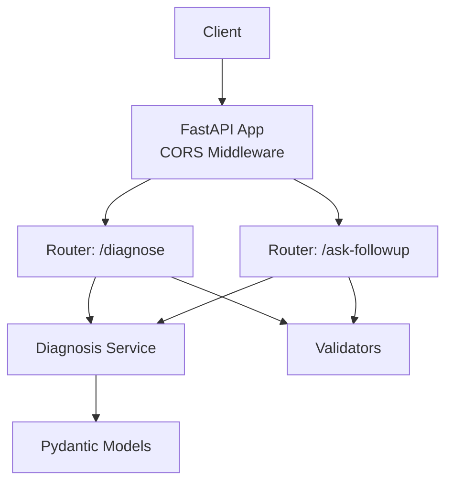
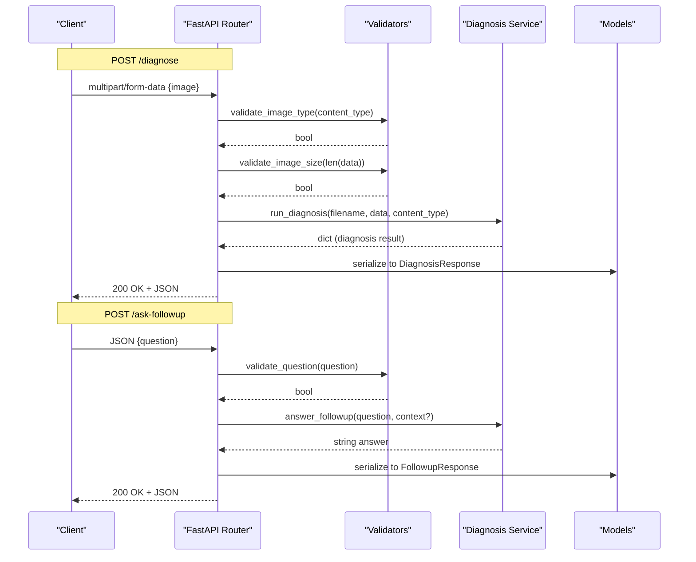
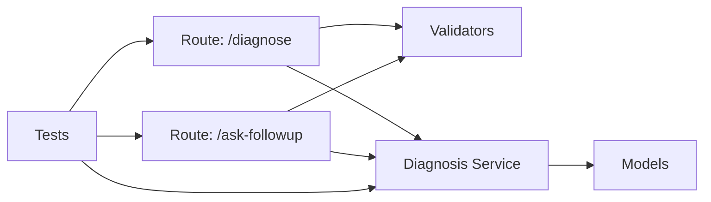

# API Reference

<cite>
**Referenced Files in This Document**
- [main.py](file://backend/main.py)
- [diagnose.py](file://backend/routes/diagnose.py)
- [followup.py](file://backend/routes/followup.py)
- [diagnosis_service.py](file://backend/services/diagnosis_service.py)
- [models.py](file://backend/models.py)
- [validators.py](file://backend/utils/validators.py)
- [test_api.py](file://tests/test_api.py)
- [api.ts](file://frontend/src/types/api.ts)
</cite>

## Table of Contents
1. [Introduction](#introduction)
2. [Project Structure](#project-structure)
3. [Core Components](#core-components)
4. [Architecture Overview](#architecture-overview)
5. [Detailed Component Analysis](#detailed-component-analysis)
6. [Dependency Analysis](#dependency-analysis)
7. [Performance Considerations](#performance-considerations)
8. [Troubleshooting Guide](#troubleshooting-guide)
9. [Conclusion](#conclusion)
10. [Appendices](#appendices)

## Introduction
This document specifies the RESTful API for FasalDoc’s backend, focusing on complete interface specifications for all endpoints. It covers HTTP methods, URL patterns, request/response schemas, validation rules, authentication requirements (none), error codes, status messages, CORS configuration, and testing examples using curl or Postman. The API provides:
- POST /diagnose: Upload a multipart image to receive a crop disease diagnosis with confidence scores and advice.
- POST /ask-followup: Submit a JSON question to receive an answer; context is supported by the service layer but not required by the route.

The server runs fully offline with mock responses until external AI integration is configured via environment variables.

## Project Structure
The FastAPI application defines two routers that are mounted at the app root:
- Diagnose router under /diagnose
- Follow-up router under /ask-followup

CORS is enabled for local frontend development and can be overridden via an environment variable. A health endpoint returns a simple status message.

**Diagram sources**
- [main.py:1-45](file://backend/main.py#L1-L45)
- [diagnose.py:1-59](file://backend/routes/diagnose.py#L1-L59)
- [followup.py:1-40](file://backend/routes/followup.py#L1-L40)
- [diagnosis_service.py:1-128](file://backend/services/diagnosis_service.py#L1-L128)
- [models.py:1-58](file://backend/models.py#L1-L58)
- [validators.py:1-19](file://backend/utils/validators.py#L1-L19)

**Section sources**
- [main.py:1-45](file://backend/main.py#L1-L45)

## Core Components
- Health endpoint: GET / returns a status object indicating the API is running.
- Diagnosis endpoint: POST /diagnose accepts multipart/form-data with a single image field named image. Validates content type, non-empty payload, and size limit. Returns a structured diagnosis including filename, diagnosis, confidence (0..1), advice, and needs_expert.
- Follow-up endpoint: POST /ask-followup accepts JSON with a question field. Validates non-empty question. Returns question and answer. The service layer supports optional context for follow-up answers, though the route does not require it.

Authentication: None. All endpoints are public.

Rate limiting: Not implemented in this codebase.

Security headers: Only CORS headers are explicitly set via middleware. No additional security headers are enforced by the application code.

CORS configuration:
- Allowed origins default to http://localhost:5173 and http://127.0.0.1:5173.
- Can be overridden by setting the CORS_ALLOW_ORIGINS environment variable as a comma-separated list.
- Credentials allowed.
- All methods and headers allowed.

OpenAPI docs: Available at /docs and /openapi.json.

**Section sources**
- [main.py:1-45](file://backend/main.py#L1-L45)
- [diagnose.py:1-59](file://backend/routes/diagnose.py#L1-L59)
- [followup.py:1-40](file://backend/routes/followup.py#L1-L40)
- [models.py:1-58](file://backend/models.py#L1-L58)
- [validators.py:1-19](file://backend/utils/validators.py#L1-L19)

## Architecture Overview
The API follows a layered design:
- Routes handle HTTP I/O, input validation, and error mapping.
- Services encapsulate business logic and provider selection (mock vs real AI).
- Models define request/response contracts.
- Utilities provide shared validation helpers.

**Diagram sources**
- [diagnose.py:1-59](file://backend/routes/diagnose.py#L1-L59)
- [followup.py:1-40](file://backend/routes/followup.py#L1-L40)
- [diagnosis_service.py:1-128](file://backend/services/diagnosis_service.py#L1-L128)
- [models.py:1-58](file://backend/models.py#L1-L58)
- [validators.py:1-19](file://backend/utils/validators.py#L1-L19)

## Detailed Component Analysis

### Endpoint: POST /diagnose
Purpose:
- Accepts a multipart image upload and returns a diagnosis with confidence score and advice.

URL:
- /diagnose

Method:
- POST

Content-Type:
- multipart/form-data

Request:
- Field name: image
- Type: File
- Supported formats: JPEG, PNG, WEBP
- Size limit: Up to 10 MB
- Empty uploads are rejected

Validation:
- Content type must be one of image/jpeg, image/png, image/webp
- Image data must not be empty
- Image size must not exceed 10 MB

Response:
- Status 200 on success
- Body schema: DiagnosisResponse
  - filename: string
  - diagnosis: string
  - confidence: number (0..1)
  - advice: string
  - needs_expert: boolean

Error handling:
- 400 Bad Request: Invalid content type, empty image, or image too large
- 422 Unprocessable Entity: Missing required field (image)
- 500 Internal Server Error: Unexpected processing failure

Example requests:
- curl
  - Valid image:
    - curl -X POST "http://localhost:8000/diagnose" -F "image=@path/to/image.jpg"
  - Invalid type:
    - curl -X POST "http://localhost:8000/diagnose" -F "image=@path/to/image.gif"
  - Empty file:
    - curl -X POST "http://localhost:8000/diagnose" -F "image=@/dev/null"
  - Oversized file:
    - curl -X POST "http://localhost:8000/diagnose" -F "image=@path/to/big.jpg"
- Postman
  - Create a new POST request to /diagnose
  - Set body to form-data
  - Add key: image, type: File, select a valid image file

Notes:
- Authentication: None
- CORS: Enabled for configured origins
- Rate limiting: Not implemented

**Section sources**
- [diagnose.py:13-59](file://backend/routes/diagnose.py#L13-L59)
- [validators.py:1-19](file://backend/utils/validators.py#L1-L19)
- [models.py:10-31](file://backend/models.py#L10-L31)
- [test_api.py:54-91](file://tests/test_api.py#L54-L91)

### Endpoint: POST /ask-followup
Purpose:
- Accepts a JSON question and returns an answer. Context support exists in the service layer but is not required by the route.

URL:
- /ask-followup

Method:
- POST

Content-Type:
- application/json

Request:
- Body schema: FollowupRequest
  - question: string (non-empty after trimming whitespace)

Response:
- Status 200 on success
- Body schema: FollowupResponse
  - question: string (echoed from request)
  - answer: string

Error handling:
- 400 Bad Request: Question is empty or whitespace-only
- 422 Unprocessable Entity: Missing required field (question)
- 500 Internal Server Error: Unexpected processing failure

Example requests:
- curl
  - Valid question:
    - curl -X POST "http://localhost:8000/ask-followup" -H "Content-Type: application/json" -d '{"question":"How often should I water after treatment?"}'
  - Empty question:
    - curl -X POST "http://localhost:8000/ask-followup" -H "Content-Type: application/json" -d '{"question":"   "}'
  - Missing field:
    - curl -X POST "http://localhost:8000/ask-followup" -H "Content-Type: application/json" -d '{}'
- Postman
  - Create a new POST request to /ask-followup
  - Set body to raw JSON
  - Add key: question, value: your question text

Notes:
- Authentication: None
- CORS: Enabled for configured origins
- Rate limiting: Not implemented
- Context: The service layer supports passing context to answer_followup, enabling richer follow-ups if extended by the route in future versions.

**Section sources**
- [followup.py:10-39](file://backend/routes/followup.py#L10-L39)
- [validators.py:18-19](file://backend/utils/validators.py#L18-L19)
- [models.py:34-58](file://backend/models.py#L34-L58)
- [test_api.py:29-49](file://tests/test_api.py#L29-L49)

### Data Models
- DiagnosisResponse: Defines the structure of diagnosis results returned by /diagnose.
- FollowupRequest: Defines the structure of questions submitted to /ask-followup.
- FollowupResponse: Defines the structure of answers returned by /ask-followup.

These models are mirrored in the frontend types for consistency.

**Section sources**
- [models.py:10-58](file://backend/models.py#L10-L58)
- [api.ts:6-25](file://frontend/src/types/api.ts#L6-L25)

### Validation Rules
- Allowed image types: image/jpeg, image/png, image/webp
- Maximum image size: 10 MB
- Question validation: Must be present and not only whitespace

**Section sources**
- [validators.py:1-19](file://backend/utils/validators.py#L1-L19)

### Service Layer Behavior
- Provider selection: If DASHSCOPE_API_KEY is configured and valid, attempts to use a real provider; otherwise falls back to a mock provider.
- Mock behavior:
  - Diagnosis returns deterministic fields including filename, diagnosis, confidence (0..1), advice, and needs_expert.
  - Follow-up answer returns a temporary response string.

**Section sources**
- [diagnosis_service.py:55-73](file://backend/services/diagnosis_service.py#L55-L73)
- [diagnosis_service.py:75-128](file://backend/services/diagnosis_service.py#L75-L128)

## Dependency Analysis
The API components depend on each other as follows:
- Routes depend on validators and services.
- Services depend on providers (mock or real) and return model-compatible structures.
- Models define contracts used by routes and tests.
- Tests verify endpoint behavior, CORS, and service fallback.

**Diagram sources**
- [diagnose.py:1-59](file://backend/routes/diagnose.py#L1-L59)
- [followup.py:1-40](file://backend/routes/followup.py#L1-L40)
- [diagnosis_service.py:1-128](file://backend/services/diagnosis_service.py#L1-L128)
- [models.py:1-58](file://backend/models.py#L1-L58)
- [test_api.py:1-129](file://tests/test_api.py#L1-L129)

**Section sources**
- [test_api.py:1-129](file://tests/test_api.py#L1-L129)

## Performance Considerations
- Image uploads are validated early to reject invalid or oversized files before processing.
- The service layer uses a cached provider instance to avoid repeated initialization overhead.
- No rate limiting is implemented; consider adding throttling at the gateway or middleware level if needed.
- For high-throughput scenarios, consider streaming uploads and asynchronous processing pipelines.

[No sources needed since this section provides general guidance]

## Troubleshooting Guide
Common issues and resolutions:
- 400 Bad Request on /diagnose:
  - Cause: Unsupported image type, empty upload, or file exceeds 10 MB.
  - Resolution: Ensure the file is JPEG/PNG/WEBP, not empty, and under 10 MB.
- 422 Unprocessable Entity:
  - Cause: Missing required fields (image for /diagnose, question for /ask-followup).
  - Resolution: Include all required fields in the request.
- 400 Bad Request on /ask-followup:
  - Cause: Question is empty or whitespace-only.
  - Resolution: Provide a non-empty question string.
- 500 Internal Server Error:
  - Cause: Unexpected exception during processing.
  - Resolution: Retry later; check server logs for details.

CORS verification:
- Confirm that the Origin header matches an allowed origin.
- Default allowed origins include http://localhost:5173 and http://127.0.0.1:5173.
- Override with CORS_ALLOW_ORIGINS environment variable.

Testing references:
- Health endpoint returns 200 and a message.
- OpenAPI docs available at /docs and /openapi.json.
- Endpoints exposed in OpenAPI paths include /, /diagnose, /ask-followup.

**Section sources**
- [diagnose.py:21-59](file://backend/routes/diagnose.py#L21-L59)
- [followup.py:18-39](file://backend/routes/followup.py#L18-L39)
- [validators.py:1-19](file://backend/utils/validators.py#L1-L19)
- [test_api.py:18-109](file://tests/test_api.py#L18-L109)

## Conclusion
FasalDoc’s API provides a straightforward interface for crop disease diagnosis and follow-up Q&A. The endpoints enforce clear validation rules, return well-defined schemas, and operate without authentication. CORS is configured for local development and can be customized. The service layer supports both mock and real AI providers, ensuring the system remains functional offline. Use the provided curl and Postman examples to test each endpoint and consult the troubleshooting guide for common issues.

[No sources needed since this section summarizes without analyzing specific files]

## Appendices

### Environment Variables
- CORS_ALLOW_ORIGINS: Comma-separated list of allowed origins for CORS. Defaults to http://localhost:5173,http://127.0.0.1:5173.
- DASHSCOPE_API_KEY: Optional key to enable real AI provider; if missing or placeholder, the system falls back to mock responses.

**Section sources**
- [main.py:19-35](file://backend/main.py#L19-L35)
- [diagnosis_service.py:75-95](file://backend/services/diagnosis_service.py#L75-L95)

### OpenAPI and Documentation
- Interactive docs: /docs
- OpenAPI schema: /openapi.json

**Section sources**
- [test_api.py:96-102](file://tests/test_api.py#L96-L102)