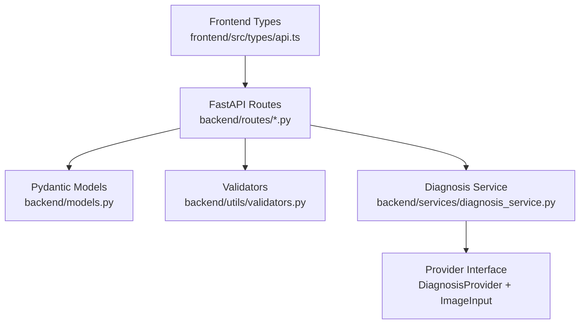
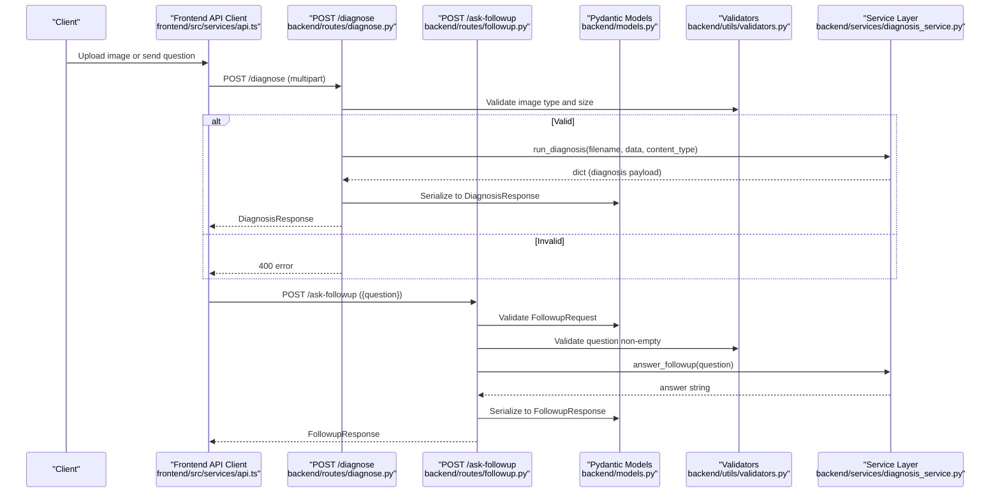
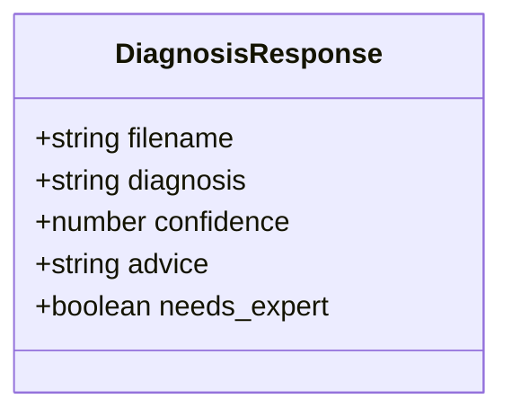
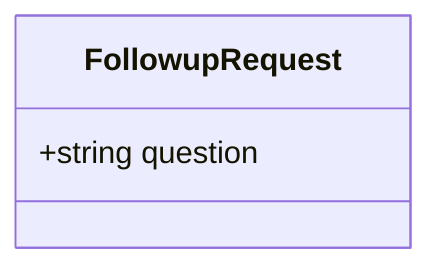
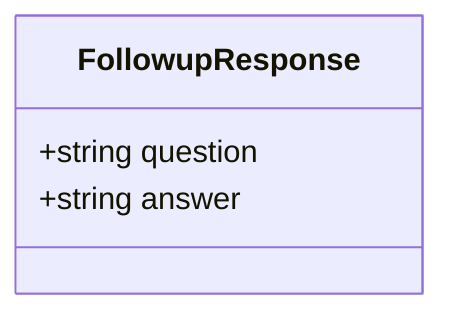
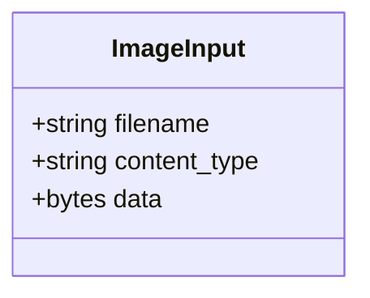
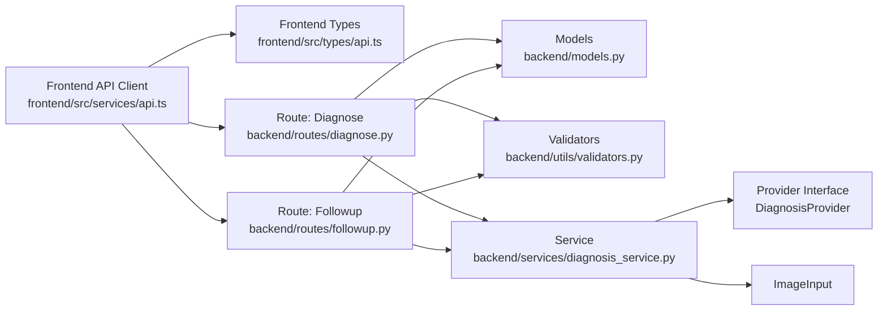

# Data Models & Schemas

<cite>
**Referenced Files in This Document**
- [models.py](file://backend/models.py)
- [api.ts](file://frontend/src/types/api.ts)
- [diagnose.py](file://backend/routes/diagnose.py)
- [followup.py](file://backend/routes/followup.py)
- [diagnosis_service.py](file://backend/services/diagnosis_service.py)
- [validators.py](file://backend/utils/validators.py)
- [api_client.ts](file://frontend/src/services/api.ts)
- [README.md](file://README.md)
</cite>

## Table of Contents
1. [Introduction](#introduction)
2. [Project Structure](#project-structure)
3. [Core Components](#core-components)
4. [Architecture Overview](#architecture-overview)
5. [Detailed Component Analysis](#detailed-component-analysis)
6. [Dependency Analysis](#dependency-analysis)
7. [Performance Considerations](#performance-considerations)
8. [Troubleshooting Guide](#troubleshooting-guide)
9. [Conclusion](#conclusion)
10. [Appendices](#appendices)

## Introduction
This document describes FasalDoc’s API data models and schemas with a focus on type definitions and data structures across the backend (Pydantic v2) and frontend (TypeScript). It covers:
- Backend Pydantic models: DiagnosisResponse, FollowupRequest, FollowupResponse
- Backend internal data structure: ImageInput
- Frontend TypeScript interfaces mirroring backend contracts
- Validation rules, constraints, optional fields, defaults, and embedded business logic
- Example JSON payloads for each model
- Serialization/deserialization behavior
- Versioning considerations and migration guidance for schema changes while preserving backward compatibility

## Project Structure
The data contract is defined in the backend and mirrored in the frontend to ensure end-to-end type safety. The FastAPI routes declare request/response models and enforce validation via Pydantic and custom validators. The service layer encapsulates provider selection and returns structured results that conform to the response models.

**Diagram sources**
- [api.ts:1-26](file://frontend/src/types/api.ts#L1-L26)
- [diagnose.py:1-59](file://backend/routes/diagnose.py#L1-L59)
- [followup.py:1-40](file://backend/routes/followup.py#L1-L40)
- [models.py:1-58](file://backend/models.py#L1-L58)
- [validators.py:1-19](file://backend/utils/validators.py#L1-L19)
- [diagnosis_service.py:31-52](file://backend/services/diagnosis_service.py#L31-L52)

**Section sources**
- [README.md:80-87](file://README.md#L80-L87)
- [diagnose.py:13-59](file://backend/routes/diagnose.py#L13-L59)
- [followup.py:10-39](file://backend/routes/followup.py#L10-L39)

## Core Components
This section summarizes the core data models used by the API.

- DiagnosisResponse (backend Pydantic; frontend interface mirrors it)
- FollowupRequest (backend Pydantic; frontend interface mirrors it)
- FollowupResponse (backend Pydantic; frontend interface mirrors it)
- ImageInput (backend internal dataclass used by the service layer)

Key characteristics:
- All fields are required unless explicitly marked otherwise.
- Numeric ranges and string constraints are enforced at the boundary (routes and models).
- Frontend types mirror backend contracts to maintain compile-time safety.

**Section sources**
- [models.py:10-58](file://backend/models.py#L10-L58)
- [api.ts:6-25](file://frontend/src/types/api.ts#L6-L25)
- [diagnosis_service.py:31-38](file://backend/services/diagnosis_service.py#L31-L38)

## Architecture Overview
The API endpoints use Pydantic models to validate inputs and serialize outputs. The diagnosis endpoint accepts multipart image uploads and returns a diagnosis result. The follow-up endpoint accepts a JSON question and returns an answer.

**Diagram sources**
- [diagnose.py:13-59](file://backend/routes/diagnose.py#L13-L59)
- [followup.py:10-39](file://backend/routes/followup.py#L10-L39)
- [models.py:10-58](file://backend/models.py#L10-L58)
- [validators.py:1-19](file://backend/utils/validators.py#L1-L19)
- [diagnosis_service.py:116-128](file://backend/services/diagnosis_service.py#L116-L128)
- [api_client.ts:60-98](file://frontend/src/services/api.ts#L60-L98)

## Detailed Component Analysis

### DiagnosisResponse
- Purpose: Represents the diagnosis result returned by the diagnose endpoint.
- Fields:
  - filename: string — Name of the uploaded image file.
  - diagnosis: string — Predicted disease or condition.
  - confidence: number (float) — Model confidence constrained to 0..1.
  - advice: string — Recommended next action for the farmer.
  - needs_expert: boolean — Whether escalation to a human expert is recommended.
- Validation rules:
  - confidence must be between 0 and 1 inclusive.
- Optional fields: None.
- Default values: None.
- Example JSON payload:
  - { "filename": "tomato_leaf.jpg", "diagnosis": "Early Blight", "confidence": 0.70, "advice": "Remove affected leaves and improve airflow around the plant.", "needs_expert": false }
- Serialization/Deserialization:
  - FastAPI serializes this Pydantic model to JSON automatically.
  - Frontend consumes it as the DiagnosisResponse TypeScript interface.
- Business logic:
  - Confidence range enforces valid probability-like values.
  - needs_expert flag guides downstream UX (e.g., escalation prompts).

**Section sources**
- [models.py:10-31](file://backend/models.py#L10-L31)
- [api.ts:6-14](file://frontend/src/types/api.ts#L6-L14)

#### Class Diagram: DiagnosisResponse

**Diagram sources**
- [models.py:10-31](file://backend/models.py#L10-L31)
- [api.ts:6-14](file://frontend/src/types/api.ts#L6-L14)

### FollowupRequest
- Purpose: Request body for asking a follow-up question about a diagnosis.
- Fields:
  - question: string — Non-empty question text.
- Validation rules:
  - Must not be empty or whitespace-only (validated both in model and route-level validator).
- Optional fields: None.
- Default values: None.
- Example JSON payload:
  - { "question": "How often should I water after treatment?" }
- Serialization/Deserialization:
  - FastAPI validates and parses JSON into FollowupRequest.
  - Frontend sends JSON with a single key "question".
- Business logic:
  - Ensures meaningful questions are processed.

**Section sources**
- [models.py:34-43](file://backend/models.py#L34-L43)
- [followup.py:16-23](file://backend/routes/followup.py#L16-L23)
- [api.ts:16-19](file://frontend/src/types/api.ts#L16-L19)
- [api_client.ts:79-98](file://frontend/src/services/api.ts#L79-L98)

#### Class Diagram: FollowupRequest

**Diagram sources**
- [models.py:34-43](file://backend/models.py#L34-L43)
- [api.ts:16-19](file://frontend/src/types/api.ts#L16-L19)

### FollowupResponse
- Purpose: Response body for the follow-up endpoint containing the echoed question and assistant answer.
- Fields:
  - question: string — Echo of the submitted question.
  - answer: string — Assistant answer to the question.
- Optional fields: None.
- Default values: None.
- Example JSON payload:
  - { "question": "How often should I water after treatment?", "answer": "Keep the soil moist but not waterlogged, roughly every 2 days." }
- Serialization/Deserialization:
  - FastAPI serializes to JSON; frontend parses into FollowupResponse interface.
- Business logic:
  - Provides consistent shape for chat UI rendering.

**Section sources**
- [models.py:46-58](file://backend/models.py#L46-L58)
- [api.ts:21-25](file://frontend/src/types/api.ts#L21-L25)

#### Class Diagram: FollowupResponse

**Diagram sources**
- [models.py:46-58](file://backend/models.py#L46-L58)
- [api.ts:21-25](file://frontend/src/types/api.ts#L21-L25)

### ImageInput (Internal)
- Purpose: Internal data structure passed to the diagnosis provider representing an uploaded image.
- Fields:
  - filename: string — Original file name.
  - content_type: string — MIME type of the image.
  - data: bytes — Raw image bytes.
- Optional fields: None.
- Default values: None.
- Usage:
  - Constructed by the service layer before calling the provider’s diagnose method.
- Notes:
  - Not exposed directly over the API; used within the backend service boundary.

**Section sources**
- [diagnosis_service.py:31-38](file://backend/services/diagnosis_service.py#L31-L38)
- [diagnosis_service.py:116-123](file://backend/services/diagnosis_service.py#L116-L123)

#### Class Diagram: ImageInput

**Diagram sources**
- [diagnosis_service.py:31-38](file://backend/services/diagnosis_service.py#L31-L38)

### Validation Rules and Constraints
- Allowed image types: JPEG, PNG, WEBP.
- Maximum image size: 10 MB.
- Question validation: Must be non-empty after trimming whitespace.
- Confidence constraint: Must be within 0..1.

These rules are enforced at multiple layers:
- Frontend client performs early checks for better UX.
- Backend routes call validators before processing.
- Pydantic models enforce numeric ranges and presence.

**Section sources**
- [validators.py:1-19](file://backend/utils/validators.py#L1-L19)
- [diagnose.py:21-43](file://backend/routes/diagnose.py#L21-L43)
- [api_client.ts:28-44](file://frontend/src/services/api.ts#L28-L44)
- [models.py:25-27](file://backend/models.py#L25-L27)

### Enum Values, Optional Fields, Defaults
- Enums: No explicit enum types are used in the current models. Allowed image types are represented as a set constant in validators.
- Optional fields: None in the current models; all fields are required.
- Default values: None in the current models.

**Section sources**
- [validators.py:1-19](file://backend/utils/validators.py#L1-L19)
- [models.py:10-58](file://backend/models.py#L10-L58)

### Example JSON Payloads
- DiagnosisResponse:
  - { "filename": "tomato_leaf.jpg", "diagnosis": "Early Blight", "confidence": 0.70, "advice": "Remove affected leaves and improve airflow around the plant.", "needs_expert": false }
- FollowupRequest:
  - { "question": "How often should I water after treatment?" }
- FollowupResponse:
  - { "question": "How often should I water after treatment?", "answer": "Keep the soil moist but not waterlogged, roughly every 2 days." }

**Section sources**
- [models.py:10-58](file://backend/models.py#L10-L58)

### Serialization/Deserialization Behavior
- Backend:
  - Pydantic v2 handles serialization to JSON and deserialization from JSON.
  - Field constraints (e.g., confidence range) are enforced during parsing.
- Frontend:
  - Uses TypeScript interfaces to ensure type-safe consumption of backend responses.
  - Sends multipart form data for image upload and JSON for follow-up requests.

**Section sources**
- [models.py:1-58](file://backend/models.py#L1-58)
- [api.ts:1-26](file://frontend/src/types/api.ts#L1-L26)
- [api_client.ts:60-98](file://frontend/src/services/api.ts#L60-L98)

### Versioning Considerations
- Current models do not include version fields.
- To support future evolution:
  - Prefer additive changes (adding optional fields) to maintain backward compatibility.
  - Avoid renaming or removing existing fields without a deprecation period.
  - Introduce a version field in top-level responses if needed for major schema shifts.
  - Keep frontend interfaces aligned with backend models to prevent runtime mismatches.

[No sources needed since this section provides general guidance]

## Dependency Analysis
The following diagram shows how components depend on each other regarding data models and validation.

**Diagram sources**
- [api_client.ts:60-98](file://frontend/src/services/api.ts#L60-L98)
- [api.ts:1-26](file://frontend/src/types/api.ts#L1-L26)
- [diagnose.py:1-59](file://backend/routes/diagnose.py#L1-L59)
- [followup.py:1-40](file://backend/routes/followup.py#L1-L40)
- [models.py:1-58](file://backend/models.py#L1-L58)
- [validators.py:1-19](file://backend/utils/validators.py#L1-L19)
- [diagnosis_service.py:31-52](file://backend/services/diagnosis_service.py#L31-L52)

**Section sources**
- [diagnose.py:1-59](file://backend/routes/diagnose.py#L1-L59)
- [followup.py:1-40](file://backend/routes/followup.py#L1-L40)
- [models.py:1-58](file://backend/models.py#L1-L58)
- [validators.py:1-19](file://backend/utils/validators.py#L1-L19)
- [diagnosis_service.py:31-52](file://backend/services/diagnosis_service.py#L31-L52)
- [api_client.ts:60-98](file://frontend/src/services/api.ts#L60-L98)

## Performance Considerations
- Image validation occurs early to reject invalid uploads quickly.
- Large images are rejected at the route level to avoid unnecessary processing.
- Confidence normalization ensures consistent numeric handling.
- Frontend validation reduces network calls for obviously invalid inputs.

[No sources needed since this section provides general guidance]

## Troubleshooting Guide
Common issues and their causes:
- Invalid image type: Ensure the file is JPEG, PNG, or WEBP.
- Image too large: Ensure the file size is under 10 MB.
- Empty question: Ensure the question is non-empty after trimming whitespace.
- Network errors: Check connectivity and backend availability.
- Server errors: Inspect backend logs for unexpected exceptions; these are wrapped into generic messages for clients.

Validation and error handling locations:
- Image type and size validation in validators and routes.
- Question validation in route and service boundaries.
- Error parsing and classification in the frontend API client.

**Section sources**
- [validators.py:1-19](file://backend/utils/validators.py#L1-L19)
- [diagnose.py:21-59](file://backend/routes/diagnose.py#L21-L59)
- [followup.py:16-39](file://backend/routes/followup.py#L16-L39)
- [api_client.ts:46-58](file://frontend/src/services/api.ts#L46-L58)

## Conclusion
FasalDoc’s data models define a clear, validated contract between the frontend and backend. Pydantic models enforce constraints such as confidence ranges and required fields, while validators handle image type and size limits. The frontend mirrors these models with TypeScript interfaces to ensure type safety throughout the stack. Following the migration guidelines will help evolve schemas safely while maintaining backward compatibility.

[No sources needed since this section summarizes without analyzing specific files]

## Appendices

### Migration Guide for Schema Changes
- Additive changes:
  - Add new optional fields to response models to preserve compatibility.
  - Update frontend interfaces to consume new fields gradually.
- Breaking changes:
  - Deprecate old fields with warnings before removal.
  - Introduce a version field in responses when necessary.
  - Coordinate frontend updates to handle both old and new shapes during transition.
- Validation updates:
  - Extend validators to accommodate new constraints.
  - Mirror frontend validations to provide immediate feedback.

[No sources needed since this section provides general guidance]