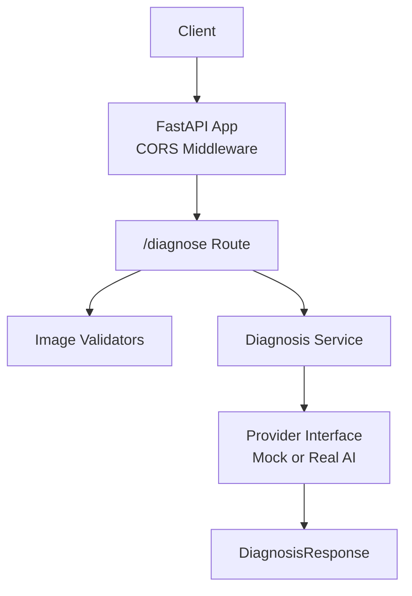
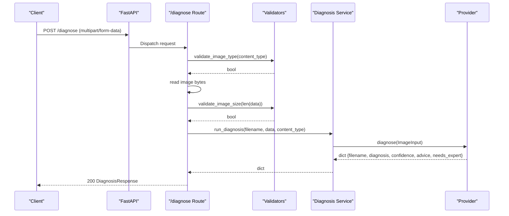
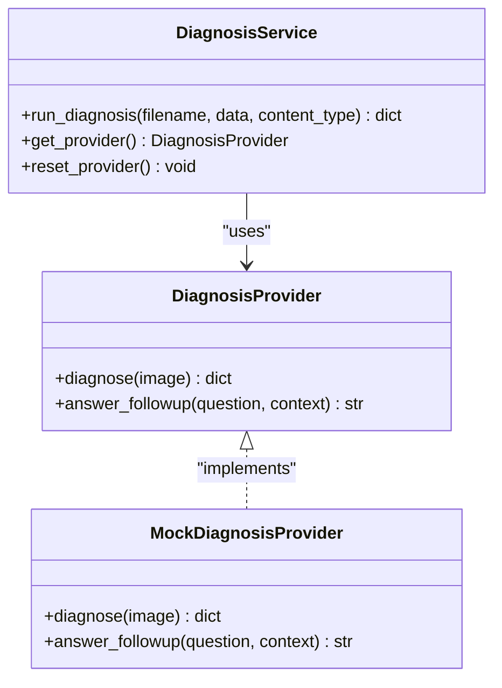
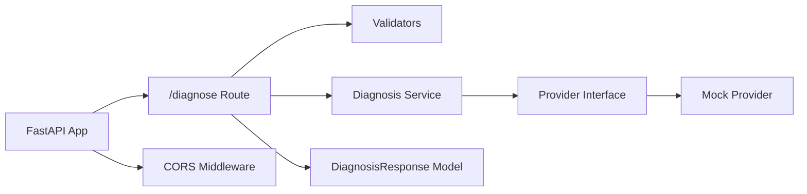
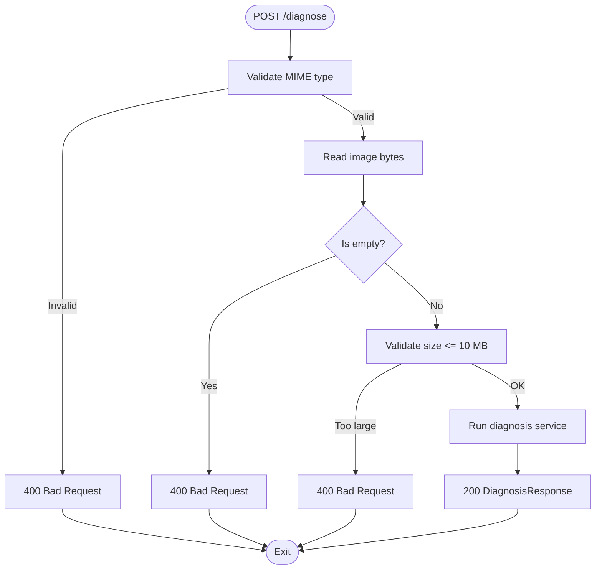

# Diagnosis Endpoint

<cite>
**Referenced Files in This Document**
- [diagnose.py](file://backend/routes/diagnose.py)
- [diagnosis_service.py](file://backend/services/diagnosis_service.py)
- [validators.py](file://backend/utils/validators.py)
- [models.py](file://backend/models.py)
- [main.py](file://backend/main.py)
- [test_api.py](file://tests/test_api.py)
- [api.ts](file://frontend/src/types/api.ts)
</cite>

## Table of Contents
1. [Introduction](#introduction)
2. [Project Structure](#project-structure)
3. [Core Components](#core-components)
4. [Architecture Overview](#architecture-overview)
5. [Detailed Component Analysis](#detailed-component-analysis)
6. [Dependency Analysis](#dependency-analysis)
7. [Performance Considerations](#performance-considerations)
8. [Troubleshooting Guide](#troubleshooting-guide)
9. [Conclusion](#conclusion)
10. [Appendices](#appendices)

## Introduction
This document provides detailed API documentation for the POST /diagnose endpoint used to diagnose crop diseases from uploaded images. It covers supported formats, validation rules, request handling, response schema, error scenarios, CORS configuration, security considerations, and rate limiting strategies. The backend currently runs with a mock AI provider but is designed to integrate a real AI provider later without changing route code.

## Project Structure
The diagnosis feature spans routes, service layer, validators, models, and application configuration:
- Route handler defines the POST /diagnose endpoint and orchestrates validation and service calls.
- Service layer abstracts the AI provider (mock or real) and returns standardized results.
- Validators enforce allowed image types and size limits.
- Models define the response contract used by both backend and frontend.
- Application config sets up CORS middleware and mounts routers.

**Diagram sources**
- [main.py:19-38](file://backend/main.py#L19-L38)
- [diagnose.py:13-59](file://backend/routes/diagnose.py#L13-L59)
- [diagnosis_service.py:40-123](file://backend/services/diagnosis_service.py#L40-L123)
- [validators.py:1-15](file://backend/utils/validators.py#L1-L15)
- [models.py:10-31](file://backend/models.py#L10-L31)

**Section sources**
- [main.py:1-45](file://backend/main.py#L1-L45)
- [diagnose.py:1-59](file://backend/routes/diagnose.py#L1-L59)
- [diagnosis_service.py:1-128](file://backend/services/diagnosis_service.py#L1-L128)
- [validators.py:1-19](file://backend/utils/validators.py#L1-L19)
- [models.py:1-58](file://backend/models.py#L1-L58)

## Core Components
- POST /diagnose: Accepts multipart/form-data with an image field named "image". Validates type and size, reads bytes, delegates to service, and returns DiagnosisResponse.
- Validators: Enforce allowed MIME types (JPEG, PNG, WEBP) and maximum file size (10 MB).
- Service Layer: Provides a stable interface to the AI provider; currently uses a mock provider that returns deterministic responses.
- Models: Define the DiagnosisResponse schema with fields filename, diagnosis, confidence (0..1), advice, and needs_expert.

Key behaviors:
- Empty uploads are rejected early with a 400 status.
- Invalid file types return 400.
- Oversized files (>10 MB) return 400.
- Missing image field returns 422 (validation error).
- Internal errors are caught and returned as 500 with a safe message.

**Section sources**
- [diagnose.py:13-59](file://backend/routes/diagnose.py#L13-L59)
- [validators.py:1-15](file://backend/utils/validators.py#L1-L15)
- [diagnosis_service.py:55-73](file://backend/services/diagnosis_service.py#L55-L73)
- [models.py:10-31](file://backend/models.py#L10-L31)
- [test_api.py:54-91](file://tests/test_api.py#L54-L91)

## Architecture Overview
The endpoint follows a layered architecture:
- Request enters FastAPI and passes through CORS middleware.
- Route validates input and delegates to the service layer.
- Service selects a provider (real or mock) and returns a standardized result.
- Response conforms to DiagnosisResponse schema.

**Diagram sources**
- [diagnose.py:13-59](file://backend/routes/diagnose.py#L13-L59)
- [diagnosis_service.py:116-123](file://backend/services/diagnosis_service.py#L116-L123)
- [validators.py:10-15](file://backend/utils/validators.py#L10-L15)

## Detailed Component Analysis

### POST /diagnose Endpoint
- Method: POST
- Path: /diagnose
- Content-Type: multipart/form-data
- Required field: image (UploadFile)
- Supported image formats: JPEG, PNG, WEBP
- Maximum file size: 10 MB
- Success response: 200 with DiagnosisResponse
- Error responses:
  - 400: Invalid file type, empty upload, oversized file
  - 422: Missing required field (image)
  - 500: Internal server error during diagnosis

Request parameters:
- image: Multipart form field containing the image file. Must be one of the supported MIME types and under 10 MB.

Processing steps:
1. Validate MIME type against allowed set.
2. Read image bytes into memory.
3. Reject empty uploads immediately.
4. Validate file size against 10 MB limit.
5. Call service layer to perform diagnosis.
6. Return standardized DiagnosisResponse.

Error handling:
- Validation failures raise HTTPException with descriptive messages.
- Unexpected exceptions are caught and converted to a generic 500 error to avoid leaking internal details.

**Section sources**
- [diagnose.py:13-59](file://backend/routes/diagnose.py#L13-L59)
- [validators.py:1-15](file://backend/utils/validators.py#L1-L15)
- [test_api.py:64-91](file://tests/test_api.py#L64-L91)

### DiagnosisResponse Schema
Fields:
- filename: string — Name of the uploaded image file.
- diagnosis: string — Predicted disease or condition.
- confidence: float — Model confidence in the 0..1 range.
- advice: string — Recommended next action for the farmer.
- needs_expert: boolean — Whether the case should be escalated to a human expert.

Frontend mirror:
- TypeScript interface mirrors the backend model to ensure consistent contracts.

**Section sources**
- [models.py:10-31](file://backend/models.py#L10-L31)
- [api.ts:6-14](file://frontend/src/types/api.ts#L6-L14)

### Service Layer and Provider Selection
- Provider interface defines diagnose and answer_followup methods.
- Mock provider returns deterministic responses when no real AI credentials are configured.
- Provider selection checks environment variable for real provider; falls back to mock otherwise.
- run_diagnosis constructs ImageInput and invokes provider.diagnose.

**Diagram sources**
- [diagnosis_service.py:40-73](file://backend/services/diagnosis_service.py#L40-L73)
- [diagnosis_service.py:80-123](file://backend/services/diagnosis_service.py#L80-L123)

**Section sources**
- [diagnosis_service.py:40-123](file://backend/services/diagnosis_service.py#L40-L123)

### CORS Configuration
- CORS middleware is enabled with configurable origins via CORS_ALLOW_ORIGINS.
- Default allows local development origins for the Vite dev server.
- Credentials are allowed; all methods and headers are permitted.

Configuration notes:
- Set CORS_ALLOW_ORIGINS to a comma-separated list of allowed origins for production.
- Keep allow_credentials true only if clients send cookies or auth headers and you trust the listed origins.

**Section sources**
- [main.py:19-35](file://backend/main.py#L19-L35)
- [test_api.py:107-109](file://tests/test_api.py#L107-L109)

## Dependency Analysis
The endpoint depends on:
- FastAPI routing and UploadFile handling.
- Validators for type and size constraints.
- Service layer abstraction for AI provider integration.
- Pydantic models for response schema enforcement.
- CORS middleware for cross-origin requests.

**Diagram sources**
- [diagnose.py:1-59](file://backend/routes/diagnose.py#L1-L59)
- [diagnosis_service.py:40-123](file://backend/services/diagnosis_service.py#L40-L123)
- [validators.py:1-15](file://backend/utils/validators.py#L1-L15)
- [models.py:10-31](file://backend/models.py#L10-L31)
- [main.py:19-38](file://backend/main.py#L19-L38)

**Section sources**
- [diagnose.py:1-59](file://backend/routes/diagnose.py#L1-L59)
- [diagnosis_service.py:1-128](file://backend/services/diagnosis_service.py#L1-L128)
- [validators.py:1-19](file://backend/utils/validators.py#L1-L19)
- [models.py:1-58](file://backend/models.py#L1-L58)
- [main.py:1-45](file://backend/main.py#L1-L45)

## Performance Considerations
- Memory usage: The endpoint reads the entire image into memory before processing. For large images near the 10 MB limit, this can increase memory pressure. Consider streaming or temporary file storage if scaling to many concurrent uploads.
- Validation order: Type check occurs before reading bytes to fail fast on unsupported formats. Size check occurs after reading to enforce the 10 MB limit consistently.
- Provider fallback: If the real AI provider is unavailable, the mock provider ensures low-latency responses for development and testing.

[No sources needed since this section provides general guidance]

## Troubleshooting Guide
Common issues and resolutions:
- Invalid file type: Ensure the client sends a supported MIME type (image/jpeg, image/png, image/webp). Check browser or tool settings for correct content type.
- Empty upload: Verify that the file field is present and contains data. The endpoint rejects zero-byte payloads.
- Oversized file: Reduce image size to under 10 MB. Compress or resize images before uploading.
- Missing field: Include the "image" field in multipart/form-data. Without it, the request fails with a validation error.
- CORS errors: Configure CORS_ALLOW_ORIGINS to include your frontend origin. Confirm the Access-Control-Allow-Origin header is present in responses.
- Internal errors: If a 500 error occurs, retry the request. Logs will contain details for debugging.

Validation flow:

**Diagram sources**
- [diagnose.py:21-43](file://backend/routes/diagnose.py#L21-L43)
- [validators.py:10-15](file://backend/utils/validators.py#L10-L15)

**Section sources**
- [diagnose.py:21-59](file://backend/routes/diagnose.py#L21-L59)
- [test_api.py:64-91](file://tests/test_api.py#L64-L91)

## Conclusion
The POST /diagnose endpoint provides a robust, validated interface for crop disease diagnosis using uploaded images. It enforces strict input constraints, returns a well-defined response schema, and supports flexible CORS configuration. The service layer abstracts AI provider integration, enabling seamless upgrades while maintaining stability. Follow the troubleshooting guide for common issues and adhere to security and performance recommendations for production deployments.

[No sources needed since this section summarizes without analyzing specific files]

## Appendices

### Request and Response Examples

- cURL example:
  - Use multipart/form-data with field name "image".
  - Replace path with your server URL.
  - Reference: [diagnose.py:13-59](file://backend/routes/diagnose.py#L13-L59)

- Postman collection example:
  - Create a new request to POST /diagnose.
  - Set Body > form-data with key "image" and select a file.
  - Ensure file type is JPEG, PNG, or WEBP and size < 10 MB.
  - Reference: [test_api.py:54-91](file://tests/test_api.py#L54-L91)

- JavaScript fetch implementation:
  - Construct FormData with "image" field.
  - POST to /diagnose with appropriate headers.
  - Handle JSON response matching DiagnosisResponse.
  - Reference: [models.py:10-31](file://backend/models.py#L10-L31), [api.ts:6-14](file://frontend/src/types/api.ts#L6-L14)

### Security Considerations
- Input validation: Enforce allowed MIME types and size limits at the route level.
- Error sanitization: Do not expose internal stack traces or AI provider details to clients.
- CORS: Restrict allowed origins to trusted domains in production.
- Rate limiting: Implement rate limiting at the gateway or application level to prevent abuse.
- Authentication: Add authentication/authorization if the endpoint should be restricted to authenticated users.

[No sources needed since this section provides general guidance]

### Rate Limiting Strategies
- Gateway-level throttling: Use reverse proxy or API gateway to limit requests per IP or user.
- Application-level limits: Track request counts per client and enforce quotas.
- Backoff policies: Encourage clients to implement exponential backoff on 429 responses.
- Monitoring: Log and alert on high request volumes or repeated failures.

[No sources needed since this section provides general guidance]