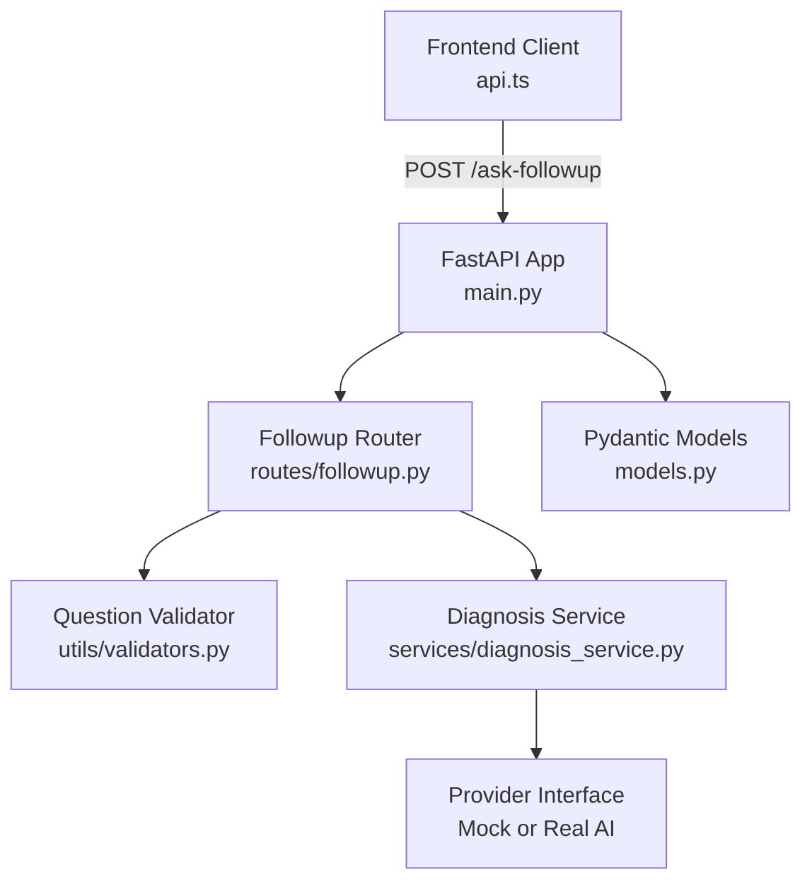
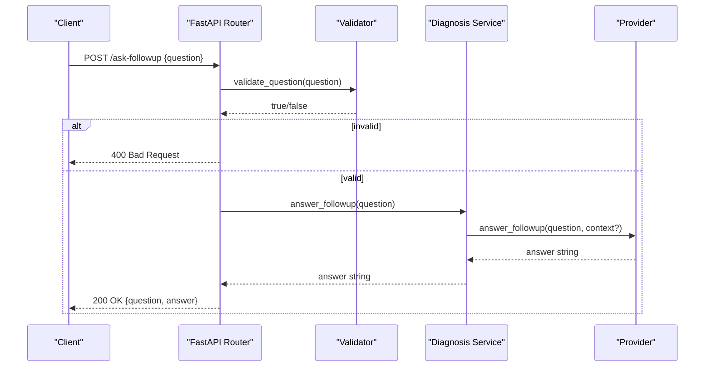
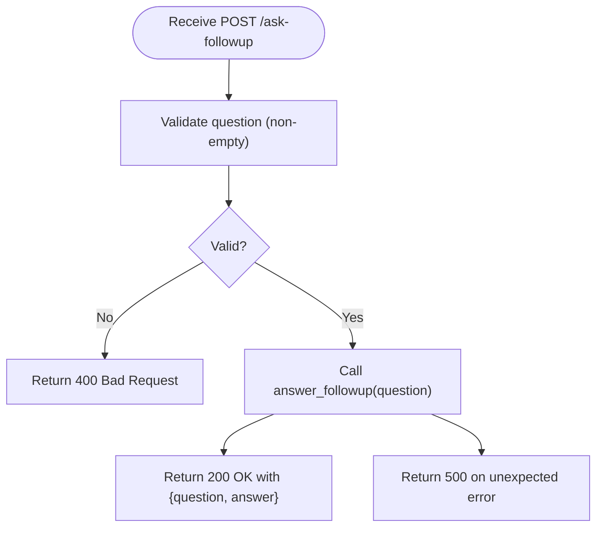
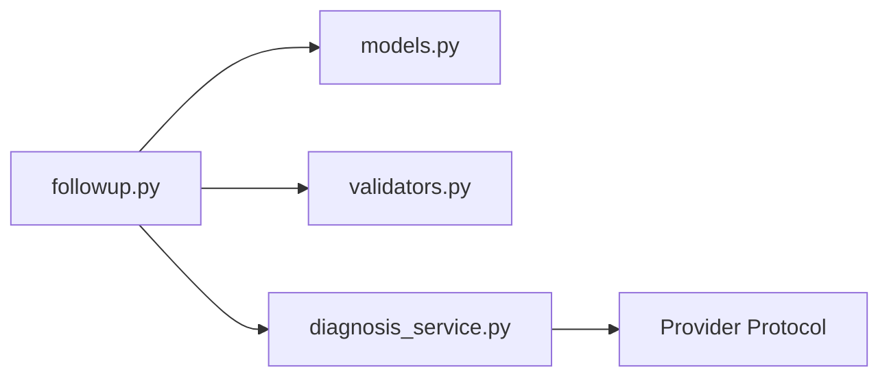

# Follow-up Question Endpoint

<cite>
**Referenced Files in This Document**
- [backend/routes/followup.py](file://backend/routes/followup.py)
- [backend/models.py](file://backend/models.py)
- [backend/services/diagnosis_service.py](file://backend/services/diagnosis_service.py)
- [backend/utils/validators.py](file://backend/utils/validators.py)
- [backend/main.py](file://backend/main.py)
- [frontend/src/services/api.ts](file://frontend/src/services/api.ts)
- [frontend/src/types/api.ts](file://frontend/src/types/api.ts)
- [tests/test_api.py](file://tests/test_api.py)
</cite>

## Table of Contents
1. [Introduction](#introduction)
2. [Project Structure](#project-structure)
3. [Core Components](#core-components)
4. [Architecture Overview](#architecture-overview)
5. [Detailed Component Analysis](#detailed-component-analysis)
6. [Dependency Analysis](#dependency-analysis)
7. [Performance Considerations](#performance-considerations)
8. [Troubleshooting Guide](#troubleshooting-guide)
9. [Conclusion](#conclusion)
10. [Appendices](#appendices)

## Introduction
This document provides comprehensive API documentation for the /ask-followup endpoint, which enables interactive question-answering about a prior diagnosis. It covers request/response schemas, validation rules, error handling, authentication and CORS configuration, session and conversation state considerations, and integration examples using common HTTP clients and frameworks.

## Project Structure
The follow-up Q&A feature is implemented as a FastAPI route that validates input, delegates to a service layer (currently a mock provider), and returns a structured response. The frontend calls this endpoint via a centralized API client.

**Diagram sources**
- [backend/main.py:9-38](file://backend/main.py#L9-L38)
- [backend/routes/followup.py:10-39](file://backend/routes/followup.py#L10-L39)
- [backend/services/diagnosis_service.py:40-128](file://backend/services/diagnosis_service.py#L40-L128)
- [backend/utils/validators.py:18-19](file://backend/utils/validators.py#L18-L19)
- [backend/models.py:34-58](file://backend/models.py#L34-L58)

**Section sources**
- [backend/main.py:9-38](file://backend/main.py#L9-L38)
- [backend/routes/followup.py:10-39](file://backend/routes/followup.py#L10-L39)
- [backend/services/diagnosis_service.py:40-128](file://backend/services/diagnosis_service.py#L40-L128)
- [backend/utils/validators.py:18-19](file://backend/utils/validators.py#L18-L19)
- [backend/models.py:34-58](file://backend/models.py#L34-L58)

## Core Components
- Route: POST /ask-followup accepts a JSON body with a single field, question.
- Validation: Non-empty, non-whitespace-only questions are enforced.
- Service: answer_followup(question) is delegated to the active provider (mock by default).
- Response: Returns the echoed question and an answer string.

Key behaviors:
- Empty or whitespace-only questions return HTTP 400 with a descriptive detail.
- Missing required fields return HTTP 422 (Pydantic validation).
- Unexpected errors return HTTP 500 with a user-friendly message.

**Section sources**
- [backend/routes/followup.py:10-39](file://backend/routes/followup.py#L10-L39)
- [backend/utils/validators.py:18-19](file://backend/utils/validators.py#L18-L19)
- [backend/services/diagnosis_service.py:126-128](file://backend/services/diagnosis_service.py#L126-L128)
- [backend/models.py:34-58](file://backend/models.py#L34-L58)

## Architecture Overview
The endpoint follows a layered design:
- Presentation layer (FastAPI router) handles HTTP I/O and validation.
- Service layer abstracts provider selection and business logic.
- Provider abstraction supports offline mock and future real AI integration.

**Diagram sources**
- [backend/routes/followup.py:10-39](file://backend/routes/followup.py#L10-L39)
- [backend/utils/validators.py:18-19](file://backend/utils/validators.py#L18-L19)
- [backend/services/diagnosis_service.py:126-128](file://backend/services/diagnosis_service.py#L126-L128)

## Detailed Component Analysis

### Endpoint Specification: POST /ask-followup
- Path: /ask-followup
- Method: POST
- Content-Type: application/json
- Authentication: None configured at the route level.
- CORS: Enabled for configured origins (default includes local dev servers).

Request schema (FollowupRequest):
- question: string (required, must not be empty or whitespace-only)

Response schema (FollowupResponse):
- question: string (echoed from request)
- answer: string (assistant’s answer)

Validation and errors:
- 400 Bad Request: When question is empty or whitespace-only.
- 422 Unprocessable Entity: When the request body is missing or malformed (Pydantic).
- 500 Internal Server Error: On unexpected failures within the service layer.

Examples:
- Successful request:
  - Request: {"question": "How often should I water after treatment?"}
  - Response: {"question": "How often should I water after treatment?", "answer": "..."}
- Invalid request:
  - Request: {"question": "   "}
  - Response: 400 with detail indicating the question must not be empty.

Integration notes:
- Frontend sends JSON with a single key question and parses the response into a typed object.
- Tests verify success, empty question rejection, and missing field behavior.

**Section sources**
- [backend/routes/followup.py:10-39](file://backend/routes/followup.py#L10-L39)
- [backend/models.py:34-58](file://backend/models.py#L34-L58)
- [frontend/src/services/api.ts:79-98](file://frontend/src/services/api.ts#L79-L98)
- [frontend/src/types/api.ts:16-25](file://frontend/src/types/api.ts#L16-L25)
- [tests/test_api.py:29-49](file://tests/test_api.py#L29-L49)

### Data Flow and Processing Logic

**Diagram sources**
- [backend/routes/followup.py:18-34](file://backend/routes/followup.py#L18-L34)
- [backend/services/diagnosis_service.py:126-128](file://backend/services/diagnosis_service.py#L126-L128)

**Section sources**
- [backend/routes/followup.py:18-34](file://backend/routes/followup.py#L18-L34)
- [backend/services/diagnosis_service.py:126-128](file://backend/services/diagnosis_service.py#L126-L128)

### Conversation State and Context Handling
Current implementation:
- The endpoint does not accept or persist conversation context; it processes each question independently.
- The frontend maintains conversation UI state locally and displays context in the chat header, but this context is not sent to the backend.

Implications:
- Each call is stateless; there is no server-side session or memory of previous turns.
- For multi-turn conversations requiring context, extend the request schema to include conversation history or a session identifier and update the service/provider to use that context.

**Section sources**
- [backend/models.py:34-58](file://backend/models.py#L34-L58)
- [frontend/src/services/api.ts:79-98](file://frontend/src/services/api.ts#L79-L98)

### Authentication and Security
- No authentication middleware is applied to the /ask-followup endpoint.
- CORS is enabled for configured origins; ensure production deployments restrict allowed origins appropriately.

Recommendations:
- Add authentication (e.g., JWT or API keys) if exposing the endpoint publicly.
- Restrict CORS to trusted domains in production.
- Consider rate limiting and request size limits for robustness.

**Section sources**
- [backend/main.py:19-35](file://backend/main.py#L19-L35)

## Dependency Analysis
The endpoint depends on:
- Pydantic models for request/response contracts.
- A validator utility for question validation.
- A service layer that abstracts provider selection (mock or real AI).

**Diagram sources**
- [backend/routes/followup.py:1-6](file://backend/routes/followup.py#L1-L6)
- [backend/models.py:34-58](file://backend/models.py#L34-L58)
- [backend/utils/validators.py:18-19](file://backend/utils/validators.py#L18-L19)
- [backend/services/diagnosis_service.py:40-128](file://backend/services/diagnosis_service.py#L40-L128)

**Section sources**
- [backend/routes/followup.py:1-6](file://backend/routes/followup.py#L1-L6)
- [backend/models.py:34-58](file://backend/models.py#L34-L58)
- [backend/utils/validators.py:18-19](file://backend/utils/validators.py#L18-L19)
- [backend/services/diagnosis_service.py:40-128](file://backend/services/diagnosis_service.py#L40-L128)

## Performance Considerations
- Stateless processing: Each request is independent; no server-side session overhead.
- Mock provider: Current implementation returns a deterministic string quickly; real AI integration may introduce latency.
- Memory management: Avoid storing large payloads or conversation histories in server memory unless explicitly designed.
- Rate limiting: Not currently implemented; consider adding middleware to protect endpoints under load.
- Timeouts: Ensure upstream AI providers have appropriate timeouts and retries to avoid hanging requests.

[No sources needed since this section provides general guidance]

## Troubleshooting Guide
Common issues and resolutions:
- 400 Bad Request: Occurs when the question is empty or whitespace-only. Ensure the client trims and validates input before sending.
- 422 Unprocessable Entity: Indicates missing or invalid fields in the request body. Verify the JSON structure matches the schema.
- 500 Internal Server Error: Unexpected failure in the service layer. Check logs and provider configuration.

Verification via tests:
- Valid question returns 200 with expected fields.
- Whitespace-only question returns 400.
- Missing question field returns 422.

**Section sources**
- [backend/routes/followup.py:18-34](file://backend/routes/followup.py#L18-L34)
- [tests/test_api.py:29-49](file://tests/test_api.py#L29-L49)

## Conclusion
The /ask-followup endpoint provides a simple, stateless interface for asking follow-up questions about diagnoses. It enforces basic input validation and returns a consistent response contract. For advanced features like multi-turn conversations, context preservation, authentication, and rate limiting, extend the request schema, add middleware, and implement server-side session management.

[No sources needed since this section summarizes without analyzing specific files]

## Appendices

### Integration Examples

- cURL
  - Send a follow-up question:
    - curl -X POST http://localhost:8000/ask-followup -H "Content-Type: application/json" -d '{"question":"How often should I water after treatment?"}'
  - Expected responses:
    - 200 OK with {question, answer}
    - 400 Bad Request for empty/whitespace-only question
    - 422 Unprocessable Entity for missing fields
    - 500 Internal Server Error for unexpected failures

- JavaScript (Fetch)
  - Use the frontend API client function askFollowup(question) to send a POST request with JSON body and parse the response into a typed object.

- Python (requests)
  - import requests
  - r = requests.post("http://localhost:8000/ask-followup", json={"question": "When to water?"})
  - Handle status codes and parse JSON accordingly.

- TypeScript/Axios
  - axios.post("/ask-followup", { question: "..." })
  - Map response to FollowupResponse type.

[No sources needed since this section provides general guidance]

### Multi-Turn Conversations and Context Handling
- Current behavior: Stateless; each request is processed independently without context.
- To support multi-turn conversations:
  - Extend FollowupRequest to include conversation history or a session ID.
  - Update the service/provider to maintain or retrieve context based on the session ID.
  - Implement server-side storage (e.g., in-memory cache or database) for conversation state.
  - Add session lifecycle management (creation, timeout, cleanup).

[No sources needed since this section provides general guidance]

### Session Management, Timeouts, and Memory Considerations
- Sessions: Not implemented; add middleware to create and manage sessions if needed.
- Timeouts: Configure upstream provider timeouts and client-side timeouts to prevent long-running requests.
- Memory: Avoid retaining large conversation histories in memory; use bounded caches or persistent storage.

[No sources needed since this section provides general guidance]