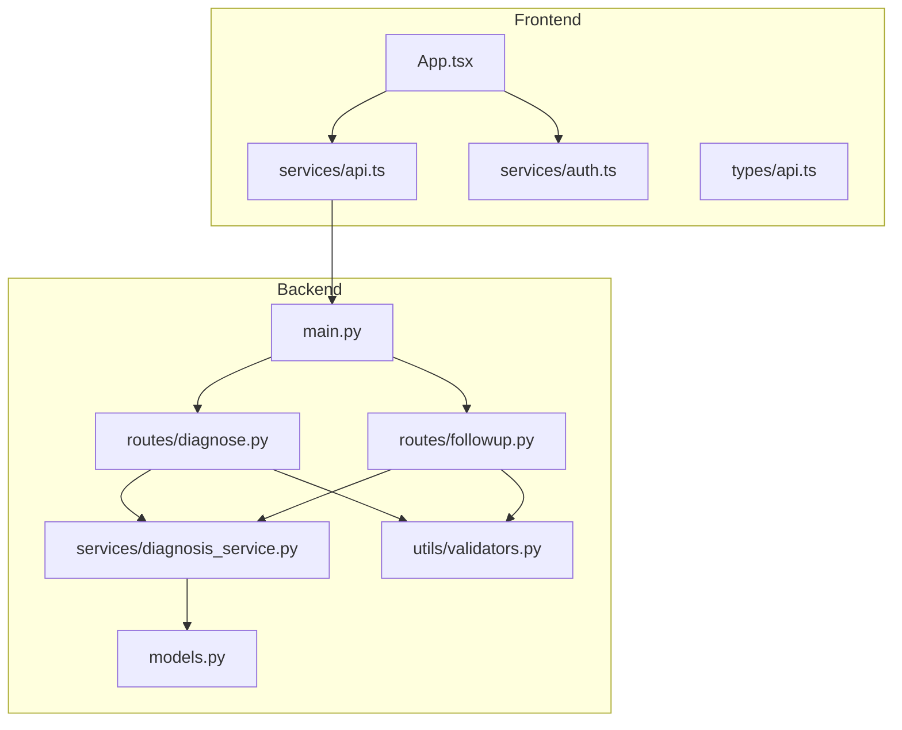
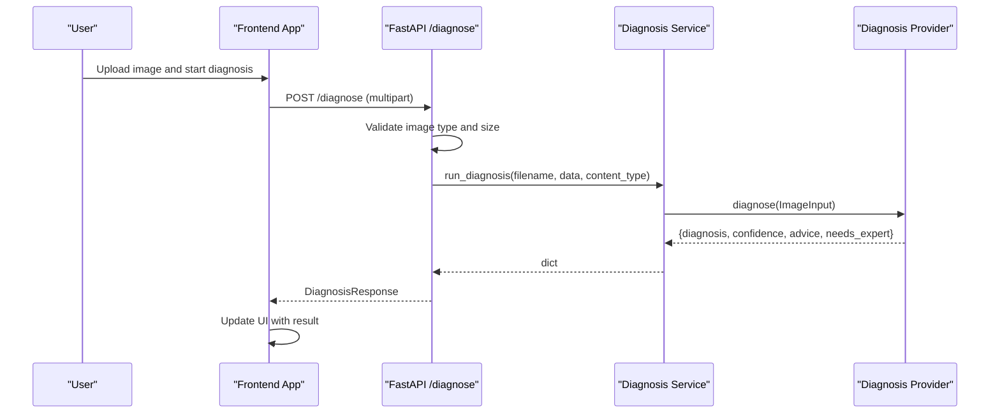
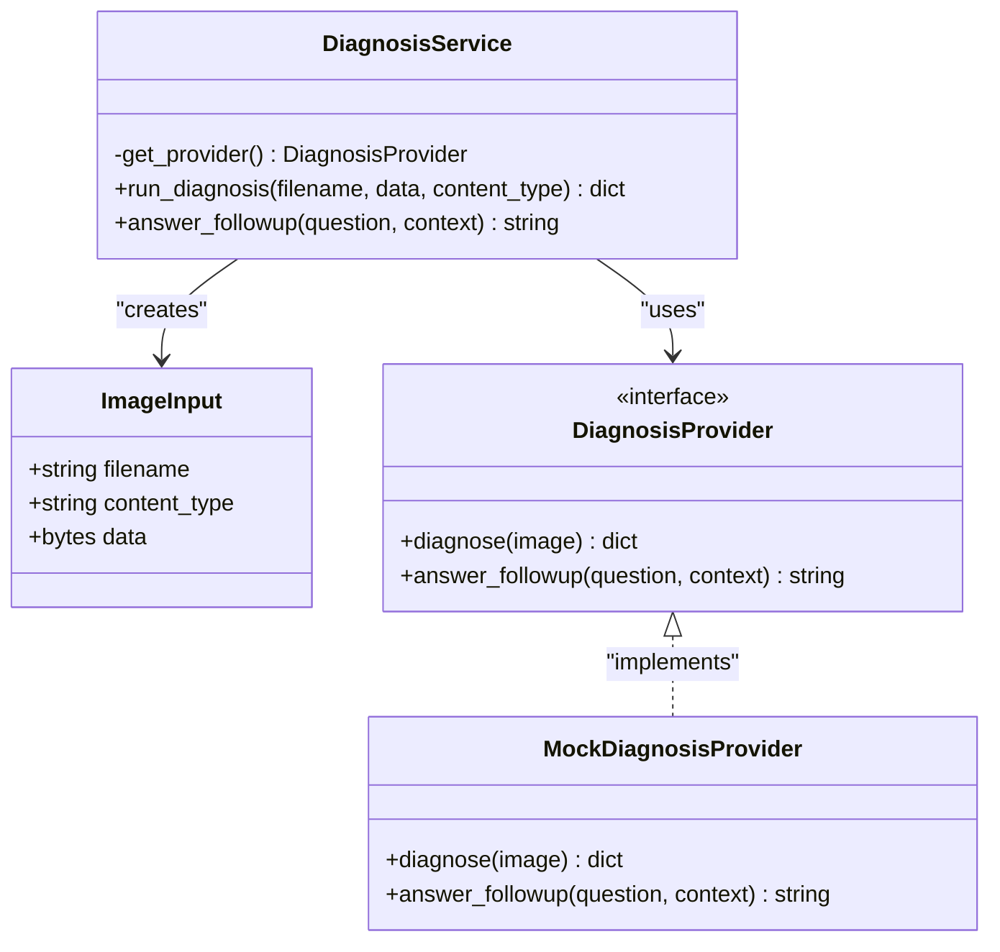
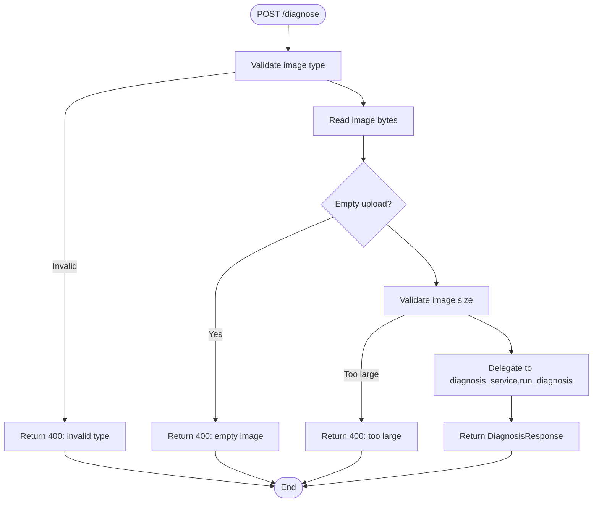
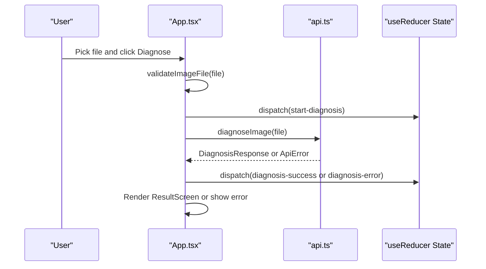
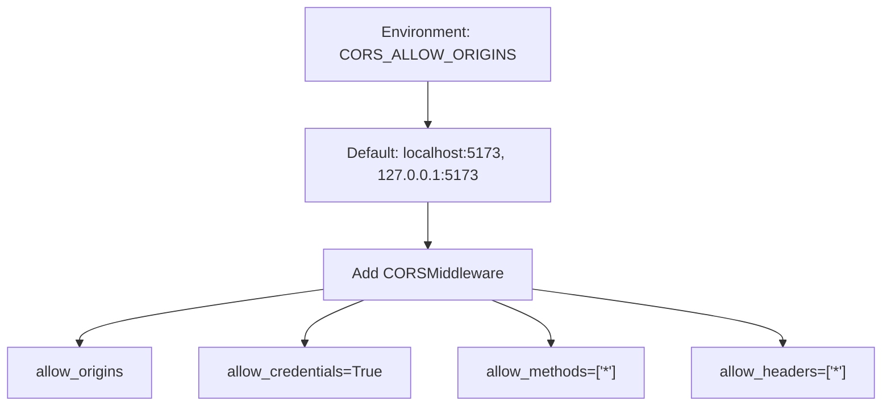
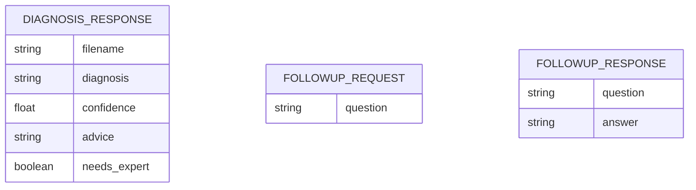
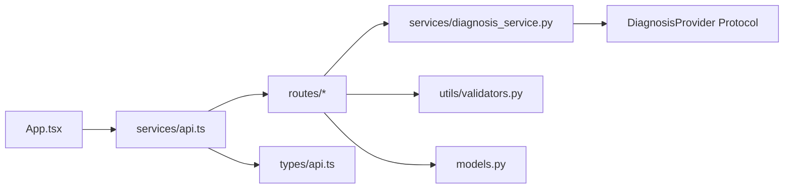

# Architecture Overview

<cite>
**Referenced Files in This Document**
- [backend/main.py](file://backend/main.py)
- [backend/routes/diagnose.py](file://backend/routes/diagnose.py)
- [backend/routes/followup.py](file://backend/routes/followup.py)
- [backend/services/diagnosis_service.py](file://backend/services/diagnosis_service.py)
- [backend/utils/validators.py](file://backend/utils/validators.py)
- [backend/models.py](file://backend/models.py)
- [frontend/src/App.tsx](file://frontend/src/App.tsx)
- [frontend/src/services/api.ts](file://frontend/src/services/api.ts)
- [frontend/src/types/api.ts](file://frontend/src/types/api.ts)
- [frontend/src/services/auth.ts](file://frontend/src/services/auth.ts)
- [requirements.txt](file://requirements.txt)
- [README.md](file://README.md)
</cite>

## Table of Contents
1. Introduction
2. Project Structure
3. Core Components
4. Architecture Overview
5. Detailed Component Analysis
6. Dependency Analysis
7. Performance Considerations
8. Troubleshooting Guide
9. Conclusion

## Introduction
FasalDoc is a service-oriented web application that provides crop-disease diagnosis and follow-up Q&A. The system consists of:
- A React + Vite frontend that handles user interactions, image uploads, and state management.
- A FastAPI backend that exposes RESTful endpoints for diagnosis and follow-up questions.
- A pluggable AI provider layer that allows seamless switching between an offline mock provider and a real AI provider (e.g., Qwen/Alibaba Cloud) without changing routes or frontend code.

The architecture emphasizes clear separation between routes (HTTP boundaries), services (business logic), and providers (AI abstraction). It also includes robust validation, error handling, CORS configuration, and cross-cutting concerns across the full stack.

## Project Structure
The repository is organized into backend and frontend directories with clear responsibilities:
- Backend: FastAPI app with routes, models, services, and utilities.
- Frontend: React SPA with pages, components, services, types, and i18n.

**Diagram sources**
- [backend/main.py:1-45](file://backend/main.py#L1-L45)
- [backend/routes/diagnose.py:1-59](file://backend/routes/diagnose.py#L1-L59)
- [backend/routes/followup.py:1-40](file://backend/routes/followup.py#L1-L40)
- [backend/services/diagnosis_service.py:1-128](file://backend/services/diagnosis_service.py#L1-L128)
- [backend/utils/validators.py:1-19](file://backend/utils/validators.py#L1-L19)
- [backend/models.py:1-58](file://backend/models.py#L1-L58)
- [frontend/src/App.tsx:1-336](file://frontend/src/App.tsx#L1-L336)
- [frontend/src/services/api.ts:1-99](file://frontend/src/services/api.ts#L1-L99)
- [frontend/src/types/api.ts:1-26](file://frontend/src/types/api.ts#L1-L26)
- [frontend/src/services/auth.ts:1-126](file://frontend/src/services/auth.ts#L1-L126)

**Section sources**
- [README.md:1-106](file://README.md#L1-L106)
- [requirements.txt:1-6](file://requirements.txt#L1-L6)

## Core Components
- Routes: Define HTTP endpoints and handle request/response contracts.
- Services: Encapsulate business logic and abstract AI provider usage.
- Providers: Implement the DiagnosisProvider protocol; currently a mock provider with a factory to switch to a real provider when configured.
- Models: Pydantic schemas defining API contracts mirrored by frontend TypeScript types.
- Validators: Shared validation rules for images and questions.
- Frontend App: Manages UI flow, state via useReducer, and communicates with backend through a centralized API service.

Key responsibilities:
- Route layer validates inputs and delegates to services.
- Service layer selects the active provider (mock or real) and executes diagnosis/follow-up.
- Provider layer implements the stable interface for AI calls.
- Frontend enforces client-side validation and maps backend errors to user-friendly messages.

**Section sources**
- [backend/routes/diagnose.py:1-59](file://backend/routes/diagnose.py#L1-L59)
- [backend/routes/followup.py:1-40](file://backend/routes/followup.py#L1-L40)
- [backend/services/diagnosis_service.py:1-128](file://backend/services/diagnosis_service.py#L1-L128)
- [backend/models.py:1-58](file://backend/models.py#L1-L58)
- [backend/utils/validators.py:1-19](file://backend/utils/validators.py#L1-L19)
- [frontend/src/App.tsx:1-336](file://frontend/src/App.tsx#L1-L336)
- [frontend/src/services/api.ts:1-99](file://frontend/src/services/api.ts#L1-L99)
- [frontend/src/types/api.ts:1-26](file://frontend/src/types/api.ts#L1-L26)

## Architecture Overview
The system follows a service-oriented architecture with clear boundaries:
- Frontend communicates with the backend via RESTful APIs.
- Backend routes accept requests, validate inputs, and delegate to services.
- Services abstract AI provider usage behind a protocol, enabling seamless switching between mock and real providers.
- CORS is configured to allow local frontend development and can be overridden via environment variables.

**Diagram sources**
- [frontend/src/App.tsx:187-208](file://frontend/src/App.tsx#L187-L208)
- [frontend/src/services/api.ts:64-77](file://frontend/src/services/api.ts#L64-L77)
- [backend/routes/diagnose.py:13-59](file://backend/routes/diagnose.py#L13-L59)
- [backend/services/diagnosis_service.py:116-124](file://backend/services/diagnosis_service.py#L116-L124)

**Section sources**
- [backend/main.py:19-38](file://backend/main.py#L19-L38)
- [backend/routes/diagnose.py:13-59](file://backend/routes/diagnose.py#L13-L59)
- [backend/services/diagnosis_service.py:80-105](file://backend/services/diagnosis_service.py#L80-L105)

## Detailed Component Analysis

### Pluggable AI Provider Pattern
The provider pattern isolates AI implementation details behind a stable protocol. The service layer selects the active provider at runtime based on environment configuration and falls back to a mock provider if credentials are missing or construction fails.

**Diagram sources**
- [backend/services/diagnosis_service.py:31-52](file://backend/services/diagnosis_service.py#L31-L52)
- [backend/services/diagnosis_service.py:55-73](file://backend/services/diagnosis_service.py#L55-L73)
- [backend/services/diagnosis_service.py:101-128](file://backend/services/diagnosis_service.py#L101-L128)

**Section sources**
- [backend/services/diagnosis_service.py:1-128](file://backend/services/diagnosis_service.py#L1-L128)

### Routes and Validation
Routes enforce input validation and delegate to services. They convert exceptions into standardized HTTP responses and ensure internal errors are not leaked to clients.

**Diagram sources**
- [backend/routes/diagnose.py:13-59](file://backend/routes/diagnose.py#L13-L59)
- [backend/utils/validators.py:1-19](file://backend/utils/validators.py#L1-L19)

**Section sources**
- [backend/routes/diagnose.py:13-59](file://backend/routes/diagnose.py#L13-L59)
- [backend/utils/validators.py:1-19](file://backend/utils/validators.py#L1-L19)

### Frontend State Management and Flow
The frontend manages application state using React’s useReducer. It coordinates screens (login, signup, dashboard, upload, analyzing, result, followup) and orchestrates API calls through a centralized service. Client-side validation mirrors backend constraints for better UX.

**Diagram sources**
- [frontend/src/App.tsx:164-208](file://frontend/src/App.tsx#L164-L208)
- [frontend/src/services/api.ts:64-77](file://frontend/src/services/api.ts#L64-L77)

**Section sources**
- [frontend/src/App.tsx:31-133](file://frontend/src/App.tsx#L31-L133)
- [frontend/src/services/api.ts:28-44](file://frontend/src/services/api.ts#L28-L44)

### CORS Configuration
CORS is enabled for local development with configurable origins via environment variables. This allows the frontend dev server to communicate with the backend during development.

**Diagram sources**
- [backend/main.py:19-35](file://backend/main.py#L19-L35)

**Section sources**
- [backend/main.py:19-35](file://backend/main.py#L19-L35)

### Data Contracts
The backend defines Pydantic models for request/response contracts, which are mirrored by frontend TypeScript interfaces to maintain consistency across the stack.

**Diagram sources**
- [backend/models.py:10-58](file://backend/models.py#L10-L58)
- [frontend/src/types/api.ts:6-25](file://frontend/src/types/api.ts#L6-L25)

**Section sources**
- [backend/models.py:10-58](file://backend/models.py#L10-L58)
- [frontend/src/types/api.ts:6-25](file://frontend/src/types/api.ts#L6-L25)

## Dependency Analysis
The system exhibits low coupling between layers due to clear abstractions:
- Routes depend on services, not on AI implementations.
- Services depend on a provider protocol, decoupling from specific AI providers.
- Frontend depends on a centralized API service, avoiding direct fetch calls in components.
- Validators are shared between backend routes and frontend services to ensure consistent constraints.

**Diagram sources**
- [frontend/src/App.tsx:1-336](file://frontend/src/App.tsx#L1-L336)
- [frontend/src/services/api.ts:1-99](file://frontend/src/services/api.ts#L1-L99)
- [backend/routes/diagnose.py:1-59](file://backend/routes/diagnose.py#L1-L59)
- [backend/routes/followup.py:1-40](file://backend/routes/followup.py#L1-L40)
- [backend/services/diagnosis_service.py:1-128](file://backend/services/diagnosis_service.py#L1-L128)
- [backend/utils/validators.py:1-19](file://backend/utils/validators.py#L1-L19)
- [backend/models.py:1-58](file://backend/models.py#L1-L58)
- [frontend/src/types/api.ts:1-26](file://frontend/src/types/api.ts#L1-L26)

**Section sources**
- [backend/main.py:1-45](file://backend/main.py#L1-L45)
- [frontend/src/services/api.ts:1-99](file://frontend/src/services/api.ts#L1-L99)

## Performance Considerations
- Input validation occurs early in both frontend and backend to reduce unnecessary processing.
- Provider selection happens lazily and is cached to avoid repeated configuration checks.
- Multipart image uploads should respect size limits to prevent memory pressure.
- CORS middleware adds minimal overhead but ensures secure cross-origin access during development.

[No sources needed since this section provides general guidance]

## Troubleshooting Guide
Common issues and resolutions:
- Network errors: Occur when the backend is unreachable; check CORS settings and backend availability.
- Validation errors: Ensure image type and size match allowed constraints; frontend and backend share these rules.
- Server errors: Internal exceptions are caught and converted to generic 500 responses; inspect backend logs for root causes.
- Provider configuration: If real AI provider is unavailable, the system falls back to mock responses; verify environment variables and provider module availability.

**Section sources**
- [backend/routes/diagnose.py:45-59](file://backend/routes/diagnose.py#L45-L59)
- [backend/routes/followup.py:25-34](file://backend/routes/followup.py#L25-L34)
- [frontend/src/services/api.ts:46-58](file://frontend/src/services/api.ts#L46-L58)
- [backend/services/diagnosis_service.py:80-95](file://backend/services/diagnosis_service.py#L80-L95)

## Conclusion
FasalDoc’s architecture separates concerns effectively across routes, services, and providers, enabling seamless integration of AI capabilities while maintaining a robust offline fallback. The frontend manages state and user flows clearly, communicating with the backend through a centralized API service. Cross-cutting concerns such as validation, error handling, and CORS are consistently applied across the stack. This design supports future enhancements, including additional AI providers and expanded features, without disrupting existing functionality.

[No sources needed since this section summarizes without analyzing specific files]