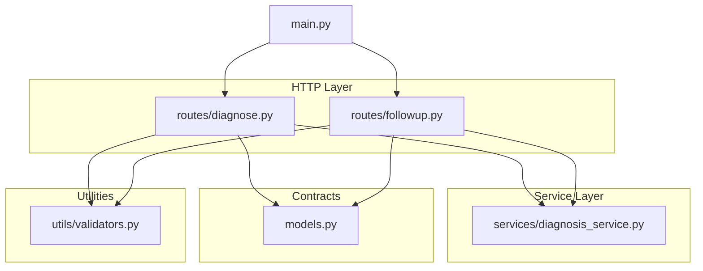
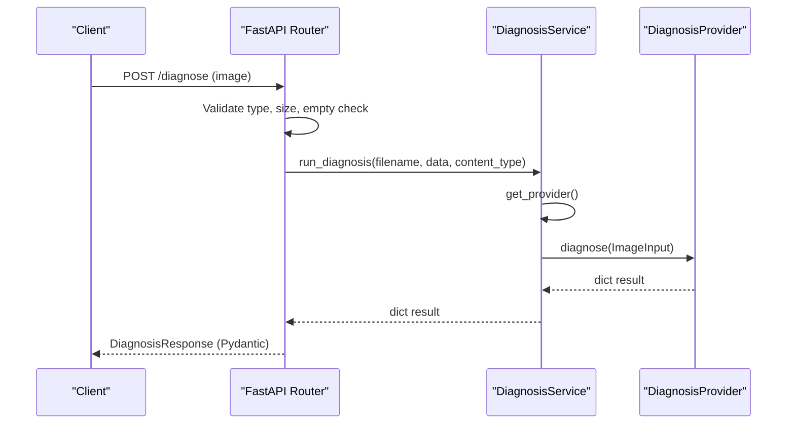
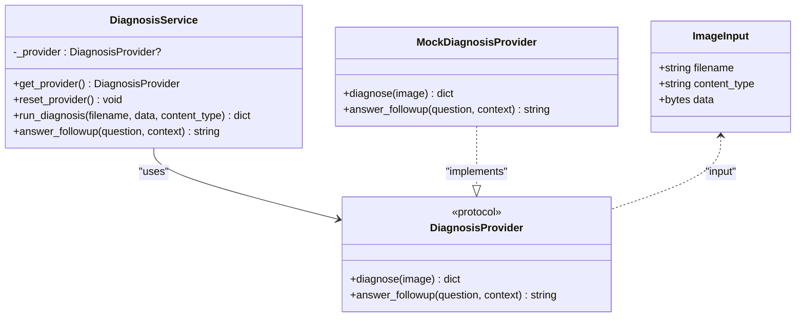
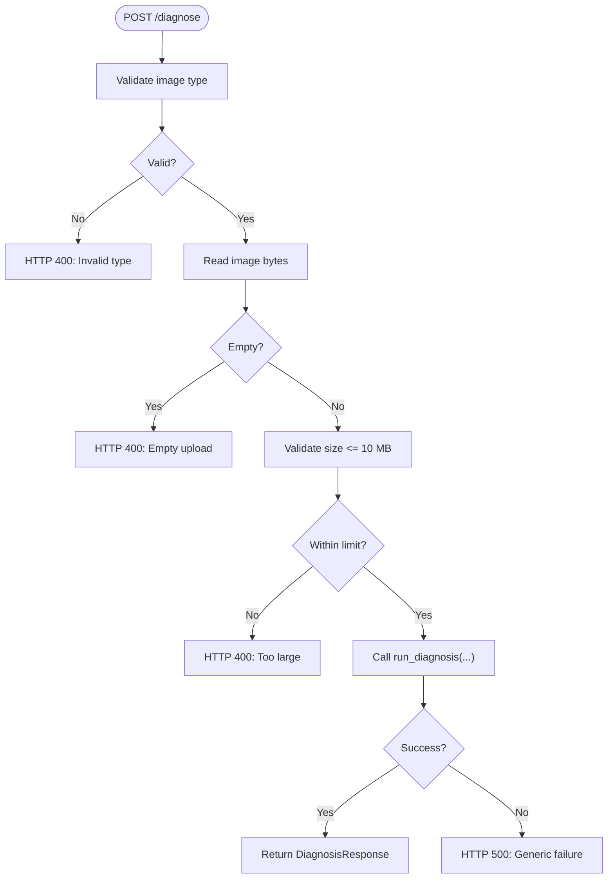
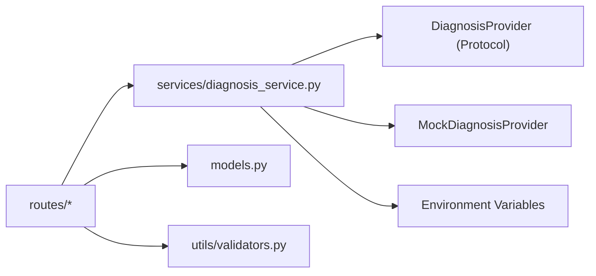

# Backend Service Layer

<cite>
**Referenced Files in This Document**
- [diagnosis_service.py](file://backend/services/diagnosis_service.py)
- [diagnose.py](file://backend/routes/diagnose.py)
- [followup.py](file://backend/routes/followup.py)
- [main.py](file://backend/main.py)
- [models.py](file://backend/models.py)
- [validators.py](file://backend/utils/validators.py)
- [test_api.py](file://tests/test_api.py)
</cite>

## Table of Contents
1. [Introduction](#introduction)
2. [Project Structure](#project-structure)
3. [Core Components](#core-components)
4. [Architecture Overview](#architecture-overview)
5. [Detailed Component Analysis](#detailed-component-analysis)
6. [Dependency Analysis](#dependency-analysis)
7. [Performance Considerations](#performance-considerations)
8. [Troubleshooting Guide](#troubleshooting-guide)
9. [Conclusion](#conclusion)

## Introduction
This document explains the backend service layer architecture with a focus on the service-oriented design pattern that cleanly separates HTTP routes from business logic. The DiagnosisService module acts as a facade over AI providers, enabling dynamic provider instantiation based on environment configuration and providing a stable interface for route handlers. It uses Python protocols to define the provider contract and includes a mock implementation for offline operation. Dependency injection is implemented via a lazy-initialized provider cache, ensuring stateless services that scale horizontally.

## Project Structure
The backend follows a layered structure:
- Routes handle HTTP concerns (request parsing, validation, error mapping).
- Services encapsulate business logic and orchestrate calls to providers.
- Models define request/response contracts using Pydantic.
- Utils provide reusable validation helpers.
- The application entrypoint wires routers and middleware.

**Diagram sources**
- [main.py:6-8](file://backend/main.py#L6-L8)
- [diagnose.py:1-9](file://backend/routes/diagnose.py#L1-L9)
- [followup.py:1-6](file://backend/routes/followup.py#L1-L6)
- [diagnosis_service.py:1-20](file://backend/services/diagnosis_service.py#L1-L20)
- [models.py:1-7](file://backend/models.py#L1-L7)
- [validators.py:1-19](file://backend/utils/validators.py#L1-L19)

**Section sources**
- [main.py:1-45](file://backend/main.py#L1-L45)
- [diagnose.py:1-59](file://backend/routes/diagnose.py#L1-L59)
- [followup.py:1-40](file://backend/routes/followup.py#L1-L40)
- [diagnosis_service.py:1-128](file://backend/services/diagnosis_service.py#L1-L128)
- [models.py:1-58](file://backend/models.py#L1-L58)
- [validators.py:1-19](file://backend/utils/validators.py#L1-L19)

## Core Components
- DiagnosisProvider protocol: Defines the stable interface for diagnosis and follow-up capabilities.
- MockDiagnosisProvider: Offline fallback returning deterministic responses when no real AI is configured.
- Provider factory: Lazily builds and caches the active provider based on environment variables.
- Service helpers: run_diagnosis and answer_followup expose simple functions for routes to call.
- Route handlers: Validate inputs, delegate to service helpers, and map errors to HTTP responses.
- Models: Pydantic models enforce response/request shapes.
- Validators: Reusable checks for image types, sizes, and question content.

Key responsibilities:
- Routes: Input validation, error handling, and response serialization.
- Services: Orchestration and abstraction over provider implementations.
- Providers: Encapsulated AI logic (mock or real), injected via factory.

**Section sources**
- [diagnosis_service.py:31-128](file://backend/services/diagnosis_service.py#L31-L128)
- [diagnose.py:13-59](file://backend/routes/diagnose.py#L13-L59)
- [followup.py:10-39](file://backend/routes/followup.py#L10-L39)
- [models.py:10-58](file://backend/models.py#L10-L58)
- [validators.py:1-19](file://backend/utils/validators.py#L1-L19)

## Architecture Overview
The system uses a service-oriented design with clear separation between HTTP routes and business logic. Routes validate requests and delegate to service functions. The service layer abstracts AI provider details behind a protocol, enabling runtime selection of provider implementations based on environment configuration. A cached provider instance ensures efficient reuse without per-request overhead.

**Diagram sources**
- [diagnose.py:13-59](file://backend/routes/diagnose.py#L13-L59)
- [diagnosis_service.py:116-124](file://backend/services/diagnosis_service.py#L116-L124)
- [diagnosis_service.py:101-105](file://backend/services/diagnosis_service.py#L101-L105)
- [models.py:10-31](file://backend/models.py#L10-L31)

## Detailed Component Analysis

### DiagnosisService Facade and Provider Abstraction
The service module defines a Protocol-based interface for providers and a mock implementation. It also provides a factory that selects the appropriate provider at first use and caches it globally.

- Protocol definition: DiagnosisProvider specifies diagnose and answer_followup signatures.
- Mock implementation: Returns deterministic, contract-valid responses suitable for offline testing.
- Factory: Checks environment configuration; attempts to import and instantiate a real provider if credentials are present; otherwise falls back to the mock.
- Lazy caching: A module-level variable holds the provider instance after first build; reset_provider clears it for tests or reconfiguration.

**Diagram sources**
- [diagnosis_service.py:31-52](file://backend/services/diagnosis_service.py#L31-L52)
- [diagnosis_service.py:55-73](file://backend/services/diagnosis_service.py#L55-L73)
- [diagnosis_service.py:80-111](file://backend/services/diagnosis_service.py#L80-L111)
- [diagnosis_service.py:116-128](file://backend/services/diagnosis_service.py#L116-L128)

**Section sources**
- [diagnosis_service.py:31-128](file://backend/services/diagnosis_service.py#L31-L128)

### Route Handlers and Request Processing
Routes perform input validation and delegate to service helpers. Errors are mapped to appropriate HTTP status codes, and internal exceptions are sanitized before being returned to clients.

- Diagnose endpoint: Validates image type, reads bytes, rejects empty uploads, enforces size limits, then calls run_diagnosis. Catches non-HTTP exceptions and returns a generic 500 error.
- Follow-up endpoint: Validates question content, delegates to answer_followup, and maps exceptions to 500 errors.

**Diagram sources**
- [diagnose.py:13-59](file://backend/routes/diagnose.py#L13-L59)
- [validators.py:1-19](file://backend/utils/validators.py#L1-L19)

**Section sources**
- [diagnose.py:13-59](file://backend/routes/diagnose.py#L13-L59)
- [followup.py:10-39](file://backend/routes/followup.py#L10-L39)
- [validators.py:1-19](file://backend/utils/validators.py#L1-L19)

### Data Contracts (Models)
Pydantic models define the API contracts for requests and responses, ensuring consistent serialization and validation across the stack.

- DiagnosisResponse: Fields include filename, diagnosis, confidence (bounded 0..1), advice, and needs_expert.
- FollowupRequest and FollowupResponse: Define question and answer fields with examples and constraints.

**Section sources**
- [models.py:10-58](file://backend/models.py#L10-L58)

### Validation Utilities
Reusable validators enforce constraints on incoming data:
- Image type allowed set and size limit.
- Question validation helper used by the follow-up route.

**Section sources**
- [validators.py:1-19](file://backend/utils/validators.py#L1-L19)

### Application Entry Point
The FastAPI application wires routers and configures CORS for local development. It exposes a health endpoint and includes both diagnosis and follow-up routers.

**Section sources**
- [main.py:1-45](file://backend/main.py#L1-L45)

## Dependency Analysis
The service layer depends on:
- Environment configuration for provider selection.
- Optional external provider module (Qwen/DashScope) which is imported lazily only when credentials are present.
- Pydantic models for response shaping.
- Validators for input constraints.

**Diagram sources**
- [diagnosis_service.py:75-105](file://backend/services/diagnosis_service.py#L75-L105)
- [diagnose.py:1-9](file://backend/routes/diagnose.py#L1-L9)
- [followup.py:1-6](file://backend/routes/followup.py#L1-L6)
- [models.py:1-7](file://backend/models.py#L1-L7)
- [validators.py:1-19](file://backend/utils/validators.py#L1-L19)

**Section sources**
- [diagnosis_service.py:75-105](file://backend/services/diagnosis_service.py#L75-L105)
- [diagnose.py:1-9](file://backend/routes/diagnose.py#L1-L9)
- [followup.py:1-6](file://backend/routes/followup.py#L1-L6)
- [models.py:1-7](file://backend/models.py#L1-L7)
- [validators.py:1-19](file://backend/utils/validators.py#L1-L19)

## Performance Considerations
- Lazy provider initialization: The provider is built once and cached, avoiding repeated environment checks and imports.
- Stateless service functions: run_diagnosis and answer_followup do not hold mutable state, enabling horizontal scaling and safe concurrent usage.
- Early input validation: Rejecting invalid or oversized images reduces unnecessary processing and network calls.
- Minimal memory footprint: Image bytes are read once and passed through; avoid storing large payloads in memory beyond what is necessary.

[No sources needed since this section provides general guidance]

## Troubleshooting Guide
Common issues and resolutions:
- Missing or placeholder API key: If DASHSCOPE_API_KEY is absent or set to a placeholder, the service falls back to the mock provider. Verify environment configuration when expecting real AI behavior.
- Unexpected 500 errors: Routes catch internal exceptions and return a generic message. Inspect server logs for root causes and ensure provider construction does not raise unhandled exceptions.
- Test isolation: Use reset_provider to clear the cached provider between tests to avoid cross-test contamination.

Relevant behaviors and tests:
- Fallback to mock when credentials are missing.
- Service methods return expected shapes and constraints.

**Section sources**
- [diagnosis_service.py:75-111](file://backend/services/diagnosis_service.py#L75-L111)
- [test_api.py:114-128](file://tests/test_api.py#L114-L128)

## Conclusion
The backend service layer implements a clean separation of concerns using a service-oriented design. The DiagnosisService acts as a facade over AI providers via a Protocol-based interface, enabling dynamic provider instantiation based on environment configuration and robust offline operation through a mock provider. Routes remain thin, focusing on validation and error mapping, while services encapsulate orchestration logic. The dependency injection approach uses lazy initialization and caching to maintain statelessness and scalability. This architecture supports easy integration of real AI providers without altering route code, ensuring maintainability and testability.

[No sources needed since this section summarizes without analyzing specific files]