# Component Architecture

<cite>
**Referenced Files in This Document**
- [backend/main.py](file://backend/main.py)
- [backend/models.py](file://backend/models.py)
- [backend/routes/diagnose.py](file://backend/routes/diagnose.py)
- [backend/routes/followup.py](file://backend/routes/followup.py)
- [backend/services/diagnosis_service.py](file://backend/services/diagnosis_service.py)
- [backend/utils/validators.py](file://backend/utils/validators.py)
- [frontend/src/App.tsx](file://frontend/src/App.tsx)
- [frontend/src/services/api.ts](file://frontend/src/services/api.ts)
- [frontend/src/types/api.ts](file://frontend/src/types/api.ts)
- [frontend/src/pages/HomeScreen.tsx](file://frontend/src/pages/HomeScreen.tsx)
- [frontend/src/pages/UploadScreen.tsx](file://frontend/src/pages/UploadScreen.tsx)
- [frontend/src/components/ImageUploader.tsx](file://frontend/src/components/ImageUploader.tsx)
- [frontend/src/components/FollowUpChat.tsx](file://frontend/src/components/FollowUpChat.tsx)
- [frontend/src/i18n/LanguageContext.tsx](file://frontend/src/i18n/LanguageContext.tsx)
</cite>

## Table of Contents
1. Introduction
2. Project Structure
3. Core Components
4. Architecture Overview
5. Detailed Component Analysis
6. Dependency Analysis
7. Performance Considerations
8. Troubleshooting Guide
9. Conclusion

## Introduction
This document explains FasalDoc’s modular, service-oriented architecture with clear separation between routes, services, and providers on the backend, and a layered frontend organized into pages, components, and services. It details the pluggable AI provider pattern using Python protocols and a factory to switch seamlessly between mock and real AI services, and describes how dependency injection is used throughout the application via well-defined interfaces. It also includes diagrams for component interactions and data flow patterns across layers.

## Project Structure
The repository is split into backend (FastAPI) and frontend (React + TypeScript). The backend exposes two primary endpoints: diagnosis and follow-up Q&A. The frontend orchestrates user flows, validates inputs, calls the backend API, and renders screens and reusable components.

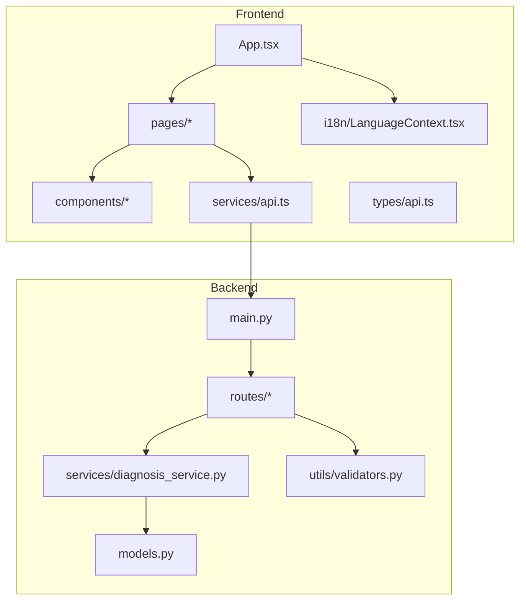

**Diagram sources**
- [backend/main.py:1-45](file://backend/main.py#L1-L45)
- [backend/routes/diagnose.py:1-59](file://backend/routes/diagnose.py#L1-L59)
- [backend/routes/followup.py:1-40](file://backend/routes/followup.py#L1-L40)
- [backend/services/diagnosis_service.py:1-128](file://backend/services/diagnosis_service.py#L1-L128)
- [backend/models.py:1-58](file://backend/models.py#L1-L58)
- [backend/utils/validators.py:1-19](file://backend/utils/validators.py#L1-L19)
- [frontend/src/App.tsx:1-336](file://frontend/src/App.tsx#L1-L336)
- [frontend/src/services/api.ts:1-99](file://frontend/src/services/api.ts#L1-L99)
- [frontend/src/types/api.ts:1-26](file://frontend/src/types/api.ts#L1-L26)
- [frontend/src/i18n/LanguageContext.tsx:1-67](file://frontend/src/i18n/LanguageContext.tsx#L1-L67)

**Section sources**
- [backend/main.py:1-45](file://backend/main.py#L1-L45)
- [frontend/src/App.tsx:1-336](file://frontend/src/App.tsx#L1-L336)

## Core Components
- Backend
  - Routes: HTTP endpoints that validate input and delegate to services.
  - Services: Business logic layer; abstracts AI provider behind a protocol and provides a factory to select mock or real provider.
  - Models: Pydantic contracts mirroring frontend types.
  - Utils: Shared validators for images and questions.
- Frontend
  - App: Central state machine driving screen transitions and orchestration.
  - Pages: Feature screens (Home, Upload, Analyzing, Result, Follow-Up, etc.).
  - Components: Reusable UI building blocks (ImageUploader, ChatMessage, Button, etc.).
  - Services: API client encapsulating fetch calls and error mapping.
  - Types: TypeScript mirrors of backend models.
  - i18n: Language context providing localized strings and directionality.

Key responsibilities:
- Routes do not implement AI logic; they call service functions.
- Services define a stable interface (Protocol) so routes remain unchanged when swapping providers.
- Frontend services centralize network calls and errors; components stay UI-focused.

**Section sources**
- [backend/routes/diagnose.py:1-59](file://backend/routes/diagnose.py#L1-L59)
- [backend/routes/followup.py:1-40](file://backend/routes/followup.py#L1-L40)
- [backend/services/diagnosis_service.py:1-128](file://backend/services/diagnosis_service.py#L1-L128)
- [backend/models.py:1-58](file://backend/models.py#L1-L58)
- [backend/utils/validators.py:1-19](file://backend/utils/validators.py#L1-L19)
- [frontend/src/services/api.ts:1-99](file://frontend/src/services/api.ts#L1-L99)
- [frontend/src/types/api.ts:1-26](file://frontend/src/types/api.ts#L1-L26)
- [frontend/src/i18n/LanguageContext.tsx:1-67](file://frontend/src/i18n/LanguageContext.tsx#L1-L67)

## Architecture Overview
FasalDoc follows a service-oriented architecture with explicit boundaries:
- Frontend pages and components communicate through a single API service.
- FastAPI routes accept requests, validate inputs, and delegate to the diagnosis service.
- The diagnosis service uses a Protocol-based abstraction to decouple routes from concrete AI implementations.
- A factory selects the active provider at runtime based on environment configuration, falling back to a mock provider if credentials are missing or construction fails.

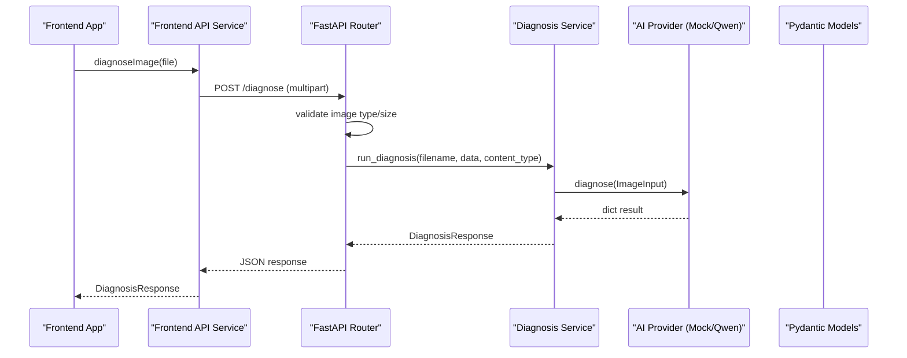

**Diagram sources**
- [frontend/src/App.tsx:187-208](file://frontend/src/App.tsx#L187-L208)
- [frontend/src/services/api.ts:64-77](file://frontend/src/services/api.ts#L64-L77)
- [backend/routes/diagnose.py:13-59](file://backend/routes/diagnose.py#L13-L59)
- [backend/services/diagnosis_service.py:116-124](file://backend/services/diagnosis_service.py#L116-L124)
- [backend/models.py:10-31](file://backend/models.py#L10-L31)

## Detailed Component Analysis

### Backend: Pluggable AI Provider Pattern
The diagnosis service defines a stable interface via a Protocol and a factory that chooses the implementation at runtime.

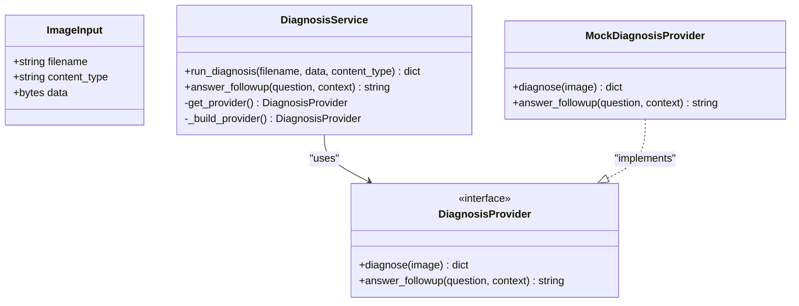

- Protocol ensures any future provider must implement the same method signatures.
- Factory checks environment variables to build the real provider; otherwise returns the mock.
- Routes call service helpers without knowing which provider is active.

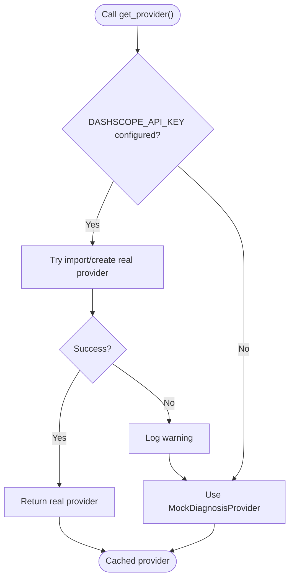

**Diagram sources**
- [backend/services/diagnosis_service.py:40-53](file://backend/services/diagnosis_service.py#L40-L53)
- [backend/services/diagnosis_service.py:55-73](file://backend/services/diagnosis_service.py#L55-L73)
- [backend/services/diagnosis_service.py:75-105](file://backend/services/diagnosis_service.py#L75-L105)

**Section sources**
- [backend/services/diagnosis_service.py:1-128](file://backend/services/diagnosis_service.py#L1-L128)

### Backend: Route-to-Service Flow
Routes perform validation and delegate to the service layer. Errors are normalized to HTTP exceptions.

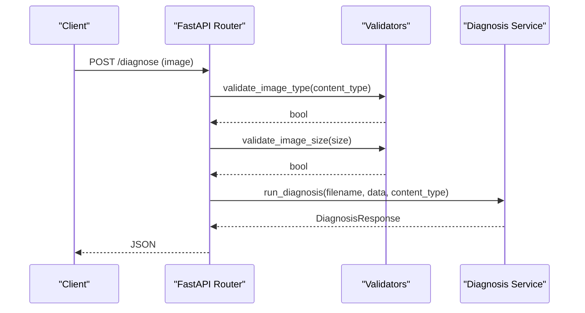

**Diagram sources**
- [backend/routes/diagnose.py:13-59](file://backend/routes/diagnose.py#L13-L59)
- [backend/utils/validators.py:1-19](file://backend/utils/validators.py#L1-L19)
- [backend/services/diagnosis_service.py:116-124](file://backend/services/diagnosis_service.py#L116-L124)

**Section sources**
- [backend/routes/diagnose.py:1-59](file://backend/routes/diagnose.py#L1-L59)
- [backend/utils/validators.py:1-19](file://backend/utils/validators.py#L1-L19)

### Backend: Follow-up Q&A Flow
Follow-up endpoint validates the question and delegates to the service.

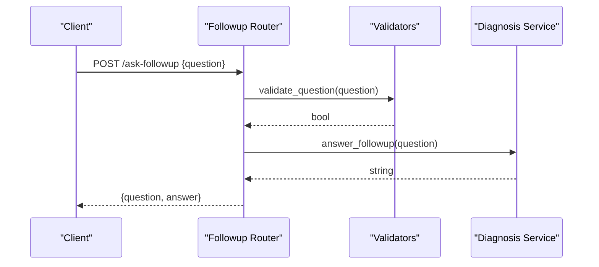

**Diagram sources**
- [backend/routes/followup.py:10-40](file://backend/routes/followup.py#L10-L40)
- [backend/utils/validators.py:18-19](file://backend/utils/validators.py#L18-L19)
- [backend/services/diagnosis_service.py:126-128](file://backend/services/diagnosis_service.py#L126-L128)

**Section sources**
- [backend/routes/followup.py:1-40](file://backend/routes/followup.py#L1-L40)

### Frontend: Application State and Screen Orchestration
The App component manages the overall flow using a reducer-driven state machine. It coordinates authentication, file selection, diagnosis, results, and follow-up chat.

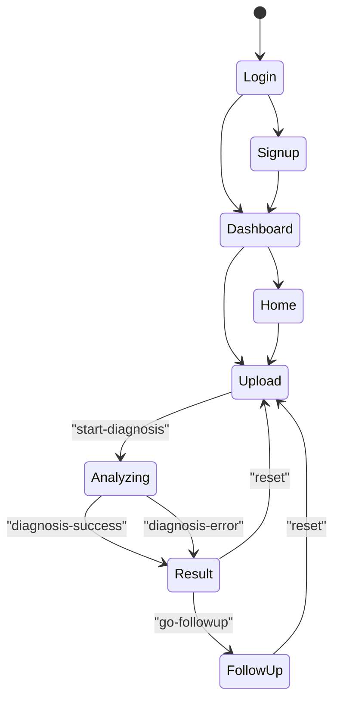

**Diagram sources**
- [frontend/src/App.tsx:29-133](file://frontend/src/App.tsx#L29-L133)
- [frontend/src/App.tsx:135-336](file://frontend/src/App.tsx#L135-L336)

**Section sources**
- [frontend/src/App.tsx:1-336](file://frontend/src/App.tsx#L1-L336)

### Frontend: API Service Layer
The API service centralizes all backend calls, enforces consistent error handling, and mirrors backend constraints for early UX feedback.

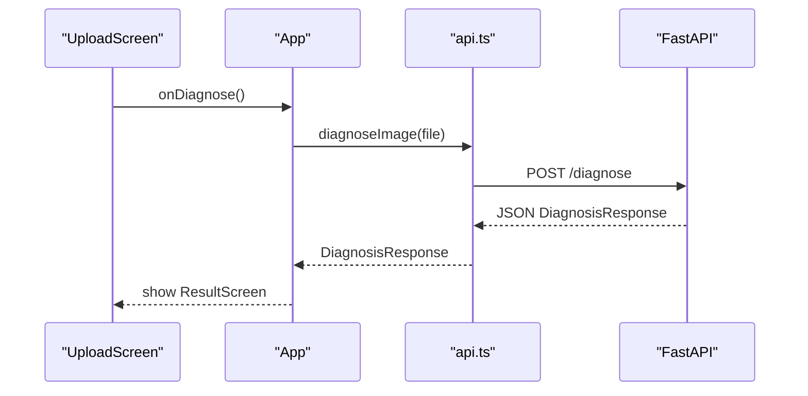

**Diagram sources**
- [frontend/src/pages/UploadScreen.tsx:19-67](file://frontend/src/pages/UploadScreen.tsx#L19-L67)
- [frontend/src/App.tsx:187-208](file://frontend/src/App.tsx#L187-L208)
- [frontend/src/services/api.ts:64-77](file://frontend/src/services/api.ts#L64-L77)

**Section sources**
- [frontend/src/services/api.ts:1-99](file://frontend/src/services/api.ts#L1-L99)

### Frontend: Data Contracts
TypeScript interfaces mirror backend Pydantic models to ensure type safety across the boundary.

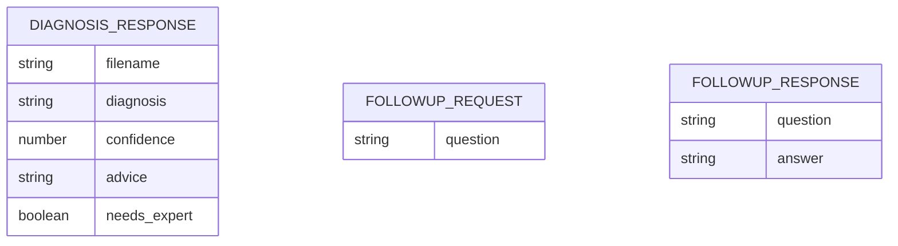

**Diagram sources**
- [frontend/src/types/api.ts:6-25](file://frontend/src/types/api.ts#L6-L25)
- [backend/models.py:10-58](file://backend/models.py#L10-L58)

**Section sources**
- [frontend/src/types/api.ts:1-26](file://frontend/src/types/api.ts#L1-L26)
- [backend/models.py:1-58](file://backend/models.py#L1-L58)

### Frontend: i18n Context as a Global Service
Language context provides localized strings and text direction, consumed by pages and components via a hook.

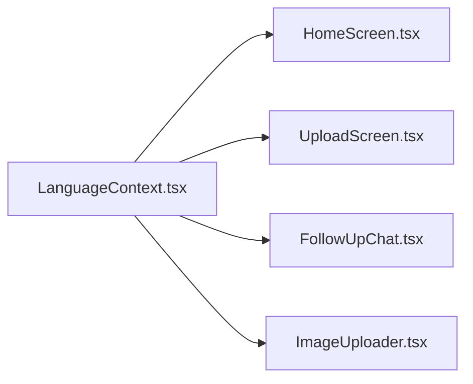

**Diagram sources**
- [frontend/src/i18n/LanguageContext.tsx:1-67](file://frontend/src/i18n/LanguageContext.tsx#L1-L67)
- [frontend/src/pages/HomeScreen.tsx:1-68](file://frontend/src/pages/HomeScreen.tsx#L1-L68)
- [frontend/src/pages/UploadScreen.tsx:1-67](file://frontend/src/pages/UploadScreen.tsx#L1-L67)
- [frontend/src/components/FollowUpChat.tsx:1-92](file://frontend/src/components/FollowUpChat.tsx#L1-L92)
- [frontend/src/components/ImageUploader.tsx:1-173](file://frontend/src/components/ImageUploader.tsx#L1-L173)

**Section sources**
- [frontend/src/i18n/LanguageContext.tsx:1-67](file://frontend/src/i18n/LanguageContext.tsx#L1-L67)

## Dependency Analysis
- Coupling
  - Routes depend only on the service layer, not on specific AI providers.
  - Services depend on a Protocol; concrete providers are resolved via a factory.
  - Frontend components depend on the API service, not directly on fetch.
- Cohesion
  - Each module has a focused responsibility: routes handle HTTP concerns, services encapsulate business logic and provider selection, components render UI and manage local state.
- External Integrations
  - Backend may integrate with an external AI service via optional environment configuration; fallback behavior ensures resilience.
  - Frontend integrates with the backend over HTTP with centralized error handling.

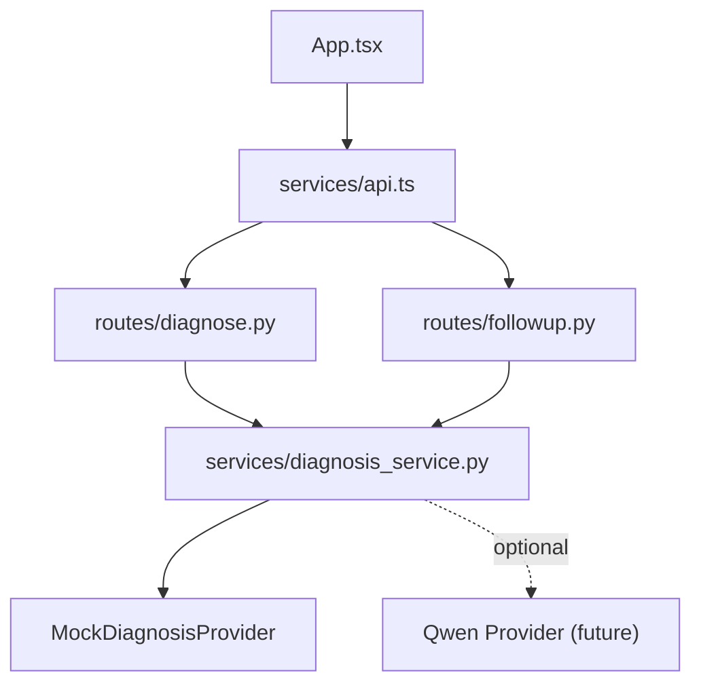

**Diagram sources**
- [backend/routes/diagnose.py:1-59](file://backend/routes/diagnose.py#L1-L59)
- [backend/routes/followup.py:1-40](file://backend/routes/followup.py#L1-L40)
- [backend/services/diagnosis_service.py:1-128](file://backend/services/diagnosis_service.py#L1-L128)
- [frontend/src/App.tsx:1-336](file://frontend/src/App.tsx#L1-L336)
- [frontend/src/services/api.ts:1-99](file://frontend/src/services/api.ts#L1-L99)

**Section sources**
- [backend/services/diagnosis_service.py:1-128](file://backend/services/diagnosis_service.py#L1-L128)
- [frontend/src/services/api.ts:1-99](file://frontend/src/services/api.ts#L1-L99)

## Performance Considerations
- Input Validation Early Exit
  - Frontend validates image type and size before upload to reduce unnecessary network calls.
  - Backend validates content type and size to protect resources and provide fast failures.
- Provider Selection
  - Provider is built once and cached; subsequent calls reuse the instance, avoiding repeated initialization overhead.
- Error Handling
  - Centralized error parsing in the frontend API service prevents leaking internal details and standardizes user-facing messages.
- CORS Configuration
  - CORS middleware allows flexible origins via environment variables to support local development and deployment targets.

[No sources needed since this section provides general guidance]

## Troubleshooting Guide
Common issues and where to look:
- Network errors during diagnosis or follow-up
  - Frontend API service throws typed ApiError for network failures; App maps these to user-friendly messages.
  - Check VITE_API_BASE_URL and backend availability.
- Validation errors
  - Frontend validates image type and size; backend also validates and returns 400/422 with detail messages.
  - Ensure file types are JPEG/PNG/WEBP and under 10 MB.
- Provider not available
  - If DASHSCOPE_API_KEY is missing or invalid, the service falls back to the mock provider; logs indicate fallback usage.
  - Verify environment variables and provider module availability when integrating the real AI service.
- CORS issues
  - Adjust CORS_ALLOW_ORIGINS to include your frontend origin during development or deployment.

**Section sources**
- [frontend/src/services/api.ts:46-99](file://frontend/src/services/api.ts#L46-L99)
- [backend/routes/diagnose.py:21-43](file://backend/routes/diagnose.py#L21-L43)
- [backend/routes/followup.py:18-23](file://backend/routes/followup.py#L18-L23)
- [backend/services/diagnosis_service.py:75-95](file://backend/services/diagnosis_service.py#L75-L95)
- [backend/main.py:19-35](file://backend/main.py#L19-L35)

## Conclusion
FasalDoc’s architecture cleanly separates concerns:
- Backend routes focus on HTTP concerns and delegate to a service layer that abstracts AI providers behind a stable Protocol.
- A factory-based provider selection enables seamless switching between mock and real AI services without changing route code.
- Frontend components are organized into pages and reusable components, communicating with the backend through a centralized API service.
- Dependency injection via Protocols and factories, combined with strict contracts (Pydantic models and TypeScript interfaces), ensures maintainability, testability, and resilience.

[No sources needed since this section summarizes without analyzing specific files]