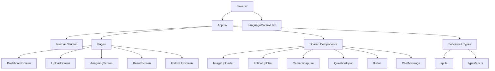
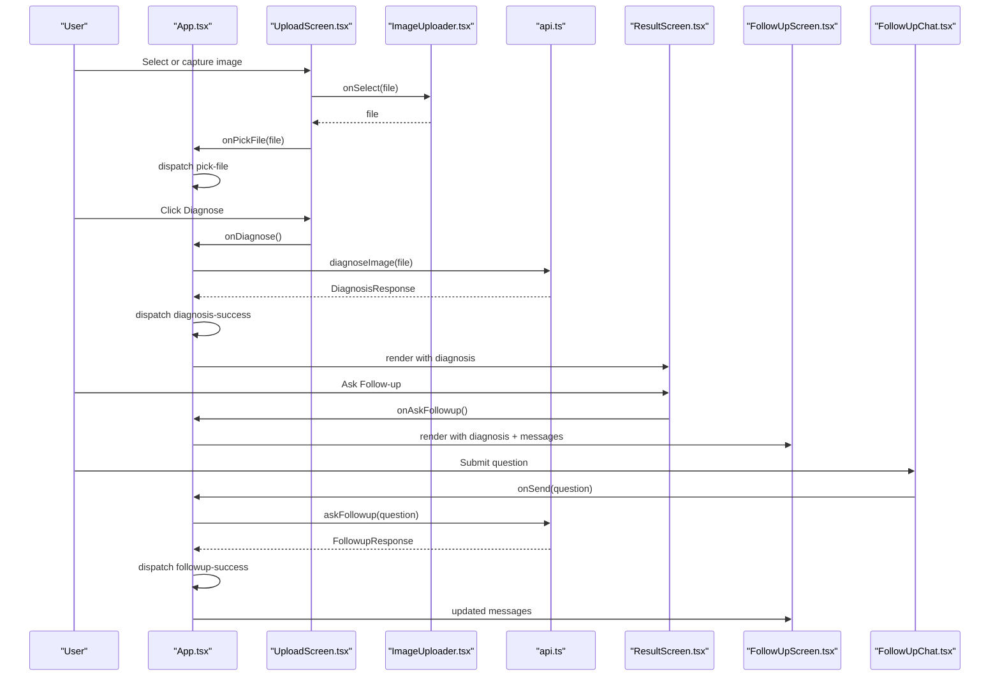
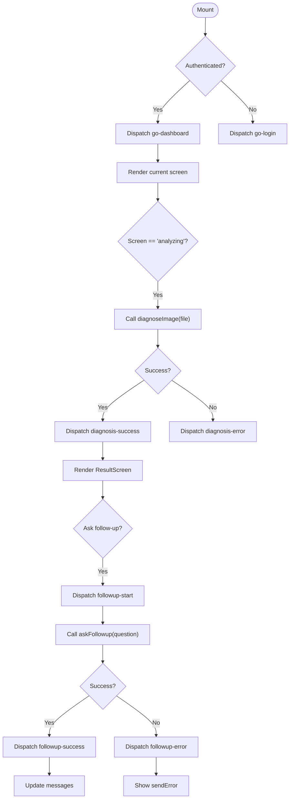
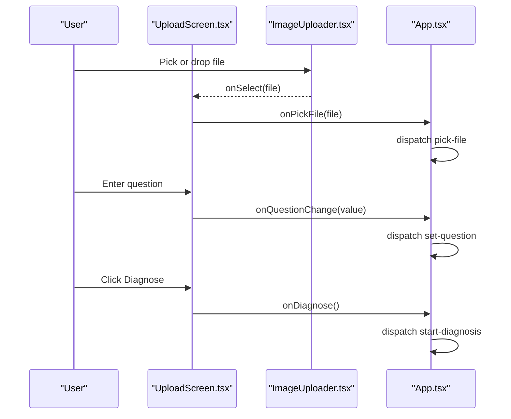
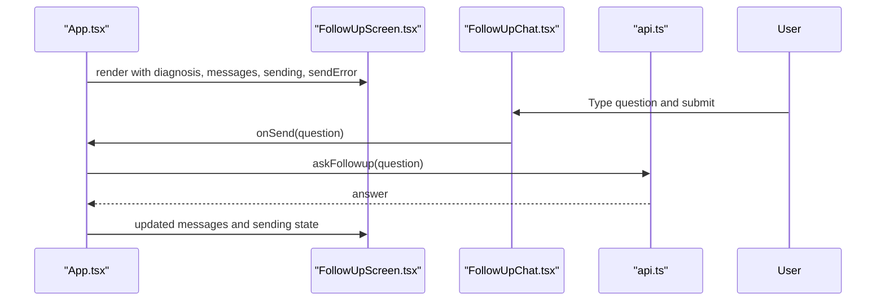
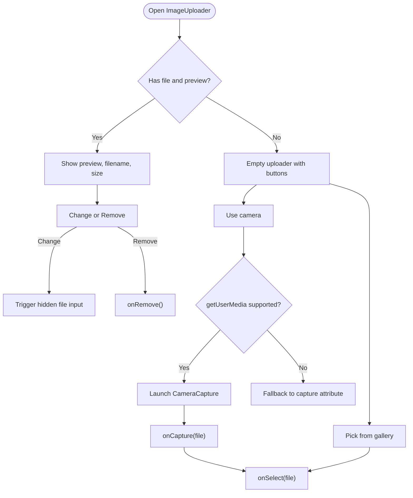
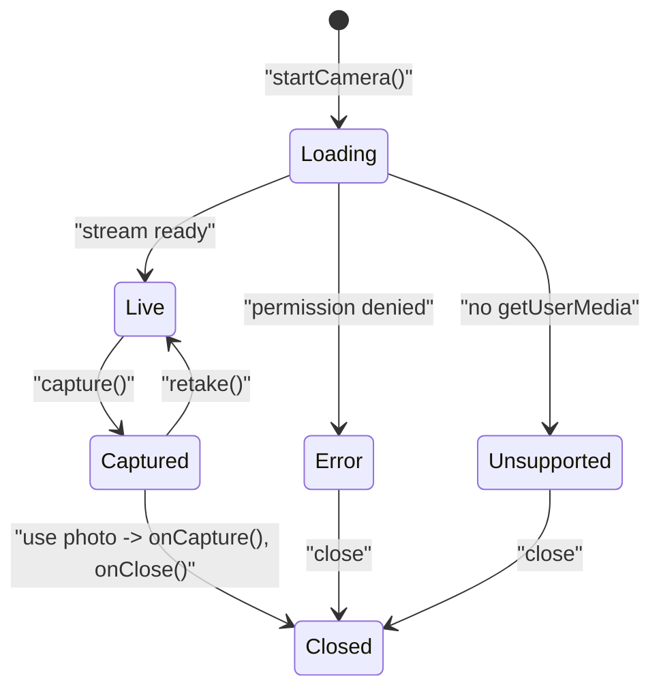
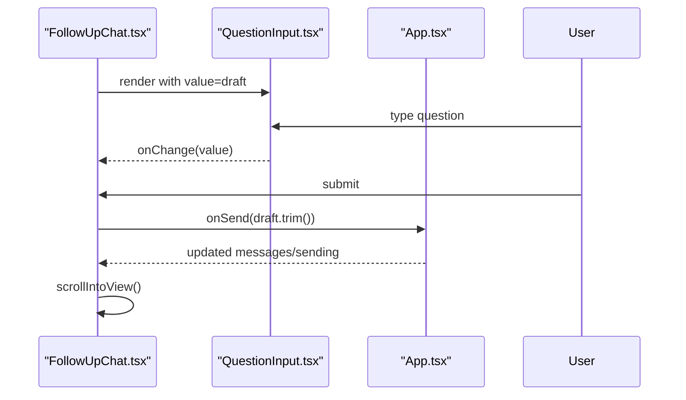
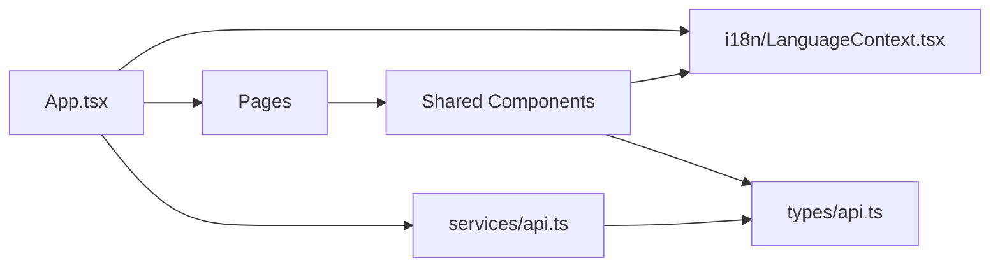

# Frontend Component Hierarchy

<cite>
**Referenced Files in This Document**
- [App.tsx](file://frontend/src/App.tsx)
- [main.tsx](file://frontend/src/main.tsx)
- [LanguageContext.tsx](file://frontend/src/i18n/LanguageContext.tsx)
- [UploadScreen.tsx](file://frontend/src/pages/UploadScreen.tsx)
- [FollowUpScreen.tsx](file://frontend/src/pages/FollowUpScreen.tsx)
- [DashboardScreen.tsx](file://frontend/src/pages/DashboardScreen.tsx)
- [ImageUploader.tsx](file://frontend/src/components/ImageUploader.tsx)
- [FollowUpChat.tsx](file://frontend/src/components/FollowUpChat.tsx)
- [CameraCapture.tsx](file://frontend/src/components/CameraCapture.tsx)
- [QuestionInput.tsx](file://frontend/src/components/QuestionInput.tsx)
- [ChatMessage.tsx](file://frontend/src/components/ChatMessage.tsx)
- [Button.tsx](file://frontend/src/components/Button.tsx)
- [api.ts](file://frontend/src/services/api.ts)
- [api.ts (types)](file://frontend/src/types/api.ts)
</cite>

## Table of Contents
1. Introduction
2. Project Structure
3. Core Components
4. Architecture Overview
5. Detailed Component Analysis
6. Dependency Analysis
7. Performance Considerations
8. Troubleshooting Guide
9. Conclusion

## Introduction
This document explains the frontend component hierarchy and organization of the React application. It starts from the root App component and describes how it manages application state, routing via conditional rendering, and orchestrates page-level components such as UploadScreen and FollowUpScreen. It also documents reusable UI components like ImageUploader, FollowUpChat, and CameraCapture, including their props, events, and internal state management. Finally, it outlines data flow patterns, composition strategies, and the global state approach using React hooks and the Context API for language support.

## Project Structure
The application is organized into:
- Root entry and providers: main.tsx wraps the app with LanguageProvider.
- Application shell and routing: App.tsx renders a Navbar, Footer, and conditionally renders page screens based on an internal screen state.
- Pages: Feature-oriented screens under src/pages (e.g., UploadScreen, FollowUpScreen, DashboardScreen).
- Shared components: Reusable UI elements under src/components (e.g., ImageUploader, FollowUpChat, CameraCapture, Button, QuestionInput, ChatMessage).
- Services and types: API client and shared types under src/services and src/types.
- i18n: Global language context under src/i18n.

**Diagram sources**
- [main.tsx:1-15](file://frontend/src/main.tsx#L1-L15)
- [App.tsx:1-336](file://frontend/src/App.tsx#L1-L336)
- [LanguageContext.tsx:1-67](file://frontend/src/i18n/LanguageContext.tsx#L1-L67)

**Section sources**
- [main.tsx:1-15](file://frontend/src/main.tsx#L1-L15)
- [App.tsx:1-336](file://frontend/src/App.tsx#L1-L336)

## Core Components
- App.tsx: Central orchestrator that holds the application’s flow state (current screen, selected file, preview URL, question, diagnosis result, chat messages, sending status, errors). It uses useReducer to manage state transitions and side effects to trigger diagnosis and follow-up flows. It conditionally renders pages based on the current screen value.
- Page components:
  - UploadScreen: Presents image upload, optional question input, error display, and triggers diagnosis.
  - FollowUpScreen: Displays diagnosis context and a chat interface for follow-up questions.
  - DashboardScreen: Entry point after login; routes user to upload/camera/question/voice actions.
- Shared components:
  - ImageUploader: Handles file selection, drag-and-drop, preview, removal, and camera capture integration.
  - FollowUpChat: Manages message list rendering, typing indicator, scroll-to-bottom, and submission flow.
  - CameraCapture: Opens device camera, captures frames to a File, and returns it to the parent.
  - QuestionInput: Text input with optional voice input integration.
  - ChatMessage: Renders individual chat bubbles with role-based styling.
  - Button: Accessible button with loading state and variants.

Data flow pattern:
- Parent (App) owns state and handlers.
- Pages receive props and call back functions to update parent state.
- Shared components emit events (e.g., onSelect, onSend) to propagate changes upward.
- Side effects in App trigger API calls and update state accordingly.

**Section sources**
- [App.tsx:29-133](file://frontend/src/App.tsx#L29-L133)
- [UploadScreen.tsx:1-67](file://frontend/src/pages/UploadScreen.tsx#L1-L67)
- [FollowUpScreen.tsx:1-54](file://frontend/src/pages/FollowUpScreen.tsx#L1-L54)
- [DashboardScreen.tsx:1-104](file://frontend/src/pages/DashboardScreen.tsx#L1-L104)
- [ImageUploader.tsx:1-173](file://frontend/src/components/ImageUploader.tsx#L1-L173)
- [FollowUpChat.tsx:1-92](file://frontend/src/components/FollowUpChat.tsx#L1-L92)
- [CameraCapture.tsx:1-200](file://frontend/src/components/CameraCapture.tsx#L1-L200)
- [QuestionInput.tsx:1-96](file://frontend/src/components/QuestionInput.tsx#L1-L96)
- [ChatMessage.tsx:1-22](file://frontend/src/components/ChatMessage.tsx#L1-L22)
- [Button.tsx:1-32](file://frontend/src/components/Button.tsx#L1-L32)

## Architecture Overview
The application uses a single-page architecture with conditional rendering for navigation. The root provider sets up internationalization. App maintains a reducer-driven flow state to control which screen is visible and what data is available. Pages are thin presentational layers that delegate interactions to App through callbacks. Shared components encapsulate UI behaviors and communicate via props and events.

**Diagram sources**
- [App.tsx:178-237](file://frontend/src/App.tsx#L178-L237)
- [UploadScreen.tsx:18-67](file://frontend/src/pages/UploadScreen.tsx#L18-L67)
- [ImageUploader.tsx:27-46](file://frontend/src/components/ImageUploader.tsx#L27-L46)
- [api.ts:64-98](file://frontend/src/services/api.ts#L64-L98)
- [FollowUpScreen.tsx:16-54](file://frontend/src/pages/FollowUpScreen.tsx#L16-L54)
- [FollowUpChat.tsx:16-92](file://frontend/src/components/FollowUpChat.tsx#L16-L92)

## Detailed Component Analysis

### App.tsx — Root Orchestrator and State Manager
- Responsibilities:
  - Holds flow state: screen, file, previewUrl, question, diagnosis, messages, sending, errors.
  - Uses useReducer with explicit action types to transition between screens and update data.
  - Performs authentication checks on mount and redirects to appropriate screens.
  - Triggers diagnosis when entering analyzing screen and handles success/error states.
  - Coordinates follow-up chat by appending user messages and receiving AI answers.
  - Manages memory by revoking object URLs for previews.
- Key interactions:
  - Dispatches actions to change screens and update data.
  - Calls api.ts functions for diagnosis and follow-up.
  - Passes handlers down to pages and shared components.

**Diagram sources**
- [App.tsx:142-237](file://frontend/src/App.tsx#L142-L237)

**Section sources**
- [App.tsx:29-133](file://frontend/src/App.tsx#L29-L133)
- [App.tsx:178-237](file://frontend/src/App.tsx#L178-L237)
- [App.tsx:239-336](file://frontend/src/App.tsx#L239-L336)

### UploadScreen — Image Selection and Diagnosis Trigger
- Props:
  - file, previewUrl: current image and its preview URL.
  - question: text input value.
  - error: validation or upload error message.
  - onPickFile, onRemoveFile, onQuestionChange, onDiagnose: event handlers to update parent state.
- Behavior:
  - Composes ImageUploader and QuestionInput.
  - Shows ErrorMessage when present.
  - Triggers diagnosis via onDiagnose.

**Diagram sources**
- [UploadScreen.tsx:18-67](file://frontend/src/pages/UploadScreen.tsx#L18-L67)
- [ImageUploader.tsx:27-46](file://frontend/src/components/ImageUploader.tsx#L27-L46)
- [App.tsx:178-208](file://frontend/src/App.tsx#L178-L208)

**Section sources**
- [UploadScreen.tsx:1-67](file://frontend/src/pages/UploadScreen.tsx#L1-L67)

### FollowUpScreen — Diagnosis Context and Chat
- Props:
  - diagnosis: previous diagnosis to show context.
  - previewUrl: thumbnail of uploaded image.
  - messages: chat history array.
  - sending, sendError: UI state for sending and errors.
  - initialDraft: pre-filled question draft.
  - onSend: callback to submit a new question.
- Behavior:
  - Displays diagnosis summary and confidence.
  - Renders FollowUpChat with messages and controls.
  - Delegates sending to parent via onSend.

**Diagram sources**
- [FollowUpScreen.tsx:16-54](file://frontend/src/pages/FollowUpScreen.tsx#L16-L54)
- [FollowUpChat.tsx:16-92](file://frontend/src/components/FollowUpChat.tsx#L16-L92)
- [App.tsx:227-237](file://frontend/src/App.tsx#L227-L237)
- [api.ts:84-98](file://frontend/src/services/api.ts#L84-L98)

**Section sources**
- [FollowUpScreen.tsx:1-54](file://frontend/src/pages/FollowUpScreen.tsx#L1-L54)

### ImageUploader — File Handling and Camera Integration
- Props:
  - file, previewUrl: current selection and preview.
  - disabled: optional disable flag.
  - onSelect, onRemove: callbacks to handle selection and removal.
- Internal state:
  - dragOver: visual feedback during drag.
  - showCamera: toggles CameraCapture modal.
- Behaviors:
  - Supports gallery selection, drag-and-drop, and camera capture.
  - When a file is captured, calls onSelect and closes camera modal.
  - Provides change/remove actions when a file is already selected.

**Diagram sources**
- [ImageUploader.tsx:14-167](file://frontend/src/components/ImageUploader.tsx#L14-L167)
- [CameraCapture.tsx:29-56](file://frontend/src/components/CameraCapture.tsx#L29-L56)

**Section sources**
- [ImageUploader.tsx:1-173](file://frontend/src/components/ImageUploader.tsx#L1-L173)

### CameraCapture — Device Camera Workflow
- Props:
  - onCapture: emits captured File.
  - onClose: closes the modal and cleans up resources.
- Internal state:
  - state: loading | live | captured | error | unsupported.
  - capturedUrl: temporary URL for previewing captured image.
- Behaviors:
  - Starts camera stream and displays video.
  - Captures frame to canvas and converts to File.
  - Allows retake or confirm usage.
  - Cleans up media streams and object URLs on close.

**Diagram sources**
- [CameraCapture.tsx:13-117](file://frontend/src/components/CameraCapture.tsx#L13-L117)

**Section sources**
- [CameraCapture.tsx:1-200](file://frontend/src/components/CameraCapture.tsx#L1-L200)

### FollowUpChat — Message List and Submission
- Props:
  - messages: array of ChatMessageData.
  - sending: boolean indicating ongoing request.
  - sendError: string for error display.
  - initialDraft: optional pre-filled question.
  - onSend: callback to submit question.
- Internal state:
  - draft: local text input value.
  - bottomRef: auto-scroll to latest message.
- Behaviors:
  - Renders greeting and messages.
  - Shows typing indicator while sending.
  - Submits via form handler and clears draft.

**Diagram sources**
- [FollowUpChat.tsx:16-92](file://frontend/src/components/FollowUpChat.tsx#L16-L92)
- [QuestionInput.tsx:23-96](file://frontend/src/components/QuestionInput.tsx#L23-L96)
- [App.tsx:227-237](file://frontend/src/App.tsx#L227-L237)

**Section sources**
- [FollowUpChat.tsx:1-92](file://frontend/src/components/FollowUpChat.tsx#L1-L92)
- [QuestionInput.tsx:1-96](file://frontend/src/components/QuestionInput.tsx#L1-L96)

### DashboardScreen — Entry Point After Login
- Props:
  - user: authenticated user info.
  - onUploadPhoto, onUseCamera, onAskQuestion, onVoiceInput: navigation callbacks to start different flows.
- Behavior:
  - Greets user and presents action cards.
  - Displays supported crops chips.
  - Provides quick start button to begin diagnosis.

**Section sources**
- [DashboardScreen.tsx:1-104](file://frontend/src/pages/DashboardScreen.tsx#L1-L104)

### Button and ChatMessage — Presentational Primitives
- Button:
  - Supports variants and loading state.
  - Disables itself when loading or disabled prop is true.
- ChatMessage:
  - Renders a bubble with role-based styling and optional avatar.

**Section sources**
- [Button.tsx:1-32](file://frontend/src/components/Button.tsx#L1-L32)
- [ChatMessage.tsx:1-22](file://frontend/src/components/ChatMessage.tsx#L1-L22)

## Dependency Analysis
Component relationships and data flow:
- App depends on:
  - Pages for rendering specific screens.
  - Shared components for UI building blocks.
  - services/api for backend communication.
  - i18n LanguageContext for translations.
- Pages depend on:
  - Shared components for interaction and presentation.
  - App-provided props and callbacks.
- Shared components depend on:
  - i18n for localized strings.
  - Other shared components (e.g., ImageUploader uses CameraCapture; FollowUpChat uses QuestionInput and ChatMessage).

**Diagram sources**
- [App.tsx:1-336](file://frontend/src/App.tsx#L1-L336)
- [api.ts:1-99](file://frontend/src/services/api.ts#L1-L99)
- [LanguageContext.tsx:1-67](file://frontend/src/i18n/LanguageContext.tsx#L1-L67)
- [api.ts (types):1-26](file://frontend/src/types/api.ts#L1-L26)

**Section sources**
- [App.tsx:1-336](file://frontend/src/App.tsx#L1-L336)
- [api.ts:1-99](file://frontend/src/services/api.ts#L1-L99)
- [LanguageContext.tsx:1-67](file://frontend/src/i18n/LanguageContext.tsx#L1-L67)
- [api.ts (types):1-26](file://frontend/src/types/api.ts#L1-L26)

## Performance Considerations
- Memory management:
  - App revokes previous preview URLs to prevent memory leaks when switching images.
  - CameraCapture stops media tracks and revokes captured image URLs on close.
- Rendering efficiency:
  - Conditional rendering in App avoids unnecessary mounts for inactive screens.
  - FollowUpChat scrolls only when messages or sending state changes.
- Network calls:
  - Diagnosis and follow-up requests are centralized in api.ts, reducing duplicate fetch logic.
  - Early client-side validation reduces unnecessary network requests.

[No sources needed since this section provides general guidance]

## Troubleshooting Guide
Common issues and handling:
- Image validation errors:
  - No image, invalid type, or too large files are caught early in api.ts and surfaced via UploadScreen error display.
- Network errors:
  - ApiError with kind 'network' is handled in App and translated to user-friendly messages.
- Server errors:
  - Non-2xx responses parse backend detail and map to ApiError with kind 'server'.
- Camera permission issues:
  - CameraCapture distinguishes between NotAllowedError and NotFoundError, showing appropriate messages.
- Speech recognition not available:
  - QuestionInput alerts users when browser does not support speech recognition.

**Section sources**
- [api.ts:17-58](file://frontend/src/services/api.ts#L17-L58)
- [App.tsx:210-225](file://frontend/src/App.tsx#L210-L225)
- [CameraCapture.tsx:29-56](file://frontend/src/components/CameraCapture.tsx#L29-L56)
- [QuestionInput.tsx:50-59](file://frontend/src/components/QuestionInput.tsx#L50-L59)

## Conclusion
The application follows a clear, hierarchical component structure with a central state manager in App.tsx. Pages orchestrate user workflows while shared components encapsulate reusable UI behaviors. Data flows downward via props and upward via callbacks, enabling predictable state updates. Internationalization is provided globally through a Context Provider. The design supports extensibility, maintainability, and robust error handling across the user journey from upload to diagnosis and follow-up.

[No sources needed since this section summarizes without analyzing specific files]