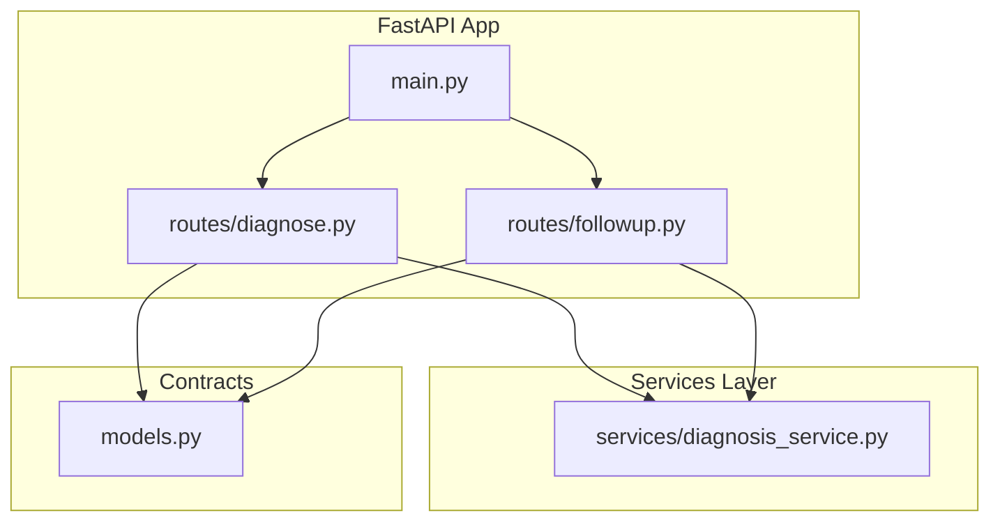
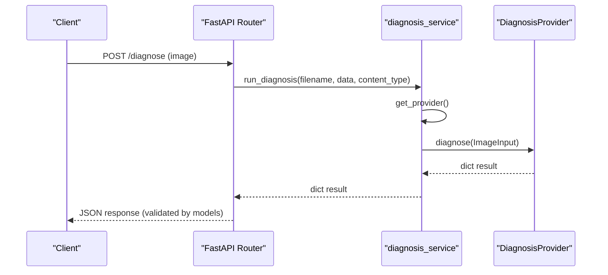
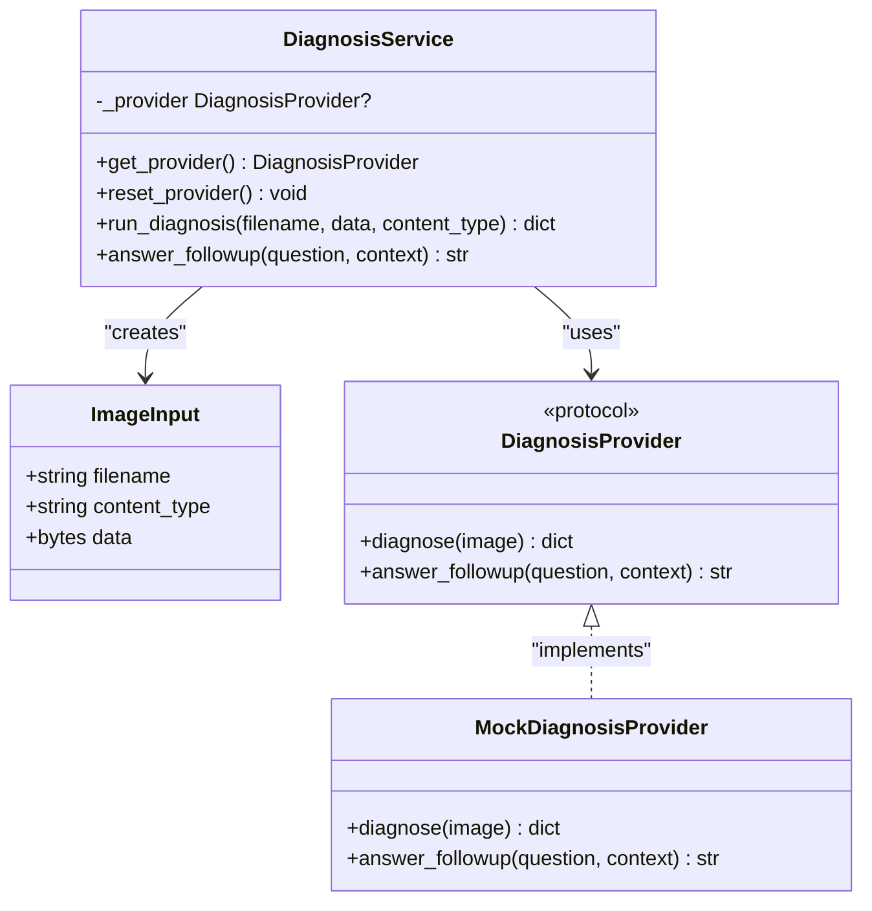
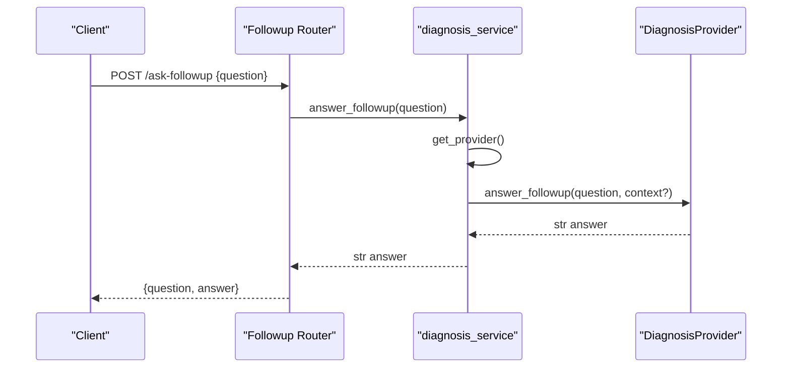
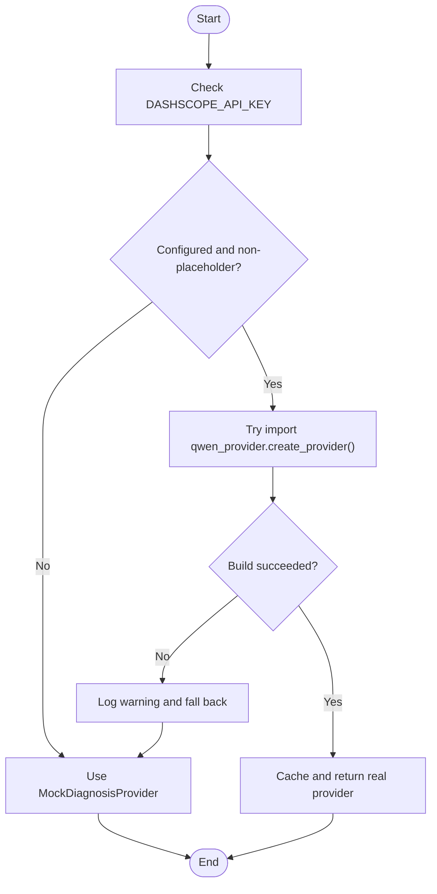
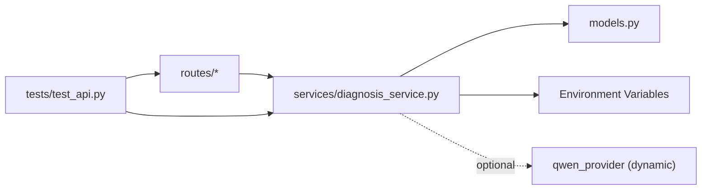

# Provider Abstraction Pattern

<cite>
**Referenced Files in This Document**
- [diagnosis_service.py](file://backend/services/diagnosis_service.py)
- [diagnose.py](file://backend/routes/diagnose.py)
- [followup.py](file://backend/routes/followup.py)
- [models.py](file://backend/models.py)
- [main.py](file://backend/main.py)
- [test_api.py](file://tests/test_api.py)
</cite>

## Table of Contents
1. [Introduction](#introduction)
2. [Project Structure](#project-structure)
3. [Core Components](#core-components)
4. [Architecture Overview](#architecture-overview)
5. [Detailed Component Analysis](#detailed-component-analysis)
6. [Dependency Analysis](#dependency-analysis)
7. [Performance Considerations](#performance-considerations)
8. [Troubleshooting Guide](#troubleshooting-guide)
9. [Conclusion](#conclusion)
10. [Appendices](#appendices)

## Introduction
This document explains the pluggable provider abstraction pattern implemented in FasalDoc’s backend. It focuses on how a stable protocol defines a consistent interface for different AI service implementations, how a mock provider enables offline development and testing, and how a factory selects the active provider at runtime based on environment configuration. The design allows seamless switching between AI backends without changing route handlers or business logic, improving testability, maintainability, and extensibility.

## Project Structure
The provider abstraction lives in the services layer and is consumed by FastAPI routes. The main application wires routers and middleware but remains decoupled from AI implementation details.

**Diagram sources**
- [main.py:6-38](file://backend/main.py#L6-L38)
- [diagnose.py:1-59](file://backend/routes/diagnose.py#L1-L59)
- [followup.py:1-40](file://backend/routes/followup.py#L1-L40)
- [diagnosis_service.py:1-128](file://backend/services/diagnosis_service.py#L1-L128)
- [models.py:1-58](file://backend/models.py#L1-L58)

**Section sources**
- [main.py:6-38](file://backend/main.py#L6-L38)
- [diagnose.py:1-59](file://backend/routes/diagnose.py#L1-L59)
- [followup.py:1-40](file://backend/routes/followup.py#L1-L40)
- [diagnosis_service.py:1-128](file://backend/services/diagnosis_service.py#L1-L128)
- [models.py:1-58](file://backend/models.py#L1-L58)

## Core Components
- DiagnosisProvider protocol: Defines the stable interface that all providers must implement (diagnose and answer_followup).
- MockDiagnosisProvider: An offline fallback returning deterministic responses with confidence scoring to support development and tests.
- Factory and caching: A module-level factory builds the active provider once and caches it; it can be reset for tests or reconfiguration.
- Route helpers: Routes call service helpers that delegate to the provider, keeping route code free of AI-specific logic.

Key responsibilities:
- Protocol ensures type safety and consistent behavior across providers.
- Mock provider guarantees the app runs without external dependencies.
- Factory centralizes environment-driven selection and error-safe fallback.
- Service helpers encapsulate data transformation and provider invocation.

**Section sources**
- [diagnosis_service.py:31-52](file://backend/services/diagnosis_service.py#L31-L52)
- [diagnosis_service.py:55-73](file://backend/services/diagnosis_service.py#L55-L73)
- [diagnosis_service.py:75-111](file://backend/services/diagnosis_service.py#L75-L111)
- [diagnosis_service.py:114-128](file://backend/services/diagnosis_service.py#L114-L128)

## Architecture Overview
The architecture separates concerns into layers:
- Routes handle HTTP validation and return standardized responses.
- Services define the contract and orchestrate provider usage.
- Providers implement AI logic (mock now, real later).
- Models enforce request/response contracts.

**Diagram sources**
- [diagnose.py:13-59](file://backend/routes/diagnose.py#L13-L59)
- [diagnosis_service.py:116-124](file://backend/services/diagnosis_service.py#L116-L124)
- [diagnosis_service.py:101-105](file://backend/services/diagnosis_service.py#L101-L105)
- [models.py:10-31](file://backend/models.py#L10-L31)

## Detailed Component Analysis

### DiagnosisProvider Protocol
The protocol defines two methods:
- diagnose(image): Accepts an ImageInput dataclass and returns a diagnosis dictionary conforming to the API model.
- answer_followup(question, context=None): Returns a string answer for follow-up questions.

Benefits:
- Stable contract decouples routes from provider specifics.
- Enables multiple implementations (mock, production AI) behind one interface.
- Supports static analysis and IDE assistance through typing.

**Section sources**
- [diagnosis_service.py:31-52](file://backend/services/diagnosis_service.py#L31-L52)

### MockDiagnosisProvider
Provides deterministic, offline responses:
- diagnose returns a fixed disease name, advice, needs_expert flag, and a confidence value within 0..1.
- answer_followup returns a placeholder string.

Testing and development benefits:
- No network or cloud dependencies required.
- Deterministic outputs simplify assertions and UI rendering.
- Confidence scoring demonstrates expected response shape and range.

**Section sources**
- [diagnosis_service.py:55-73](file://backend/services/diagnosis_service.py#L55-L73)
- [models.py:10-31](file://backend/models.py#L10-L31)

### Factory and Caching
Factory behavior:
- Checks environment variable DASHSCOPE_API_KEY for a non-empty, non-placeholder value.
- If configured, attempts to dynamically import and instantiate a real provider via create_provider().
- On any exception or missing configuration, falls back to MockDiagnosisProvider.
- Caches the selected provider in a module-level variable for performance.
- Exposes reset_provider() to clear the cache for tests or runtime reconfiguration.

Runtime implications:
- First use triggers provider resolution; subsequent calls reuse the cached instance.
- Graceful degradation ensures availability even if the real provider is unavailable.

**Section sources**
- [diagnosis_service.py:75-111](file://backend/services/diagnosis_service.py#L75-L111)

### Route Integration
Routes remain provider-agnostic:
- /diagnose validates image type, size, and emptiness, then delegates to run_diagnosis.
- /ask-followup validates question text, then delegates to answer_followup.
- Errors are normalized to HTTP status codes; internal/AI errors do not leak.

This separation means adding or swapping providers never requires route changes.

**Section sources**
- [diagnose.py:13-59](file://backend/routes/diagnose.py#L13-L59)
- [followup.py:10-40](file://backend/routes/followup.py#L10-L40)

### Data Contracts
Models define the API surface:
- DiagnosisResponse enforces fields like filename, diagnosis, confidence (0..1), advice, and needs_expert.
- FollowupRequest/Response standardize Q&A payloads.

These contracts ensure consistency between backend and frontend and validate responses automatically.

**Section sources**
- [models.py:10-58](file://backend/models.py#L10-L58)

### Class Diagram

**Diagram sources**
- [diagnosis_service.py:31-52](file://backend/services/diagnosis_service.py#L31-L52)
- [diagnosis_service.py:55-73](file://backend/services/diagnosis_service.py#L55-L73)
- [diagnosis_service.py:98-128](file://backend/services/diagnosis_service.py#L98-L128)

### Sequence Diagram: Follow-up Flow

**Diagram sources**
- [followup.py:10-40](file://backend/routes/followup.py#L10-L40)
- [diagnosis_service.py:126-128](file://backend/services/diagnosis_service.py#L126-L128)
- [diagnosis_service.py:101-105](file://backend/services/diagnosis_service.py#L101-L105)

### Flowchart: Provider Selection Logic

**Diagram sources**
- [diagnosis_service.py:75-95](file://backend/services/diagnosis_service.py#L75-L95)

## Dependency Analysis
- Routes depend only on service helpers, not on provider implementations.
- Service depends on environment variables and optional dynamic import for the real provider.
- Models provide strict contracts used by both routes and tests.
- Tests verify fallback behavior and response shapes without external dependencies.

**Diagram sources**
- [diagnose.py:1-59](file://backend/routes/diagnose.py#L1-L59)
- [followup.py:1-40](file://backend/routes/followup.py#L1-L40)
- [diagnosis_service.py:75-128](file://backend/services/diagnosis_service.py#L75-L128)
- [models.py:1-58](file://backend/models.py#L1-L58)
- [test_api.py:1-129](file://tests/test_api.py#L1-L129)

**Section sources**
- [diagnose.py:1-59](file://backend/routes/diagnose.py#L1-L59)
- [followup.py:1-40](file://backend/routes/followup.py#L1-L40)
- [diagnosis_service.py:75-128](file://backend/services/diagnosis_service.py#L75-L128)
- [models.py:1-58](file://backend/models.py#L1-L58)
- [test_api.py:1-129](file://tests/test_api.py#L1-L129)

## Performance Considerations
- Provider caching avoids repeated environment checks and object construction overhead.
- Early input validation in routes reduces unnecessary processing before provider calls.
- Graceful fallback prevents cold-start failures when the real provider is unavailable.

[No sources needed since this section provides general guidance]

## Troubleshooting Guide
Common issues and resolutions:
- Missing or placeholder API key: The system falls back to the mock provider. Ensure DASHSCOPE_API_KEY is set to a valid, non-placeholder value to activate the real provider.
- Import errors for the real provider: Any exception during provider construction triggers a warning and fallback to the mock. Inspect logs for details.
- Test isolation: Use reset_provider() to clear the cached provider between tests to avoid cross-test state leakage.
- Response validation: If frontend expects specific fields, confirm they match DiagnosisResponse schema.

**Section sources**
- [diagnosis_service.py:75-95](file://backend/services/diagnosis_service.py#L75-L95)
- [diagnosis_service.py:108-111](file://backend/services/diagnosis_service.py#L108-L111)
- [test_api.py:114-118](file://tests/test_api.py#L114-L118)

## Conclusion
FasalDoc’s provider abstraction cleanly separates AI implementation from routing and business logic. The DiagnosisProvider protocol guarantees a stable contract, while the factory and caching mechanism enable environment-driven selection and resilient fallback to a mock provider. This design improves testability, maintainability, and future extensibility, allowing new AI backends to be added without touching route handlers.

[No sources needed since this section summarizes without analyzing specific files]

## Appendices

### How to Add a New Provider
Steps to integrate a new AI backend:
1. Create a new provider module under backend/services that implements the DiagnosisProvider protocol.
2. Implement diagnose(image) to return a dictionary matching DiagnosisResponse fields (filename, diagnosis, confidence in 0..1, advice, needs_expert).
3. Implement answer_followup(question, context=None) to return a string answer.
4. Expose a factory function create_provider() that returns an instance of your provider.
5. Update the factory in diagnosis_service to detect your environment configuration and import/create your provider alongside or instead of the existing logic.
6. Keep routes unchanged; they will automatically use the new provider after configuration.

Guidance for production-ready providers:
- Validate inputs and handle timeouts, retries, and rate limits internally.
- Map provider errors to meaningful exceptions so the service layer can log and fall back safely.
- Preserve the response contract strictly to avoid breaking the frontend.
- Avoid side effects in constructors; defer expensive initialization to first use if necessary.
- Provide clear logging for diagnostics and observability.

[No sources needed since this section provides general guidance]