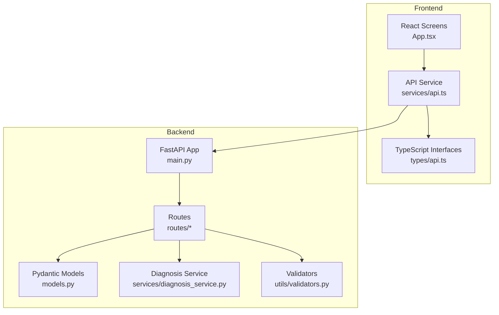
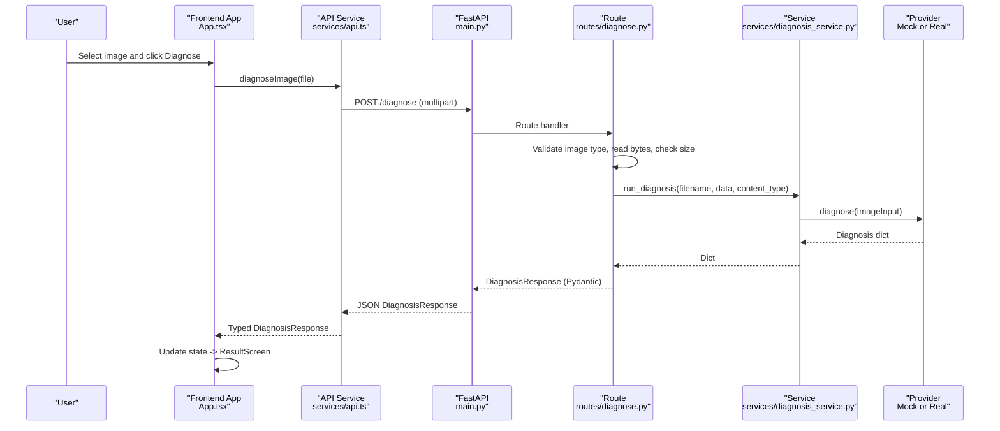
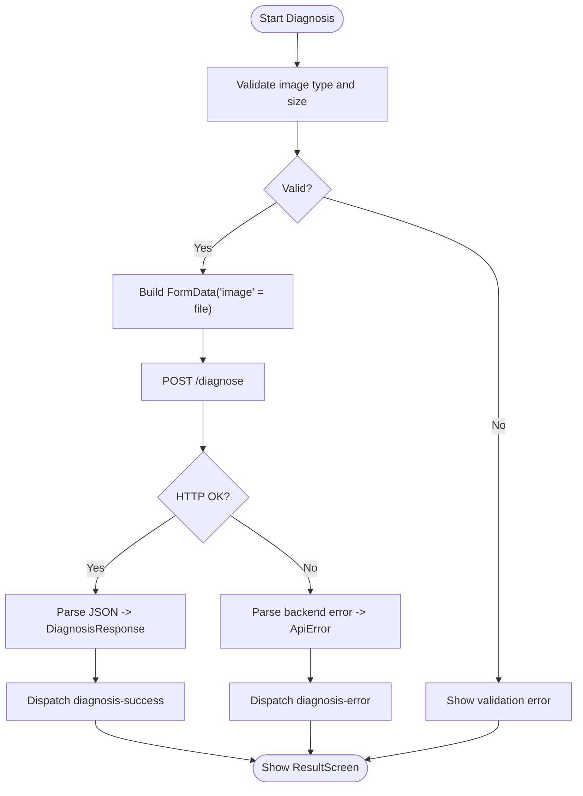
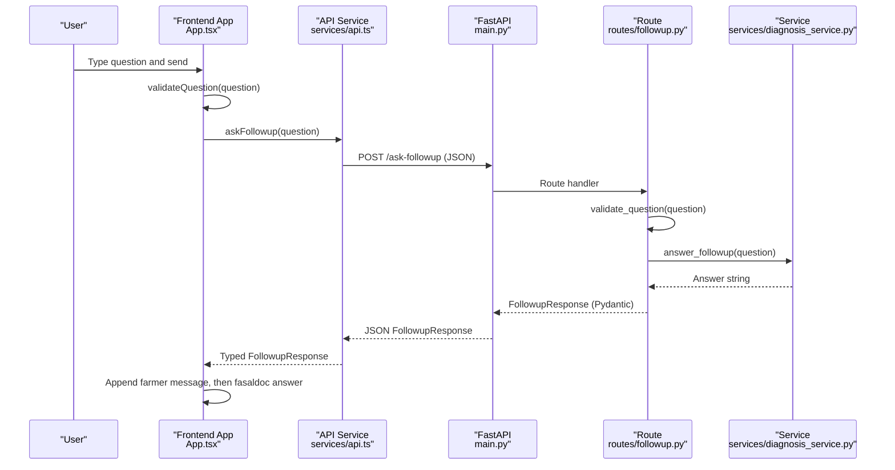
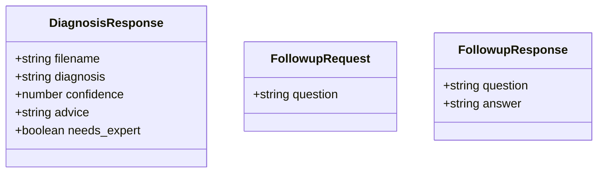
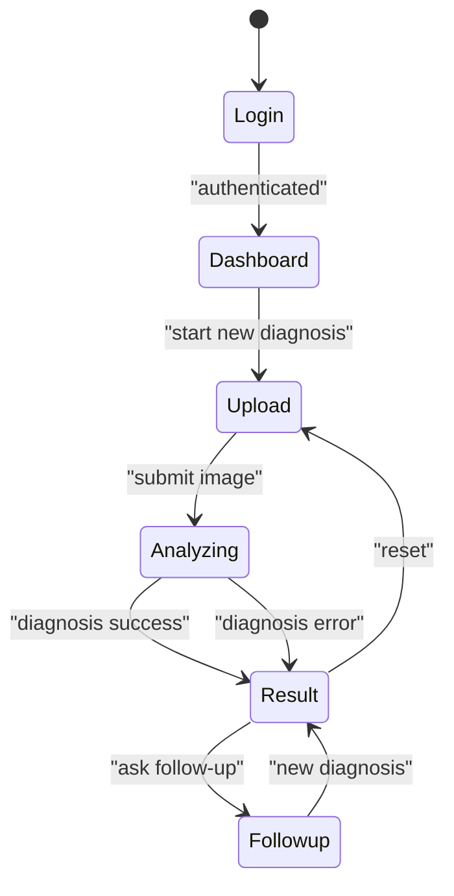
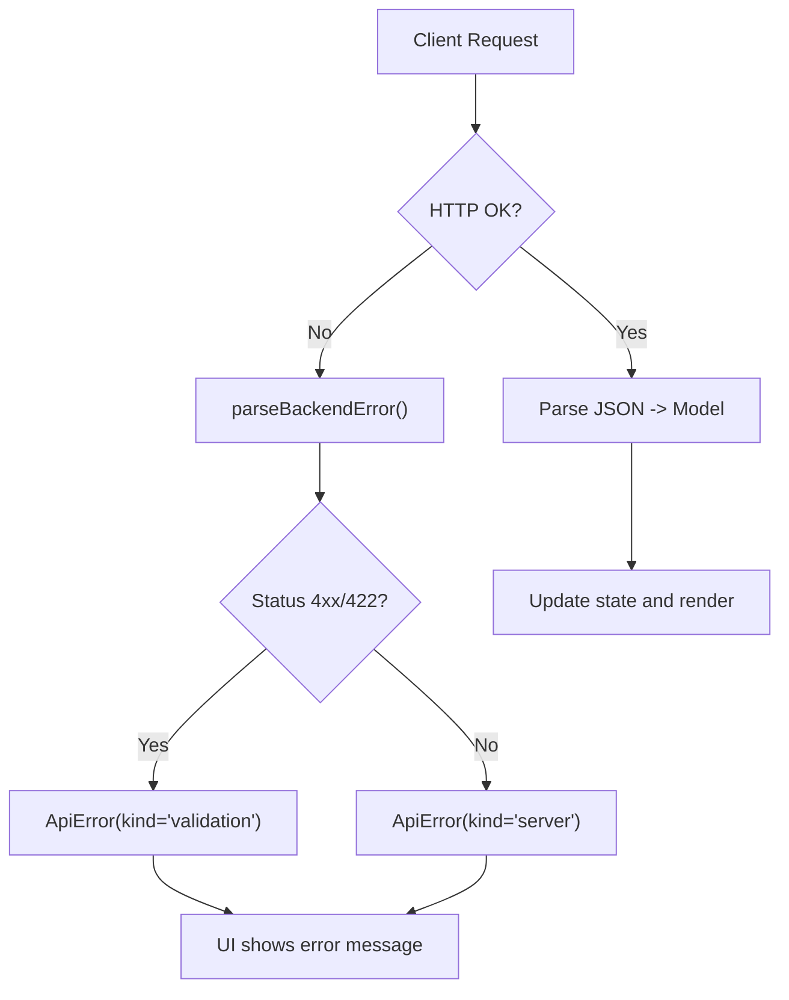
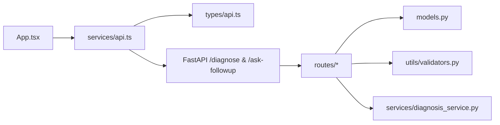

# Data Flow

<cite>
**Referenced Files in This Document**
- [main.py](file://backend/main.py)
- [models.py](file://backend/models.py)
- [diagnose.py](file://backend/routes/diagnose.py)
- [followup.py](file://backend/routes/followup.py)
- [diagnosis_service.py](file://backend/services/diagnosis_service.py)
- [validators.py](file://backend/utils/validators.py)
- [api.ts](file://frontend/src/services/api.ts)
- [api.ts (types)](file://frontend/src/types/api.ts)
- [App.tsx](file://frontend/src/App.tsx)
- [UploadScreen.tsx](file://frontend/src/pages/UploadScreen.tsx)
- [ImageUploader.tsx](file://frontend/src/components/ImageUploader.tsx)
- [ResultScreen.tsx](file://frontend/src/pages/ResultScreen.tsx)
- [FollowUpScreen.tsx](file://frontend/src/pages/FollowUpScreen.tsx)
- [FollowUpChat.tsx](file://frontend/src/components/FollowUpChat.tsx)
</cite>

## Table of Contents
1. Introduction
2. Project Structure
3. Core Components
4. Architecture Overview
5. Detailed Component Analysis
6. Dependency Analysis
7. Performance Considerations
8. Troubleshooting Guide
9. Conclusion

## Introduction
This document describes the complete request-response lifecycle for FasalDoc, from image upload to diagnosis results and follow-up conversations. It explains how data is validated and transformed across layers, how Pydantic models define backend contracts mirrored by TypeScript interfaces on the frontend, and how state is managed in React to keep UI components synchronized with API responses. It also includes sequence diagrams for typical workflows: disease diagnosis and follow-up Q&A.

## Project Structure
FasalDoc is split into a FastAPI backend and a React + TypeScript frontend. The backend exposes two primary endpoints:
- POST /diagnose: Accepts an image file and returns a diagnosis result.
- POST /ask-followup: Accepts a question and returns an assistant answer.

The frontend centralizes API calls, performs client-side validation, manages application state via useReducer, and renders screens that reflect the current flow step.

**Diagram sources**
- [main.py:9-38](file://backend/main.py#L9-L38)
- [diagnose.py:10-59](file://backend/routes/diagnose.py#L10-L59)
- [followup.py:7-40](file://backend/routes/followup.py#L7-L40)
- [models.py:10-58](file://backend/models.py#L10-L58)
- [diagnosis_service.py:31-128](file://backend/services/diagnosis_service.py#L31-L128)
- [validators.py:1-19](file://backend/utils/validators.py#L1-L19)
- [api.ts:11-99](file://frontend/src/services/api.ts#L11-L99)
- [api.ts (types):1-26](file://frontend/src/types/api.ts#L1-L26)
- [App.tsx:135-336](file://frontend/src/App.tsx#L135-L336)

**Section sources**
- [main.py:9-38](file://backend/main.py#L9-L38)
- [api.ts:11-99](file://frontend/src/services/api.ts#L11-L99)
- [App.tsx:135-336](file://frontend/src/App.tsx#L135-L336)

## Core Components
- Backend contract models: DiagnosisResponse, FollowupRequest, FollowupResponse defined with Pydantic v2. These enforce field presence, types, and constraints (e.g., confidence between 0 and 1).
- Validation utilities: Allowed image MIME types and size limits; question non-empty checks.
- Route handlers: POST /diagnose validates image type, reads bytes, enforces size, delegates to service; POST /ask-followup validates question, delegates to service.
- Service layer: Provider abstraction with a mock fallback when no AI credentials are configured; provides diagnose and answer_followup methods.
- Frontend API service: Centralized fetch wrappers with typed responses, error parsing, and shared validation constants mirroring backend rules.
- Frontend state: A single reducer-driven FlowState tracks screen navigation, selected file, preview URL, diagnosis, messages, sending status, and errors.

Key responsibilities and interactions:
- Image upload path: UI selects file -> client validation -> multipart POST /diagnose -> route-level validation -> service provider -> response model serialization -> UI updates.
- Follow-up path: UI composes question -> client validation -> JSON POST /ask-followup -> route-level validation -> service provider -> response model serialization -> UI appends chat message.

**Section sources**
- [models.py:10-58](file://backend/models.py#L10-L58)
- [validators.py:1-19](file://backend/utils/validators.py#L1-L19)
- [diagnose.py:13-59](file://backend/routes/diagnose.py#L13-L59)
- [followup.py:10-40](file://backend/routes/followup.py#L10-L40)
- [diagnosis_service.py:31-128](file://backend/services/diagnosis_service.py#L31-L128)
- [api.ts:28-99](file://frontend/src/services/api.ts#L28-L99)
- [App.tsx:31-133](file://frontend/src/App.tsx#L31-L133)

## Architecture Overview
The system follows a layered architecture:
- Presentation layer (React screens) handles user input and displays results.
- Application layer (useReducer state) orchestrates flows and coordinates API calls.
- Integration layer (frontend services) encapsulates HTTP requests and error handling.
- API layer (FastAPI routes) validates inputs and delegates to business logic.
- Domain layer (service provider) implements diagnosis and follow-up logic with a pluggable provider strategy.
- Contracts (Pydantic models and TypeScript interfaces) ensure consistent data shapes across the boundary.

**Diagram sources**
- [App.tsx:187-208](file://frontend/src/App.tsx#L187-L208)
- [api.ts:64-77](file://frontend/src/services/api.ts#L64-L77)
- [main.py:37-38](file://backend/main.py#L37-L38)
- [diagnose.py:13-59](file://backend/routes/diagnose.py#L13-L59)
- [diagnosis_service.py:116-124](file://backend/services/diagnosis_service.py#L116-L124)
- [models.py:10-31](file://backend/models.py#L10-L31)

## Detailed Component Analysis

### Image Upload and Diagnosis Workflow
- Client-side validation:
  - Allowed types and size limits mirror backend validators.
  - Errors mapped to user-friendly messages.
- Request construction:
  - Multipart form with field name "image".
- Backend processing:
  - Type check, empty payload check, size limit enforcement.
  - Delegation to service provider which returns a dictionary conforming to DiagnosisResponse.
- Response handling:
  - FastAPI serializes to JSON using Pydantic.
  - Frontend parses into typed DiagnosisResponse and updates state to show ResultScreen.

**Diagram sources**
- [api.ts:28-39](file://frontend/src/services/api.ts#L28-L39)
- [api.ts:64-77](file://frontend/src/services/api.ts#L64-L77)
- [diagnose.py:21-43](file://backend/routes/diagnose.py#L21-L43)
- [App.tsx:187-208](file://frontend/src/App.tsx#L187-L208)

**Section sources**
- [api.ts:28-39](file://frontend/src/services/api.ts#L28-L39)
- [api.ts:64-77](file://frontend/src/services/api.ts#L64-L77)
- [diagnose.py:21-59](file://backend/routes/diagnose.py#L21-L59)
- [App.tsx:187-208](file://frontend/src/App.tsx#L187-L208)

### Follow-Up Conversation Workflow
- Client-side validation:
  - Non-empty question after trimming.
- Request construction:
  - JSON body { question }.
- Backend processing:
  - Question validation, delegation to service provider.
- Response handling:
  - FastAPI serializes FollowupResponse.
  - Frontend appends farmer and fasaldoc messages to state.

**Diagram sources**
- [api.ts:41-44](file://frontend/src/services/api.ts#L41-L44)
- [api.ts:84-98](file://frontend/src/services/api.ts#L84-L98)
- [followup.py:10-40](file://backend/routes/followup.py#L10-L40)
- [diagnosis_service.py:126-128](file://backend/services/diagnosis_service.py#L126-L128)
- [models.py:34-58](file://backend/models.py#L34-L58)
- [App.tsx:227-237](file://frontend/src/App.tsx#L227-L237)

**Section sources**
- [api.ts:41-44](file://frontend/src/services/api.ts#L41-L44)
- [api.ts:84-98](file://frontend/src/services/api.ts#L84-L98)
- [followup.py:10-40](file://backend/routes/followup.py#L10-L40)
- [diagnosis_service.py:126-128](file://backend/services/diagnosis_service.py#L126-L128)
- [models.py:34-58](file://backend/models.py#L34-L58)
- [App.tsx:227-237](file://frontend/src/App.tsx#L227-L237)

### Data Models and Validation Rules
- Backend Pydantic models:
  - DiagnosisResponse: filename, diagnosis, confidence (0..1), advice, needs_expert.
  - FollowupRequest: question (non-empty).
  - FollowupResponse: question echo, answer.
- Frontend TypeScript interfaces:
  - Mirrors backend models exactly to maintain contract parity.
- Validation layers:
  - Frontend: Allowed image types and size; question non-empty.
  - Backend: Image type and size; question non-empty; Pydantic field constraints.

**Diagram sources**
- [models.py:10-58](file://backend/models.py#L10-L58)
- [api.ts (types):6-25](file://frontend/src/types/api.ts#L6-L25)

**Section sources**
- [models.py:10-58](file://backend/models.py#L10-L58)
- [api.ts (types):6-25](file://frontend/src/types/api.ts#L6-L25)
- [validators.py:1-19](file://backend/utils/validators.py#L1-L19)
- [api.ts:28-44](file://frontend/src/services/api.ts#L28-L44)

### State Management and UI Synchronization
- Single source of truth: FlowState in App.tsx via useReducer.
- Key state fields:
  - screen: controls active page.
  - file/previewUrl: uploaded image and preview.
  - diagnosis: latest result.
  - messages/sending/sendError: follow-up conversation state.
- Synchronization points:
  - On diagnosis success: set screen to result and store diagnosis.
  - On follow-up send: append farmer message immediately, then append fasaldoc answer on success; show error if network/validation/server issues occur.
  - Memory management: revoke previous preview URLs to avoid leaks.

**Diagram sources**
- [App.tsx:31-133](file://frontend/src/App.tsx#L31-L133)
- [App.tsx:187-237](file://frontend/src/App.tsx#L187-L237)

**Section sources**
- [App.tsx:31-133](file://frontend/src/App.tsx#L31-L133)
- [App.tsx:187-237](file://frontend/src/App.tsx#L187-L237)

### Error Handling Strategies
- Frontend:
  - Network errors: caught during fetch, converted to ApiError with kind 'network'.
  - Validation errors: parsed from backend detail, mapped to user messages.
  - Server errors: generic server error message.
- Backend:
  - Route-level validation raises HTTPException for invalid inputs.
  - Service exceptions are caught and translated to 500 with safe messages.
  - Provider selection falls back to mock when real AI is unavailable.

**Diagram sources**
- [api.ts:46-58](file://frontend/src/services/api.ts#L46-L58)
- [api.ts:64-98](file://frontend/src/services/api.ts#L64-L98)
- [diagnose.py:21-59](file://backend/routes/diagnose.py#L21-L59)
- [followup.py:18-34](file://backend/routes/followup.py#L18-L34)

**Section sources**
- [api.ts:46-58](file://frontend/src/services/api.ts#L46-L58)
- [diagnose.py:21-59](file://backend/routes/diagnose.py#L21-L59)
- [followup.py:18-34](file://backend/routes/followup.py#L18-L34)

## Dependency Analysis
- Frontend dependencies:
  - App.tsx depends on services/api.ts for all API calls and on types/api.ts for typing.
  - Screens depend on components for UI rendering and i18n context for labels.
- Backend dependencies:
  - main.py mounts routers and CORS middleware.
  - Routes depend on models, validators, and services.
  - Services abstract provider implementation, enabling mock or real AI integration.

**Diagram sources**
- [App.tsx:1-27](file://frontend/src/App.tsx#L1-L27)
- [api.ts:1-99](file://frontend/src/services/api.ts#L1-L99)
- [main.py:9-38](file://backend/main.py#L9-L38)
- [diagnose.py:1-59](file://backend/routes/diagnose.py#L1-L59)
- [followup.py:1-40](file://backend/routes/followup.py#L1-L40)
- [models.py:1-58](file://backend/models.py#L1-L58)
- [validators.py:1-19](file://backend/utils/validators.py#L1-L19)
- [diagnosis_service.py:1-128](file://backend/services/diagnosis_service.py#L1-L128)

**Section sources**
- [App.tsx:1-27](file://frontend/src/App.tsx#L1-L27)
- [api.ts:1-99](file://frontend/src/services/api.ts#L1-L99)
- [main.py:9-38](file://backend/main.py#L9-L38)
- [diagnose.py:1-59](file://backend/routes/diagnose.py#L1-L59)
- [followup.py:1-40](file://backend/routes/followup.py#L1-L40)
- [models.py:1-58](file://backend/models.py#L1-L58)
- [validators.py:1-19](file://backend/utils/validators.py#L1-L19)
- [diagnosis_service.py:1-128](file://backend/services/diagnosis_service.py#L1-L128)

## Performance Considerations
- Avoid large payloads: Enforce 10 MB image size at both frontend and backend to prevent unnecessary transfers.
- Early validation: Frontend validation reduces failed requests and improves UX.
- Provider caching: Backend caches the active provider instance to avoid repeated configuration checks.
- Memory hygiene: Revoke previous preview URLs to free memory when switching images.
- Minimal state mutations: Use immutable updates in reducer to optimize re-renders.

[No sources needed since this section provides general guidance]

## Troubleshooting Guide
Common issues and resolutions:
- Invalid image type or too large:
  - Frontend rejects before upload; backend also validates and returns 400 with detail.
  - Check allowed types and size constants in both layers.
- Empty uploads:
  - Backend detects empty bytes and returns 400.
- Network failures:
  - Frontend catches fetch errors and surfaces a network error message.
- Server errors:
  - Backend wraps unexpected exceptions into 500 with safe messages; frontend maps to generic server error.
- Follow-up question empty:
  - Both frontend and backend reject empty questions; ensure non-empty trimmed input.

**Section sources**
- [api.ts:28-44](file://frontend/src/services/api.ts#L28-L44)
- [api.ts:46-58](file://frontend/src/services/api.ts#L46-L58)
- [diagnose.py:21-43](file://backend/routes/diagnose.py#L21-L43)
- [followup.py:18-23](file://backend/routes/followup.py#L18-L23)

## Conclusion
FasalDoc’s data flow is designed around clear contracts and layered validation. Pydantic models and TypeScript interfaces keep the backend and frontend aligned. The service layer abstracts AI integration, allowing seamless fallback to offline behavior. Frontend state management ensures predictable UI transitions and robust error handling. This structure supports reliable diagnosis and follow-up workflows while remaining extensible for future enhancements.

[No sources needed since this section summarizes without analyzing specific files]