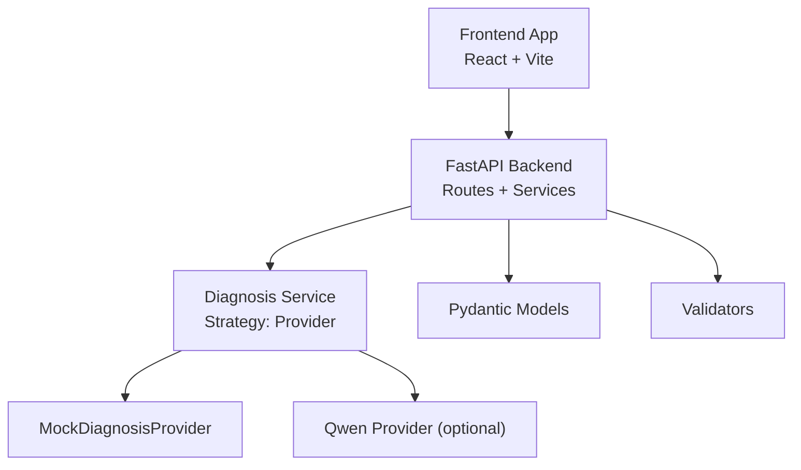
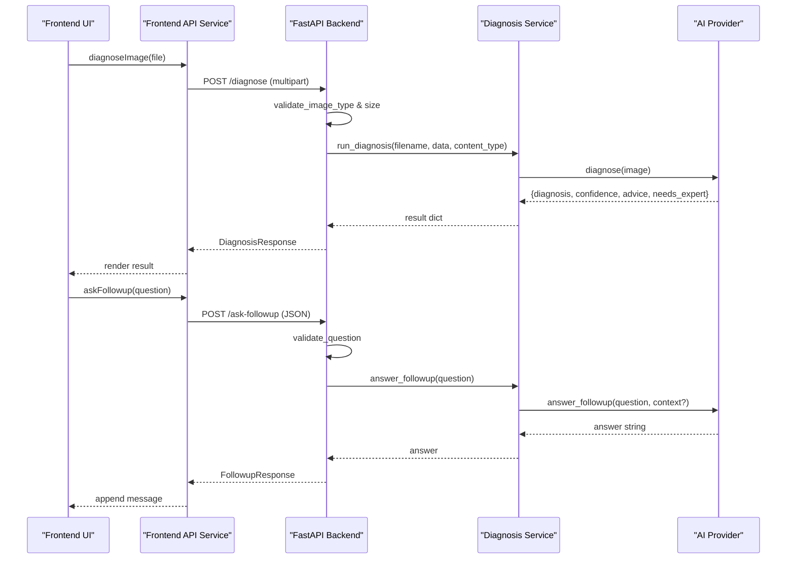
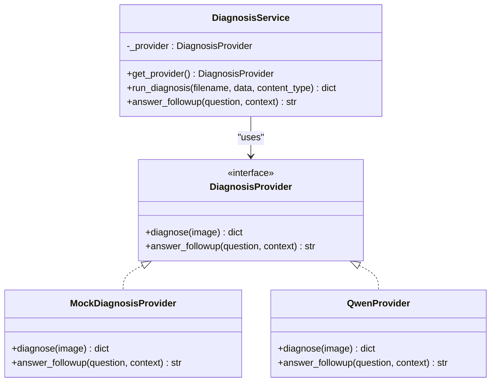
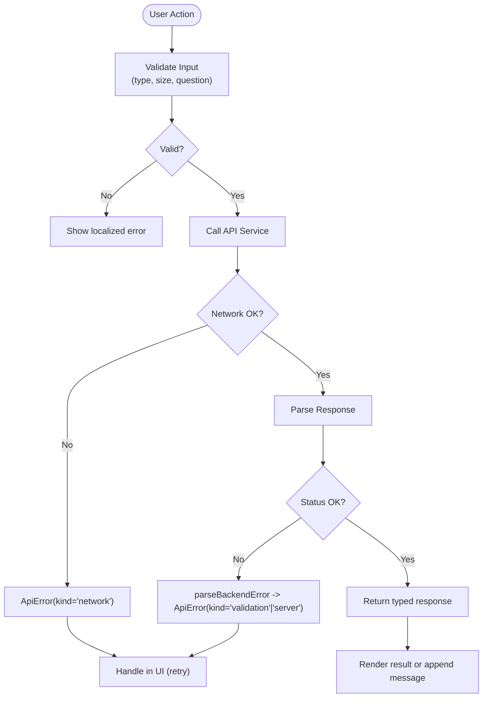
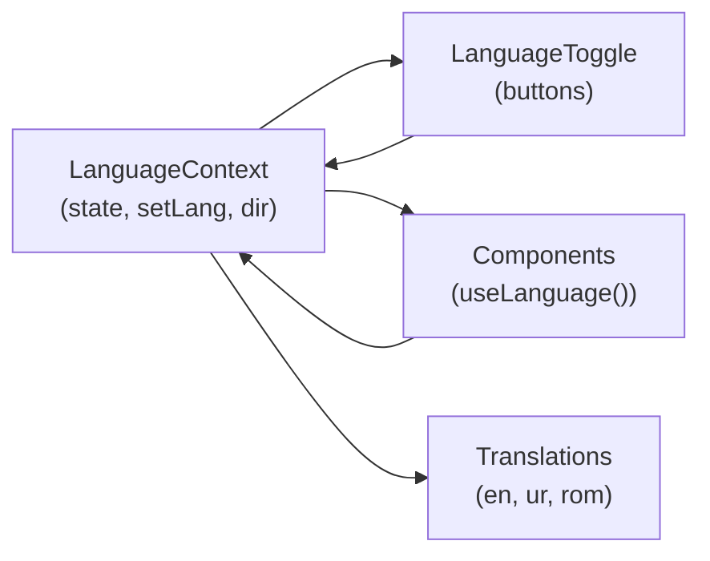
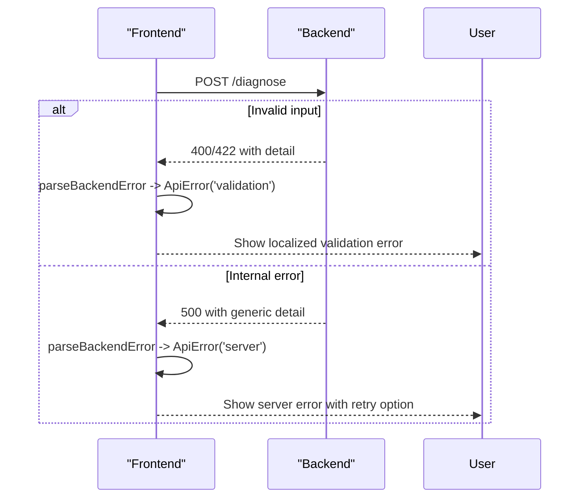
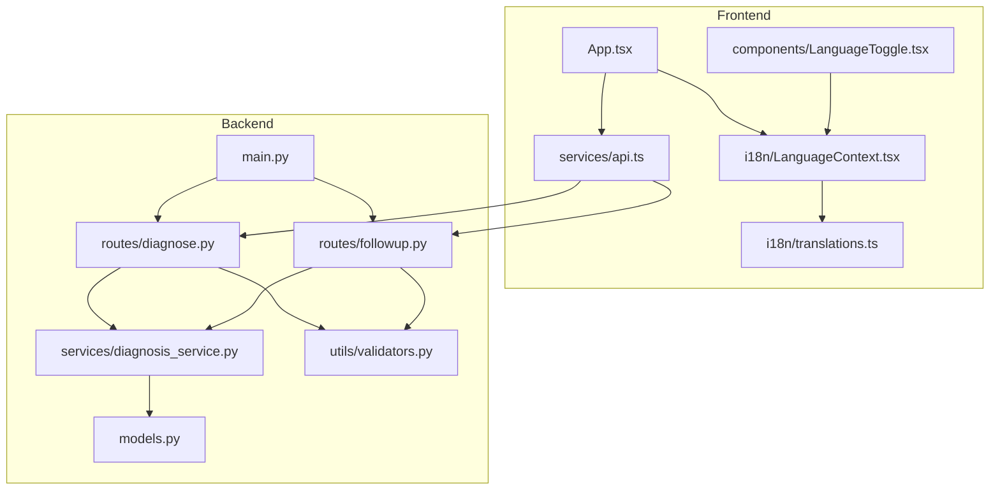

# Integration Patterns

<cite>
**Referenced Files in This Document**
- [backend/main.py](file://backend/main.py)
- [backend/routes/diagnose.py](file://backend/routes/diagnose.py)
- [backend/routes/followup.py](file://backend/routes/followup.py)
- [backend/services/diagnosis_service.py](file://backend/services/diagnosis_service.py)
- [backend/models.py](file://backend/models.py)
- [backend/utils/validators.py](file://backend/utils/validators.py)
- [frontend/src/services/api.ts](file://frontend/src/services/api.ts)
- [frontend/src/types/api.ts](file://frontend/src/types/api.ts)
- [frontend/src/i18n/LanguageContext.tsx](file://frontend/src/i18n/LanguageContext.tsx)
- [frontend/src/i18n/translations.ts](file://frontend/src/i18n/translations.ts)
- [frontend/src/components/LanguageToggle.tsx](file://frontend/src/components/LanguageToggle.tsx)
- [frontend/src/App.tsx](file://frontend/src/App.tsx)
</cite>

## Table of Contents
1. [Introduction](#introduction)
2. [Project Structure](#project-structure)
3. [Core Components](#core-components)
4. [Architecture Overview](#architecture-overview)
5. [Detailed Component Analysis](#detailed-component-analysis)
6. [Dependency Analysis](#dependency-analysis)
7. [Performance Considerations](#performance-considerations)
8. [Troubleshooting Guide](#troubleshooting-guide)
9. [Conclusion](#conclusion)
10. [Appendices](#appendices)

## Introduction
This document explains FasalDoc’s integration patterns across the backend and frontend, focusing on:
- Strategy pattern for AI providers (mock vs real) enabling seamless switching without changing routes or UI.
- RESTful API patterns used by the frontend to communicate with the FastAPI backend.
- Internationalization architecture supporting multiple languages with dynamic switching.
- Error handling and retry strategies for external API calls.
- Best practices and examples for adding new integrations while maintaining loose coupling.

## Project Structure
The system is split into a FastAPI backend and a React frontend:
- Backend exposes two primary endpoints: image-based diagnosis and follow-up Q&A. It uses a service layer that abstracts the AI provider behind a stable interface.
- Frontend centralizes API calls in a single service module, mirrors backend models as TypeScript types, and provides an i18n context for language management.

**Diagram sources**
- [backend/main.py:1-45](file://backend/main.py#L1-L45)
- [backend/routes/diagnose.py:1-59](file://backend/routes/diagnose.py#L1-L59)
- [backend/routes/followup.py:1-40](file://backend/routes/followup.py#L1-L40)
- [backend/services/diagnosis_service.py:1-128](file://backend/services/diagnosis_service.py#L1-L128)
- [backend/models.py:1-58](file://backend/models.py#L1-L58)
- [backend/utils/validators.py:1-19](file://backend/utils/validators.py#L1-L19)
- [frontend/src/services/api.ts:1-99](file://frontend/src/services/api.ts#L1-L99)

**Section sources**
- [backend/main.py:1-45](file://backend/main.py#L1-L45)
- [frontend/src/services/api.ts:1-99](file://frontend/src/services/api.ts#L1-L99)

## Core Components
- Strategy Pattern for AI Providers: A stable protocol defines how diagnosis and follow-up are performed. The service selects between a mock provider (always available) and a real provider (when credentials exist). Routes call service helpers without caring about implementation details.
- REST Endpoints: Two endpoints handle core flows:
  - POST /diagnose: Accepts multipart image upload, validates input, delegates to service, returns structured diagnosis response.
  - POST /ask-followup: Accepts JSON question, validates input, delegates to service, returns answer.
- Frontend API Service: Centralized client functions for both endpoints, consistent error parsing, and type-safe responses mirroring backend contracts.
- Internationalization: Contextual language state with persistence, directionality support, and translation resources for English, Urdu, and Roman Urdu.

**Section sources**
- [backend/services/diagnosis_service.py:40-128](file://backend/services/diagnosis_service.py#L40-L128)
- [backend/routes/diagnose.py:13-59](file://backend/routes/diagnose.py#L13-L59)
- [backend/routes/followup.py:10-40](file://backend/routes/followup.py#L10-L40)
- [frontend/src/services/api.ts:60-99](file://frontend/src/services/api.ts#L60-L99)
- [frontend/src/i18n/LanguageContext.tsx:1-67](file://frontend/src/i18n/LanguageContext.tsx#L1-L67)

## Architecture Overview
The end-to-end flow demonstrates how the frontend communicates with the backend and how the backend switches providers based on configuration.

**Diagram sources**
- [frontend/src/services/api.ts:60-99](file://frontend/src/services/api.ts#L60-L99)
- [backend/routes/diagnose.py:13-59](file://backend/routes/diagnose.py#L13-L59)
- [backend/routes/followup.py:10-40](file://backend/routes/followup.py#L10-L40)
- [backend/services/diagnosis_service.py:116-128](file://backend/services/diagnosis_service.py#L116-L128)

## Detailed Component Analysis

### Strategy Pattern for AI Providers
FasalDoc uses a strategy pattern to decouple route logic from AI implementation:
- Protocol defines a stable interface for diagnosis and follow-up.
- Mock provider implements the protocol and returns deterministic responses for offline use.
- Real provider can be added later; when environment variables indicate credentials, the service builds and caches the real provider; otherwise it falls back to the mock.
- Routes call service helpers without knowing which provider is active.

**Diagram sources**
- [backend/services/diagnosis_service.py:40-128](file://backend/services/diagnosis_service.py#L40-L128)

**Section sources**
- [backend/services/diagnosis_service.py:40-128](file://backend/services/diagnosis_service.py#L40-L128)

### RESTful API Integration Patterns (Frontend to Backend)
- Centralized API service encapsulates all HTTP calls, ensuring no component directly invokes fetch.
- Input validation mirrors backend constraints to provide immediate UX feedback.
- Errors are parsed into typed ApiError instances with categories (network, validation, server), enabling consistent user messaging and retry behavior.
- Endpoints:
  - POST /diagnose: Multipart form with field name "image".
  - POST /ask-followup: JSON body with question field.

**Diagram sources**
- [frontend/src/services/api.ts:46-99](file://frontend/src/services/api.ts#L46-L99)
- [backend/routes/diagnose.py:21-59](file://backend/routes/diagnose.py#L21-L59)
- [backend/routes/followup.py:18-34](file://backend/routes/followup.py#L18-L34)

**Section sources**
- [frontend/src/services/api.ts:1-99](file://frontend/src/services/api.ts#L1-L99)
- [backend/routes/diagnose.py:1-59](file://backend/routes/diagnose.py#L1-L59)
- [backend/routes/followup.py:1-40](file://backend/routes/followup.py#L1-L40)

### Internationalization System Architecture
- LanguageContext manages current language, persists selection to localStorage, and applies directionality and CSS classes for RTL support.
- Translations object contains full text resources for supported languages.
- LanguageToggle component allows users to switch languages dynamically.
- All UI components consume translations via the context, ensuring consistent localization.

**Diagram sources**
- [frontend/src/i18n/LanguageContext.tsx:1-67](file://frontend/src/i18n/LanguageContext.tsx#L1-L67)
- [frontend/src/i18n/translations.ts:1-666](file://frontend/src/i18n/translations.ts#L1-L666)
- [frontend/src/components/LanguageToggle.tsx:1-28](file://frontend/src/components/LanguageToggle.tsx#L1-L28)

**Section sources**
- [frontend/src/i18n/LanguageContext.tsx:1-67](file://frontend/src/i18n/LanguageContext.tsx#L1-L67)
- [frontend/src/i18n/translations.ts:1-666](file://frontend/src/i18n/translations.ts#L1-L666)
- [frontend/src/components/LanguageToggle.tsx:1-28](file://frontend/src/components/LanguageToggle.tsx#L1-L28)

### Error Handling and Retry Mechanisms
- Backend:
  - Validates inputs early and raises HTTP exceptions for invalid requests.
  - Catches internal/AI errors and returns generic 500 messages to avoid leaking internals.
- Frontend:
  - Parses backend errors into typed ApiError with kind classification.
  - Displays localized messages and offers retry actions where appropriate.
  - Network failures are handled distinctly from validation/server errors.

**Diagram sources**
- [backend/routes/diagnose.py:21-59](file://backend/routes/diagnose.py#L21-L59)
- [backend/routes/followup.py:18-34](file://backend/routes/followup.py#L18-L34)
- [frontend/src/services/api.ts:46-99](file://frontend/src/services/api.ts#L46-L99)

**Section sources**
- [backend/routes/diagnose.py:21-59](file://backend/routes/diagnose.py#L21-L59)
- [backend/routes/followup.py:18-34](file://backend/routes/followup.py#L18-L34)
- [frontend/src/services/api.ts:46-99](file://frontend/src/services/api.ts#L46-L99)

### Adding New Integrations Following Established Patterns
To add a new AI provider or external service:
- Define a new provider implementing the existing protocol/interface so routes remain unchanged.
- Update provider selection logic to detect configuration (e.g., environment variables) and instantiate the new provider.
- Mirror any new request/response fields in backend Pydantic models and frontend TypeScript types to keep contracts synchronized.
- Add corresponding translations if user-facing strings change.
- Ensure validators cover new inputs and error handling remains consistent.

Examples:
- New AI provider: Implement the provider interface and integrate via the service’s provider builder.
- New endpoint: Create a route, define models, add validators, and expose a frontend API function mirroring the contract.

**Section sources**
- [backend/services/diagnosis_service.py:7-20](file://backend/services/diagnosis_service.py#L7-L20)
- [backend/services/diagnosis_service.py:80-105](file://backend/services/diagnosis_service.py#L80-L105)
- [backend/models.py:10-58](file://backend/models.py#L10-L58)
- [frontend/src/types/api.ts:1-26](file://frontend/src/types/api.ts#L1-L26)

## Dependency Analysis
The following diagram shows key dependencies among modules and files:

**Diagram sources**
- [frontend/src/App.tsx:1-336](file://frontend/src/App.tsx#L1-L336)
- [frontend/src/services/api.ts:1-99](file://frontend/src/services/api.ts#L1-L99)
- [frontend/src/i18n/LanguageContext.tsx:1-67](file://frontend/src/i18n/LanguageContext.tsx#L1-L67)
- [frontend/src/i18n/translations.ts:1-666](file://frontend/src/i18n/translations.ts#L1-L666)
- [frontend/src/components/LanguageToggle.tsx:1-28](file://frontend/src/components/LanguageToggle.tsx#L1-L28)
- [backend/main.py:1-45](file://backend/main.py#L1-L45)
- [backend/routes/diagnose.py:1-59](file://backend/routes/diagnose.py#L1-L59)
- [backend/routes/followup.py:1-40](file://backend/routes/followup.py#L1-L40)
- [backend/services/diagnosis_service.py:1-128](file://backend/services/diagnosis_service.py#L1-L128)
- [backend/models.py:1-58](file://backend/models.py#L1-L58)
- [backend/utils/validators.py:1-19](file://backend/utils/validators.py#L1-L19)

**Section sources**
- [backend/main.py:1-45](file://backend/main.py#L1-L45)
- [frontend/src/App.tsx:1-336](file://frontend/src/App.tsx#L1-L336)

## Performance Considerations
- Provider caching: The service caches the selected provider to avoid repeated construction overhead.
- Early validation: Both frontend and backend validate inputs before network calls to reduce unnecessary requests.
- Minimal payload: Only necessary fields are sent over the wire; context for follow-up is maintained in frontend state to avoid redundant payloads.
- Static assets: Keep translations and UI assets optimized; consider lazy-loading heavy screens like camera or voice features.

[No sources needed since this section provides general guidance]

## Troubleshooting Guide
Common issues and resolutions:
- Image upload rejected:
  - Ensure file type is JPEG, PNG, or WEBP and size under 10 MB.
  - Check frontend validation and backend validators for consistency.
- Network errors:
  - Verify API base URL configuration and CORS settings.
  - Confirm backend is running and accessible from the frontend origin.
- Server errors:
  - Inspect backend logs for exceptions during diagnosis or follow-up processing.
  - If using a real provider, ensure credentials are correctly configured; otherwise, the mock will be used automatically.
- Language not persisting:
  - Check browser storage permissions; fallback defaults to English if storage is unavailable.

**Section sources**
- [backend/routes/diagnose.py:21-59](file://backend/routes/diagnose.py#L21-L59)
- [backend/routes/followup.py:18-34](file://backend/routes/followup.py#L18-L34)
- [frontend/src/services/api.ts:46-99](file://frontend/src/services/api.ts#L46-L99)
- [frontend/src/i18n/LanguageContext.tsx:23-31](file://frontend/src/i18n/LanguageContext.tsx#L23-L31)

## Conclusion
FasalDoc employs clear integration patterns:
- Strategy pattern for AI providers enables easy switching between mock and real services without altering routes or UI.
- Centralized frontend API service ensures consistent communication with the backend, robust error handling, and type safety.
- Internationalization supports multiple languages with dynamic switching and persistent preferences.
- Validation and error handling are implemented consistently across layers to maintain reliability and user experience.
These patterns facilitate adding new integrations while preserving loose coupling and maintainability.

[No sources needed since this section summarizes without analyzing specific files]

## Appendices

### API Contracts Summary
- POST /diagnose
  - Request: multipart/form-data with field "image"
  - Response: DiagnosisResponse (filename, diagnosis, confidence, advice, needs_expert)
- POST /ask-followup
  - Request: JSON { question }
  - Response: FollowupResponse { question, answer }

**Section sources**
- [backend/models.py:10-58](file://backend/models.py#L10-L58)
- [frontend/src/types/api.ts:1-26](file://frontend/src/types/api.ts#L1-L26)