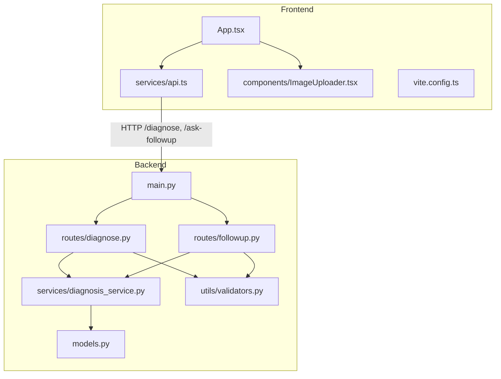
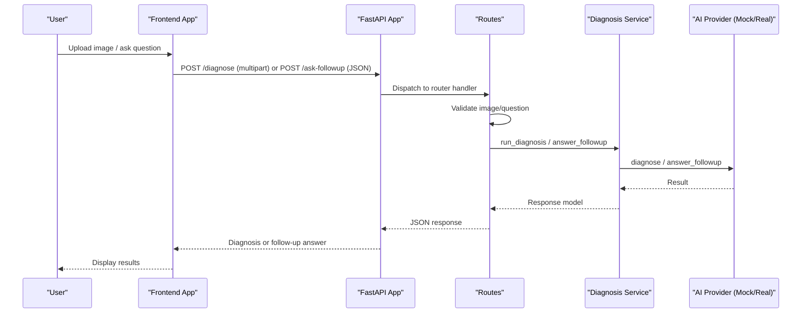
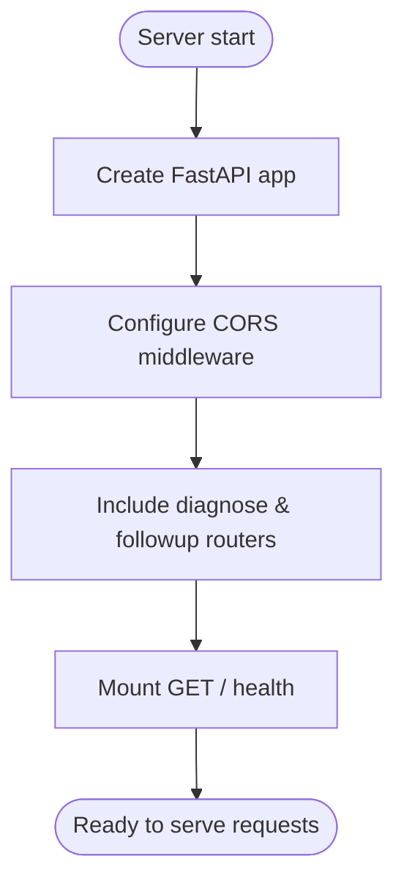
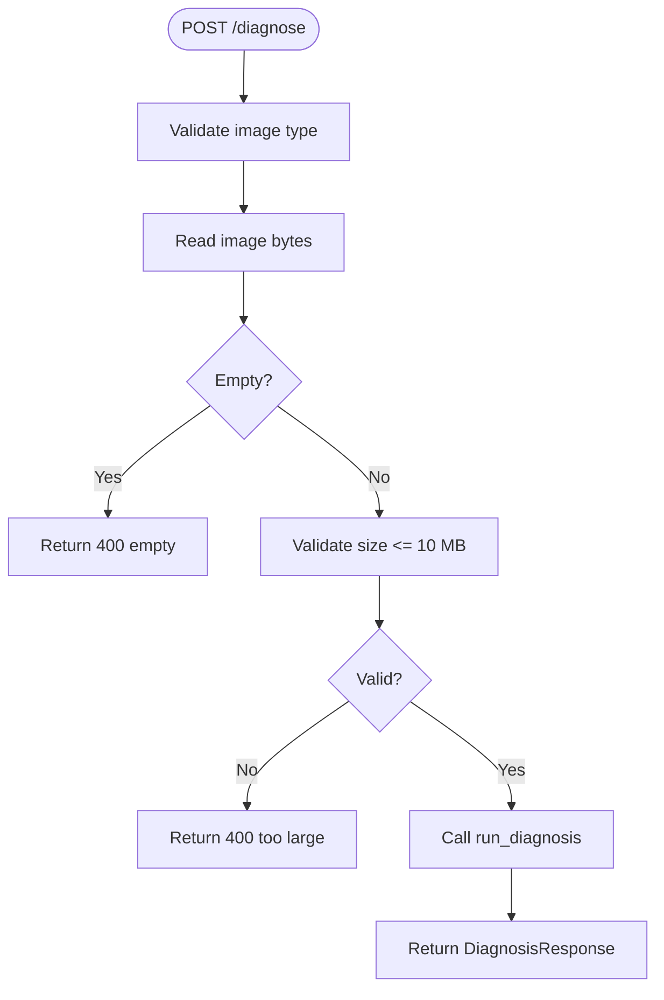
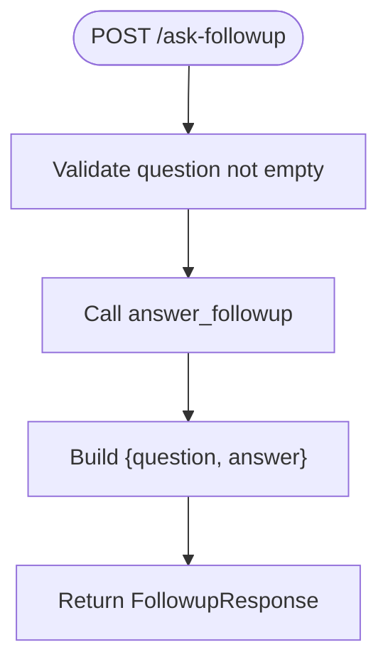
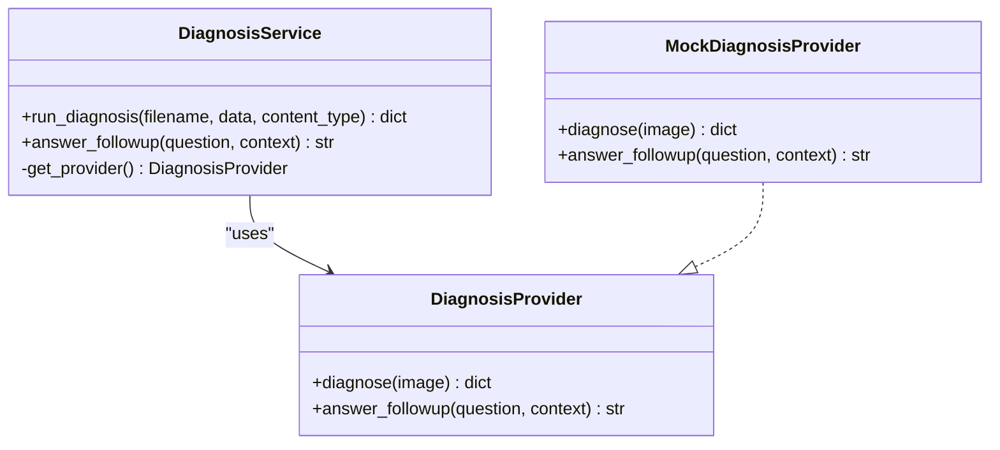
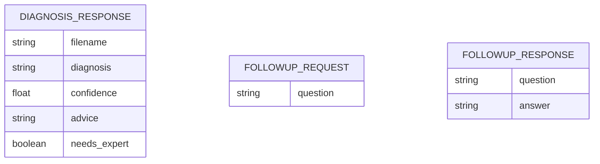
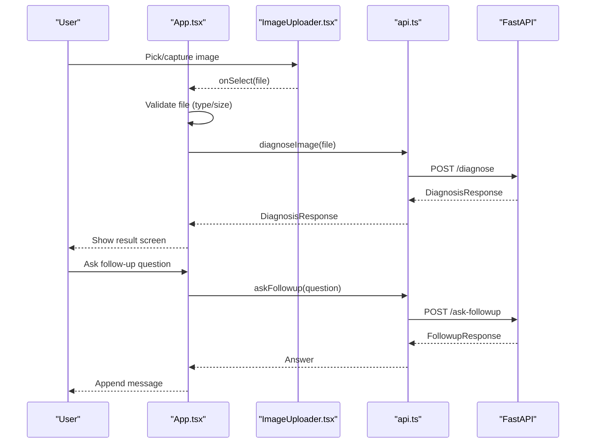
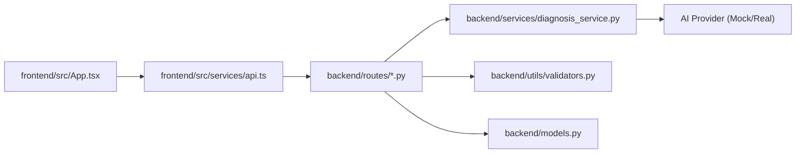
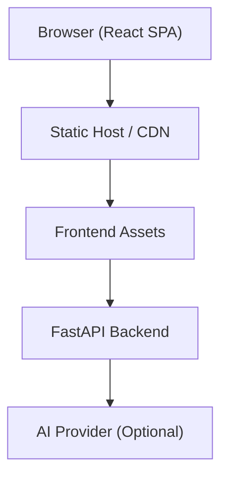

# System Design

<cite>
**Referenced Files in This Document**
- [backend/main.py](file://backend/main.py)
- [backend/routes/diagnose.py](file://backend/routes/diagnose.py)
- [backend/routes/followup.py](file://backend/routes/followup.py)
- [backend/services/diagnosis_service.py](file://backend/services/diagnosis_service.py)
- [backend/utils/validators.py](file://backend/utils/validators.py)
- [backend/models.py](file://backend/models.py)
- [frontend/src/App.tsx](file://frontend/src/App.tsx)
- [frontend/src/services/api.ts](file://frontend/src/services/api.ts)
- [frontend/src/types/api.ts](file://frontend/src/types/api.ts)
- [frontend/src/components/ImageUploader.tsx](file://frontend/src/components/ImageUploader.tsx)
- [frontend/vite.config.ts](file://frontend/vite.config.ts)
- [requirements.txt](file://requirements.txt)
- [README.md](file://README.md)
- [demo_backup/render.yaml](file://demo_backup/render.yaml)
</cite>

## Table of Contents
1. [Introduction](#introduction)
2. [Project Structure](#project-structure)
3. [Core Components](#core-components)
4. [Architecture Overview](#architecture-overview)
5. [Detailed Component Analysis](#detailed-component-analysis)
6. [Dependency Analysis](#dependency-analysis)
7. [Performance Considerations](#performance-considerations)
8. [Troubleshooting Guide](#troubleshooting-guide)
9. [Conclusion](#conclusion)
10. [Appendices](#appendices)

## Introduction
FasalDoc is a full-stack application that provides crop-disease diagnosis and follow-up Q&A. The frontend is a React + Vite single-page application, and the backend is a FastAPI service. The system currently runs fully offline using mock AI responses until the real AI provider (Qwen/Alibaba Cloud DashScope) is configured via environment variables. The design emphasizes clear separation between UI, API routes, validation, and the AI service layer, enabling easy integration of external AI without changing route code.

## Project Structure
The repository is organized into two primary services:
- Backend (FastAPI): routes, models, service layer, validators, and configuration for CORS and environment-driven AI provider selection.
- Frontend (React + Vite): pages, components, API client, types mirroring backend contracts, and local authentication flow.

**Diagram sources**
- [frontend/src/App.tsx:1-336](file://frontend/src/App.tsx#L1-L336)
- [frontend/src/services/api.ts:1-99](file://frontend/src/services/api.ts#L1-L99)
- [frontend/src/components/ImageUploader.tsx:1-173](file://frontend/src/components/ImageUploader.tsx#L1-L173)
- [frontend/vite.config.ts:1-10](file://frontend/vite.config.ts#L1-L10)
- [backend/main.py:1-45](file://backend/main.py#L1-L45)
- [backend/routes/diagnose.py:1-59](file://backend/routes/diagnose.py#L1-L59)
- [backend/routes/followup.py:1-40](file://backend/routes/followup.py#L1-L40)
- [backend/services/diagnosis_service.py:1-128](file://backend/services/diagnosis_service.py#L1-L128)
- [backend/utils/validators.py:1-19](file://backend/utils/validators.py#L1-L19)
- [backend/models.py:1-58](file://backend/models.py#L1-L58)

**Section sources**
- [README.md:1-106](file://README.md#L1-L106)
- [backend/main.py:1-45](file://backend/main.py#L1-L45)
- [frontend/src/App.tsx:1-336](file://frontend/src/App.tsx#L1-L336)

## Core Components
- FastAPI Application: Configures CORS, mounts routers, exposes health endpoint.
- Routes:
  - Diagnose: accepts multipart image upload, validates type/size, delegates to service.
  - Follow-up: validates question text, delegates to service.
- Service Layer:
  - Provider abstraction with a mock implementation and optional real AI provider selected by environment.
  - Exposes run_diagnosis and answer_followup used by routes.
- Models: Pydantic v2 request/response contracts mirrored by frontend types.
- Validators: Shared constraints for image types/sizes and question content.
- Frontend:
  - App orchestrates screens and state transitions.
  - API client centralizes HTTP calls, error mapping, and input validation.
  - Image uploader supports gallery, camera capture, drag-and-drop, and preview.

**Section sources**
- [backend/main.py:1-45](file://backend/main.py#L1-L45)
- [backend/routes/diagnose.py:1-59](file://backend/routes/diagnose.py#L1-L59)
- [backend/routes/followup.py:1-40](file://backend/routes/followup.py#L1-L40)
- [backend/services/diagnosis_service.py:1-128](file://backend/services/diagnosis_service.py#L1-L128)
- [backend/utils/validators.py:1-19](file://backend/utils/validators.py#L1-L19)
- [backend/models.py:1-58](file://backend/models.py#L1-L58)
- [frontend/src/App.tsx:1-336](file://frontend/src/App.tsx#L1-L336)
- [frontend/src/services/api.ts:1-99](file://frontend/src/services/api.ts#L1-L99)
- [frontend/src/types/api.ts:1-26](file://frontend/src/types/api.ts#L1-L26)
- [frontend/src/components/ImageUploader.tsx:1-173](file://frontend/src/components/ImageUploader.tsx#L1-L173)

## Architecture Overview
The system follows a layered architecture:
- Client (React/Vite) interacts with the FastAPI backend over HTTP.
- Routes validate inputs and delegate to the service layer.
- Service layer abstracts AI provider selection based on environment variables; falls back to mock when credentials are absent or provider construction fails.
- Models define strict contracts ensuring consistent data exchange between frontend and backend.

**Diagram sources**
- [frontend/src/App.tsx:187-237](file://frontend/src/App.tsx#L187-L237)
- [frontend/src/services/api.ts:60-99](file://frontend/src/services/api.ts#L60-L99)
- [backend/routes/diagnose.py:13-59](file://backend/routes/diagnose.py#L13-L59)
- [backend/routes/followup.py:10-40](file://backend/routes/followup.py#L10-L40)
- [backend/services/diagnosis_service.py:116-128](file://backend/services/diagnosis_service.py#L116-L128)

## Detailed Component Analysis

### Backend FastAPI Application
- Initializes the app with metadata and includes routers.
- Configures CORS middleware to allow origins from environment variable or defaults for local development.
- Provides a health check endpoint.

**Diagram sources**
- [backend/main.py:9-45](file://backend/main.py#L9-L45)

**Section sources**
- [backend/main.py:1-45](file://backend/main.py#L1-L45)

### Diagnose Route
- Accepts multipart image upload with field name "image".
- Validates image type and size using shared validators.
- Reads image bytes and delegates to service.
- Catches internal exceptions and returns user-friendly errors.

**Diagram sources**
- [backend/routes/diagnose.py:13-59](file://backend/routes/diagnose.py#L13-L59)
- [backend/utils/validators.py:1-19](file://backend/utils/validators.py#L1-L19)

**Section sources**
- [backend/routes/diagnose.py:1-59](file://backend/routes/diagnose.py#L1-L59)
- [backend/utils/validators.py:1-19](file://backend/utils/validators.py#L1-L19)

### Follow-up Route
- Validates non-empty question text.
- Delegates to service to generate an answer.
- Returns structured response echoing the question and providing the answer.

**Diagram sources**
- [backend/routes/followup.py:10-40](file://backend/routes/followup.py#L10-L40)
- [backend/utils/validators.py:18-19](file://backend/utils/validators.py#L18-L19)

**Section sources**
- [backend/routes/followup.py:1-40](file://backend/routes/followup.py#L1-L40)
- [backend/utils/validators.py:1-19](file://backend/utils/validators.py#L1-L19)

### Service Layer and Provider Abstraction
- Defines a stable protocol for diagnosis providers.
- Implements a mock provider returning deterministic responses.
- Selects real provider if environment contains valid API key; otherwise uses mock.
- Exposes helper functions for routes to call without knowing provider details.

**Diagram sources**
- [backend/services/diagnosis_service.py:40-128](file://backend/services/diagnosis_service.py#L40-L128)

**Section sources**
- [backend/services/diagnosis_service.py:1-128](file://backend/services/diagnosis_service.py#L1-L128)

### Data Contracts (Models and Types)
- Backend uses Pydantic v2 models to enforce request/response schemas.
- Frontend mirrors these contracts in TypeScript interfaces to ensure type safety.

**Diagram sources**
- [backend/models.py:10-58](file://backend/models.py#L10-L58)
- [frontend/src/types/api.ts:6-25](file://frontend/src/types/api.ts#L6-L25)

**Section sources**
- [backend/models.py:1-58](file://backend/models.py#L1-L58)
- [frontend/src/types/api.ts:1-26](file://frontend/src/types/api.ts#L1-L26)

### Frontend Application Flow
- Manages screen state transitions for login/signup/dashboard/home/upload/analyzing/result/followup.
- Handles image selection, validation, and preview.
- Calls backend endpoints through centralized API service and maps errors to user-friendly messages.
- Supports follow-up chat with message history and sending states.

**Diagram sources**
- [frontend/src/App.tsx:178-237](file://frontend/src/App.tsx#L178-L237)
- [frontend/src/services/api.ts:60-99](file://frontend/src/services/api.ts#L60-L99)
- [frontend/src/components/ImageUploader.tsx:27-46](file://frontend/src/components/ImageUploader.tsx#L27-L46)

**Section sources**
- [frontend/src/App.tsx:1-336](file://frontend/src/App.tsx#L1-L336)
- [frontend/src/services/api.ts:1-99](file://frontend/src/services/api.ts#L1-L99)
- [frontend/src/components/ImageUploader.tsx:1-173](file://frontend/src/components/ImageUploader.tsx#L1-L173)

## Dependency Analysis
- Frontend depends on backend endpoints defined in routes; contracts are enforced by models/types.
- Backend routes depend on service layer and validators; service layer depends on provider abstraction.
- Environment variables drive provider selection and CORS behavior.

**Diagram sources**
- [frontend/src/App.tsx:1-336](file://frontend/src/App.tsx#L1-L336)
- [frontend/src/services/api.ts:1-99](file://frontend/src/services/api.ts#L1-L99)
- [backend/routes/diagnose.py:1-59](file://backend/routes/diagnose.py#L1-L59)
- [backend/routes/followup.py:1-40](file://backend/routes/followup.py#L1-L40)
- [backend/services/diagnosis_service.py:1-128](file://backend/services/diagnosis_service.py#L1-L128)
- [backend/utils/validators.py:1-19](file://backend/utils/validators.py#L1-L19)
- [backend/models.py:1-58](file://backend/models.py#L1-L58)

**Section sources**
- [backend/main.py:19-35](file://backend/main.py#L19-L35)
- [backend/services/diagnosis_service.py:75-105](file://backend/services/diagnosis_service.py#L75-L105)
- [frontend/src/services/api.ts:11-13](file://frontend/src/services/api.ts#L11-L13)

## Performance Considerations
- Input validation at both frontend and backend reduces unnecessary processing and network calls.
- Multipart image uploads should be sized appropriately; backend enforces a 10 MB limit.
- Service layer caches provider instance to avoid repeated initialization overhead.
- Frontend maintains local state for chat messages to minimize re-renders and network chatter.
- Consider adding server-side caching for frequent follow-up answers and rate limiting for endpoints in production.

[No sources needed since this section provides general guidance]

## Troubleshooting Guide
- CORS issues: Ensure CORS_ALLOW_ORIGINS includes the frontend origin; defaults cover local dev servers.
- Network errors: Frontend maps fetch failures to ApiError with kind 'network'; verify backend is running and reachable.
- Validation errors: Backend returns 400/422 for invalid images/questions; frontend surfaces user-friendly messages.
- AI provider not configured: If DASHSCOPE_API_KEY is missing or placeholder, service falls back to mock; confirm environment setup for real AI.

**Section sources**
- [backend/main.py:19-35](file://backend/main.py#L19-L35)
- [backend/routes/diagnose.py:21-43](file://backend/routes/diagnose.py#L21-L43)
- [backend/routes/followup.py:18-23](file://backend/routes/followup.py#L18-L23)
- [backend/services/diagnosis_service.py:75-95](file://backend/services/diagnosis_service.py#L75-L95)
- [frontend/src/services/api.ts:46-58](file://frontend/src/services/api.ts#L46-L58)

## Conclusion
FasalDoc’s architecture cleanly separates concerns across frontend, API routes, validation, and AI service layers. The provider abstraction enables seamless integration of real AI while maintaining offline functionality. Clear contracts via models/types ensure consistency between frontend and backend. The system is designed for straightforward deployment and can scale by adding caching, rate limiting, and robust infrastructure around the FastAPI service.

[No sources needed since this section summarizes without analyzing specific files]

## Appendices

### Environment Setup
- Backend:
  - Install dependencies listed in requirements.txt.
  - Run uvicorn with port 8000; Swagger docs available at /docs.
  - Configure CORS_ALLOW_ORIGINS for cross-origin access; defaults support local dev.
  - Set DASHSCOPE_API_KEY to enable real AI; otherwise mock responses are used.
- Frontend:
  - Install Node dependencies and run dev server on port 5173.
  - Configure VITE_API_BASE_URL to point to backend; default is http://localhost:8000.

**Section sources**
- [requirements.txt:1-6](file://requirements.txt#L1-L6)
- [README.md:22-79](file://README.md#L22-L79)
- [backend/main.py:19-35](file://backend/main.py#L19-L35)
- [frontend/vite.config.ts:4-9](file://frontend/vite.config.ts#L4-L9)
- [frontend/src/services/api.ts:11-13](file://frontend/src/services/api.ts#L11-L13)

### Deployment Topology
- Backend service can be deployed as a web service using a containerized runner; example configuration shows Python environment and uvicorn startup command.
- Frontend is typically served via a static site host or CDN; it communicates with backend over HTTP.

**Diagram sources**
- [demo_backup/render.yaml:1-6](file://demo_backup/render.yaml#L1-L6)
- [backend/main.py:9-45](file://backend/main.py#L9-L45)

**Section sources**
- [demo_backup/render.yaml:1-6](file://demo_backup/render.yaml#L1-L6)