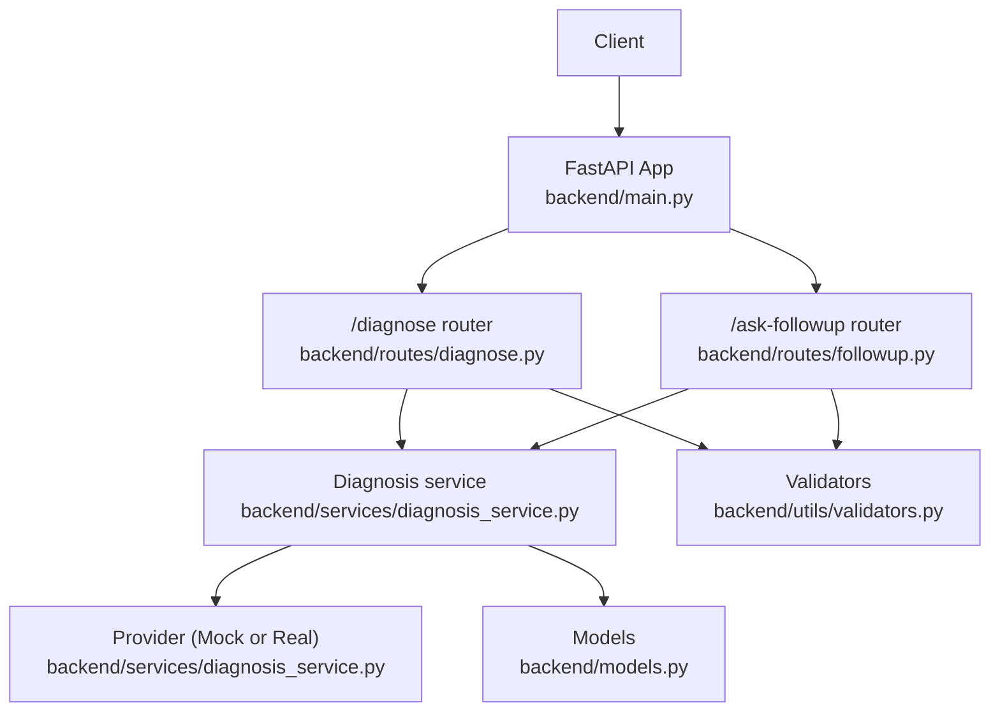
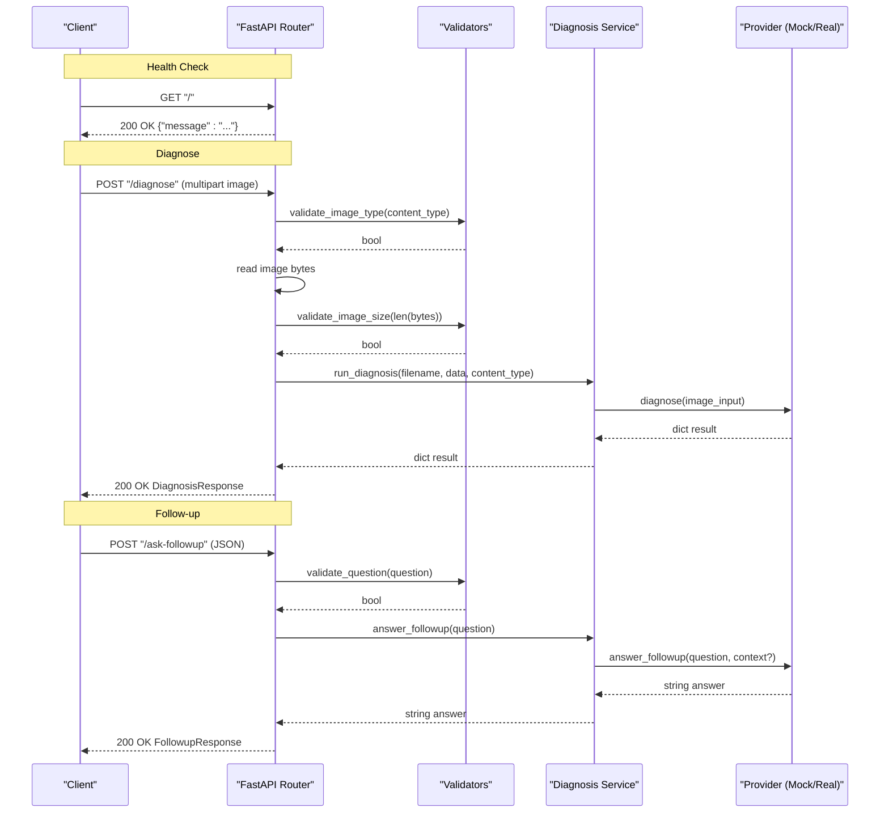
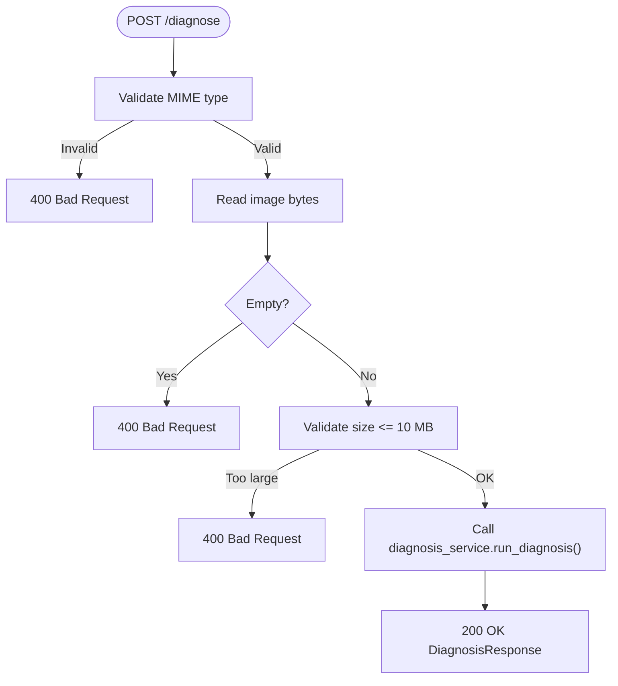
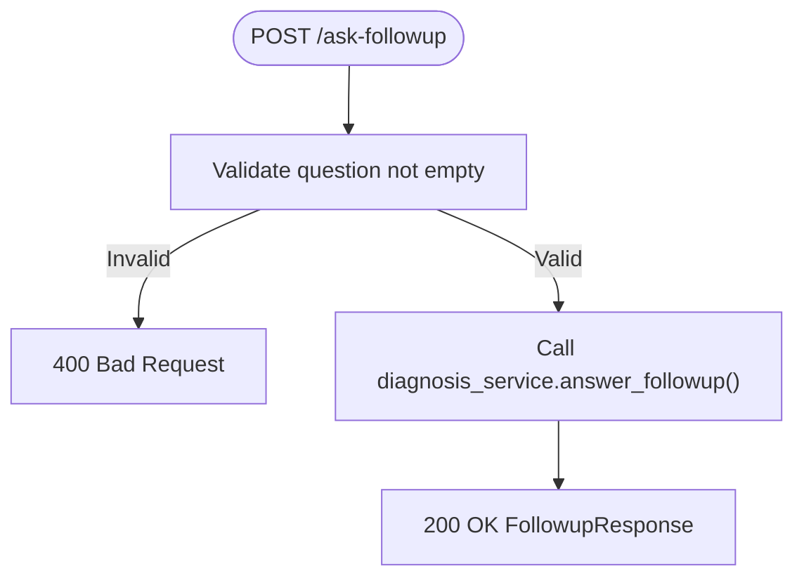
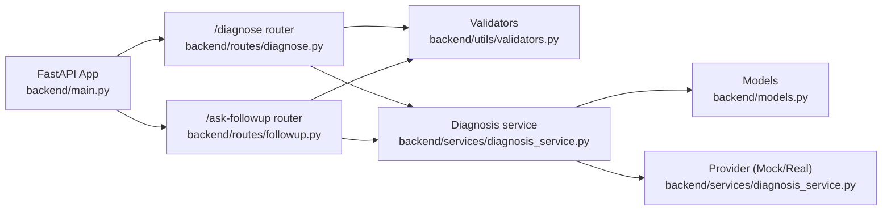

# API Endpoints Reference

<cite>
**Referenced Files in This Document**
- [main.py](file://backend/main.py)
- [diagnose.py](file://backend/routes/diagnose.py)
- [followup.py](file://backend/routes/followup.py)
- [diagnosis_service.py](file://backend/services/diagnosis_service.py)
- [validators.py](file://backend/utils/validators.py)
- [models.py](file://backend/models.py)
- [test_api.py](file://tests/test_api.py)
</cite>

## Table of Contents
1. [Introduction](#introduction)
2. [Project Structure](#project-structure)
3. [Core Components](#core-components)
4. [Architecture Overview](#architecture-overview)
5. [Detailed Component Analysis](#detailed-component-analysis)
6. [Dependency Analysis](#dependency-analysis)
7. [Performance Considerations](#performance-considerations)
8. [Troubleshooting Guide](#troubleshooting-guide)
9. [Conclusion](#conclusion)

## Introduction
This document provides a complete backend API reference for FasalDoc, covering:
- Root health check endpoint
- Image upload and disease diagnosis endpoint
- Interactive follow-up Q&A endpoint

It includes request/response schemas, validation rules, status codes, error handling, data flow diagrams, and troubleshooting guidance. The backend is built with FastAPI and currently runs fully offline using a mock provider until the real AI integration is configured via environment variables.

## Project Structure
The backend exposes three endpoints mounted on the root path:
- GET / — Health check
- POST /diagnose — Upload an image and receive a diagnosis
- POST /ask-followup — Ask a follow-up question about a diagnosis

**Diagram sources**
- [main.py:1-45](file://backend/main.py#L1-L45)
- [diagnose.py:1-59](file://backend/routes/diagnose.py#L1-L59)
- [followup.py:1-40](file://backend/routes/followup.py#L1-L40)
- [diagnosis_service.py:1-128](file://backend/services/diagnosis_service.py#L1-L128)
- [validators.py:1-19](file://backend/utils/validators.py#L1-L19)
- [models.py:1-58](file://backend/models.py#L1-L58)

**Section sources**
- [main.py:1-45](file://backend/main.py#L1-L45)

## Core Components
- FastAPI application with CORS middleware and two routers included.
- Route handlers validate inputs and delegate to the service layer.
- Service layer abstracts the AI provider; defaults to a deterministic mock when no credentials are set.
- Pydantic models define request/response contracts used by routes and tests.
- Validators enforce allowed image types, size limits, and non-empty questions.

Key responsibilities:
- Input validation and sanitization at route boundaries
- Business logic encapsulation in the service layer
- Stable provider interface enabling offline mock and future real AI integration
- Consistent response modeling via Pydantic

**Section sources**
- [main.py:1-45](file://backend/main.py#L1-L45)
- [diagnose.py:1-59](file://backend/routes/diagnose.py#L1-L59)
- [followup.py:1-40](file://backend/routes/followup.py#L1-L40)
- [diagnosis_service.py:1-128](file://backend/services/diagnosis_service.py#L1-L128)
- [validators.py:1-19](file://backend/utils/validators.py#L1-L19)
- [models.py:1-58](file://backend/models.py#L1-L58)

## Architecture Overview
The API follows a layered architecture:
- Routes handle HTTP concerns (parsing, validation, error mapping).
- Service layer implements business logic and provider selection.
- Provider abstraction allows swapping mock and real AI implementations without changing routes.

**Diagram sources**
- [main.py:1-45](file://backend/main.py#L1-L45)
- [diagnose.py:1-59](file://backend/routes/diagnose.py#L1-L59)
- [followup.py:1-40](file://backend/routes/followup.py#L1-L40)
- [diagnosis_service.py:1-128](file://backend/services/diagnosis_service.py#L1-L128)
- [validators.py:1-19](file://backend/utils/validators.py#L1-L19)
- [models.py:1-58](file://backend/models.py#L1-L58)

## Detailed Component Analysis

### Health Check Endpoint
- Method: GET
- Path: /
- Purpose: Verify that the API is running.
- Request: None
- Response:
  - Status: 200 OK
  - Body: JSON object with a message field indicating the API is running.
- Authentication: Not required.
- Rate limiting: Not implemented.
- Content type: application/json

Example response:
- { "message": "FasalDoc API is running" }

**Section sources**
- [main.py:40-45](file://backend/main.py#L40-L45)
- [test_api.py:18-24](file://tests/test_api.py#L18-L24)

### Diagnose Endpoint
- Method: POST
- Path: /diagnose
- Purpose: Upload an image of a crop leaf/plant and receive a disease diagnosis with confidence and advice.
- Request:
  - Content-Type: multipart/form-data
  - Form field: image (required)
    - Type: file
    - Allowed MIME types: image/jpeg, image/png, image/webp
    - Maximum size: 10 MB
- Validation:
  - Rejects unsupported MIME types with 400 Bad Request.
  - Rejects empty uploads with 400 Bad Request.
  - Rejects files exceeding 10 MB with 400 Bad Request.
  - Missing image field returns 422 Unprocessable Entity (Pydantic/FastAPI validation).
- Processing flow:
  - Validate MIME type and size.
  - Read image bytes.
  - Delegate to service layer to run diagnosis.
  - Return standardized diagnosis response.
- Response:
  - Status: 200 OK on success
  - Body schema: DiagnosisResponse
    - filename: string
    - diagnosis: string
    - confidence: number between 0 and 1
    - advice: string
    - needs_expert: boolean
- Authentication: Not required.
- Rate limiting: Not implemented.
- Error responses:
  - 400 Bad Request: Invalid file type, empty file, or too large.
  - 422 Unprocessable Entity: Missing required fields.
  - 500 Internal Server Error: Unexpected processing failure (internal errors are masked).

Example request (multipart):
- Field name: image
- File: tomato_leaf.jpg (image/jpeg)

Example response (200 OK):
- {
    "filename": "tomato_leaf.jpg",
    "diagnosis": "Early Blight",
    "confidence": 0.70,
    "advice": "Remove affected leaves and improve airflow around the plant.",
    "needs_expert": false
  }

Data flow diagram:

**Diagram sources**
- [diagnose.py:13-59](file://backend/routes/diagnose.py#L13-L59)
- [validators.py:1-19](file://backend/utils/validators.py#L1-L19)
- [diagnosis_service.py:116-123](file://backend/services/diagnosis_service.py#L116-L123)
- [models.py:10-31](file://backend/models.py#L10-L31)

**Section sources**
- [diagnose.py:13-59](file://backend/routes/diagnose.py#L13-L59)
- [validators.py:1-19](file://backend/utils/validators.py#L1-L19)
- [diagnosis_service.py:116-123](file://backend/services/diagnosis_service.py#L116-L123)
- [models.py:10-31](file://backend/models.py#L10-L31)
- [test_api.py:54-91](file://tests/test_api.py#L54-L91)

### Ask-Followup Endpoint
- Method: POST
- Path: /ask-followup
- Purpose: Submit a follow-up question about a previous diagnosis and receive an assistant answer.
- Request:
  - Content-Type: application/json
  - Body schema: FollowupRequest
    - question: string (non-empty after trimming whitespace)
- Validation:
  - Empty or whitespace-only questions return 400 Bad Request.
  - Missing question field returns 422 Unprocessable Entity.
- Processing flow:
  - Validate question presence and content.
  - Delegate to service layer to generate an answer.
  - Return standardized follow-up response.
- Response:
  - Status: 200 OK on success
  - Body schema: FollowupResponse
    - question: string (echoed from request)
    - answer: string (assistant’s response)
- Authentication: Not required.
- Rate limiting: Not implemented.
- Error responses:
  - 400 Bad Request: Empty or whitespace-only question.
  - 422 Unprocessable Entity: Missing required fields.
  - 500 Internal Server Error: Unexpected processing failure (internal errors are masked).

Example request:
- { "question": "How often should I water after treatment?" }

Example response (200 OK):
- {
    "question": "How often should I water after treatment?",
    "answer": "Keep the soil moist but not waterlogged, roughly every 2 days."
  }

Data flow diagram:

**Diagram sources**
- [followup.py:10-39](file://backend/routes/followup.py#L10-L39)
- [validators.py:18-19](file://backend/utils/validators.py#L18-L19)
- [diagnosis_service.py:126-127](file://backend/services/diagnosis_service.py#L126-L127)
- [models.py:34-57](file://backend/models.py#L34-L57)

**Section sources**
- [followup.py:10-39](file://backend/routes/followup.py#L10-L39)
- [validators.py:18-19](file://backend/utils/validators.py#L18-L19)
- [diagnosis_service.py:126-127](file://backend/services/diagnosis_service.py#L126-L127)
- [models.py:34-57](file://backend/models.py#L34-L57)
- [test_api.py:29-49](file://tests/test_api.py#L29-L49)

## Dependency Analysis
The following diagram shows how components depend on each other during request processing:

**Diagram sources**
- [main.py:1-45](file://backend/main.py#L1-L45)
- [diagnose.py:1-59](file://backend/routes/diagnose.py#L1-L59)
- [followup.py:1-40](file://backend/routes/followup.py#L1-L40)
- [diagnosis_service.py:1-128](file://backend/services/diagnosis_service.py#L1-L128)
- [validators.py:1-19](file://backend/utils/validators.py#L1-L19)
- [models.py:1-58](file://backend/models.py#L1-L58)

**Section sources**
- [main.py:1-45](file://backend/main.py#L1-L45)
- [diagnose.py:1-59](file://backend/routes/diagnose.py#L1-L59)
- [followup.py:1-40](file://backend/routes/followup.py#L1-L40)
- [diagnosis_service.py:1-128](file://backend/services/diagnosis_service.py#L1-L128)
- [validators.py:1-19](file://backend/utils/validators.py#L1-L19)
- [models.py:1-58](file://backend/models.py#L1-L58)

## Performance Considerations
- Image upload size limit is enforced at 10 MB to prevent excessive memory usage.
- Early validation (MIME type and emptiness) avoids unnecessary processing.
- The service layer caches the active provider once per process to avoid repeated configuration checks.
- No rate limiting is implemented; consider adding token-bucket or IP-based throttling if exposed publicly.
- For high concurrency, ensure the deployment platform supports async request handling and sufficient worker processes.

[No sources needed since this section provides general guidance]

## Troubleshooting Guide
Common issues and resolutions:

- Receiving 400 Bad Request on /diagnose:
  - Cause: Unsupported MIME type, empty file, or file larger than 10 MB.
  - Resolution: Ensure the file is JPEG/PNG/WEBP, non-empty, and under 10 MB.

- Receiving 422 Unprocessable Entity:
  - Cause: Missing required fields (e.g., missing image on /diagnose or missing question on /ask-followup).
  - Resolution: Include all required fields with correct types.

- Receiving 500 Internal Server Error:
  - Cause: Unexpected internal error during diagnosis or follow-up processing.
  - Resolution: Retry the request; if persistent, check server logs for details.

- CORS errors from frontend:
  - Cause: Requests originate from an origin not allowed by CORS settings.
  - Resolution: Configure CORS_ALLOW_ORIGINS to include your frontend origin(s).

- Mock vs Real provider behavior:
  - Behavior: Without DASHSCOPE_API_KEY configured, the service uses a deterministic mock provider.
  - Resolution: Set DASHSCOPE_API_KEY to enable the real AI provider when ready.

Validation references:
- Allowed image types and size limits are defined centrally and reused by routes.
- Question validation ensures non-empty input before calling the service.

**Section sources**
- [diagnose.py:21-43](file://backend/routes/diagnose.py#L21-L43)
- [followup.py:18-23](file://backend/routes/followup.py#L18-L23)
- [validators.py:1-19](file://backend/utils/validators.py#L1-L19)
- [diagnosis_service.py:75-95](file://backend/services/diagnosis_service.py#L75-L95)
- [main.py:19-35](file://backend/main.py#L19-L35)
- [test_api.py:64-91](file://tests/test_api.py#L64-L91)

## Conclusion
FasalDoc’s backend exposes a minimal, well-validated API surface:
- A health check endpoint for readiness probes
- An image-based diagnosis endpoint with strict input validation and a stable response contract
- An interactive follow-up endpoint for Q&A

The service layer abstracts the AI provider, enabling seamless switching between offline mock and real AI integrations. Use the provided schemas and examples to integrate clients reliably. When scaling or exposing publicly, consider adding authentication, rate limiting, and enhanced logging.

[No sources needed since this section summarizes without analyzing specific files]