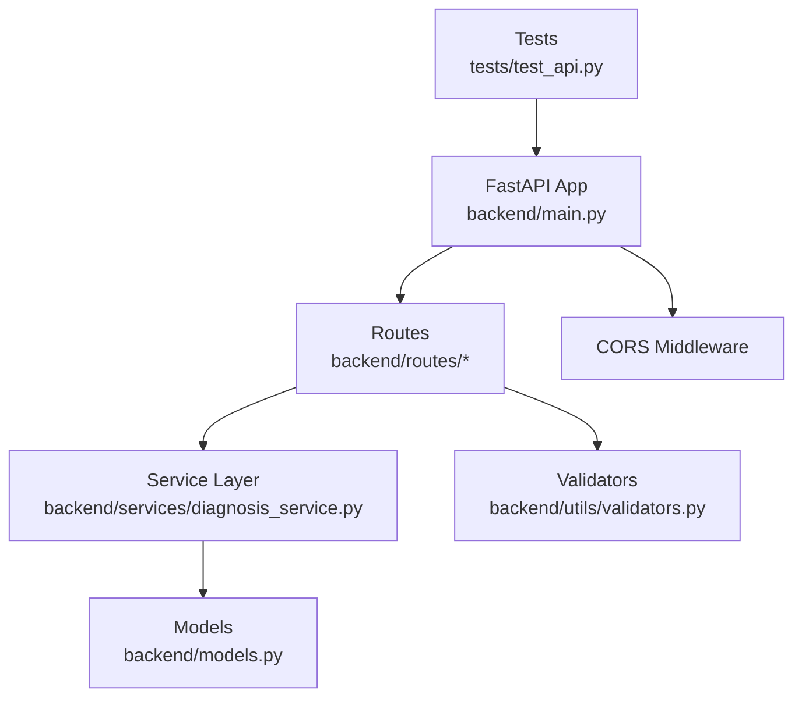
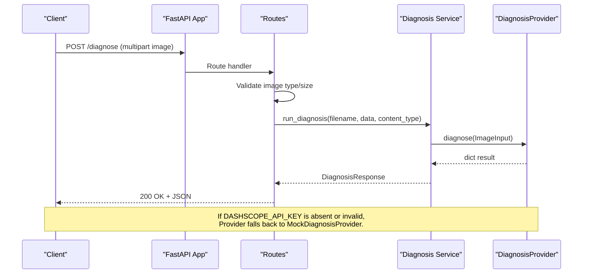
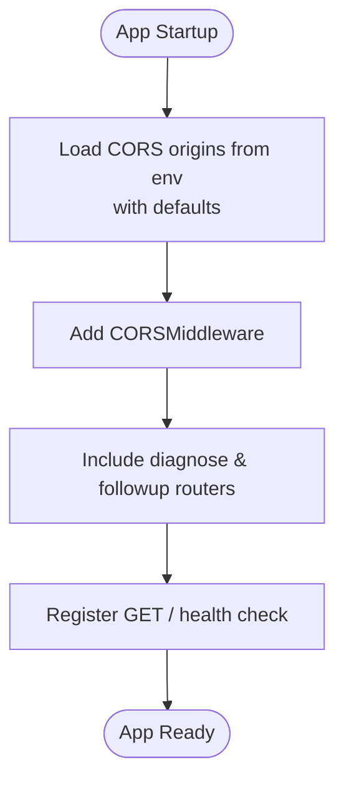
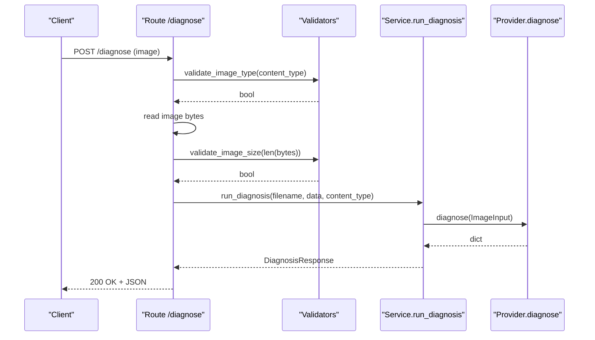
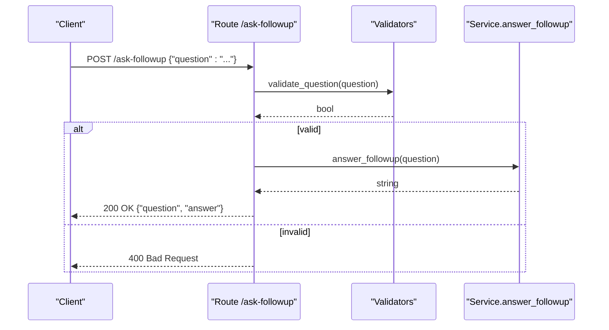
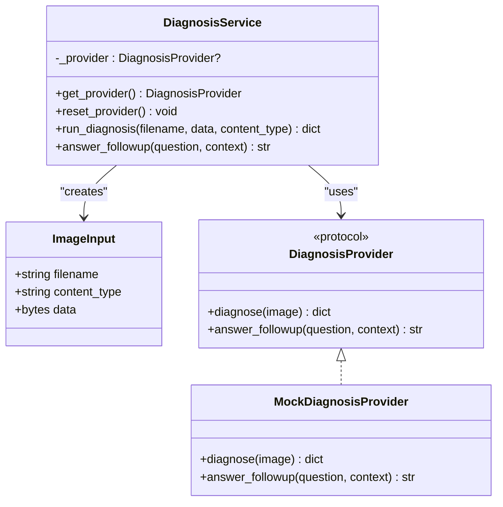
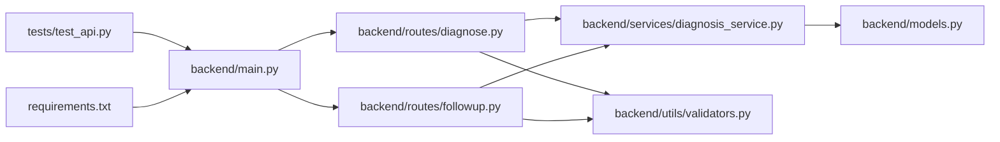

# Backend Documentation

<cite>
**Referenced Files in This Document**
- [main.py](file://backend/main.py)
- [diagnose.py](file://backend/routes/diagnose.py)
- [followup.py](file://backend/routes/followup.py)
- [diagnosis_service.py](file://backend/services/diagnosis_service.py)
- [models.py](file://backend/models.py)
- [validators.py](file://backend/utils/validators.py)
- [test_api.py](file://tests/test_api.py)
- [requirements.txt](file://requirements.txt)
- [README.md](file://README.md)
</cite>

## Table of Contents
1. [Introduction](#introduction)
2. [Project Structure](#project-structure)
3. [Core Components](#core-components)
4. [Architecture Overview](#architecture-overview)
5. [Detailed Component Analysis](#detailed-component-analysis)
6. [Dependency Analysis](#dependency-analysis)
7. [Performance Considerations](#performance-considerations)
8. [Troubleshooting Guide](#troubleshooting-guide)
9. [Conclusion](#conclusion)
10. [Appendices](#appendices)

## Introduction
This document describes the backend implementation for FasalDoc’s FastAPI application. It covers application setup, middleware configuration (including CORS), route registration, and the service layer architecture that abstracts AI providers behind a stable protocol with a built-in mock fallback. It also documents all API endpoints (/diagnose and /ask-followup), request/response schemas, validation rules, error handling patterns, and how to extend the system with new AI providers or custom business logic.

## Project Structure
The backend is organized into clear layers:
- Application entrypoint and middleware configuration
- Routes (HTTP endpoints)
- Service layer (business logic and provider abstraction)
- Models (Pydantic schemas for requests/responses)
- Utilities (validation helpers)
- Tests (offline test suite)

**Diagram sources**
- [main.py:1-45](file://backend/main.py#L1-L45)
- [diagnose.py:1-59](file://backend/routes/diagnose.py#L1-L59)
- [followup.py:1-40](file://backend/routes/followup.py#L1-L40)
- [diagnosis_service.py:1-128](file://backend/services/diagnosis_service.py#L1-L128)
- [models.py:1-58](file://backend/models.py#L1-L58)
- [validators.py:1-19](file://backend/utils/validators.py#L1-L19)
- [test_api.py:1-129](file://tests/test_api.py#L1-L129)

**Section sources**
- [main.py:1-45](file://backend/main.py#L1-L45)
- [README.md:7-15](file://README.md#L7-L15)

## Core Components
- FastAPI app initialization with title, description, version, and OpenAPI docs enabled by default.
- CORS middleware configured via environment variable with sensible defaults for local development.
- Route modules mounted under routers for diagnosis and follow-up flows.
- Service layer exposing a stable protocol (DiagnosisProvider) with a mock implementation for offline operation.
- Pydantic models defining strict request/response contracts.
- Validators enforcing image type, size, and question content constraints.

Key responsibilities:
- main.py: App creation, CORS setup, router inclusion, health endpoint.
- routes: Input validation and delegation to services; consistent error handling.
- services: Provider selection (real vs mock), encapsulated business logic.
- models: Typed schemas ensuring contract consistency across frontend/backend.
- utils: Reusable validation functions.

**Section sources**
- [main.py:9-38](file://backend/main.py#L9-L38)
- [diagnosis_service.py:40-128](file://backend/services/diagnosis_service.py#L40-L128)
- [models.py:10-58](file://backend/models.py#L10-L58)
- [validators.py:1-19](file://backend/utils/validators.py#L1-L19)

## Architecture Overview
The backend follows a layered architecture:
- HTTP layer (routes) validates inputs and delegates to services.
- Service layer abstracts AI providers through a protocol and provides a mock fallback when credentials are missing.
- Models define contracts used by both routes and tests.
- Utilities provide shared validation logic.

**Diagram sources**
- [diagnose.py:13-59](file://backend/routes/diagnose.py#L13-L59)
- [diagnosis_service.py:116-123](file://backend/services/diagnosis_service.py#L116-L123)
- [diagnosis_service.py:80-105](file://backend/services/diagnosis_service.py#L80-L105)

**Section sources**
- [main.py:19-38](file://backend/main.py#L19-L38)
- [diagnose.py:13-59](file://backend/routes/diagnose.py#L13-L59)
- [diagnosis_service.py:80-128](file://backend/services/diagnosis_service.py#L80-L128)

## Detailed Component Analysis

### FastAPI Application Setup and Middleware
- The app is created with metadata and includes CORS middleware configured from an environment variable with safe defaults for local development.
- Routers are included to mount endpoints under their respective paths.
- A simple health endpoint returns a status message.

**Diagram sources**
- [main.py:9-45](file://backend/main.py#L9-L45)

**Section sources**
- [main.py:9-45](file://backend/main.py#L9-L45)

### Route: /diagnose (Image Upload)
- Accepts multipart image upload.
- Validates image type and size using utility validators.
- Rejects empty uploads early.
- Delegates to the service layer for diagnosis.
- Wraps service calls to ensure internal errors do not leak to clients.

**Diagram sources**
- [diagnose.py:13-59](file://backend/routes/diagnose.py#L13-L59)
- [validators.py:1-19](file://backend/utils/validators.py#L1-L19)
- [diagnosis_service.py:116-123](file://backend/services/diagnosis_service.py#L116-L123)

**Section sources**
- [diagnose.py:13-59](file://backend/routes/diagnose.py#L13-L59)
- [validators.py:1-19](file://backend/utils/validators.py#L1-L19)

### Route: /ask-followup (Q&A)
- Accepts JSON payload with a question field.
- Validates that the question is non-empty and not whitespace-only.
- Delegates to the service layer to answer the question.
- Returns a response echoing the question and providing an answer.

**Diagram sources**
- [followup.py:10-39](file://backend/routes/followup.py#L10-L39)
- [validators.py:18-19](file://backend/utils/validators.py#L18-L19)
- [diagnosis_service.py:126-127](file://backend/services/diagnosis_service.py#L126-L127)

**Section sources**
- [followup.py:10-39](file://backend/routes/followup.py#L10-L39)
- [validators.py:18-19](file://backend/utils/validators.py#L18-L19)

### Service Layer: DiagnosisProvider Protocol and Mock Implementation
- Defines a stable protocol (DiagnosisProvider) with methods for diagnosing images and answering follow-up questions.
- Provides a mock implementation returning deterministic responses for offline use.
- Implements provider selection based on environment configuration, falling back to the mock if credentials are missing or construction fails.
- Exposes helper functions for routes to call without knowing about provider details.

**Diagram sources**
- [diagnosis_service.py:31-52](file://backend/services/diagnosis_service.py#L31-L52)
- [diagnosis_service.py:55-73](file://backend/services/diagnosis_service.py#L55-L73)
- [diagnosis_service.py:80-128](file://backend/services/diagnosis_service.py#L80-L128)

**Section sources**
- [diagnosis_service.py:31-128](file://backend/services/diagnosis_service.py#L31-L128)

### Models: Request/Response Schemas
- DiagnosisResponse defines fields for filename, diagnosis, confidence (bounded 0..1), advice, and needs_expert flag.
- FollowupRequest requires a non-empty question.
- FollowupResponse echoes the question and provides an answer.

These models enforce validation at the API boundary and generate OpenAPI documentation.

**Section sources**
- [models.py:10-58](file://backend/models.py#L10-L58)

### Utilities: Validation Helpers
- Allowed image types restricted to JPEG, PNG, WEBP.
- Maximum image size set to 10 MB.
- Question validator ensures non-empty, non-whitespace input.

**Section sources**
- [validators.py:1-19](file://backend/utils/validators.py#L1-L19)

## Dependency Analysis
The backend has minimal external dependencies and clear module boundaries:
- FastAPI and Uvicorn for server runtime.
- python-multipart for file uploads.
- pytest and httpx for testing.

**Diagram sources**
- [main.py:6-8](file://backend/main.py#L6-L8)
- [diagnose.py:3-8](file://backend/routes/diagnose.py#L3-L8)
- [followup.py:3-5](file://backend/routes/followup.py#L3-L5)
- [diagnosis_service.py:23-28](file://backend/services/diagnosis_service.py#L23-L28)
- [models.py:7-7](file://backend/models.py#L7-L7)
- [test_api.py:6-9](file://tests/test_api.py#L6-L9)
- [requirements.txt:1-6](file://requirements.txt#L1-L6)

**Section sources**
- [requirements.txt:1-6](file://requirements.txt#L1-L6)
- [test_api.py:1-129](file://tests/test_api.py#L1-L129)

## Performance Considerations
- Image validation occurs before reading full payloads where possible to reject invalid types early.
- Size checks prevent processing oversized files.
- Service provider is lazily initialized and cached to avoid repeated configuration checks.
- For production, consider streaming large uploads and adding rate limiting or request size limits at the proxy level.

[No sources needed since this section provides general guidance]

## Troubleshooting Guide
Common issues and resolutions:
- Invalid image type: Ensure uploaded content type is one of JPEG, PNG, or WEBP.
- Empty upload: Verify the client sends actual image bytes.
- Oversized image: Keep uploads under 10 MB.
- Missing required fields: Follow the Pydantic model contracts for requests.
- CORS errors: Confirm the frontend origin matches allowed origins configured via environment variables.
- Offline behavior: Without a valid API key, the service uses mock responses; configure DASHSCOPE_API_KEY to enable real AI integration.

Validation and error handling patterns:
- Routes raise HTTPException with appropriate status codes for client errors (400) and wrap service exceptions to return user-friendly messages (500).
- Pydantic models automatically produce 422 errors for malformed requests.

**Section sources**
- [diagnose.py:21-59](file://backend/routes/diagnose.py#L21-L59)
- [followup.py:18-34](file://backend/routes/followup.py#L18-L34)
- [test_api.py:41-92](file://tests/test_api.py#L41-L92)
- [main.py:19-35](file://backend/main.py#L19-L35)

## Conclusion
The FasalDoc backend provides a clean, modular FastAPI application with robust validation, clear separation of concerns, and a provider abstraction that supports offline mock responses and easy integration of real AI services. The documented endpoints, schemas, and error handling patterns make it straightforward to extend functionality, add new providers, and integrate with the frontend.

[No sources needed since this section summarizes without analyzing specific files]

## Appendices

### API Endpoints Summary
- GET /
  - Purpose: Health check
  - Response: Status message
- POST /diagnose
  - Purpose: Diagnose crop disease from an uploaded image
  - Request: Multipart form with image field
  - Response: DiagnosisResponse schema
  - Validation: Image type and size constraints enforced
- POST /ask-followup
  - Purpose: Ask a follow-up question about a diagnosis
  - Request: JSON with question field
  - Response: FollowupResponse schema
  - Validation: Non-empty question enforced

**Section sources**
- [README.md:80-87](file://README.md#L80-L87)
- [models.py:10-58](file://backend/models.py#L10-L58)
- [diagnose.py:13-59](file://backend/routes/diagnose.py#L13-L59)
- [followup.py:10-39](file://backend/routes/followup.py#L10-L39)

### Extending the System
To add a new AI provider:
- Implement a module exposing create_provider() that returns an object satisfying the DiagnosisProvider protocol.
- Ensure the provider implements diagnose(image) and answer_followup(question, context).
- Set DASHSCOPE_API_KEY (and any other required config) in the environment.
- No changes to routes are required; the service layer will select the real provider when configured and fall back to the mock otherwise.

To add custom business logic:
- Extend the service layer with additional helper functions while keeping route signatures unchanged.
- Use the existing models and validators to maintain consistency.

**Section sources**
- [diagnosis_service.py:7-19](file://backend/services/diagnosis_service.py#L7-L19)
- [diagnosis_service.py:80-105](file://backend/services/diagnosis_service.py#L80-L105)
- [README.md:88-99](file://README.md#L88-L99)