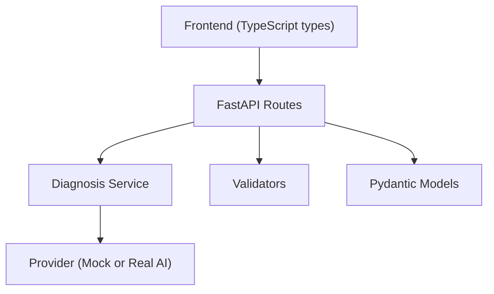
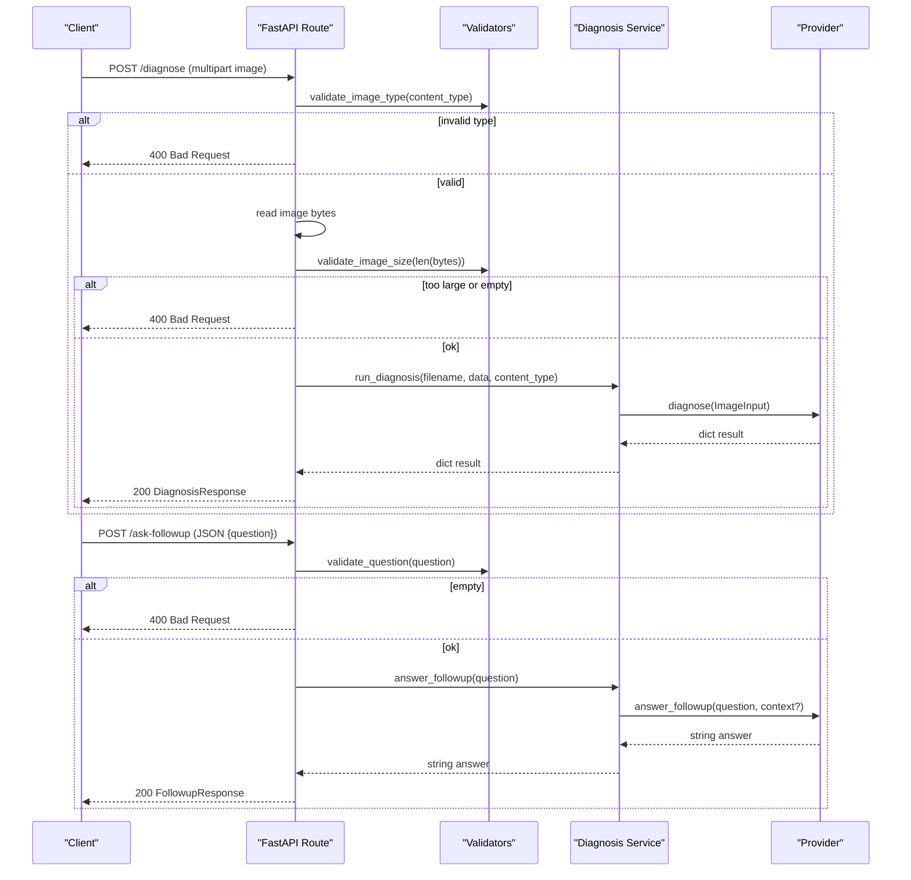
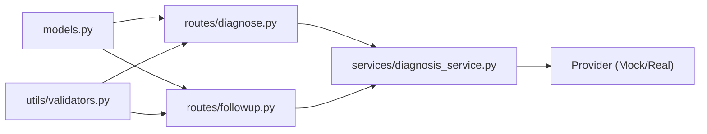

# Data Models and Validation

<cite>
**Referenced Files in This Document**
- [models.py](file://backend/models.py)
- [validators.py](file://backend/utils/validators.py)
- [diagnose.py](file://backend/routes/diagnose.py)
- [followup.py](file://backend/routes/followup.py)
- [diagnosis_service.py](file://backend/services/diagnosis_service.py)
- [main.py](file://backend/main.py)
- [api.ts](file://frontend/src/types/api.ts)
- [test_api.py](file://tests/test_api.py)
</cite>

## Table of Contents
1. [Introduction](#introduction)
2. [Project Structure](#project-structure)
3. [Core Components](#core-components)
4. [Architecture Overview](#architecture-overview)
5. [Detailed Component Analysis](#detailed-component-analysis)
6. [Dependency Analysis](#dependency-analysis)
7. [Performance Considerations](#performance-considerations)
8. [Troubleshooting Guide](#troubleshooting-guide)
9. [Conclusion](#conclusion)
10. [Appendices](#appendices)

## Introduction
This document explains the data models and validation strategy used by FasalDoc’s backend. It covers Pydantic v2 request/response contracts, image and question validation utilities, service-layer data structures, and how these pieces integrate with FastAPI endpoints. It also documents error handling for validation failures, shows how frontend types mirror backend contracts, and provides guidance for extending models and validators consistently.

## Project Structure
The backend is organized into:
- API routes that receive requests and enforce input validation
- A service layer that encapsulates business logic and AI provider abstraction
- Shared Pydantic models defining the API contract
- Utility validators for reusable input checks
- Frontend TypeScript types mirroring the backend contracts

**Diagram sources**
- [main.py:6-8](file://backend/main.py#L6-L8)
- [diagnose.py:1-59](file://backend/routes/diagnose.py#L1-L59)
- [followup.py:1-40](file://backend/routes/followup.py#L1-L40)
- [diagnosis_service.py:31-128](file://backend/services/diagnosis_service.py#L31-L128)
- [validators.py:1-19](file://backend/utils/validators.py#L1-L19)
- [models.py:10-58](file://backend/models.py#L10-L58)
- [api.ts:1-26](file://frontend/src/types/api.ts#L1-L26)

**Section sources**
- [main.py:1-45](file://backend/main.py#L1-L45)

## Core Components
- DiagnosisResponse: The response schema returned by the diagnosis endpoint. Includes filename, diagnosis, confidence (bounded 0..1), advice, and needs_expert.
- FollowupRequest: The JSON body for asking a follow-up question; requires a non-empty question string.
- FollowupResponse: Echoes the question and returns an answer string.
- ImageInput: A dataclass representing the image payload passed to the diagnosis provider. Contains filename, content_type, and raw bytes.

These models define the stable contract between the frontend and backend. Field constraints are enforced by Pydantic at runtime, ensuring type safety and consistent responses.

**Section sources**
- [models.py:10-58](file://backend/models.py#L10-L58)
- [diagnosis_service.py:31-38](file://backend/services/diagnosis_service.py#L31-L38)

## Architecture Overview
The request flow enforces validation early and delegates to the service layer, which abstracts the AI provider.

**Diagram sources**
- [diagnose.py:13-59](file://backend/routes/diagnose.py#L13-L59)
- [followup.py:10-39](file://backend/routes/followup.py#L10-L39)
- [diagnosis_service.py:116-128](file://backend/services/diagnosis_service.py#L116-L128)
- [validators.py:10-19](file://backend/utils/validators.py#L10-L19)

## Detailed Component Analysis

### Pydantic Models
- DiagnosisResponse
  - Fields: filename (string), diagnosis (string), confidence (float bounded 0..1), advice (string), needs_expert (boolean).
  - Constraints: confidence must be within [0, 1]; all fields required.
  - Usage: Declared as response_model on the /diagnose endpoint to enforce output shape.
- FollowupRequest
  - Fields: question (string, required, non-empty after trimming).
  - Constraints: Enforced via Pydantic min_length=1 plus route-level validator for whitespace-only inputs.
  - Usage: Used as request body for /ask-followup.
- FollowupResponse
  - Fields: question (string), answer (string).
  - Usage: Declared as response_model on /ask-followup.

Validation behavior:
- Missing required fields produce 422 Unprocessable Entity from FastAPI/Pydantic.
- Constraint violations (e.g., confidence out of range) are rejected by Pydantic during serialization.

**Section sources**
- [models.py:10-58](file://backend/models.py#L10-L58)
- [diagnose.py:13-18](file://backend/routes/diagnose.py#L13-L18)
- [followup.py:10-16](file://backend/routes/followup.py#L10-L16)

### Service Data Model: ImageInput
- Purpose: Encapsulates everything a diagnosis provider needs about an uploaded image.
- Fields: filename (string), content_type (string), data (bytes).
- Usage: Constructed in the service helper before calling the provider’s diagnose method.

**Section sources**
- [diagnosis_service.py:31-38](file://backend/services/diagnosis_service.py#L31-L38)
- [diagnosis_service.py:116-123](file://backend/services/diagnosis_service.py#L116-L123)

### Validators
- Allowed image types: JPEG, PNG, WEBP.
- Max image size: 10 MB.
- Functions:
  - validate_image_type(content_type): Returns True if content_type is allowed.
  - validate_image_size(file_size): Returns True if file_size <= 10 MB.
  - validate_question(question): Returns True if question is present and not only whitespace.

Usage patterns:
- Image validation occurs in the diagnose route before reading and processing the file.
- Question validation occurs in the followup route before delegating to the service.

**Section sources**
- [validators.py:1-19](file://backend/utils/validators.py#L1-L19)
- [diagnose.py:21-43](file://backend/routes/diagnose.py#L21-L43)
- [followup.py:18-23](file://backend/routes/followup.py#L18-L23)

### Endpoints and Error Handling

#### POST /diagnose
- Input: Multipart form field named image.
- Validation steps:
  - Reject disallowed content types with 400.
  - Read bytes and reject empty uploads with 400.
  - Reject oversized images (>10 MB) with 400.
  - Delegate to service; wrap unexpected exceptions in a generic 500 to avoid leaking internals.
- Output: DiagnosisResponse.

Error mapping:
- Invalid type or size or empty upload -> 400 Bad Request.
- Missing file field -> 422 Unprocessable Entity (FastAPI/Pydantic).
- Unexpected internal errors -> 500 Internal Server Error.

**Section sources**
- [diagnose.py:13-59](file://backend/routes/diagnose.py#L13-L59)
- [test_api.py:64-91](file://tests/test_api.py#L64-L91)

#### POST /ask-followup
- Input: JSON body with question.
- Validation steps:
  - Pydantic ensures question exists and has min length 1.
  - Route-level check rejects whitespace-only questions with 400.
  - Delegate to service; wrap unexpected exceptions in a generic 500.
- Output: FollowupResponse.

Error mapping:
- Missing question -> 422 Unprocessable Entity.
- Whitespace-only question -> 400 Bad Request.
- Unexpected internal errors -> 500 Internal Server Error.

**Section sources**
- [followup.py:10-39](file://backend/routes/followup.py#L10-L39)
- [test_api.py:29-49](file://tests/test_api.py#L29-L49)

### Relationship Between Frontend Types and Backend Models
Frontend TypeScript interfaces mirror backend Pydantic models to ensure type consistency across the stack:
- DiagnosisResponse matches the backend response fields and constraints.
- FollowupRequest and FollowupResponse match the backend request/response shapes.

This alignment reduces integration issues and enables shared expectations for field names and types.

**Section sources**
- [api.ts:1-26](file://frontend/src/types/api.ts#L1-L26)
- [models.py:10-58](file://backend/models.py#L10-L58)

## Dependency Analysis
The following diagram shows key dependencies among modules involved in data modeling and validation:

**Diagram sources**
- [models.py:10-58](file://backend/models.py#L10-L58)
- [validators.py:1-19](file://backend/utils/validators.py#L1-L19)
- [diagnose.py:1-59](file://backend/routes/diagnose.py#L1-L59)
- [followup.py:1-40](file://backend/routes/followup.py#L1-L40)
- [diagnosis_service.py:31-128](file://backend/services/diagnosis_service.py#L31-L128)

**Section sources**
- [diagnose.py:1-59](file://backend/routes/diagnose.py#L1-L59)
- [followup.py:1-40](file://backend/routes/followup.py#L1-L40)
- [diagnosis_service.py:31-128](file://backend/services/diagnosis_service.py#L31-L128)

## Performance Considerations
- Validate early: Type and size checks occur before reading the full payload where possible to minimize memory usage.
- Avoid unnecessary reads: Empty uploads are detected immediately after reading to short-circuit further processing.
- Provider selection: The service caches the active provider to avoid repeated configuration checks.

[No sources needed since this section provides general guidance]

## Troubleshooting Guide
Common validation failures and their causes:
- 422 Unprocessable Entity:
  - Missing required fields in JSON payloads (e.g., missing question).
  - Missing multipart file field in /diagnose.
- 400 Bad Request:
  - Disallowed image content type.
  - Empty image upload.
  - Image exceeds maximum size.
  - Whitespace-only question.
- 500 Internal Server Error:
  - Unexpected exceptions in service/provider layers; routes convert these to a safe generic message.

Diagnostic tips:
- Inspect the response detail field for human-readable messages.
- Use the OpenAPI docs (/docs) to verify expected request/response schemas.
- Run tests to confirm behavior under various edge cases.

**Section sources**
- [diagnose.py:21-59](file://backend/routes/diagnose.py#L21-L59)
- [followup.py:18-34](file://backend/routes/followup.py#L18-L34)
- [test_api.py:29-91](file://tests/test_api.py#L29-L91)

## Conclusion
FasalDoc’s backend uses Pydantic v2 models to define strict contracts for requests and responses, complemented by explicit validators for image and question inputs. Routes enforce validation early and delegate to a service layer that abstracts the AI provider. Errors are handled consistently, returning appropriate HTTP status codes and safe messages. Frontend types mirror backend models to maintain consistency across the stack.

[No sources needed since this section summarizes without analyzing specific files]

## Appendices

### Adding a New Data Model and Validation Rule
Follow these steps to maintain consistency:
1. Define the model in models.py using Pydantic v2. Add Field constraints and descriptions.
2. If the model represents user input, add corresponding validation in utils/validators.py for reusable checks.
3. Update the relevant route to use the new model and apply validators before delegating to the service.
4. Ensure the service layer accepts and returns data compatible with the new model.
5. Mirror changes in frontend/src/types/api.ts to keep the client contract aligned.
6. Add tests covering success and failure paths in tests/test_api.py.

Example references:
- Model definition pattern: [models.py:10-58](file://backend/models.py#L10-L58)
- Validator functions: [validators.py:10-19](file://backend/utils/validators.py#L10-L19)
- Route usage and error handling: [diagnose.py:21-59](file://backend/routes/diagnose.py#L21-L59), [followup.py:18-34](file://backend/routes/followup.py#L18-L34)
- Frontend mirroring: [api.ts:1-26](file://frontend/src/types/api.ts#L1-L26)
- Test coverage examples: [test_api.py:29-91](file://tests/test_api.py#L29-L91)