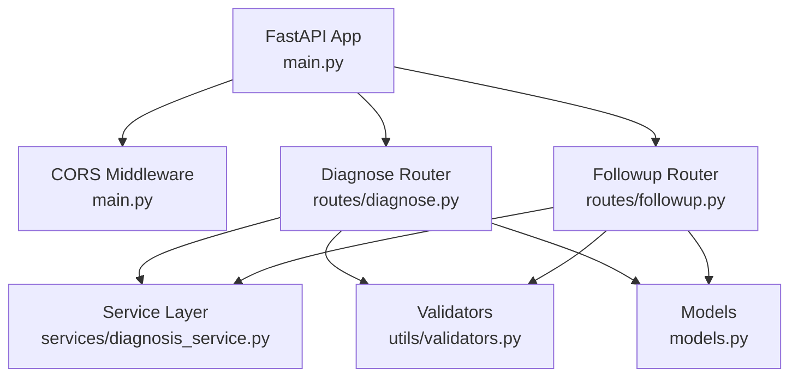
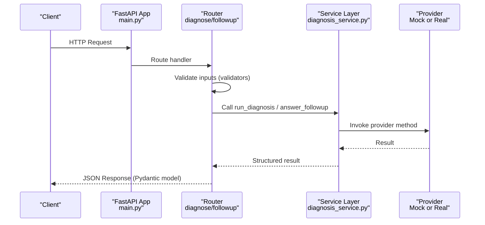
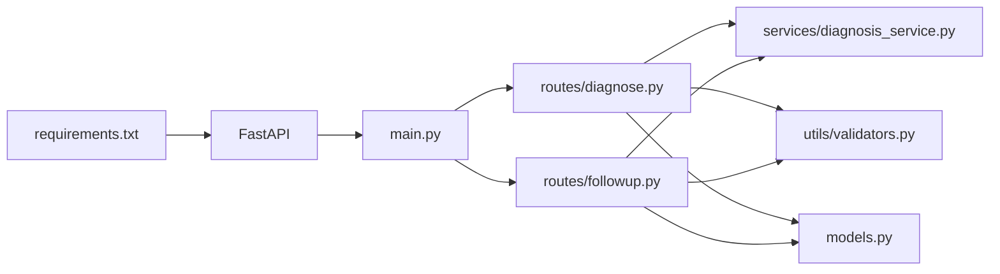

# FastAPI Application Setup

<cite>
**Referenced Files in This Document**
- [backend/main.py](file://backend/main.py)
- [backend/routes/diagnose.py](file://backend/routes/diagnose.py)
- [backend/routes/followup.py](file://backend/routes/followup.py)
- [backend/services/diagnosis_service.py](file://backend/services/diagnosis_service.py)
- [backend/utils/validators.py](file://backend/utils/validators.py)
- [backend/models.py](file://backend/models.py)
- [requirements.txt](file://requirements.txt)
- [tests/test_api.py](file://tests/test_api.py)
</cite>

## Table of Contents
1. Introduction
2. Project Structure
3. Core Components
4. Architecture Overview
5. Detailed Component Analysis
6. Dependency Analysis
7. Performance Considerations
8. Troubleshooting Guide
9. Conclusion
10. Appendices

## Introduction
This document explains the FastAPI application setup for FasalDoc’s backend. It covers the main application configuration (title, description, version), CORS middleware with environment variable support, router registration for diagnose and followup endpoints, the health check endpoint, and guidance for extending the application with additional middleware and routes. It also provides practical examples for configuring different origins in development and production environments.

## Project Structure
The backend is organized into clear layers:
- Application entrypoint and global configuration live in the main module.
- Feature routers encapsulate route definitions for diagnosis and follow-up flows.
- A service layer abstracts AI provider logic and exposes a stable interface for routes.
- Utilities provide input validation helpers.
- Pydantic models define request/response contracts shared between routes and tests.

**Diagram sources**
- [backend/main.py:9-38](file://backend/main.py#L9-L38)
- [backend/routes/diagnose.py:1-59](file://backend/routes/diagnose.py#L1-L59)
- [backend/routes/followup.py:1-40](file://backend/routes/followup.py#L1-L40)
- [backend/services/diagnosis_service.py:1-128](file://backend/services/diagnosis_service.py#L1-L128)
- [backend/utils/validators.py:1-19](file://backend/utils/validators.py#L1-L19)
- [backend/models.py:1-58](file://backend/models.py#L1-L58)

**Section sources**
- [backend/main.py:9-38](file://backend/main.py#L9-L38)
- [backend/routes/diagnose.py:1-59](file://backend/routes/diagnose.py#L1-L59)
- [backend/routes/followup.py:1-40](file://backend/routes/followup.py#L1-L40)
- [backend/services/diagnosis_service.py:1-128](file://backend/services/diagnosis_service.py#L1-L128)
- [backend/utils/validators.py:1-19](file://backend/utils/validators.py#L1-L19)
- [backend/models.py:1-58](file://backend/models.py#L1-L58)

## Core Components
- Application configuration: The FastAPI app is initialized with title, description, and version to power OpenAPI metadata and documentation.
- CORS middleware: Configured to allow cross-origin requests from specified origins, with environment variable override for flexibility across environments.
- Routers: Two feature routers are registered:
  - Diagnose: Accepts an image upload and returns a structured diagnosis response.
  - Followup: Accepts a question payload and returns an answer.
- Health check: A simple GET endpoint at the root path that confirms the API is running.
- Service layer: Provides a stable interface to the AI provider, with a built-in offline mock fallback when credentials are not configured.
- Validators: Enforce allowed image types, size limits, and question content rules.
- Models: Define request/response schemas used by routes and tests.

**Section sources**
- [backend/main.py:9-44](file://backend/main.py#L9-L44)
- [backend/routes/diagnose.py:13-59](file://backend/routes/diagnose.py#L13-L59)
- [backend/routes/followup.py:10-39](file://backend/routes/followup.py#L10-L39)
- [backend/services/diagnosis_service.py:40-128](file://backend/services/diagnosis_service.py#L40-L128)
- [backend/utils/validators.py:1-19](file://backend/utils/validators.py#L1-L19)
- [backend/models.py:10-58](file://backend/models.py#L10-L58)

## Architecture Overview
The FastAPI application wires together routing, middleware, and services to expose a clean API surface. Requests enter through routers, which validate inputs and delegate to the service layer. The service layer selects either a real AI provider or a mock fallback based on environment configuration. Responses conform to Pydantic models and are returned to clients.

**Diagram sources**
- [backend/main.py:29-38](file://backend/main.py#L29-L38)
- [backend/routes/diagnose.py:13-59](file://backend/routes/diagnose.py#L13-L59)
- [backend/routes/followup.py:10-39](file://backend/routes/followup.py#L10-L39)
- [backend/services/diagnosis_service.py:80-128](file://backend/services/diagnosis_service.py#L80-L128)

## Detailed Component Analysis

### Main Application Configuration
- Title, description, and version are set during FastAPI initialization to populate OpenAPI metadata.
- CORS middleware is added with:
  - Origins parsed from an environment variable, defaulting to local Vite dev server addresses if not provided.
  - Credentials and methods/headers allowed via wildcard settings suitable for development.
- Routers are included to register endpoints.
- A health check endpoint at the root path returns a simple status message.

Environment variable usage:
- CORS_ALLOW_ORIGINS: Comma-separated list of allowed origins; defaults to local development origins.

Example configurations:
- Development: Use default origins or set CORS_ALLOW_ORIGINS to include your local frontend URL (e.g., http://localhost:5173).
- Production: Set CORS_ALLOW_ORIGINS to your deployed frontend domain(s) (e.g., https://fasaldoc.example.com).

**Section sources**
- [backend/main.py:9-44](file://backend/main.py#L9-L44)

### CORS Middleware Configuration
- Reads CORS_ALLOW_ORIGINS from the environment; splits by comma and trims whitespace.
- Adds CORSMiddleware with allow_credentials enabled and wildcard methods/headers for broad compatibility.
- Tests verify that the Access-Control-Allow-Origin header is correctly set for allowed origins.

Operational notes:
- For strict production security, restrict allow_methods and allow_headers to only what you need.
- Ensure CORS_ALLOW_ORIGINS includes all domains that will call the API.

**Section sources**
- [backend/main.py:19-35](file://backend/main.py#L19-L35)
- [tests/test_api.py:107-109](file://tests/test_api.py#L107-L109)

### Router Registration: Diagnose Endpoint
- POST /diagnose accepts an image file upload.
- Validates image type and size using utility validators.
- Rejects empty uploads early.
- Delegates processing to the service layer, which uses a provider (mock or real).
- Returns a structured DiagnosisResponse per the Pydantic model.

Error handling:
- Invalid type, empty file, oversized file return 400 errors.
- Unexpected exceptions are caught and converted to a generic 500 error to avoid leaking internal details.

**Section sources**
- [backend/routes/diagnose.py:13-59](file://backend/routes/diagnose.py#L13-L59)
- [backend/utils/validators.py:1-19](file://backend/utils/validators.py#L1-L19)
- [backend/models.py:10-31](file://backend/models.py#L10-L31)

### Router Registration: Followup Endpoint
- POST /ask-followup accepts a JSON body with a question field.
- Validates that the question is non-empty and not whitespace-only.
- Delegates to the service layer to obtain an answer.
- Returns a FollowupResponse containing the echoed question and answer.

Error handling:
- Missing or invalid question fields return 422 (validation error).
- Empty/whitespace-only questions return 400.
- Unexpected exceptions are converted to a generic 500 error.

**Section sources**
- [backend/routes/followup.py:10-39](file://backend/routes/followup.py#L10-L39)
- [backend/utils/validators.py:18-19](file://backend/utils/validators.py#L18-L19)
- [backend/models.py:34-58](file://backend/models.py#L34-L58)

### Health Check Endpoint
- GET / returns a simple JSON message indicating the API is running.
- Useful for readiness probes and basic monitoring.

Usage:
- Health checks can be polled by orchestrators or load balancers to ensure the service is up.

**Section sources**
- [backend/main.py:40-44](file://backend/main.py#L40-L44)
- [tests/test_api.py:18-24](file://tests/test_api.py#L18-L24)

### Service Layer and Provider Selection
- Defines a stable protocol for providers (diagnose and answer_followup).
- Implements a MockDiagnosisProvider for offline operation.
- Selects the active provider based on environment variables (e.g., DASHSCOPE_API_KEY). If credentials are missing or construction fails, it falls back to the mock provider.
- Exposes helper functions for routes to call without coupling to provider specifics.

Extensibility:
- To integrate a real AI provider, implement the protocol and provide a factory function; the service will automatically use it when credentials are present.

**Section sources**
- [backend/services/diagnosis_service.py:40-128](file://backend/services/diagnosis_service.py#L40-L128)
- [tests/test_api.py:114-118](file://tests/test_api.py#L114-L118)

### Input Validation Utilities
- Allowed image types: JPEG, PNG, WEBP.
- Maximum image size: 10 MB.
- Question validation ensures non-empty, non-whitespace strings.

These helpers keep route handlers focused on orchestration while centralizing validation rules.

**Section sources**
- [backend/utils/validators.py:1-19](file://backend/utils/validators.py#L1-L19)

### Data Models
- DiagnosisResponse: Describes filename, diagnosis, confidence (bounded 0..1), advice, and needs_expert flag.
- FollowupRequest: Requires a non-empty question.
- FollowupResponse: Echoes the question and provides an answer string.

These models enforce contract consistency and generate OpenAPI schema documentation.

**Section sources**
- [backend/models.py:10-58](file://backend/models.py#L10-L58)

## Dependency Analysis
The application depends on FastAPI and related packages listed in requirements. Routes depend on services, validators, and models. The service layer optionally depends on an external provider implementation but safely falls back to a mock when not configured.

**Diagram sources**
- [requirements.txt:1-6](file://requirements.txt#L1-L6)
- [backend/main.py:1-8](file://backend/main.py#L1-L8)
- [backend/routes/diagnose.py:1-8](file://backend/routes/diagnose.py#L1-L8)
- [backend/routes/followup.py:1-5](file://backend/routes/followup.py#L1-L5)
- [backend/services/diagnosis_service.py:1-28](file://backend/services/diagnosis_service.py#L1-L28)
- [backend/utils/validators.py:1-19](file://backend/utils/validators.py#L1-L19)
- [backend/models.py:1-7](file://backend/models.py#L1-L7)

**Section sources**
- [requirements.txt:1-6](file://requirements.txt#L1-L6)
- [backend/main.py:1-8](file://backend/main.py#L1-L8)

## Performance Considerations
- Image validation occurs before reading large payloads into memory where possible; however, the current flow reads the entire image into memory to check size. Consider streaming or chunked processing for very large files.
- Limit concurrent uploads if needed by adjusting worker processes or adding rate limiting middleware.
- Keep CORS settings tight in production to reduce unnecessary preflight traffic.
- Cache provider instances (already done) to avoid repeated initialization overhead.

[No sources needed since this section provides general guidance]

## Troubleshooting Guide
Common issues and resolutions:
- CORS errors:
  - Ensure CORS_ALLOW_ORIGINS includes the exact origin making requests (scheme, host, port).
  - Verify that credentials are required; if so, ensure allow_credentials is set and the client sends credentials appropriately.
- Upload failures:
  - Confirm image type is one of JPEG, PNG, or WEBP.
  - Ensure file size does not exceed 10 MB.
  - Empty uploads are rejected; verify the client sends a valid file.
- Validation errors:
  - Followup requests must include a non-empty question; missing fields trigger 422 errors.
- Provider configuration:
  - Without DASHSCOPE_API_KEY, the service falls back to a mock provider. Configure the key to enable the real AI integration.

**Section sources**
- [backend/routes/diagnose.py:21-43](file://backend/routes/diagnose.py#L21-L43)
- [backend/routes/followup.py:18-33](file://backend/routes/followup.py#L18-L33)
- [backend/utils/validators.py:1-19](file://backend/utils/validators.py#L1-L19)
- [backend/services/diagnosis_service.py:75-95](file://backend/services/diagnosis_service.py#L75-L95)

## Conclusion
FasalDoc’s FastAPI backend provides a clean, modular setup with robust CORS configuration, well-defined routers for diagnosis and follow-up, and a service layer that supports both offline mock and real AI providers. The health check endpoint enables basic monitoring, and the codebase is structured to easily extend with additional middleware and routes. Environment variables allow flexible configuration across development and production environments.

[No sources needed since this section summarizes without analyzing specific files]

## Appendices

### Extending the Application
- Add new routes:
  - Create a new router module under backend/routes and register it in the main application.
  - Define request/response models in backend/models for consistent contracts.
- Add middleware:
  - Insert additional middleware in the main application before or after CORS depending on desired execution order.
  - Examples include authentication, logging, or rate-limiting middleware.
- Integrate a real AI provider:
  - Implement the provider protocol and provide a factory function.
  - Set DASHSCOPE_API_KEY (and any other required environment variables) to activate the real provider.

[No sources needed since this section provides general guidance]