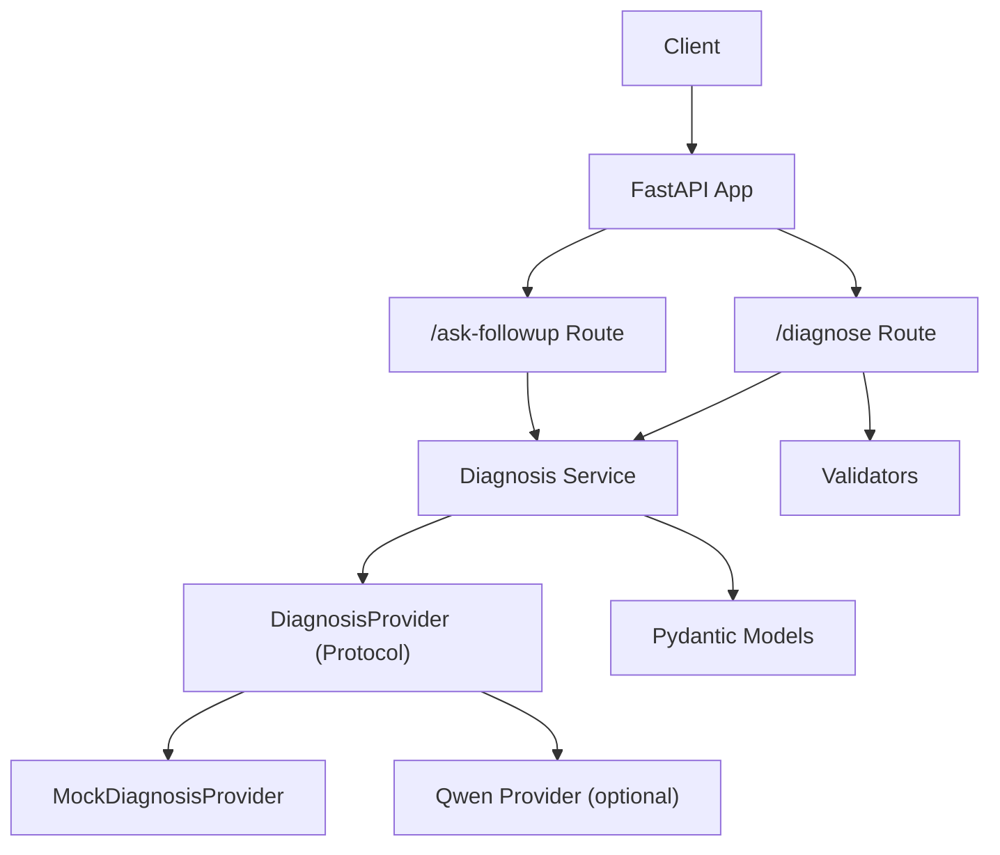
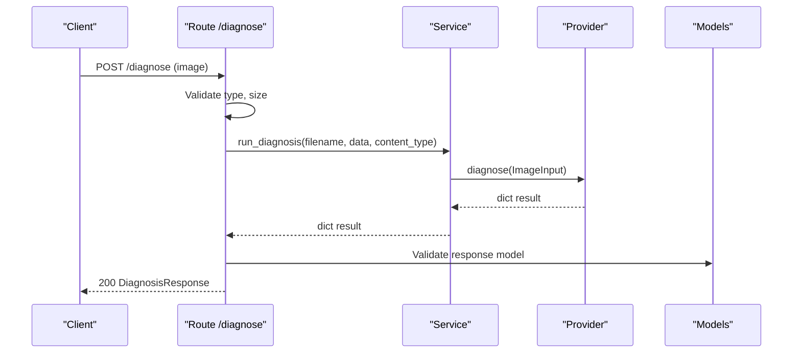
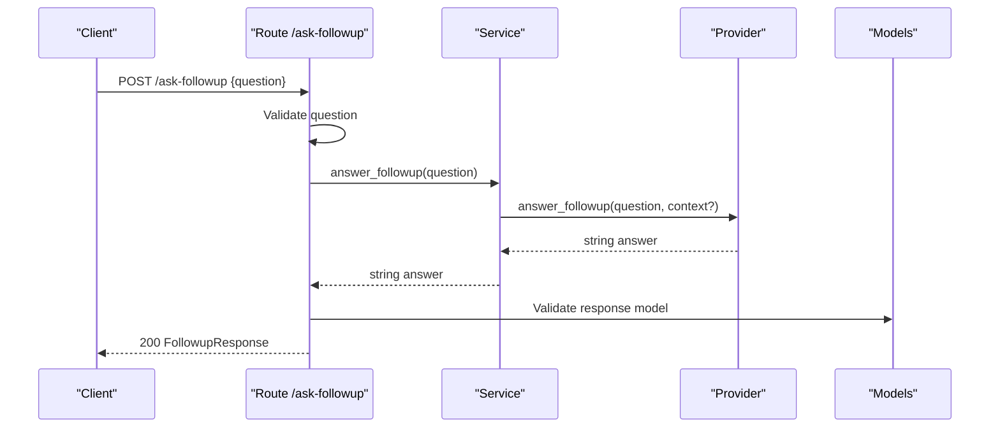
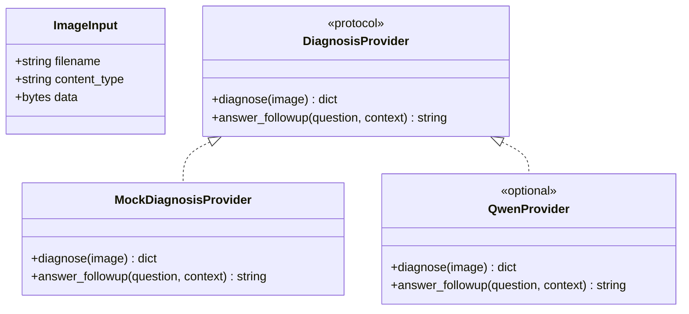
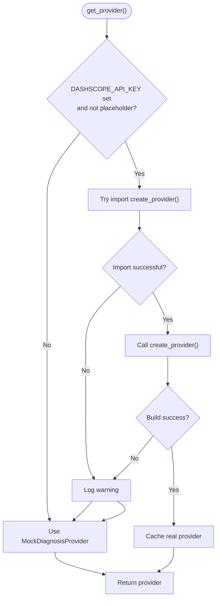
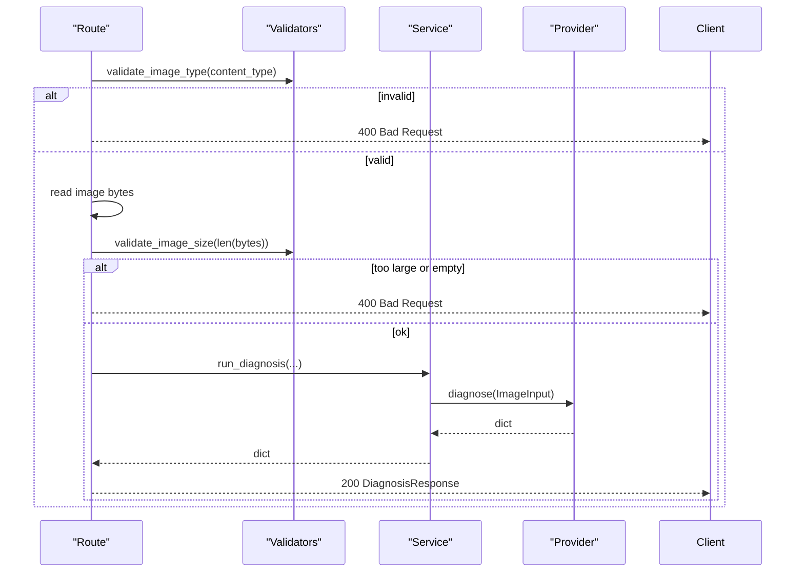
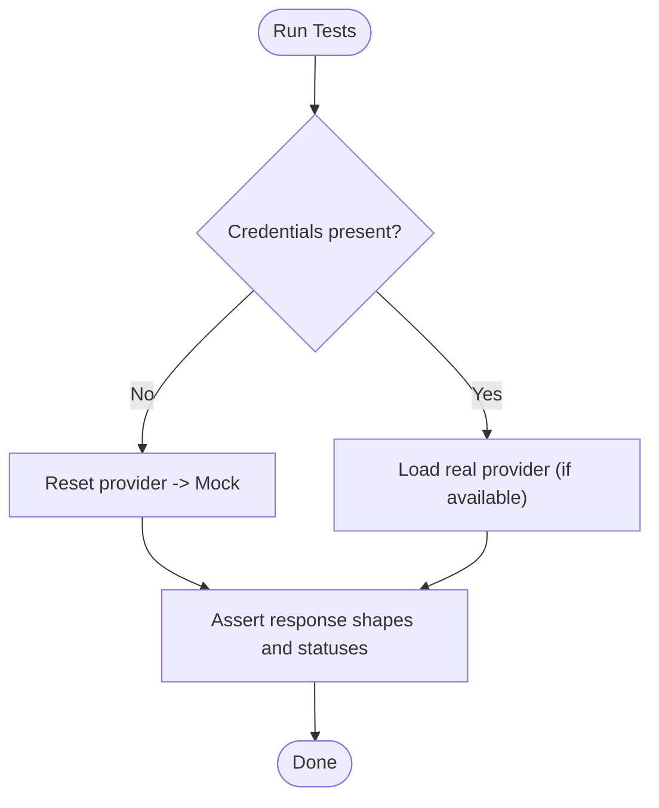
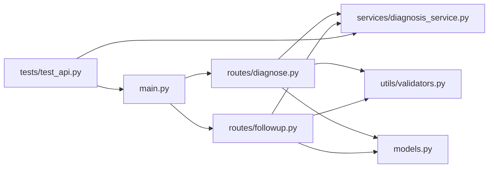

# Service Layer Architecture

<cite>
**Referenced Files in This Document**
- [diagnosis_service.py](file://backend/services/diagnosis_service.py)
- [models.py](file://backend/models.py)
- [diagnose.py](file://backend/routes/diagnose.py)
- [followup.py](file://backend/routes/followup.py)
- [main.py](file://backend/main.py)
- [validators.py](file://backend/utils/validators.py)
- [test_api.py](file://tests/test_api.py)
</cite>

## Table of Contents
1. [Introduction](#introduction)
2. [Project Structure](#project-structure)
3. [Core Components](#core-components)
4. [Architecture Overview](#architecture-overview)
5. [Detailed Component Analysis](#detailed-component-analysis)
6. [Dependency Analysis](#dependency-analysis)
7. [Performance Considerations](#performance-considerations)
8. [Troubleshooting Guide](#troubleshooting-guide)
9. [Conclusion](#conclusion)
10. [Appendices](#appendices)

## Introduction
This document explains the service layer architecture of FasalDoc’s backend, focusing on how business logic is separated from HTTP handling and how AI provider implementations are abstracted behind a stable protocol. It covers:
- The DiagnosisProvider protocol that defines the contract for AI backends
- The offline MockDiagnosisProvider used when no real AI is configured
- The provider factory pattern that selects the active provider based on environment configuration
- How routes delegate to the service layer for diagnosis and follow-up Q&A
- Error handling patterns, logging strategies, and testing approaches
- Guidance for extending the system with new AI backends or custom business logic

## Project Structure
The backend is organized into clear layers:
- Routes (HTTP endpoints): handle request validation and delegate to services
- Services (business logic): encapsulate domain operations and provider selection
- Models (contracts): define request/response schemas shared with the frontend
- Utils (helpers): input validation utilities
- Application bootstrap: FastAPI app setup, CORS, and router registration

**Diagram sources**
- [main.py:9-38](file://backend/main.py#L9-L38)
- [diagnose.py:13-59](file://backend/routes/diagnose.py#L13-L59)
- [followup.py:10-40](file://backend/routes/followup.py#L10-L40)
- [diagnosis_service.py:40-128](file://backend/services/diagnosis_service.py#L40-L128)
- [models.py:10-58](file://backend/models.py#L10-L58)
- [validators.py:1-19](file://backend/utils/validators.py#L1-L19)

**Section sources**
- [main.py:9-38](file://backend/main.py#L9-L38)
- [diagnose.py:13-59](file://backend/routes/diagnose.py#L13-L59)
- [followup.py:10-40](file://backend/routes/followup.py#L10-L40)
- [diagnosis_service.py:40-128](file://backend/services/diagnosis_service.py#L40-L128)
- [models.py:10-58](file://backend/models.py#L10-L58)
- [validators.py:1-19](file://backend/utils/validators.py#L1-L19)

## Core Components
- DiagnosisProvider protocol: a stable interface defining diagnose and answer_followup methods that all providers must implement.
- MockDiagnosisProvider: an offline fallback returning deterministic responses without network calls.
- Provider factory: lazy, cached selection of the active provider based on environment variables; falls back to mock if credentials are missing or construction fails.
- Service helpers: run_diagnosis and answer_followup expose simple functions for routes to call.
- Models: Pydantic models enforce request/response contracts between frontend and backend.
- Validators: reusable checks for image type, size, and question content.

Key responsibilities:
- Routes validate inputs and translate errors to HTTP status codes.
- Services encapsulate business logic and provider abstraction.
- Providers implement AI-specific behavior while keeping routes unchanged.

**Section sources**
- [diagnosis_service.py:40-128](file://backend/services/diagnosis_service.py#L40-L128)
- [models.py:10-58](file://backend/models.py#L10-L58)
- [validators.py:1-19](file://backend/utils/validators.py#L1-L19)

## Architecture Overview
The service layer decouples HTTP concerns from AI integration. Routes perform input validation and error mapping, then delegate to service functions. The service layer uses a provider factory to select either a real AI provider (when configured) or a mock provider (offline). This design ensures:
- Stable interfaces across providers
- Easy switching via environment configuration
- Robustness through graceful fallback
- Clear separation of concerns between HTTP and business logic

**Diagram sources**
- [diagnose.py:13-59](file://backend/routes/diagnose.py#L13-L59)
- [diagnosis_service.py:116-128](file://backend/services/diagnosis_service.py#L116-L128)
- [models.py:10-32](file://backend/models.py#L10-L32)

**Diagram sources**
- [followup.py:10-40](file://backend/routes/followup.py#L10-L40)
- [diagnosis_service.py:126-128](file://backend/services/diagnosis_service.py#L126-L128)
- [models.py:34-58](file://backend/models.py#L34-L58)

## Detailed Component Analysis

### DiagnosisProvider Protocol and Implementations
The protocol defines a minimal, stable interface for AI providers:
- diagnose(image) returns a structured dict containing filename, diagnosis, confidence, advice, needs_expert
- answer_followup(question, context?) returns a human-readable string

Two implementations exist:
- MockDiagnosisProvider: provides deterministic offline responses
- Optional real provider: dynamically loaded when environment credentials are present

**Diagram sources**
- [diagnosis_service.py:31-52](file://backend/services/diagnosis_service.py#L31-L52)
- [diagnosis_service.py:55-73](file://backend/services/diagnosis_service.py#L55-L73)

**Section sources**
- [diagnosis_service.py:31-73](file://backend/services/diagnosis_service.py#L31-L73)

### Provider Factory Pattern and Dynamic Selection
The factory selects the active provider once per process:
- Checks for required environment variable(s)
- Attempts to import and instantiate the real provider
- Falls back to MockDiagnosisProvider on missing config or exceptions
- Caches the selected provider for reuse

**Diagram sources**
- [diagnosis_service.py:75-105](file://backend/services/diagnosis_service.py#L75-L105)

**Section sources**
- [diagnosis_service.py:75-105](file://backend/services/diagnosis_service.py#L75-L105)

### Service Helpers and Route Integration
Routes delegate to service helpers:
- /diagnose validates image type and size, reads bytes, then calls run_diagnosis
- /ask-followup validates question text, then calls answer_followup
- Both routes map unexpected exceptions to HTTP 500 and re-raise HTTPException for client-facing errors

**Diagram sources**
- [diagnose.py:13-59](file://backend/routes/diagnose.py#L13-L59)
- [validators.py:1-19](file://backend/utils/validators.py#L1-L19)
- [diagnosis_service.py:116-128](file://backend/services/diagnosis_service.py#L116-L128)

**Section sources**
- [diagnose.py:13-59](file://backend/routes/diagnose.py#L13-L59)
- [followup.py:10-40](file://backend/routes/followup.py#L10-L40)
- [validators.py:1-19](file://backend/utils/validators.py#L1-L19)
- [diagnosis_service.py:116-128](file://backend/services/diagnosis_service.py#L116-L128)

### Data Contracts (Models)
Pydantic models define the API surface:
- DiagnosisResponse: fields include filename, diagnosis, confidence (0..1), advice, needs_expert
- FollowupRequest: non-empty question
- FollowupResponse: echoes question and provides answer

These models ensure consistent serialization and validation across the stack.

**Section sources**
- [models.py:10-58](file://backend/models.py#L10-L58)

### Testing Strategy
Tests cover:
- Health endpoint availability
- Input validation paths (invalid types, empty uploads, oversized images)
- Response shape and field constraints
- OpenAPI exposure of endpoints
- CORS behavior
- Service-layer fallback to mock when credentials are absent
- Direct service function behavior

**Diagram sources**
- [test_api.py:114-129](file://tests/test_api.py#L114-L129)

**Section sources**
- [test_api.py:1-129](file://tests/test_api.py#L1-129)

## Dependency Analysis
High-level dependencies:
- main.py registers routers and sets up CORS
- diagnose.py and followup.py depend on models, validators, and diagnosis_service
- diagnosis_service depends on environment configuration and optional external provider module
- tests depend on FastAPI TestClient and service functions

**Diagram sources**
- [main.py:9-38](file://backend/main.py#L9-L38)
- [diagnose.py:1-59](file://backend/routes/diagnose.py#L1-L59)
- [followup.py:1-40](file://backend/routes/followup.py#L1-L40)
- [diagnosis_service.py:1-128](file://backend/services/diagnosis_service.py#L1-L128)
- [validators.py:1-19](file://backend/utils/validators.py#L1-L19)
- [models.py:1-58](file://backend/models.py#L1-L58)
- [test_api.py:1-129](file://tests/test_api.py#L1-L129)

**Section sources**
- [main.py:9-38](file://backend/main.py#L9-L38)
- [diagnose.py:1-59](file://backend/routes/diagnose.py#L1-L59)
- [followup.py:1-40](file://backend/routes/followup.py#L1-L40)
- [diagnosis_service.py:1-128](file://backend/services/diagnosis_service.py#L1-L128)
- [validators.py:1-19](file://backend/utils/validators.py#L1-L19)
- [models.py:1-58](file://backend/models.py#L1-L58)
- [test_api.py:1-129](file://tests/test_api.py#L1-L129)

## Performance Considerations
- Provider caching: get_provider caches the selected provider to avoid repeated environment checks and imports.
- Early validation: routes reject invalid or oversized images before invoking services to reduce unnecessary processing.
- Minimal overhead: service helpers are lightweight wrappers around provider calls.
- Logging: warnings are logged when the real provider cannot be built, aiding diagnostics without impacting normal flows.

[No sources needed since this section provides general guidance]

## Troubleshooting Guide
Common issues and resolutions:
- Missing or placeholder API key:
  - Symptom: Service falls back to mock; logs may indicate provider unavailable.
  - Resolution: Set DASHSCOPE_API_KEY to a valid value; ensure it is not empty or a placeholder.
- Unexpected internal errors:
  - Symptom: HTTP 500 returned to clients.
  - Resolution: Inspect server logs; routes wrap exceptions to prevent leaking internals.
- Invalid inputs:
  - Symptom: HTTP 400 for unsupported image types, empty uploads, or oversized files.
  - Resolution: Ensure correct MIME types and file sizes within limits.
- Empty questions:
  - Symptom: HTTP 400 for whitespace-only questions.
  - Resolution: Provide non-empty, trimmed question text.

Operational tips:
- Use reset_provider in tests to isolate provider state.
- Verify OpenAPI docs to confirm endpoints and schemas.

**Section sources**
- [diagnosis_service.py:75-105](file://backend/services/diagnosis_service.py#L75-L105)
- [diagnose.py:21-59](file://backend/routes/diagnose.py#L21-L59)
- [followup.py:18-34](file://backend/routes/followup.py#L18-L34)
- [test_api.py:114-129](file://tests/test_api.py#L114-L129)

## Conclusion
FasalDoc’s service layer cleanly separates HTTP handling from AI integration by:
- Defining a stable DiagnosisProvider protocol
- Providing an offline MockDiagnosisProvider for development and testing
- Using a provider factory to dynamically select the active backend based on environment configuration
- Encapsulating business logic in service helpers called by routes
- Enforcing contracts with Pydantic models and validating inputs via utils
This design enables easy extension with new AI backends and robust operation in both online and offline modes.

[No sources needed since this section summarizes without analyzing specific files]

## Appendices

### How to Implement a New AI Provider
Steps to add a new provider:
1. Create a module under backend/services (e.g., qwen_provider.py) exposing a factory function create_provider that returns an object implementing DiagnosisProvider.
2. Implement diagnose(image) to return a dict matching DiagnosisResponse fields.
3. Implement answer_followup(question, context?) to return a string.
4. Ensure environment variables are correctly set so the factory can load your provider.
5. Keep route code unchanged; the service layer will use your provider automatically when configured.

Reference implementation pattern:
- See the existing mock provider for method signatures and return shapes.
- See the factory logic for how providers are discovered and instantiated.

**Section sources**
- [diagnosis_service.py:40-73](file://backend/services/diagnosis_service.py#L40-L73)
- [diagnosis_service.py:80-105](file://backend/services/diagnosis_service.py#L80-L105)

### Extending Business Logic
To add custom business logic:
- Add helper functions in diagnosis_service.py that compose provider calls with additional processing.
- Update routes to call these helpers after validation.
- Maintain separation: keep HTTP concerns in routes and domain logic in services.

**Section sources**
- [diagnosis_service.py:114-128](file://backend/services/diagnosis_service.py#L114-L128)
- [diagnose.py:45-59](file://backend/routes/diagnose.py#L45-L59)
- [followup.py:25-34](file://backend/routes/followup.py#L25-L34)