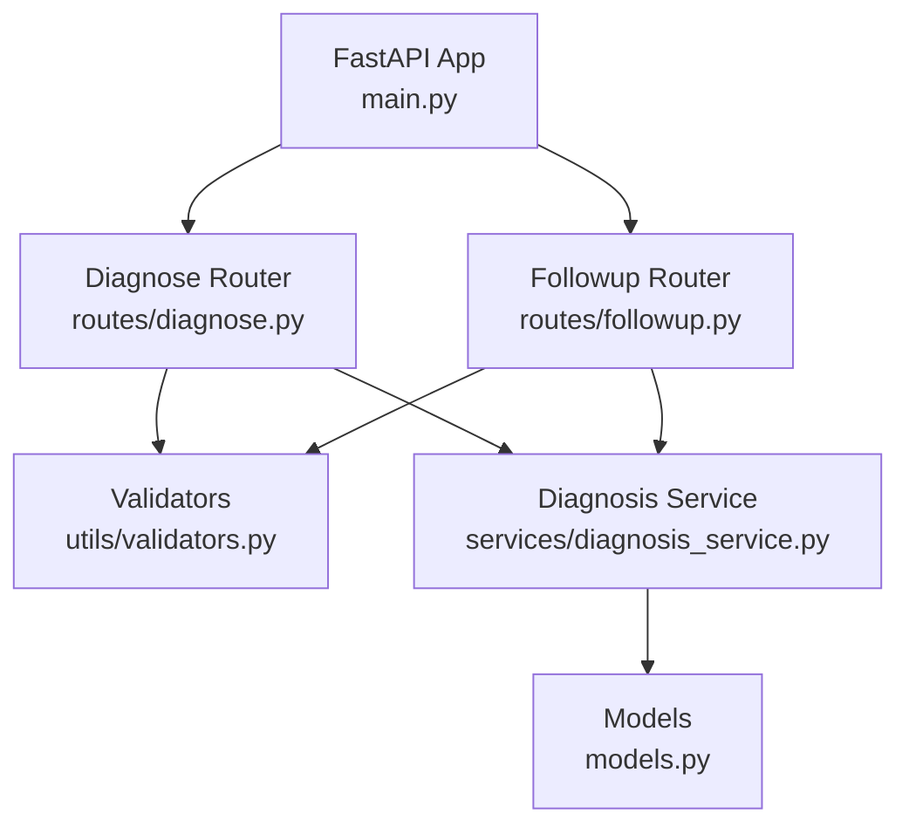
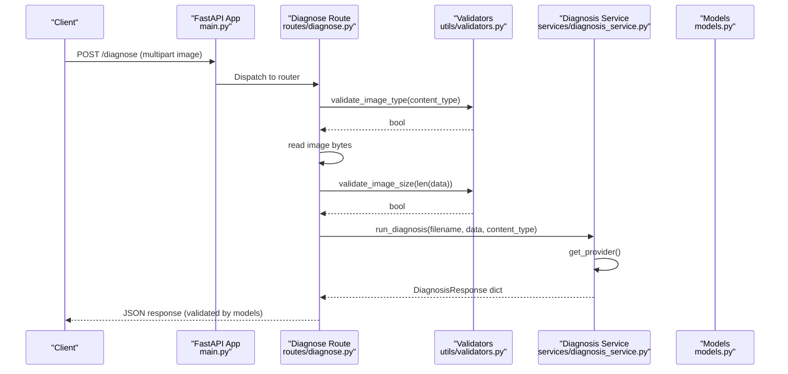
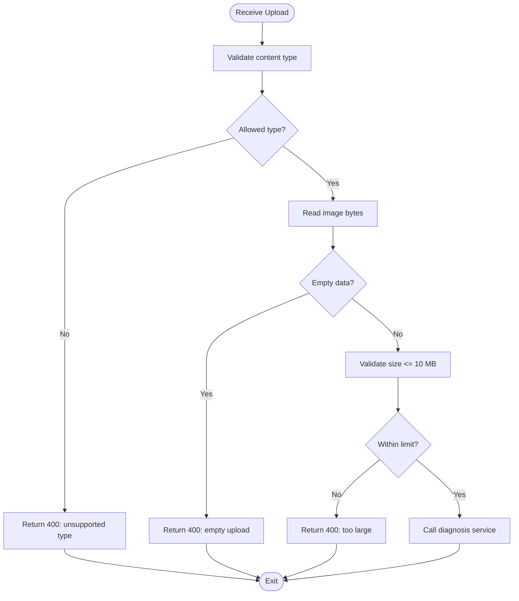
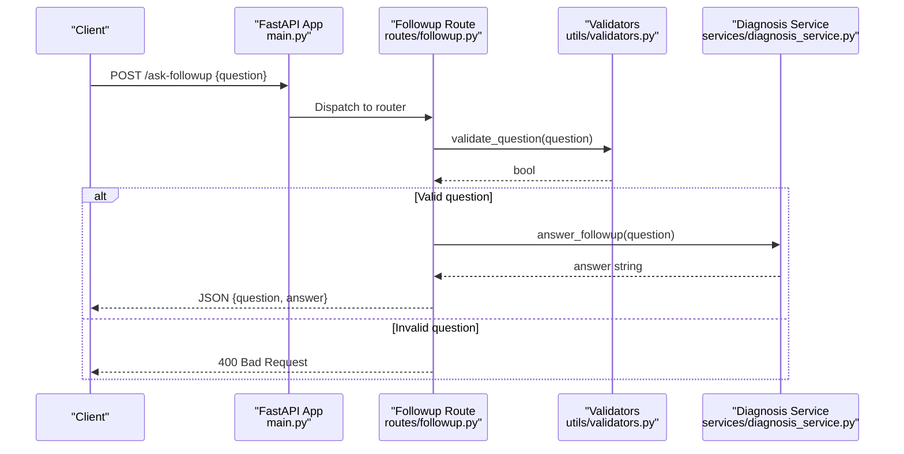
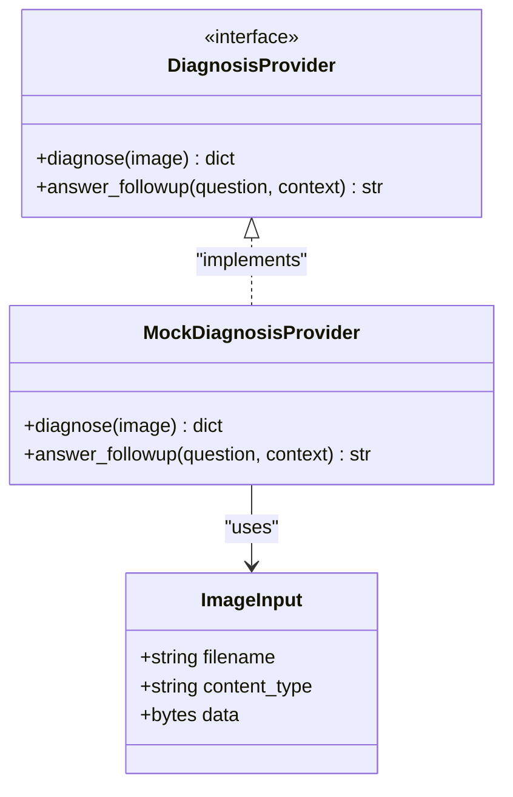
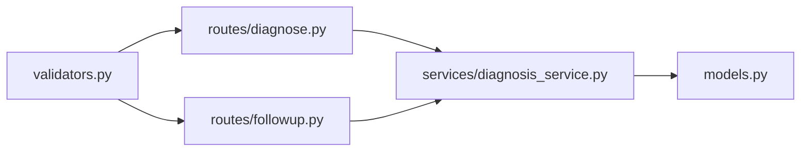

# Utilities and Helpers

<cite>
**Referenced Files in This Document**
- [validators.py](file://backend/utils/validators.py)
- [diagnose.py](file://backend/routes/diagnose.py)
- [followup.py](file://backend/routes/followup.py)
- [diagnosis_service.py](file://backend/services/diagnosis_service.py)
- [models.py](file://backend/models.py)
- [main.py](file://backend/main.py)
</cite>

## Table of Contents
1. [Introduction](#introduction)
2. [Project Structure](#project-structure)
3. [Core Components](#core-components)
4. [Architecture Overview](#architecture-overview)
5. [Detailed Component Analysis](#detailed-component-analysis)
6. [Dependency Analysis](#dependency-analysis)
7. [Performance Considerations](#performance-considerations)
8. [Troubleshooting Guide](#troubleshooting-guide)
9. [Conclusion](#conclusion)
10. [Appendices](#appendices)

## Introduction
This document explains the utility functions and helper modules that power FasalDoc’s backend, focusing on image validation, question validation for follow-up Q&A, and shared helpers used across routes and services. It also covers error handling patterns, integration points with FastAPI routes, performance considerations, and best practices for creating reusable utilities.

## Project Structure
The backend is organized into:
- Routes: FastAPI endpoints that validate inputs and delegate to services.
- Services: Business logic layer (currently a mock provider with an interface ready for real AI).
- Utils: Shared validation helpers used by multiple routes.
- Models: Pydantic request/response contracts.
- Main: Application entry point wiring routers and CORS.

**Diagram sources**
- [main.py:6-8](file://backend/main.py#L6-L8)
- [diagnose.py:1-9](file://backend/routes/diagnose.py#L1-L9)
- [followup.py:1-6](file://backend/routes/followup.py#L1-L6)
- [validators.py:1-19](file://backend/utils/validators.py#L1-L19)
- [diagnosis_service.py:1-28](file://backend/services/diagnosis_service.py#L1-L28)
- [models.py:1-7](file://backend/models.py#L1-L7)

**Section sources**
- [main.py:1-45](file://backend/main.py#L1-L45)
- [diagnose.py:1-59](file://backend/routes/diagnose.py#L1-L59)
- [followup.py:1-40](file://backend/routes/followup.py#L1-L40)
- [validators.py:1-19](file://backend/utils/validators.py#L1-L19)
- [diagnosis_service.py:1-128](file://backend/services/diagnosis_service.py#L1-L128)
- [models.py:1-58](file://backend/models.py#L1-L58)

## Core Components
- Image validation utilities:
  - Allowed types: JPEG, PNG, WEBP.
  - Size limit: up to 10 MB.
  - Type check function validates MIME content type.
  - Size check function validates byte length against the limit.
- Question validation utility:
  - Ensures non-empty, non-whitespace-only questions for follow-up requests.
- Service-layer helpers:
  - Provider abstraction with a mock implementation and lazy initialization.
  - Module-level helpers to run diagnosis and answer follow-ups.

These utilities are consumed by:
- Diagnose route: validates image type, reads data, checks size, then delegates to service.
- Follow-up route: validates question text, then delegates to service.

**Section sources**
- [validators.py:1-19](file://backend/utils/validators.py#L1-L19)
- [diagnose.py:21-43](file://backend/routes/diagnose.py#L21-L43)
- [followup.py:18-23](file://backend/routes/followup.py#L18-L23)
- [diagnosis_service.py:40-128](file://backend/services/diagnosis_service.py#L40-L128)

## Architecture Overview
The application follows a layered design:
- Routes perform input validation using utils and call services.
- Services encapsulate business logic and abstract the AI provider behind a stable protocol.
- Models define strict request/response schemas enforced by Pydantic.

**Diagram sources**
- [main.py:37-38](file://backend/main.py#L37-L38)
- [diagnose.py:13-59](file://backend/routes/diagnose.py#L13-L59)
- [validators.py:10-15](file://backend/utils/validators.py#L10-L15)
- [diagnosis_service.py:101-123](file://backend/services/diagnosis_service.py#L101-L123)
- [models.py:10-31](file://backend/models.py#L10-L31)

## Detailed Component Analysis

### Image Validation Utilities
- Allowed image types: JPEG, PNG, WEBP.
- Maximum file size: 10 MB.
- Functions:
  - Content-type validation returns boolean based on allowed set.
  - Size validation compares uploaded bytes to the maximum.

Usage in diagnose route:
- Validate content type before reading payload.
- Read image bytes and reject empty uploads early.
- Validate size after reading to avoid processing oversized payloads.
- Delegate to service only after all validations pass.

Error handling:
- Invalid type or size results in HTTP 400 with clear messages.
- Empty upload handled explicitly.

Best practices:
- Centralize allowed types and limits in one module for easy updates.
- Keep validation pure and side-effect free.

**Section sources**
- [validators.py:1-15](file://backend/utils/validators.py#L1-L15)
- [diagnose.py:21-43](file://backend/routes/diagnose.py#L21-L43)

#### Flowchart: Image Upload Validation

**Diagram sources**
- [diagnose.py:21-43](file://backend/routes/diagnose.py#L21-L43)
- [validators.py:10-15](file://backend/utils/validators.py#L10-L15)

### Question Validation Utilities
- Validates that the question string is present and not whitespace-only.
- Used in the follow-up endpoint to prevent empty or meaningless queries.

Integration:
- The follow-up route raises HTTP 400 if validation fails.
- On success, it calls the service to generate an answer.

Error handling:
- Returns HTTP 400 with a user-friendly message when validation fails.
- Wraps service calls to convert unexpected exceptions into HTTP 500 responses.

**Section sources**
- [validators.py:18-19](file://backend/utils/validators.py#L18-L19)
- [followup.py:18-34](file://backend/routes/followup.py#L18-L34)

#### Sequence: Follow-up Question Handling

**Diagram sources**
- [main.py:37-38](file://backend/main.py#L37-L38)
- [followup.py:10-39](file://backend/routes/followup.py#L10-L39)
- [validators.py:18-19](file://backend/utils/validators.py#L18-L19)
- [diagnosis_service.py:126-127](file://backend/services/diagnosis_service.py#L126-L127)

### Service Layer Helpers
- Provider Protocol:
  - Defines a stable interface for diagnosis and follow-up answers.
  - Enables swapping mock and real providers without changing routes.
- Mock Provider:
  - Provides deterministic responses for offline development and testing.
- Lazy Provider Initialization:
  - Checks environment configuration and attempts to load a real provider; falls back to mock if unavailable.
- Module-level helpers:
  - run_diagnosis constructs an image input and delegates to the provider.
  - answer_followup forwards the question and optional context to the provider.

Error handling:
- If the real provider cannot be created, logs a warning and uses the mock.
- Routes wrap service calls to ensure consistent HTTP error responses.

**Section sources**
- [diagnosis_service.py:40-128](file://backend/services/diagnosis_service.py#L40-L128)

#### Class Diagram: Provider Abstraction

**Diagram sources**
- [diagnosis_service.py:31-52](file://backend/services/diagnosis_service.py#L31-L52)
- [diagnosis_service.py:55-73](file://backend/services/diagnosis_service.py#L55-L73)

## Dependency Analysis
- Routes depend on validators for input validation and on services for business logic.
- Services depend on a provider abstraction; currently implemented by a mock provider.
- Models define contracts used by routes and validated by FastAPI.

**Diagram sources**
- [validators.py:1-19](file://backend/utils/validators.py#L1-L19)
- [diagnose.py:1-9](file://backend/routes/diagnose.py#L1-L9)
- [followup.py:1-6](file://backend/routes/followup.py#L1-L6)
- [diagnosis_service.py:1-28](file://backend/services/diagnosis_service.py#L1-L28)
- [models.py:1-7](file://backend/models.py#L1-L7)

**Section sources**
- [diagnose.py:1-59](file://backend/routes/diagnose.py#L1-L59)
- [followup.py:1-40](file://backend/routes/followup.py#L1-L40)
- [diagnosis_service.py:1-128](file://backend/services/diagnosis_service.py#L1-L128)
- [models.py:1-58](file://backend/models.py#L1-L58)

## Performance Considerations
- Validate early:
  - Check content type before reading the entire payload to avoid unnecessary I/O.
  - Reject empty uploads immediately.
  - Validate size after reading to enforce limits without loading excessively large files into memory.
- Avoid repeated work:
  - Provider is lazily initialized once per process to minimize overhead.
- Memory usage:
  - Keep image data in memory only as needed; do not duplicate buffers.
- Extensibility:
  - The provider abstraction allows swapping in efficient implementations without altering routes.

[No sources needed since this section provides general guidance]

## Troubleshooting Guide
Common issues and resolutions:
- Unsupported image type:
  - Ensure the client sends correct MIME types (image/jpeg, image/png, image/webp).
  - The route will return HTTP 400 with a descriptive detail.
- Oversized images:
  - Enforce client-side limits and server-side validation; the route returns HTTP 400 when exceeding 10 MB.
- Empty uploads:
  - Validate that the file contains data before proceeding; the route returns HTTP 400 for empty payloads.
- Empty or whitespace-only questions:
  - The follow-up route validates and returns HTTP 400 if invalid.
- Unexpected service errors:
  - Routes catch exceptions and return HTTP 500 with a safe message; log details server-side.

Patterns used:
- Explicit validation functions returning booleans.
- Raising HTTPException with appropriate status codes and human-readable messages.
- Wrapping service calls to normalize errors to HTTP responses.

**Section sources**
- [diagnose.py:21-59](file://backend/routes/diagnose.py#L21-L59)
- [followup.py:18-34](file://backend/routes/followup.py#L18-L34)
- [diagnosis_service.py:75-95](file://backend/services/diagnosis_service.py#L75-L95)

## Conclusion
FasalDoc’s backend centralizes validation in a small, focused utility module and enforces strict contracts via Pydantic models. Routes remain thin, delegating to a service layer that abstracts the AI provider. This design promotes reusability, testability, and maintainability while providing clear error handling and performance-conscious validation flows.

[No sources needed since this section summarizes without analyzing specific files]

## Appendices

### Integration Examples
- Diagnosing an image:
  - Send a multipart POST to /diagnose with a valid image file.
  - The route validates type and size, then calls the service and returns a structured response.
- Asking a follow-up question:
  - Send a JSON POST to /ask-followup with a non-empty question.
  - The route validates the question and returns an answer from the service.

References:
- Endpoint definitions and flow are implemented in the diagnose and followup routes.
- Response shapes are defined in models.

**Section sources**
- [diagnose.py:13-59](file://backend/routes/diagnose.py#L13-L59)
- [followup.py:10-39](file://backend/routes/followup.py#L10-L39)
- [models.py:10-58](file://backend/models.py#L10-L58)

### Creating New Utility Functions
Guidelines:
- Keep functions pure and stateless where possible.
- Return explicit booleans or typed results for clarity.
- Centralize constants (e.g., allowed types, limits) in the utils module.
- Use descriptive names and concise docstrings.
- Add tests to cover edge cases (empty inputs, boundary values).

Reusability tips:
- Export only what is needed by multiple routes.
- Avoid side effects in validators.
- Prefer small, composable functions over monolithic helpers.

**Section sources**
- [validators.py:1-19](file://backend/utils/validators.py#L1-L19)