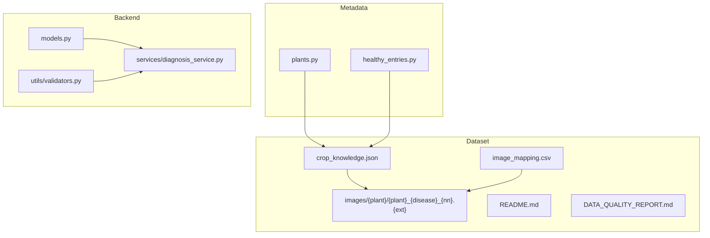
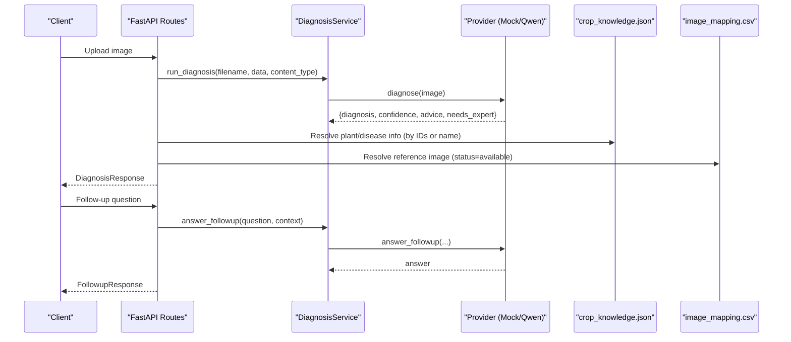
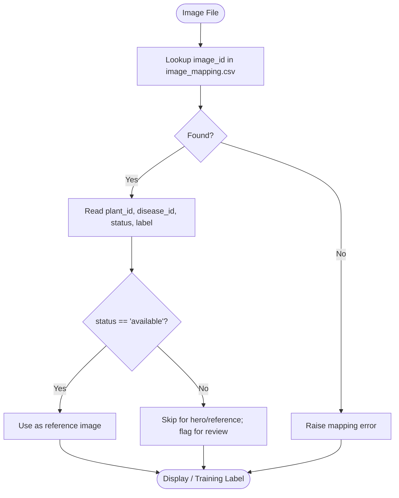
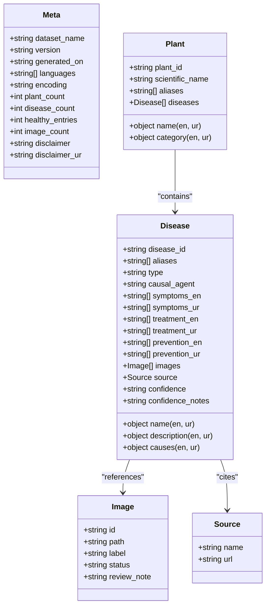
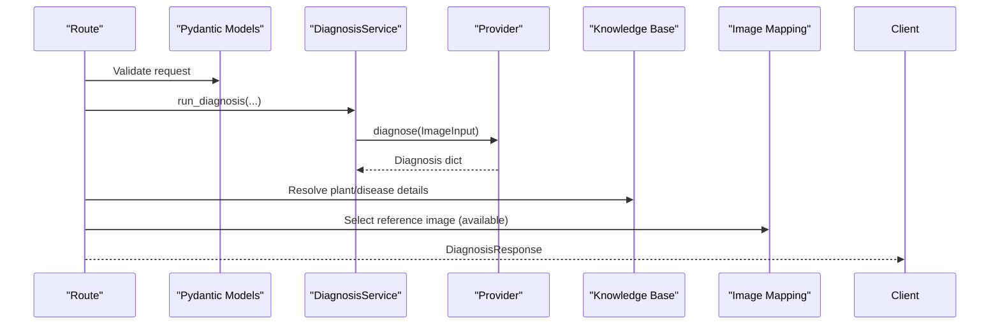
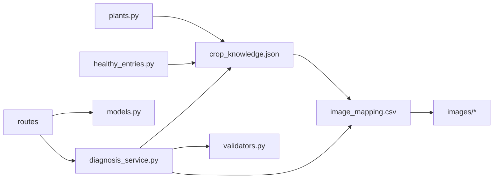

# Data Management

<cite>
**Referenced Files in This Document**
- [crop_knowledge.json](file://data/plant_disease_dataset/crop_knowledge.json)
- [image_mapping.csv](file://data/plant_disease_dataset/image_mapping.csv)
- [README.md](file://data/plant_disease_dataset/README.md)
- [DATA_QUALITY_REPORT.md](file://data/plant_disease_dataset/DATA_QUALITY_REPORT.md)
- [plants.py](file://data/dataset/plants.py)
- [healthy_entries.py](file://data/dataset/healthy_entries.py)
- [models.py](file://backend/models.py)
- [diagnosis_service.py](file://backend/services/diagnosis_service.py)
- [validators.py](file://backend/utils/validators.py)
</cite>

## Table of Contents
1. [Introduction](#introduction)
2. [Project Structure](#project-structure)
3. [Core Components](#core-components)
4. [Architecture Overview](#architecture-overview)
5. [Detailed Component Analysis](#detailed-component-analysis)
6. [Dependency Analysis](#dependency-analysis)
7. [Performance Considerations](#performance-considerations)
8. [Troubleshooting Guide](#troubleshooting-guide)
9. [Conclusion](#conclusion)
10. [Appendices](#appendices)

## Introduction
This document explains FasalDoc’s data management for plant disease information. It covers how the dataset is organized, the crop knowledge schema, image mapping structure, validation and quality assurance processes, lifecycle management, and how backend models interact with the dataset. It also provides practical guidance for adding new crops or diseases while maintaining consistency across files.

## Project Structure
The dataset and related assets are centralized under data/plant_disease_dataset and supporting metadata under data/dataset. The backend exposes API contracts and services that consume this data to deliver diagnoses and follow-up responses.

**Diagram sources**
- [crop_knowledge.json:1-18](file://data/plant_disease_dataset/crop_knowledge.json#L1-L18)
- [image_mapping.csv:1-2](file://data/plant_disease_dataset/image_mapping.csv#L1-L2)
- [README.md:9-15](file://data/plant_disease_dataset/README.md#L9-L15)
- [plants.py:4-66](file://data/dataset/plants.py#L4-L66)
- [healthy_entries.py:9-34](file://data/dataset/healthy_entries.py#L9-L34)
- [models.py:10-58](file://backend/models.py#L10-L58)
- [diagnosis_service.py:31-128](file://backend/services/diagnosis_service.py#L31-L128)
- [validators.py:1-19](file://backend/utils/validators.py#L1-L19)

**Section sources**
- [README.md:9-15](file://data/plant_disease_dataset/README.md#L9-L15)
- [crop_knowledge.json:1-18](file://data/plant_disease_dataset/crop_knowledge.json#L1-L18)
- [image_mapping.csv:1-2](file://data/plant_disease_dataset/image_mapping.csv#L1-L2)
- [plants.py:4-66](file://data/dataset/plants.py#L4-L66)
- [healthy_entries.py:9-34](file://data/dataset/healthy_entries.py#L9-L34)
- [models.py:10-58](file://backend/models.py#L10-L58)
- [diagnosis_service.py:31-128](file://backend/services/diagnosis_service.py#L31-L128)
- [validators.py:1-19](file://backend/utils/validators.py#L1-L19)

## Core Components
- Crop Knowledge JSON: Central bilingual knowledge base containing plants, diseases, symptoms, causes, treatments, prevention, images, sources, and confidence notes.
- Image Mapping CSV: Flat table linking each image to a unique ID, path, original filename, source folder, plant, disease, label, status, and review notes.
- Plant Metadata (Python): Canonical names, scientific names, categories, aliases, slugs, and folder-to-plant mappings used by scripts and UI.
- Healthy Entries (Python): One per plant; displayed when the classifier predicts “healthy.”
- Backend Models: Pydantic contracts for diagnosis and follow-up requests/responses.
- Diagnosis Service: Provider abstraction with mock fallback; routes call it to run diagnosis and answer follow-ups.
- Validators: Input validation for image types, sizes, and follow-up questions.

**Section sources**
- [crop_knowledge.json:18-62](file://data/plant_disease_dataset/crop_knowledge.json#L18-L62)
- [image_mapping.csv:1-2](file://data/plant_disease_dataset/image_mapping.csv#L1-L2)
- [plants.py:4-66](file://data/dataset/plants.py#L4-L66)
- [healthy_entries.py:9-34](file://data/dataset/healthy_entries.py#L9-L34)
- [models.py:10-58](file://backend/models.py#L10-L58)
- [diagnosis_service.py:31-128](file://backend/services/diagnosis_service.py#L31-L128)
- [validators.py:1-19](file://backend/utils/validators.py#L1-L19)

## Architecture Overview
The system loads the knowledge base and image mapping to power result pages and classification outputs. The backend receives an image, runs diagnosis via a provider (mock or real), and returns a standardized response. Follow-up questions are answered through the same provider interface.

**Diagram sources**
- [diagnosis_service.py:116-128](file://backend/services/diagnosis_service.py#L116-L128)
- [models.py:10-58](file://backend/models.py#L10-L58)
- [crop_knowledge.json:18-62](file://data/plant_disease_dataset/crop_knowledge.json#L18-L62)
- [image_mapping.csv:1-2](file://data/plant_disease_dataset/image_mapping.csv#L1-L2)

## Detailed Component Analysis

### Dataset Organization
- Images are organized by crop folders under images/{plant}/ with normalized filenames following the pattern plant_disease_nn.ext.
- Each image has a stable image_id and is linked to a plant_id and disease_id.
- The mapping CSV includes original_filename, source_folder, plant, disease, image_label, status, and review_note fields to support QA and display logic.

**Diagram sources**
- [image_mapping.csv:1-2](file://data/plant_disease_dataset/image_mapping.csv#L1-L2)
- [README.md:120-137](file://data/plant_disease_dataset/README.md#L120-L137)

**Section sources**
- [image_mapping.csv:1-2](file://data/plant_disease_dataset/image_mapping.csv#L1-L2)
- [README.md:120-137](file://data/plant_disease_dataset/README.md#L120-L137)

### Crop Knowledge JSON Schema
- meta: dataset_name, version, generated_on, languages, encoding, counts, disclaimer (EN/UR).
- plants: array of plant objects with plant_id, name (en/ur), scientific_name, category (en/ur), aliases, and diseases.
- diseases: array with disease_id, name (en/ur), aliases, type, causal_agent, description (en/ur), symptoms (parallel arrays en/ur), causes (en/ur), treatment (parallel arrays en/ur), prevention (parallel arrays en/ur), images (id, path, label, status, optional review_note), source (name, url), confidence, confidence_notes.

Key conventions:
- All user-facing text is bilingual {en, ur}.
- Arrays like symptoms/treatment/prevention are parallel between EN and UR.
- Stable IDs (PLxxx, DSxxx, IMGxxx) are used as classifier labels and DB keys.
- confidence indicates dataset quality, not model prediction certainty.

**Diagram sources**
- [crop_knowledge.json:18-62](file://data/plant_disease_dataset/crop_knowledge.json#L18-L62)
- [README.md:17-63](file://data/plant_disease_dataset/README.md#L17-L63)

**Section sources**
- [crop_knowledge.json:18-62](file://data/plant_disease_dataset/crop_knowledge.json#L18-L62)
- [README.md:17-63](file://data/plant_disease_dataset/README.md#L17-L63)

### Image Mapping CSV Structure
Columns include:
- image_id: unique identifier for each image.
- image_path: relative path from dataset root.
- original_filename: original file name before normalization.
- source_folder: canonical crop folder name.
- plant_id, plant: stable plant ID and display name.
- disease_id, disease: stable disease ID and display name.
- image_label: human-readable caption.
- status: available or needs_review.
- review_note: optional note explaining issues.

Usage:
- Maps training labels to images.
- Drives selection of reference images on result pages (skip needs_review).
- Supports QA workflows and audits.

**Section sources**
- [image_mapping.csv:1-2](file://data/plant_disease_dataset/image_mapping.csv#L1-L2)
- [README.md:120-137](file://data/plant_disease_dataset/README.md#L120-L137)

### Data Validation Rules
- Image upload validation:
  - Allowed types: JPEG, PNG, WebP.
  - Max size: 10 MB.
  - Follow-up question must be non-empty after trimming.
- Dataset-level validation (per quality report):
  - Valid UTF-8 JSON with correct counts.
  - Unique IDs across plants, diseases, images.
  - Every bilingual field non-empty in both languages.
  - Parallel arrays lengths match between EN and UR.
  - Urdu script present in every ur field; no mojibake.
  - All referenced image paths exist on disk; counts match meta.
  - CSV rows consistent with JSON IDs.

**Section sources**
- [validators.py:1-19](file://backend/utils/validators.py#L1-L19)
- [DATA_QUALITY_REPORT.md:100-108](file://data/plant_disease_dataset/DATA_QUALITY_REPORT.md#L100-L108)

### Quality Assurance Processes
- Automated checks:
  - Validate JSON structure, counts, ID uniqueness, bilingual completeness, image existence, and CSV consistency.
- Manual verification:
  - Spot-checking sample of images; flagged items marked needs_review with notes.
  - Confidence levels assigned per entry (high, medium, needs_verification).
- Change log:
  - Corrections to typos, source URLs, disease names, and content splits (treatment vs prevention).
  - Normalization of image filenames and extensions.

Operational guidance:
- Before production use, review all flagged images and entries.
- Maintain the DATA_QUALITY_REPORT as the single source of truth for changes and open items.

**Section sources**
- [DATA_QUALITY_REPORT.md:9-38](file://data/plant_disease_dataset/DATA_QUALITY_REPORT.md#L9-L38)
- [DATA_QUALITY_REPORT.md:49-72](file://data/plant_disease_dataset/DATA_QUALITY_REPORT.md#L49-L72)
- [DATA_QUALITY_REPORT.md:100-108](file://data/plant_disease_dataset/DATA_QUALITY_REPORT.md#L100-L108)

### Data Lifecycle Management
- Creation:
  - Build from master spreadsheet into enhanced Excel, JSON, CSV, and normalized images.
  - Assign stable IDs and bilingual content.
- Validation:
  - Run automated validators; fix reported issues.
  - Perform manual spot-checks; mark needs_review where necessary.
- Release:
  - Publish JSON and CSV; ensure image paths resolve correctly.
  - Update README with usage guidance and display suggestions.
- Maintenance:
  - Track changes in DATA_QUALITY_REPORT.
  - Periodically re-validate and re-review flagged items.
  - Rotate out low-confidence or problematic images.

**Section sources**
- [DATA_QUALITY_REPORT.md:9-38](file://data/plant_disease_dataset/DATA_QUALITY_REPORT.md#L9-L38)
- [README.md:72-137](file://data/plant_disease_dataset/README.md#L72-L137)

### Backend Interaction with Dataset
- Models:
  - DiagnosisResponse and FollowupRequest/Response define API contracts.
- Service:
  - run_diagnosis wraps image input and calls provider.diagnose.
  - answer_followup delegates to provider.answer_followup.
  - Provider selection falls back to Mock if real provider is unavailable.
- Display:
  - Result pages map classifier output to crop_knowledge entries using plant_id and disease_id.
  - Reference images selected from image_mapping with status=available.

**Diagram sources**
- [models.py:10-58](file://backend/models.py#L10-L58)
- [diagnosis_service.py:116-128](file://backend/services/diagnosis_service.py#L116-L128)
- [crop_knowledge.json:18-62](file://data/plant_disease_dataset/crop_knowledge.json#L18-L62)
- [image_mapping.csv:1-2](file://data/plant_disease_dataset/image_mapping.csv#L1-L2)

**Section sources**
- [models.py:10-58](file://backend/models.py#L10-L58)
- [diagnosis_service.py:31-128](file://backend/services/diagnosis_service.py#L31-L128)

### Adding New Crop Categories or Disease Types
To add a new crop or disease consistently:

1. Define or update metadata:
   - Add plant entry to plants.py with canonical name, scientific name, category, aliases, slug, and folder mapping.
   - If needed, add a healthy entry in healthy_entries.py for the new crop.

2. Extend the knowledge base:
   - Add a new plant object in crop_knowledge.json with a unique plant_id and diseases array.
   - For each disease, assign a unique disease_id and fill bilingual fields, symptoms, causes, treatment, prevention, images, source, confidence, and confidence_notes.

3. Prepare images:
   - Place normalized images under images/{plant}/ with naming convention plant_disease_nn.ext.
   - Ensure at least one image with status=available per disease for reference display.

4. Update mapping:
   - Add rows in image_mapping.csv linking each image to its image_id, path, original_filename, source_folder, plant_id, plant, disease_id, disease, image_label, status, and review_note.

5. Validate:
   - Re-run dataset validators to check JSON validity, ID uniqueness, bilingual completeness, and image existence.
   - Review any flagged items in DATA_QUALITY_REPORT.

6. Integrate with backend:
   - Ensure classifier supports the new classes (plant + disease combinations).
   - Confirm result pages can resolve the new entries via plant_id and disease_id.

7. Release and maintain:
   - Update README with any schema or usage changes.
   - Record additions and decisions in DATA_QUALITY_REPORT.

**Section sources**
- [plants.py:4-66](file://data/dataset/plants.py#L4-L66)
- [healthy_entries.py:9-34](file://data/dataset/healthy_entries.py#L9-L34)
- [crop_knowledge.json:18-62](file://data/plant_disease_dataset/crop_knowledge.json#L18-L62)
- [image_mapping.csv:1-2](file://data/plant_disease_dataset/image_mapping.csv#L1-L2)
- [DATA_QUALITY_REPORT.md:100-108](file://data/plant_disease_dataset/DATA_QUALITY_REPORT.md#L100-L108)
- [README.md:72-137](file://data/plant_disease_dataset/README.md#L72-L137)

## Dependency Analysis
- Dataset dependencies:
  - crop_knowledge.json depends on images/ for referenced paths.
  - image_mapping.csv depends on images/ and aligns with crop_knowledge.json IDs.
  - plants.py and healthy_entries.py provide canonical mappings and healthy messages used by UI and processing scripts.
- Backend dependencies:
  - models.py defines contracts consumed by routes and frontend.
  - diagnosis_service.py abstracts AI provider; routes depend only on service helpers.
  - validators.py enforces input constraints for uploads and follow-ups.

**Diagram sources**
- [plants.py:4-66](file://data/dataset/plants.py#L4-L66)
- [healthy_entries.py:9-34](file://data/dataset/healthy_entries.py#L9-L34)
- [crop_knowledge.json:18-62](file://data/plant_disease_dataset/crop_knowledge.json#L18-L62)
- [image_mapping.csv:1-2](file://data/plant_disease_dataset/image_mapping.csv#L1-L2)
- [models.py:10-58](file://backend/models.py#L10-L58)
- [diagnosis_service.py:31-128](file://backend/services/diagnosis_service.py#L31-L128)
- [validators.py:1-19](file://backend/utils/validators.py#L1-L19)

**Section sources**
- [plants.py:4-66](file://data/dataset/plants.py#L4-L66)
- [healthy_entries.py:9-34](file://data/dataset/healthy_entries.py#L9-L34)
- [crop_knowledge.json:18-62](file://data/plant_disease_dataset/crop_knowledge.json#L18-L62)
- [image_mapping.csv:1-2](file://data/plant_disease_dataset/image_mapping.csv#L1-L2)
- [models.py:10-58](file://backend/models.py#L10-L58)
- [diagnosis_service.py:31-128](file://backend/services/diagnosis_service.py#L31-L128)
- [validators.py:1-19](file://backend/utils/validators.py#L1-L19)

## Performance Considerations
- Loading the knowledge base once and caching indices reduces repeated parsing overhead.
- Prebuilding a client-side index over plant and disease names and aliases improves search performance.
- Using stable IDs (plant_id, disease_id) avoids expensive string matching during result rendering.
- Limiting reference image selection to status=available reduces unnecessary checks.

[No sources needed since this section provides general guidance]

## Troubleshooting Guide
Common issues and resolutions:
- Missing or invalid image paths:
  - Verify image exists on disk and matches image_mapping.csv path.
  - Check normalization rules (lowercase, extension handling).
- Needs_review images:
  - Inspect review_note and replace or relabel as needed.
- Bilingual inconsistencies:
  - Ensure symptoms/treatment/prevention arrays have equal length in EN and UR.
  - Confirm every ur field contains Urdu text without mojibake.
- Validator failures:
  - Re-run dataset validators and address reported mismatches in counts or IDs.
- Upload errors:
  - Confirm image type is allowed and size within limits.
  - Ensure follow-up question is non-empty.

**Section sources**
- [DATA_QUALITY_REPORT.md:49-72](file://data/plant_disease_dataset/DATA_QUALITY_REPORT.md#L49-L72)
- [DATA_QUALITY_REPORT.md:100-108](file://data/plant_disease_dataset/DATA_QUALITY_REPORT.md#L100-L108)
- [validators.py:1-19](file://backend/utils/validators.py#L1-L19)

## Conclusion
FasalDoc’s data management centers on a robust, bilingual knowledge base and a precise image mapping layer. The dataset is validated automatically and manually reviewed to ensure high quality. Backend models and services integrate cleanly with the dataset to deliver diagnoses and follow-up answers. Following the outlined procedures ensures consistent expansion of crops and diseases while maintaining reliability and usability.

[No sources needed since this section summarizes without analyzing specific files]

## Appendices

### Example: Adding a New Disease to an Existing Crop
Steps:
- Choose a unique disease_id and populate all required fields in crop_knowledge.json for the target plant.
- Add corresponding images under images/{plant}/ and update image_mapping.csv with image_id, path, and metadata.
- Set status appropriately (available or needs_review) and include review_note if needed.
- Re-run validators and update DATA_QUALITY_REPORT with the addition.

**Section sources**
- [crop_knowledge.json:18-62](file://data/plant_disease_dataset/crop_knowledge.json#L18-L62)
- [image_mapping.csv:1-2](file://data/plant_disease_dataset/image_mapping.csv#L1-L2)
- [DATA_QUALITY_REPORT.md:100-108](file://data/plant_disease_dataset/DATA_QUALITY_REPORT.md#L100-L108)