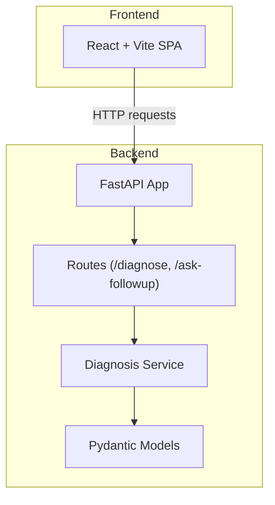
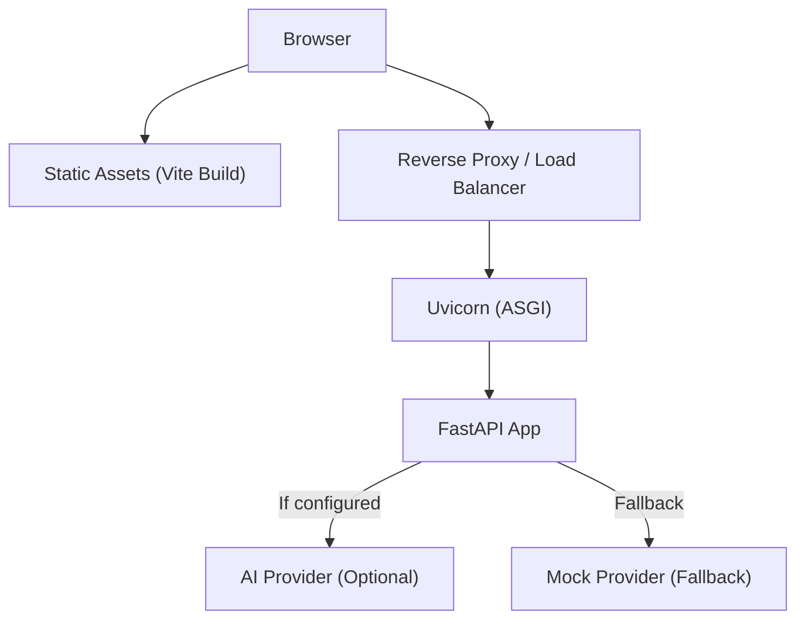
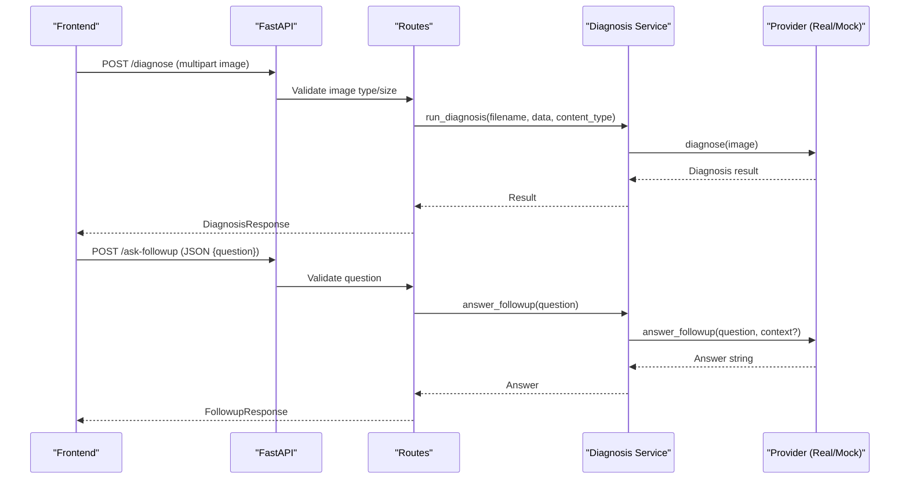
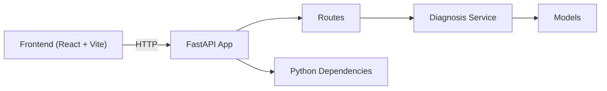

# Deployment and Configuration

<cite>
**Referenced Files in This Document**
- [backend/main.py](file://backend/main.py)
- [backend/routes/diagnose.py](file://backend/routes/diagnose.py)
- [backend/routes/followup.py](file://backend/routes/followup.py)
- [backend/services/diagnosis_service.py](file://backend/services/diagnosis_service.py)
- [backend/models.py](file://backend/models.py)
- [requirements.txt](file://requirements.txt)
- [frontend/vite.config.ts](file://frontend/vite.config.ts)
- [frontend/package.json](file://frontend/package.json)
- [frontend/src/services/api.ts](file://frontend/src/services/api.ts)
- [demo_backup/render.yaml](file://demo_backup/render.yaml)
- [README.md](file://README.md)
- [tests/test_api.py](file://tests/test_api.py)
</cite>

## Table of Contents
1. Introduction
2. Project Structure
3. Core Components
4. Architecture Overview
5. Detailed Component Analysis
6. Dependency Analysis
7. Performance Considerations
8. Troubleshooting Guide
9. Conclusion
10. Appendices

## Introduction
This document provides production deployment guidance for FasalDoc, covering Render platform configuration, environment setup, build processes for the backend (Python) and frontend (Vite), environment variables, containerization strategies, scaling considerations, monitoring, security best practices, performance optimization, maintenance procedures, step-by-step deployment instructions, and troubleshooting common issues.

FasalDoc consists of:
- A FastAPI backend that serves diagnosis and follow-up endpoints with a mock AI fallback until real AI credentials are configured.
- A React + Vite frontend that calls the backend via an API base URL.

The repository includes a sample Render configuration for the backend and clear separation between build-time and runtime configuration.

## Project Structure
At a high level:
- Backend: FastAPI app with routes, service layer, models, and validators.
- Frontend: React application built with Vite; communicates with the backend via a configurable base URL.
- Tests: Offline tests using FastAPI TestClient to validate endpoints and behavior without external dependencies.
- Render config: Example service definition for deploying the backend on Render.

**Diagram sources**
- [backend/main.py:1-45](file://backend/main.py#L1-L45)
- [backend/routes/diagnose.py:1-59](file://backend/routes/diagnose.py#L1-L59)
- [backend/routes/followup.py:1-40](file://backend/routes/followup.py#L1-L40)
- [backend/services/diagnosis_service.py:1-128](file://backend/services/diagnosis_service.py#L1-L128)
- [backend/models.py:1-58](file://backend/models.py#L1-L58)
- [frontend/src/services/api.ts:1-99](file://frontend/src/services/api.ts#L1-L99)

**Section sources**
- [README.md:1-106](file://README.md#L1-L106)

## Core Components
- Backend entrypoint and CORS configuration: The FastAPI app sets up CORS based on environment variables and registers routers for diagnosis and follow-up endpoints. It exposes a health endpoint at the root path.
- Routes:
  - POST /diagnose: Accepts multipart image uploads, validates type and size, then delegates to the diagnosis service.
  - POST /ask-followup: Accepts JSON with a question, validates input, and returns an answer from the diagnosis service.
- Service layer: Provides a stable interface for diagnosis and follow-up answers. It selects a real provider if credentials exist or falls back to a mock provider when not configured.
- Models: Pydantic models define request/response contracts for both endpoints.
- Frontend API client: Centralized service that calls backend endpoints, handles errors, and enforces consistent validation rules.

Key environment variables:
- CORS_ALLOW_ORIGINS: Comma-separated list of allowed origins for CORS. Defaults to local development origins.
- DASHSCOPE_API_KEY: If present and valid, enables the real AI provider; otherwise, the service uses the offline mock.
- VITE_API_BASE_URL: Frontend-only variable that points to the backend API base URL.

**Section sources**
- [backend/main.py:1-45](file://backend/main.py#L1-L45)
- [backend/routes/diagnose.py:1-59](file://backend/routes/diagnose.py#L1-L59)
- [backend/routes/followup.py:1-40](file://backend/routes/followup.py#L1-L40)
- [backend/services/diagnosis_service.py:1-128](file://backend/services/diagnosis_service.py#L1-L128)
- [backend/models.py:1-58](file://backend/models.py#L1-L58)
- [frontend/src/services/api.ts:1-99](file://frontend/src/services/api.ts#L1-L99)

## Architecture Overview
The production architecture typically involves:
- A static frontend hosted on a CDN or web server.
- A backend API served by an ASGI server (Uvicorn) behind a reverse proxy.
- Optional integration with an AI provider via environment variables.

**Diagram sources**
- [backend/main.py:1-45](file://backend/main.py#L1-L45)
- [backend/services/diagnosis_service.py:1-128](file://backend/services/diagnosis_service.py#L1-L128)
- [frontend/src/services/api.ts:1-99](file://frontend/src/services/api.ts#L1-L99)

## Detailed Component Analysis

### Backend API Endpoints
- GET /: Health check returning a simple status message.
- POST /diagnose: Validates image type and size, reads the file, and delegates to the diagnosis service. Returns a structured response including diagnosis, confidence, advice, and escalation flag.
- POST /ask-followup: Validates the question payload and returns an answer from the service layer.

**Diagram sources**
- [backend/routes/diagnose.py:1-59](file://backend/routes/diagnose.py#L1-L59)
- [backend/routes/followup.py:1-40](file://backend/routes/followup.py#L1-L40)
- [backend/services/diagnosis_service.py:1-128](file://backend/services/diagnosis_service.py#L1-L128)

**Section sources**
- [backend/routes/diagnose.py:1-59](file://backend/routes/diagnose.py#L1-L59)
- [backend/routes/followup.py:1-40](file://backend/routes/followup.py#L1-L40)
- [backend/models.py:1-58](file://backend/models.py#L1-L58)

### Environment Variables and CORS
- CORS_ALLOW_ORIGINS: Controls which origins can call the API. In production, set this to your frontend domain(s).
- DASHSCOPE_API_KEY: Enables real AI provider if present and non-placeholder; otherwise, the service uses the offline mock.
- VITE_API_BASE_URL: Frontend-only variable used at build time to configure the backend URL.

CORS is applied globally in the FastAPI app and defaults to local development origins unless overridden.

**Section sources**
- [backend/main.py:1-45](file://backend/main.py#L1-L45)
- [backend/services/diagnosis_service.py:1-128](file://backend/services/diagnosis_service.py#L1-L128)
- [frontend/src/services/api.ts:1-99](file://frontend/src/services/api.ts#L1-L99)

### Build Processes
- Backend:
  - Install Python dependencies listed in requirements.txt.
  - Start the ASGI server (Uvicorn) bound to 0.0.0.0 and the port provided by the hosting platform.
- Frontend:
  - Run TypeScript compilation and Vite build to produce static assets.
  - Configure the backend URL via VITE_API_BASE_URL during build.

Render example:
- The sample Render configuration installs backend dependencies and starts Uvicorn with the correct host/port binding.

**Section sources**
- [requirements.txt:1-6](file://requirements.txt#L1-L6)
- [frontend/package.json:1-23](file://frontend/package.json#L1-L23)
- [frontend/vite.config.ts:1-10](file://frontend/vite.config.ts#L1-L10)
- [demo_backup/render.yaml:1-6](file://demo_backup/render.yaml#L1-L6)

### Containerization Strategy
- Backend:
  - Use a lightweight Python image with Uvicorn installed.
  - Copy requirements.txt and install dependencies in a separate layer for caching.
  - Expose the port defined by the platform (commonly 8000 or $PORT).
  - Set environment variables for CORS and optional AI provider.
- Frontend:
  - Build static assets with Vite and serve them via a static web server (e.g., Nginx or a CDN).
  - Inject VITE_API_BASE_URL at build time or via runtime configuration.

[No sources needed since this section provides general guidance]

### Scaling Considerations
- Horizontal scaling:
  - Deploy multiple backend instances behind a load balancer.
  - Ensure stateless design; avoid storing session data in memory.
- Concurrency:
  - Uvicorn workers should be tuned to match CPU cores and expected concurrency.
- Static assets:
  - Serve frontend assets from a CDN to reduce latency and offload origin traffic.
- Database and storage:
  - If adding persistent storage later, use managed services with connection pooling and read replicas as needed.

[No sources needed since this section provides general guidance]

### Monitoring Setup
- Application logs:
  - Centralize logs from Uvicorn and application modules.
  - Include correlation IDs for request tracing.
- Metrics:
  - Track request rates, error rates, and latency percentiles.
  - Monitor resource usage (CPU, memory) per instance.
- Health checks:
  - Expose a dedicated health endpoint for readiness/liveness probes.
- Alerts:
  - Alert on elevated error rates, increased latency, and unhealthy instances.

[No sources needed since this section provides general guidance]

## Dependency Analysis
The backend depends on FastAPI and Uvicorn, with optional AI provider integration controlled by environment variables. The frontend depends on React and Vite, calling the backend through a centralized API service.

**Diagram sources**
- [backend/main.py:1-45](file://backend/main.py#L1-L45)
- [backend/routes/diagnose.py:1-59](file://backend/routes/diagnose.py#L1-L59)
- [backend/routes/followup.py:1-40](file://backend/routes/followup.py#L1-L40)
- [backend/services/diagnosis_service.py:1-128](file://backend/services/diagnosis_service.py#L1-L128)
- [backend/models.py:1-58](file://backend/models.py#L1-L58)
- [requirements.txt:1-6](file://requirements.txt#L1-L6)
- [frontend/package.json:1-23](file://frontend/package.json#L1-L23)
- [frontend/src/services/api.ts:1-99](file://frontend/src/services/api.ts#L1-L99)

**Section sources**
- [requirements.txt:1-6](file://requirements.txt#L1-L6)
- [frontend/package.json:1-23](file://frontend/package.json#L1-L23)

## Performance Considerations
- Input validation:
  - Enforce strict image type and size limits to prevent abuse and reduce processing overhead.
- Caching:
  - Consider caching frequent responses or results where appropriate.
- Request size limits:
  - Configure upstream proxies to limit upload sizes consistently.
- Asset optimization:
  - Enable compression and caching headers for static assets.
- Concurrency tuning:
  - Adjust Uvicorn worker count based on workload characteristics.

[No sources needed since this section provides general guidance]

## Troubleshooting Guide
Common deployment issues and resolutions:
- CORS errors:
  - Ensure CORS_ALLOW_ORIGINS includes the frontend domain(s).
  - Verify that the browser’s Origin header matches an allowed origin.
- Frontend cannot reach backend:
  - Confirm VITE_API_BASE_URL is correctly set during build and points to the deployed backend.
  - Check network policies and firewall rules allowing inbound traffic to the backend.
- Upload failures:
  - Validate image type and size constraints on both frontend and backend.
  - Inspect error messages returned by the backend for specific validation failures.
- AI provider not active:
  - Ensure DASHSCOPE_API_KEY is set and not a placeholder.
  - Review logs for provider initialization warnings indicating fallback to mock.
- Health checks failing:
  - Verify the root endpoint responds successfully.
  - Check process health and resource utilization.

**Section sources**
- [backend/main.py:1-45](file://backend/main.py#L1-L45)
- [backend/routes/diagnose.py:1-59](file://backend/routes/diagnose.py#L1-L59)
- [backend/routes/followup.py:1-40](file://backend/routes/followup.py#L1-L40)
- [backend/services/diagnosis_service.py:1-128](file://backend/services/diagnosis_service.py#L1-L128)
- [frontend/src/services/api.ts:1-99](file://frontend/src/services/api.ts#L1-L99)
- [tests/test_api.py:1-129](file://tests/test_api.py#L1-L129)

## Conclusion
FasalDoc’s deployment is straightforward due to its modular design and clear separation of concerns. The backend runs on Uvicorn with robust CORS handling and a resilient service layer that gracefully falls back to a mock provider when AI credentials are absent. The frontend builds statically and calls the backend via a configurable base URL. For production, focus on secure environment configuration, proper CORS settings, scalable hosting, observability, and disciplined maintenance practices.

[No sources needed since this section summarizes without analyzing specific files]

## Appendices

### Step-by-Step Deployment Guide (Render)
- Backend:
  - Create a Render Web Service pointing to the repository.
  - Set build command to install Python dependencies and start Uvicorn with host 0.0.0.0 and the platform-provided port.
  - Configure environment variables:
    - CORS_ALLOW_ORIGINS: Add your frontend domain(s).
    - DASHSCOPE_API_KEY: Provide the key to enable real AI; leave blank for mock mode.
  - Deploy and verify the health endpoint.
- Frontend:
  - Build the static assets using Vite.
  - Set VITE_API_BASE_URL to point to the deployed backend.
  - Host the built assets on a static site host or CDN.

**Section sources**
- [demo_backup/render.yaml:1-6](file://demo_backup/render.yaml#L1-L6)
- [frontend/package.json:1-23](file://frontend/package.json#L1-L23)
- [frontend/src/services/api.ts:1-99](file://frontend/src/services/api.ts#L1-L99)
- [backend/main.py:1-45](file://backend/main.py#L1-L45)

### Environment Variables Reference
- CORS_ALLOW_ORIGINS:
  - Purpose: Define allowed origins for cross-origin requests.
  - Format: Comma-separated list of URLs.
  - Default: Local development origins.
- DASHSCOPE_API_KEY:
  - Purpose: Enable real AI provider; absence triggers mock fallback.
  - Behavior: If present and non-placeholder, attempts to initialize the real provider; otherwise uses mock.
- VITE_API_BASE_URL:
  - Purpose: Frontend-only configuration for backend base URL.
  - Default: Local development backend URL.

**Section sources**
- [backend/main.py:1-45](file://backend/main.py#L1-L45)
- [backend/services/diagnosis_service.py:1-128](file://backend/services/diagnosis_service.py#L1-L128)
- [frontend/src/services/api.ts:1-99](file://frontend/src/services/api.ts#L1-L99)

### Security Best Practices
- Restrict CORS to known domains only.
- Validate and sanitize all inputs; enforce strict limits on file uploads.
- Never expose secrets in frontend builds; keep API keys server-side.
- Use HTTPS everywhere; configure TLS termination at the reverse proxy or platform.
- Implement rate limiting and request throttling at the edge.
- Regularly update dependencies and monitor for vulnerabilities.

[No sources needed since this section provides general guidance]

### Maintenance Procedures
- Update dependencies periodically and test changes thoroughly.
- Rotate secrets and API keys regularly.
- Monitor logs and metrics; set alerts for anomalies.
- Perform periodic capacity planning and scale horizontally as needed.
- Back up any persistent data and ensure disaster recovery plans are in place.

[No sources needed since this section provides general guidance]