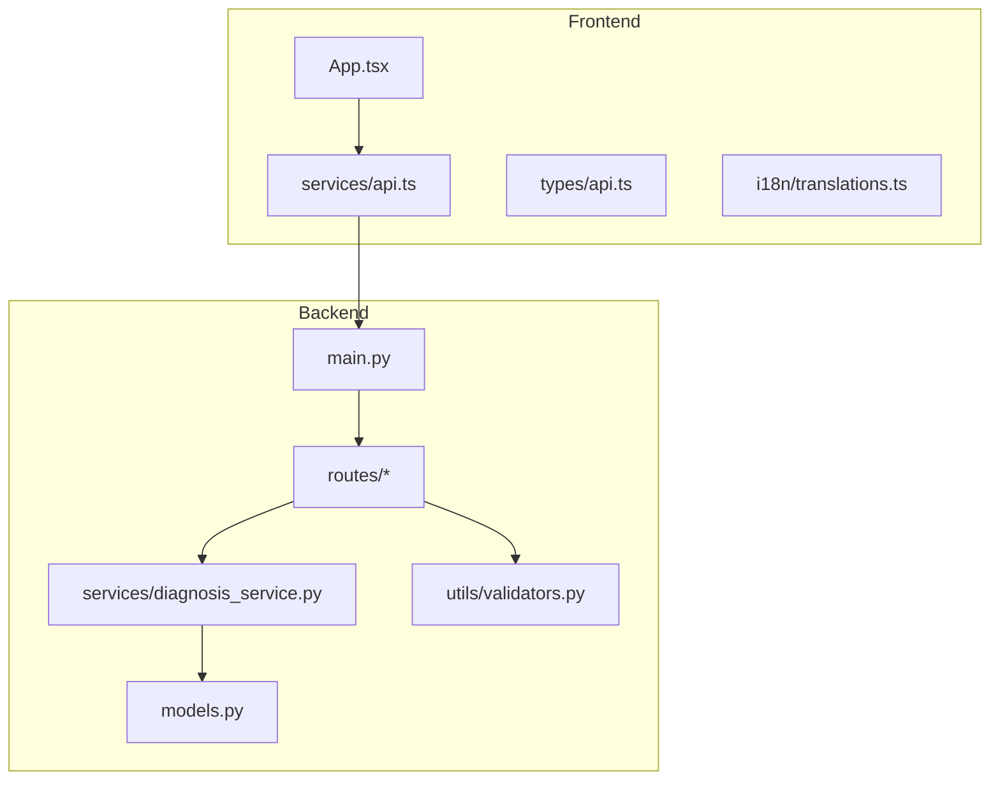
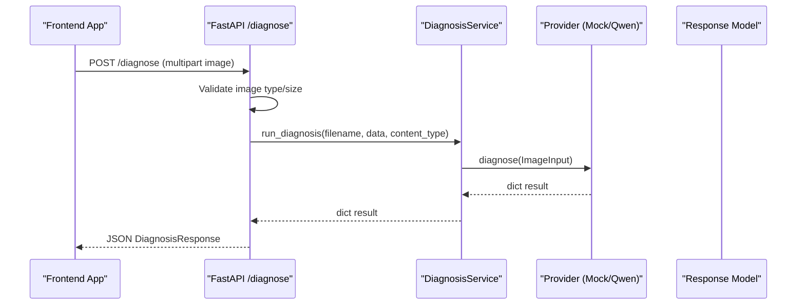
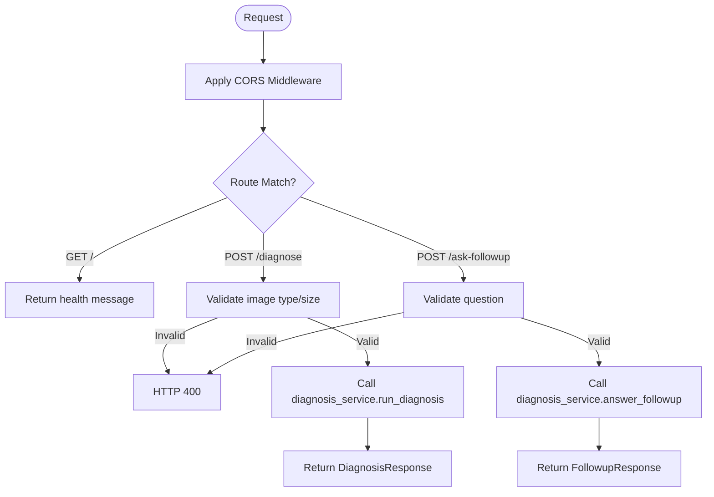
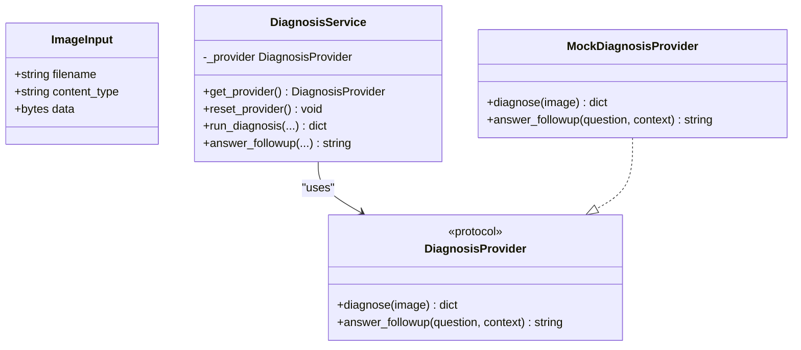
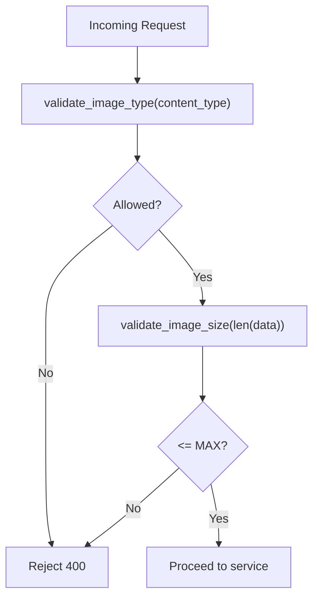
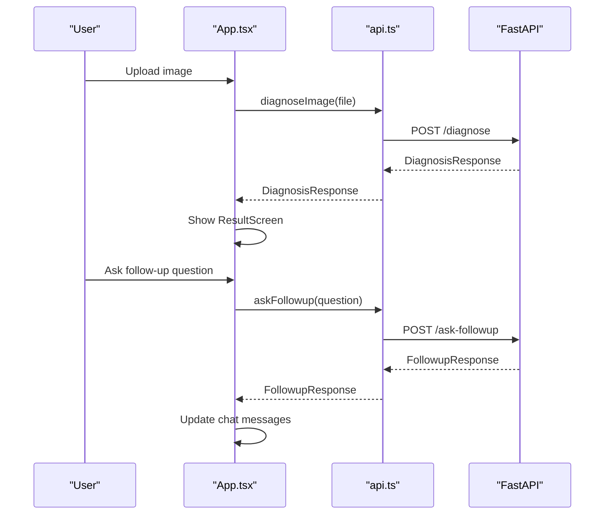
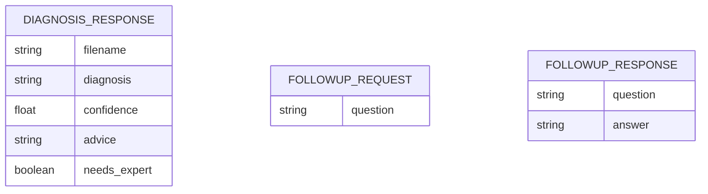
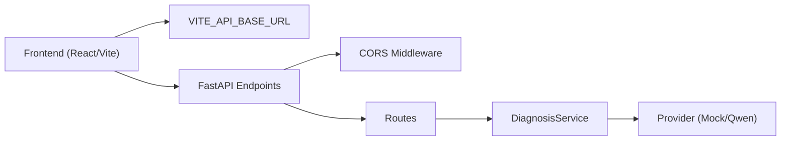

# Developer Guide

<cite>
**Referenced Files in This Document**
- [README.md](file://README.md)
- [requirements.txt](file://requirements.txt)
- [backend/main.py](file://backend/main.py)
- [backend/models.py](file://backend/models.py)
- [backend/routes/diagnose.py](file://backend/routes/diagnose.py)
- [backend/routes/followup.py](file://backend/routes/followup.py)
- [backend/services/diagnosis_service.py](file://backend/services/diagnosis_service.py)
- [backend/utils/validators.py](file://backend/utils/validators.py)
- [tests/test_api.py](file://tests/test_api.py)
- [frontend/src/App.tsx](file://frontend/src/App.tsx)
- [frontend/src/services/api.ts](file://frontend/src/services/api.ts)
- [frontend/src/types/api.ts](file://frontend/src/types/api.ts)
- [frontend/src/i18n/translations.ts](file://frontend/src/i18n/translations.ts)
- [frontend/vite.config.ts](file://frontend/vite.config.ts)
</cite>

## Table of Contents
1. Introduction
2. Project Structure
3. Core Components
4. Architecture Overview
5. Detailed Component Analysis
6. Dependency Analysis
7. Performance Considerations
8. Troubleshooting Guide
9. Conclusion
10. Appendices

## Introduction
FasalDoc is a crop-disease diagnosis assistant with a FastAPI backend and a React/Vite frontend. The backend currently runs fully offline using mock AI responses until the real Qwen/Alibaba Cloud provider is configured. This guide explains how to contribute, extend functionality (AI providers, language support, validators), follow development workflows, and maintain backward compatibility.

## Project Structure
The repository is organized into clear layers:
- Backend (FastAPI): routes, service layer, models, utilities
- Frontend (React + Vite): pages, components, services, types, i18n
- Tests: offline pytest suite
- Data: datasets and metadata for knowledge base

**Diagram sources**
- [backend/main.py:1-45](file://backend/main.py#L1-L45)
- [backend/routes/diagnose.py:1-59](file://backend/routes/diagnose.py#L1-L59)
- [backend/routes/followup.py:1-40](file://backend/routes/followup.py#L1-L40)
- [backend/services/diagnosis_service.py:1-128](file://backend/services/diagnosis_service.py#L1-L128)
- [backend/models.py:1-58](file://backend/models.py#L1-L58)
- [backend/utils/validators.py:1-19](file://backend/utils/validators.py#L1-L19)
- [frontend/src/App.tsx:1-336](file://frontend/src/App.tsx#L1-L336)
- [frontend/src/services/api.ts:1-99](file://frontend/src/services/api.ts#L1-L99)
- [frontend/src/types/api.ts:1-26](file://frontend/src/types/api.ts#L1-L26)
- [frontend/src/i18n/translations.ts:1-666](file://frontend/src/i18n/translations.ts#L1-L666)

**Section sources**
- [README.md:7-15](file://README.md#L7-L15)
- [requirements.txt:1-6](file://requirements.txt#L1-L6)

## Core Components
- API contracts: Pydantic models define request/response schemas that are mirrored in the frontend types to ensure consistency.
- Routes: Minimal endpoints that validate inputs and delegate to the service layer.
- Service layer: Provider abstraction allows swapping mock and real AI implementations without changing routes.
- Validators: Shared rules for image type/size and question validation used by both backend and frontend.
- Frontend app: Orchestrates screens, state, and API calls; centralizes error handling and user feedback.

Key extension points:
- Add a new AI provider by implementing the DiagnosisProvider protocol and factory.
- Extend language support by adding translations and updating the language selector.
- Introduce custom validators or input constraints in utils and mirror them in the frontend.

**Section sources**
- [backend/models.py:1-58](file://backend/models.py#L1-L58)
- [backend/routes/diagnose.py:1-59](file://backend/routes/diagnose.py#L1-L59)
- [backend/routes/followup.py:1-40](file://backend/routes/followup.py#L1-L40)
- [backend/services/diagnosis_service.py:1-128](file://backend/services/diagnosis_service.py#L1-L128)
- [backend/utils/validators.py:1-19](file://backend/utils/validators.py#L1-L19)
- [frontend/src/types/api.ts:1-26](file://frontend/src/types/api.ts#L1-L26)
- [frontend/src/services/api.ts:1-99](file://frontend/src/services/api.ts#L1-L99)
- [frontend/src/i18n/translations.ts:1-666](file://frontend/src/i18n/translations.ts#L1-L666)

## Architecture Overview
The system follows a layered architecture:
- Frontend UI triggers actions via a centralized API service.
- FastAPI routes validate requests and call the service layer.
- The service layer selects an AI provider based on environment configuration and falls back to a mock if unavailable.
- Models enforce schema contracts across frontend and backend.

**Diagram sources**
- [backend/routes/diagnose.py:13-59](file://backend/routes/diagnose.py#L13-L59)
- [backend/services/diagnosis_service.py:116-128](file://backend/services/diagnosis_service.py#L116-L128)
- [backend/models.py:10-31](file://backend/models.py#L10-L31)
- [frontend/src/services/api.ts:60-77](file://frontend/src/services/api.ts#L60-L77)

**Section sources**
- [backend/main.py:1-45](file://backend/main.py#L1-L45)
- [backend/routes/diagnose.py:1-59](file://backend/routes/diagnose.py#L1-L59)
- [backend/services/diagnosis_service.py:1-128](file://backend/services/diagnosis_service.py#L1-L128)

## Detailed Component Analysis

### Backend API Layer
- Health endpoint returns a simple status object.
- CORS middleware is configured for local frontend development and can be overridden via environment variables.
- Routers are mounted centrally and expose OpenAPI docs automatically.

**Diagram sources**
- [backend/main.py:19-38](file://backend/main.py#L19-L38)
- [backend/routes/diagnose.py:13-59](file://backend/routes/diagnose.py#L13-L59)
- [backend/routes/followup.py:10-40](file://backend/routes/followup.py#L10-L40)

**Section sources**
- [backend/main.py:1-45](file://backend/main.py#L1-L45)
- [backend/routes/diagnose.py:1-59](file://backend/routes/diagnose.py#L1-L59)
- [backend/routes/followup.py:1-40](file://backend/routes/followup.py#L1-L40)

### Service Layer and Provider Abstraction
- Defines a stable protocol for AI providers so routes remain unchanged when integrating real AI.
- Provides a mock implementation for offline development and testing.
- Lazily builds the active provider based on environment configuration and safely falls back to the mock.

**Diagram sources**
- [backend/services/diagnosis_service.py:31-128](file://backend/services/diagnosis_service.py#L31-L128)

**Section sources**
- [backend/services/diagnosis_service.py:1-128](file://backend/services/diagnosis_service.py#L1-L128)

### Validation Utilities
- Centralized constants and functions for allowed image types, maximum size, and question validation.
- Mirrored in the frontend to provide consistent UX and early client-side checks.

**Diagram sources**
- [backend/utils/validators.py:1-19](file://backend/utils/validators.py#L1-L19)
- [backend/routes/diagnose.py:21-43](file://backend/routes/diagnose.py#L21-L43)

**Section sources**
- [backend/utils/validators.py:1-19](file://backend/utils/validators.py#L1-L19)
- [frontend/src/services/api.ts:28-44](file://frontend/src/services/api.ts#L28-L44)

### Frontend Application Flow
- Manages multi-step flows: login/signup, dashboard, upload, analyzing, result, follow-up.
- Centralizes API calls and error mapping to user-friendly messages.
- Uses a reducer pattern to manage screen transitions and data state.

**Diagram sources**
- [frontend/src/App.tsx:164-237](file://frontend/src/App.tsx#L164-L237)
- [frontend/src/services/api.ts:60-99](file://frontend/src/services/api.ts#L60-L99)

**Section sources**
- [frontend/src/App.tsx:1-336](file://frontend/src/App.tsx#L1-L336)
- [frontend/src/services/api.ts:1-99](file://frontend/src/services/api.ts#L1-L99)

### Data Contracts
- Backend Pydantic models define strict contracts for requests/responses.
- Frontend TypeScript interfaces mirror these contracts to ensure type safety and prevent drift.

**Diagram sources**
- [backend/models.py:10-58](file://backend/models.py#L10-L58)
- [frontend/src/types/api.ts:6-25](file://frontend/src/types/api.ts#L6-L25)

**Section sources**
- [backend/models.py:1-58](file://backend/models.py#L1-L58)
- [frontend/src/types/api.ts:1-26](file://frontend/src/types/api.ts#L1-L26)

## Dependency Analysis
- Backend dependencies include FastAPI, Uvicorn, multipart parsing, and test utilities.
- Frontend depends on React and Vite tooling; API calls are centralized and do not leak credentials to the browser.
- Environment variables control CORS origins and optional AI provider configuration.

**Diagram sources**
- [frontend/vite.config.ts:4-9](file://frontend/vite.config.ts#L4-L9)
- [frontend/src/services/api.ts:11-13](file://frontend/src/services/api.ts#L11-L13)
- [backend/main.py:19-38](file://backend/main.py#L19-L38)
- [backend/services/diagnosis_service.py:75-105](file://backend/services/diagnosis_service.py#L75-L105)

**Section sources**
- [requirements.txt:1-6](file://requirements.txt#L1-L6)
- [frontend/vite.config.ts:1-10](file://frontend/vite.config.ts#L1-L10)
- [backend/main.py:19-38](file://backend/main.py#L19-L38)

## Performance Considerations
- Keep image uploads under the enforced size limit to avoid unnecessary processing and memory usage.
- Use the service-layer provider caching to avoid repeated provider construction.
- Prefer client-side validation to reduce failed requests and improve perceived performance.
- When integrating real AI providers, consider timeouts and retries at the service layer to handle network variability.

[No sources needed since this section provides general guidance]

## Troubleshooting Guide
Common issues and resolutions:
- Invalid image type or empty upload: Ensure file type is JPEG/PNG/WEBP and the payload is non-empty.
- Too large image: Reduce file size below the maximum threshold.
- Network errors: Verify backend is running and reachable from the frontend; check CORS settings if cross-origin.
- Missing fields: Ensure request bodies match the expected schema.

Validation and tests:
- The test suite covers health checks, endpoint contracts, validation rejections, OpenAPI exposure, CORS behavior, and service fallback behavior.

**Section sources**
- [backend/routes/diagnose.py:21-43](file://backend/routes/diagnose.py#L21-L43)
- [backend/routes/followup.py:18-34](file://backend/routes/followup.py#L18-L34)
- [tests/test_api.py:16-129](file://tests/test_api.py#L16-L129)

## Conclusion
FasalDoc’s modular design makes it straightforward to extend with new AI providers, languages, and validators while maintaining a stable API contract. Follow the established patterns for routes, service abstractions, and frontend services to integrate changes cleanly. Use the provided tests and validation utilities to ensure reliability and backward compatibility.

[No sources needed since this section summarizes without analyzing specific files]

## Appendices

### Development Workflow
- Set up backend: create virtual environment, install requirements, configure optional environment variables, start server, run tests.
- Set up frontend: install dependencies, start dev server, ensure backend is running first.
- Branching strategy: use feature branches per task; keep main stable; open pull requests with clear descriptions and updated tests where applicable.
- Pull request process: ensure all tests pass, update documentation if APIs change, and verify frontend-backend contract alignment.

**Section sources**
- [README.md:22-67](file://README.md#L22-L67)
- [README.md:69-79](file://README.md#L69-L79)

### Adding a New AI Provider
- Implement a module exposing a factory function that returns an object satisfying the DiagnosisProvider protocol.
- Configure environment variables to enable the provider; the service will auto-select it and fall back to mock if unavailable.
- No route changes are required; rely on the existing service layer.

**Section sources**
- [backend/services/diagnosis_service.py:1-20](file://backend/services/diagnosis_service.py#L1-L20)
- [backend/services/diagnosis_service.py:75-105](file://backend/services/diagnosis_service.py#L75-L105)
- [README.md:88-100](file://README.md#L88-L100)

### Extending Language Support
- Add translation entries for the new language in the translations file.
- Update the language type union to include the new code.
- Ensure UI components use the i18n hook to render localized strings.

**Section sources**
- [frontend/src/i18n/translations.ts:1-163](file://frontend/src/i18n/translations.ts#L1-L163)
- [frontend/src/App.tsx:135-176](file://frontend/src/App.tsx#L135-L176)

### Custom Validators
- Add validation logic in backend utils and reuse in routes.
- Mirror constraints in the frontend to provide immediate feedback and reduce server load.
- Update tests to cover new validation paths.

**Section sources**
- [backend/utils/validators.py:1-19](file://backend/utils/validators.py#L1-L19)
- [frontend/src/services/api.ts:28-44](file://frontend/src/services/api.ts#L28-L44)
- [tests/test_api.py:64-92](file://tests/test_api.py#L64-L92)

### Debugging and Logging
- Backend logging is available via the service logger; inspect logs during provider selection and error scenarios.
- Frontend maps backend errors to user-friendly messages; check network tab for raw responses when diagnosing issues.
- Use OpenAPI docs to inspect endpoints and payloads.

**Section sources**
- [backend/services/diagnosis_service.py:23-28](file://backend/services/diagnosis_service.py#L23-L28)
- [backend/services/diagnosis_service.py:86-95](file://backend/services/diagnosis_service.py#L86-L95)
- [frontend/src/services/api.ts:46-58](file://frontend/src/services/api.ts#L46-L58)
- [README.md:56-58](file://README.md#L56-L58)

### Maintaining Backward Compatibility
- Do not rename or reshape Pydantic model fields; they are mirrored by frontend types.
- Keep provider method signatures stable to avoid route changes.
- Update tests to assert current contracts and guard against regressions.

**Section sources**
- [backend/models.py:1-6](file://backend/models.py#L1-L6)
- [frontend/src/types/api.ts:1-4](file://frontend/src/types/api.ts#L1-L4)
- [backend/services/diagnosis_service.py:40-52](file://backend/services/diagnosis_service.py#L40-L52)
- [tests/test_api.py:54-62](file://tests/test_api.py#L54-L62)