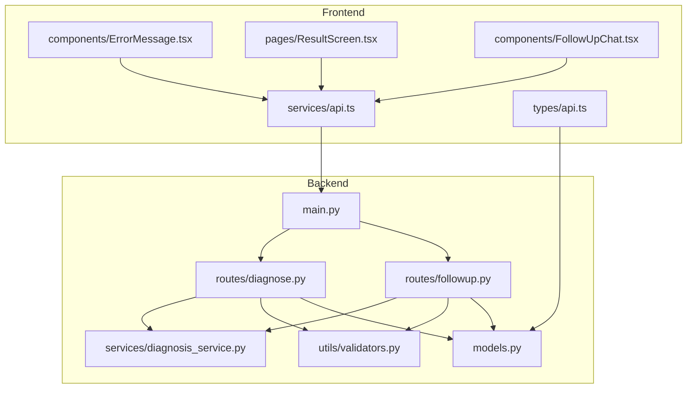
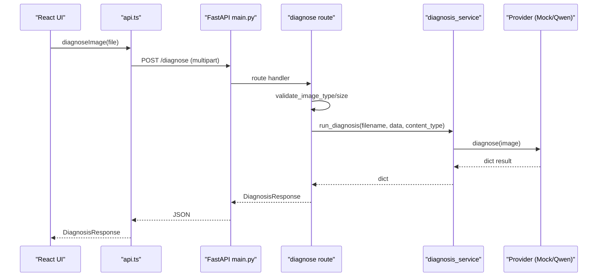
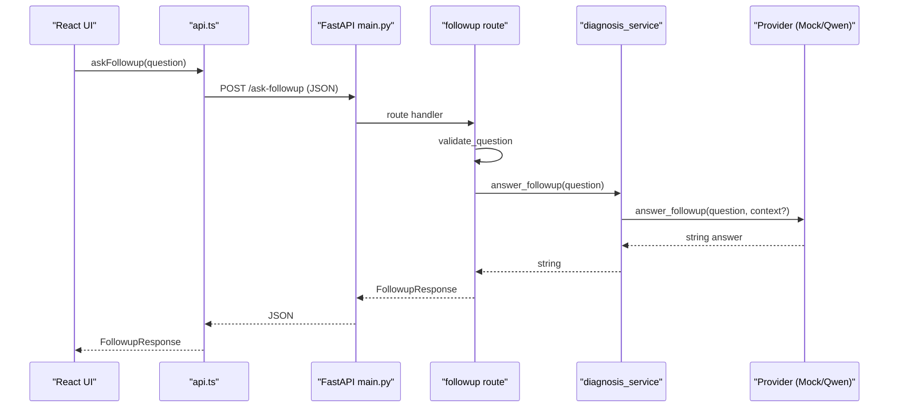
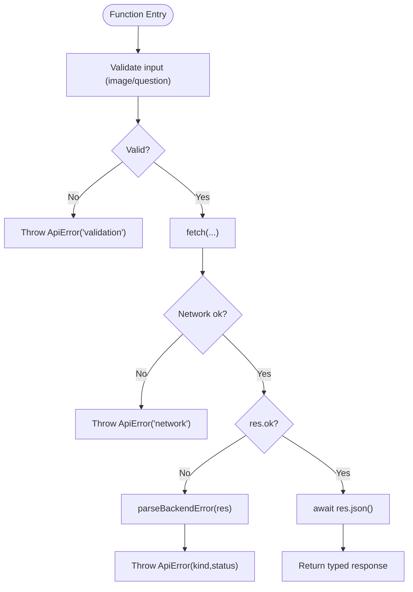
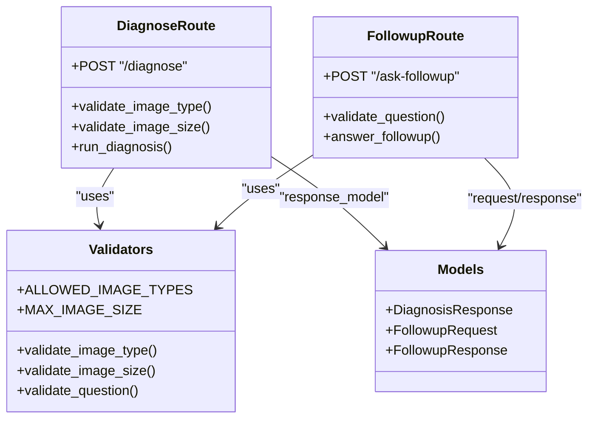
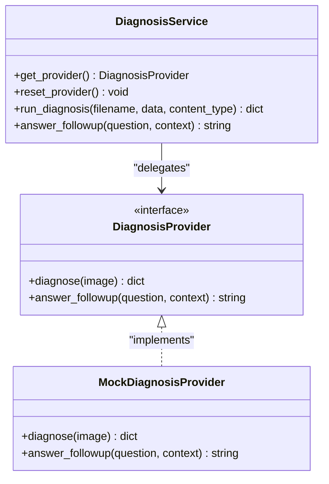
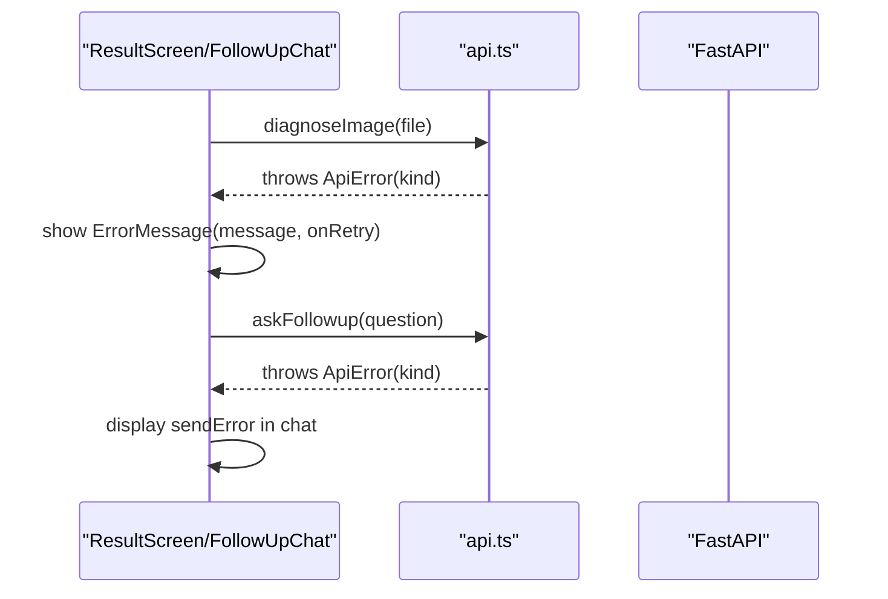
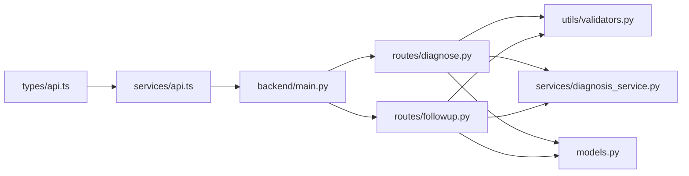

# API Integration Layer

<cite>
**Referenced Files in This Document**
- [api.ts](file://frontend/src/services/api.ts)
- [api.ts](file://frontend/src/types/api.ts)
- [diagnose.py](file://backend/routes/diagnose.py)
- [followup.py](file://backend/routes/followup.py)
- [diagnosis_service.py](file://backend/services/diagnosis_service.py)
- [models.py](file://backend/models.py)
- [validators.py](file://backend/utils/validators.py)
- [main.py](file://backend/main.py)
- [ErrorMessage.tsx](file://frontend/src/components/ErrorMessage.tsx)
- [ResultScreen.tsx](file://frontend/src/pages/ResultScreen.tsx)
- [FollowUpChat.tsx](file://frontend/src/components/FollowUpChat.tsx)
</cite>

## Table of Contents
1. Introduction
2. Project Structure
3. Core Components
4. Architecture Overview
5. Detailed Component Analysis
6. Dependency Analysis
7. Performance Considerations
8. Troubleshooting Guide
9. Conclusion
10. Appendices

## Introduction
This document explains FasalDoc’s API integration layer with a focus on the centralized HTTP client and service abstraction that connects the frontend to the FastAPI backend. It covers how image diagnosis and follow-up question endpoints are called, how errors are handled via a custom ApiError class, request/response type contracts, validation patterns, and UI integration for loading states and error messages. It also provides guidance for adding new endpoints and implementing retry mechanisms.

## Project Structure
The integration spans two layers:
- Frontend centralized API client and types
- Backend routes, models, validators, and service layer

**Diagram sources**
- [api.ts:1-99](file://frontend/src/services/api.ts#L1-L99)
- [api.ts:1-26](file://frontend/src/types/api.ts#L1-L26)
- [main.py:1-45](file://backend/main.py#L1-L45)
- [diagnose.py:1-59](file://backend/routes/diagnose.py#L1-L59)
- [followup.py:1-40](file://backend/routes/followup.py#L1-L40)
- [diagnosis_service.py:1-128](file://backend/services/diagnosis_service.py#L1-L128)
- [validators.py:1-19](file://backend/utils/validators.py#L1-L19)
- [models.py:1-58](file://backend/models.py#L1-L58)

**Section sources**
- [api.ts:1-99](file://frontend/src/services/api.ts#L1-L99)
- [main.py:1-45](file://backend/main.py#L1-L45)

## Core Components
- Centralized HTTP client: single entry point for all backend calls; components never call fetch directly.
- Custom error class: ApiError carries kind (validation, network, server), message, and optional status.
- Validation helpers: mirror backend constraints for early UX feedback (image type/size, question content).
- Type definitions: TypeScript interfaces mirroring backend Pydantic models to ensure contract consistency.
- Service layer: backend routes delegate to a provider abstraction that can be mock or real AI.

Key responsibilities:
- Diagnose endpoint: multipart upload of an image, returns diagnosis details.
- Follow-up endpoint: JSON body with a question, returns answer text.
- Error parsing: converts backend responses into typed ApiError instances.
- UI integration: reusable ErrorMessage component and screens handle loading and error states.

**Section sources**
- [api.ts:15-44](file://frontend/src/services/api.ts#L15-L44)
- [api.ts:46-99](file://frontend/src/services/api.ts#L46-L99)
- [api.ts:1-26](file://frontend/src/types/api.ts#L1-L26)
- [diagnose.py:13-59](file://backend/routes/diagnose.py#L13-L59)
- [followup.py:10-40](file://backend/routes/followup.py#L10-L40)
- [diagnosis_service.py:40-128](file://backend/services/diagnosis_service.py#L40-L128)
- [ErrorMessage.tsx:5-25](file://frontend/src/components/ErrorMessage.tsx#L5-L25)

## Architecture Overview
The system follows a clear separation:
- Frontend uses a centralized API client to make requests.
- Backend routes validate inputs, delegate to a service layer, and return typed responses.
- The service layer abstracts the AI provider, allowing offline mock behavior until credentials are configured.

**Diagram sources**
- [api.ts:64-77](file://frontend/src/services/api.ts#L64-L77)
- [main.py:37-38](file://backend/main.py#L37-L38)
- [diagnose.py:13-59](file://backend/routes/diagnose.py#L13-L59)
- [diagnosis_service.py:116-124](file://backend/services/diagnosis_service.py#L116-L124)

**Diagram sources**
- [api.ts:84-98](file://frontend/src/services/api.ts#L84-L98)
- [main.py:37-38](file://backend/main.py#L37-L38)
- [followup.py:10-40](file://backend/routes/followup.py#L10-L40)
- [diagnosis_service.py:126-128](file://backend/services/diagnosis_service.py#L126-L128)

## Detailed Component Analysis

### Centralized HTTP Client (api.ts)
- Base URL resolution from environment with trailing slash normalization.
- Custom ApiError class with kind discrimination for UI handling.
- Input validation mirrors backend rules to provide immediate user feedback.
- parseBackendError maps HTTP statuses to typed errors and extracts detail messages safely.
- Two primary functions:
  - diagnoseImage: multipart POST to /diagnose with field name "image".
  - askFollowup: JSON POST to /ask-followup with { question }.

**Diagram sources**
- [api.ts:46-99](file://frontend/src/services/api.ts#L46-L99)

**Section sources**
- [api.ts:11-44](file://frontend/src/services/api.ts#L11-L44)
- [api.ts:46-99](file://frontend/src/services/api.ts#L46-L99)

### Request/Response Types (types/api.ts)
- DiagnosisResponse mirrors backend DiagnosisResponse model fields.
- FollowupRequest and FollowupResponse mirror backend models.
- These types enforce compile-time checks and keep frontend/backend contracts aligned.

**Section sources**
- [api.ts:1-26](file://frontend/src/types/api.ts#L1-L26)
- [models.py:10-58](file://backend/models.py#L10-L58)

### Backend Routes and Validation
- Diagnose route:
  - Validates image type and size using shared validators.
  - Reads file bytes, rejects empty uploads, enforces size limit.
  - Delegates to diagnosis_service.run_diagnosis and wraps exceptions to avoid leaking internals.
- Follow-up route:
  - Validates non-empty question.
  - Delegates to diagnosis_service.answer_followup and wraps exceptions.

**Diagram sources**
- [diagnose.py:13-59](file://backend/routes/diagnose.py#L13-L59)
- [followup.py:10-40](file://backend/routes/followup.py#L10-L40)
- [validators.py:1-19](file://backend/utils/validators.py#L1-L19)
- [models.py:10-58](file://backend/models.py#L10-L58)

**Section sources**
- [diagnose.py:13-59](file://backend/routes/diagnose.py#L13-L59)
- [followup.py:10-40](file://backend/routes/followup.py#L10-L40)
- [validators.py:1-19](file://backend/utils/validators.py#L1-L19)

### Service Layer Abstraction (diagnosis_service.py)
- Provider protocol defines stable interface for diagnosis and follow-up methods.
- Mock provider returns deterministic responses for offline development and testing.
- Provider selection logic prefers a real provider when credentials exist, otherwise falls back to mock.
- Module-level helpers expose run_diagnosis and answer_followup used by routes.

**Diagram sources**
- [diagnosis_service.py:40-128](file://backend/services/diagnosis_service.py#L40-L128)

**Section sources**
- [diagnosis_service.py:40-128](file://backend/services/diagnosis_service.py#L40-L128)

### UI Integration: Loading States and Errors
- ResultScreen displays diagnosis results, confidence, advice, and expert escalation flags.
- ErrorMessage renders alert-like messages with optional retry action.
- FollowUpChat shows sending state, typing indicator, and send errors inline.

**Diagram sources**
- [ResultScreen.tsx:28-39](file://frontend/src/pages/ResultScreen.tsx#L28-L39)
- [ErrorMessage.tsx:10-25](file://frontend/src/components/ErrorMessage.tsx#L10-L25)
- [FollowUpChat.tsx:48-65](file://frontend/src/components/FollowUpChat.tsx#L48-L65)
- [api.ts:64-98](file://frontend/src/services/api.ts#L64-L98)

**Section sources**
- [ResultScreen.tsx:28-39](file://frontend/src/pages/ResultScreen.tsx#L28-L39)
- [ErrorMessage.tsx:10-25](file://frontend/src/components/ErrorMessage.tsx#L10-L25)
- [FollowUpChat.tsx:48-65](file://frontend/src/components/FollowUpChat.tsx#L48-L65)

## Dependency Analysis
- Frontend api.ts depends on types/api.ts for response/request shapes.
- Backend routes depend on models.py and utils/validators.py for contracts and validation.
- Routes delegate to services/diagnosis_service.py which abstracts provider implementation.
- main.py wires routers and CORS configuration.

**Diagram sources**
- [api.ts:1-26](file://frontend/src/types/api.ts#L1-L26)
- [api.ts:1-99](file://frontend/src/services/api.ts#L1-L99)
- [main.py:1-45](file://backend/main.py#L1-L45)
- [diagnose.py:1-59](file://backend/routes/diagnose.py#L1-L59)
- [followup.py:1-40](file://backend/routes/followup.py#L1-L40)
- [validators.py:1-19](file://backend/utils/validators.py#L1-L19)
- [diagnosis_service.py:1-128](file://backend/services/diagnosis_service.py#L1-L128)
- [models.py:1-58](file://backend/models.py#L1-L58)

**Section sources**
- [main.py:1-45](file://backend/main.py#L1-L45)
- [diagnose.py:1-59](file://backend/routes/diagnose.py#L1-L59)
- [followup.py:1-40](file://backend/routes/followup.py#L1-L40)
- [diagnosis_service.py:1-128](file://backend/services/diagnosis_service.py#L1-L128)
- [validators.py:1-19](file://backend/utils/validators.py#L1-L19)
- [models.py:1-58](file://backend/models.py#L1-L58)
- [api.ts:1-99](file://frontend/src/services/api.ts#L1-L99)
- [api.ts:1-26](file://frontend/src/types/api.ts#L1-L26)

## Performance Considerations
- Avoid large payloads: enforce MAX_IMAGE_SIZE both in frontend and backend to prevent unnecessary processing.
- Early validation reduces round trips and improves UX.
- Use provider caching in the service layer to avoid repeated initialization overhead.
- Keep network calls minimal; batch operations where possible.
- For high-latency networks, consider adding retries with exponential backoff at the client level.

[No sources needed since this section provides general guidance]

## Troubleshooting Guide
Common issues and strategies:
- Network errors: caught by try/catch around fetch; throw ApiError with kind 'network'.
- Validation errors: backend returns 400/422; parseBackendError maps to ApiError with kind 'validation' and includes detail message.
- Server errors: any other non-ok status mapped to ApiError with kind 'server'.
- UI handling: use ErrorMessage to present user-friendly messages and offer retry actions.

Recommended debugging steps:
- Verify API_BASE environment variable points to correct backend.
- Ensure CORS is configured for your frontend origin.
- Check backend logs for detailed stack traces when internal exceptions occur.
- Confirm image type and size match allowed values.

**Section sources**
- [api.ts:46-99](file://frontend/src/services/api.ts#L46-L99)
- [diagnose.py:21-59](file://backend/routes/diagnose.py#L21-L59)
- [followup.py:18-34](file://backend/routes/followup.py#L18-L34)
- [ErrorMessage.tsx:10-25](file://frontend/src/components/ErrorMessage.tsx#L10-L25)

## Conclusion
FasalDoc’s API integration layer centralizes HTTP communication through a robust client that enforces consistent error handling, input validation, and type safety. The backend separates concerns across routes, models, validators, and a provider-based service layer, enabling seamless switching between mock and real AI implementations. With clear contracts and reusable UI components, developers can confidently add new endpoints and enhance reliability with features like retries while maintaining a smooth user experience.

[No sources needed since this section summarizes without analyzing specific files]

## Appendices

### How to Add a New API Endpoint
Steps:
1. Define request/response models in backend/models.py.
2. Create a route in backend/routes/ that validates inputs and delegates to the service layer.
3. Implement or extend the provider in backend/services/diagnosis_service.py if it requires AI interaction.
4. Add corresponding TypeScript interfaces in frontend/src/types/api.ts.
5. Implement a function in frontend/src/services/api.ts to call the new endpoint, including error parsing and validation.
6. Wire up UI components to call the new function and handle loading/error states.

**Section sources**
- [models.py:10-58](file://backend/models.py#L10-L58)
- [diagnose.py:13-59](file://backend/routes/diagnose.py#L13-L59)
- [followup.py:10-40](file://backend/routes/followup.py#L10-L40)
- [diagnosis_service.py:40-128](file://backend/services/diagnosis_service.py#L40-L128)
- [api.ts:1-26](file://frontend/src/types/api.ts#L1-L26)
- [api.ts:64-99](file://frontend/src/services/api.ts#L64-L99)

### Implementing Retry Mechanisms
Guidance:
- Wrap fetch calls with a retry utility that supports:
  - Configurable max attempts and delay strategy (e.g., exponential backoff).
  - Retrying only on transient errors (network failures, 5xx server errors).
  - Excluding idempotent vs. non-idempotent considerations for different endpoints.
- Integrate retry at the api.ts layer to keep components simple.
- Provide user feedback during retries (e.g., loading indicators, progress messages).

[No sources needed since this section provides general guidance]