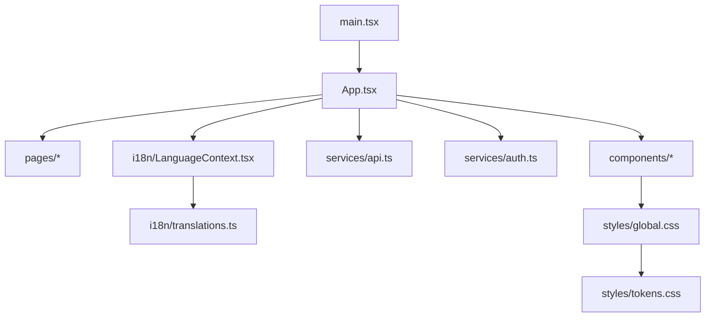
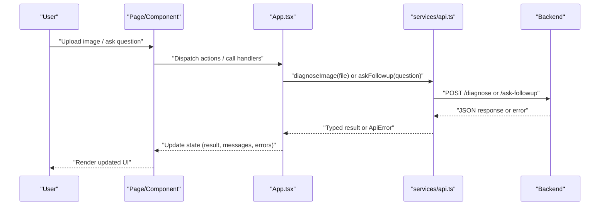
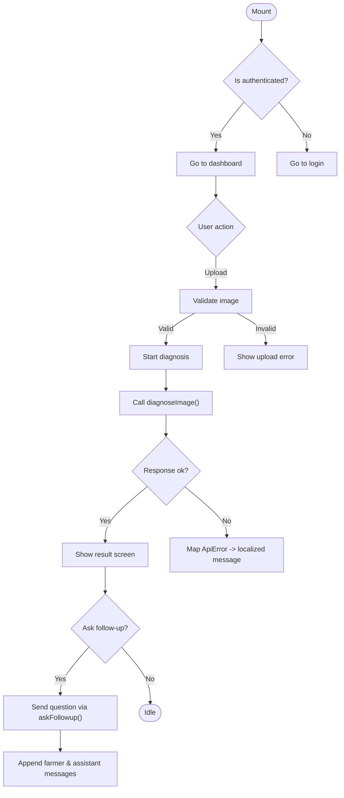
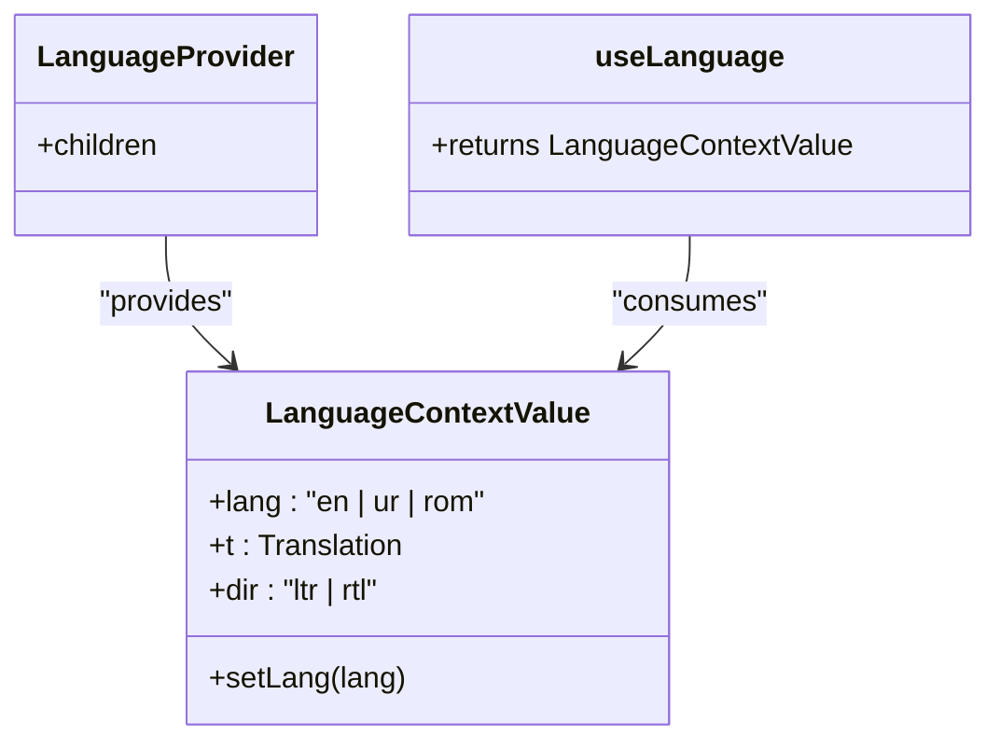
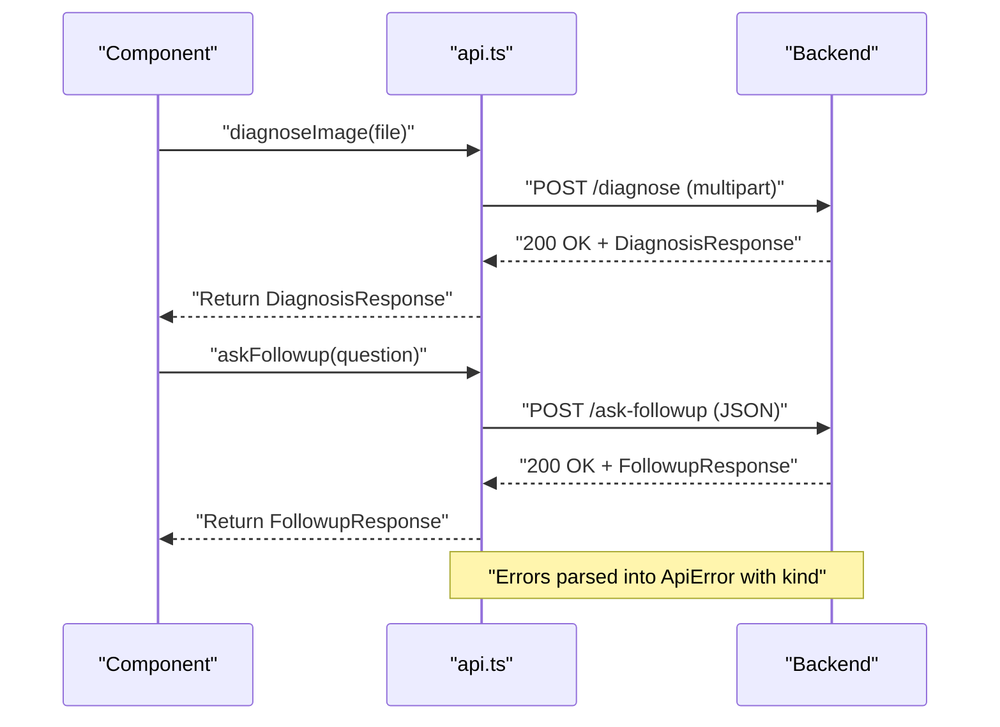
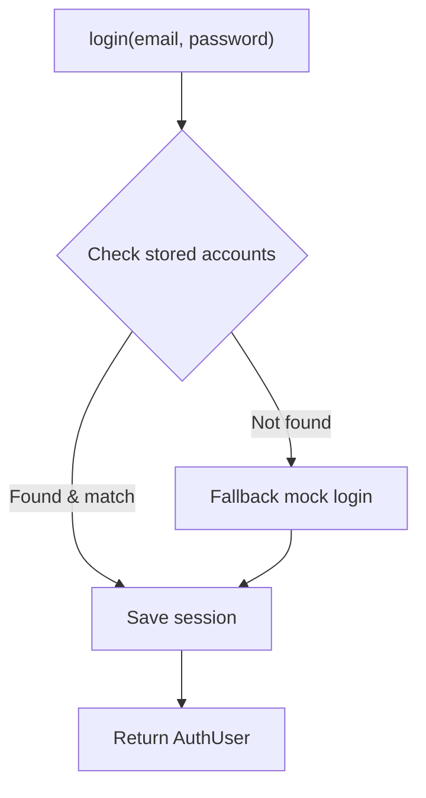
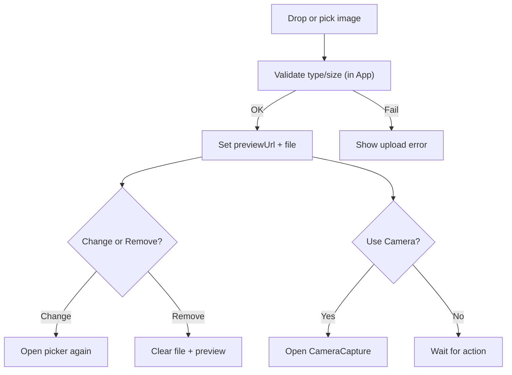
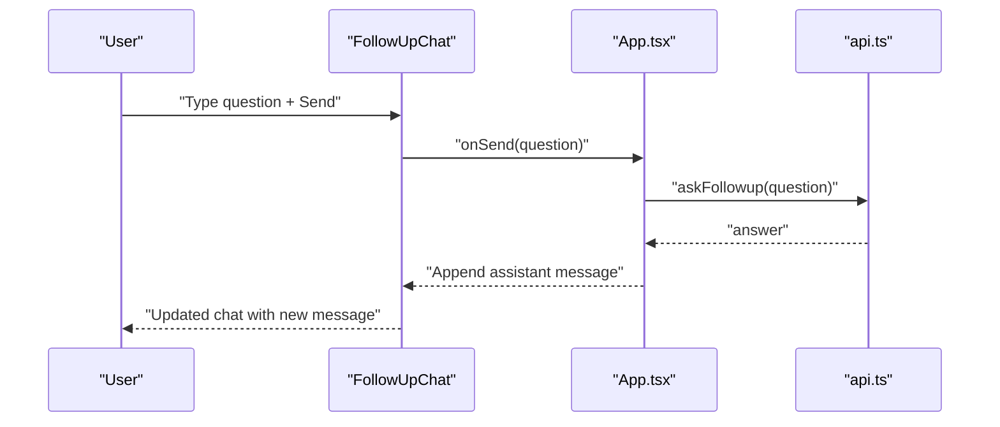
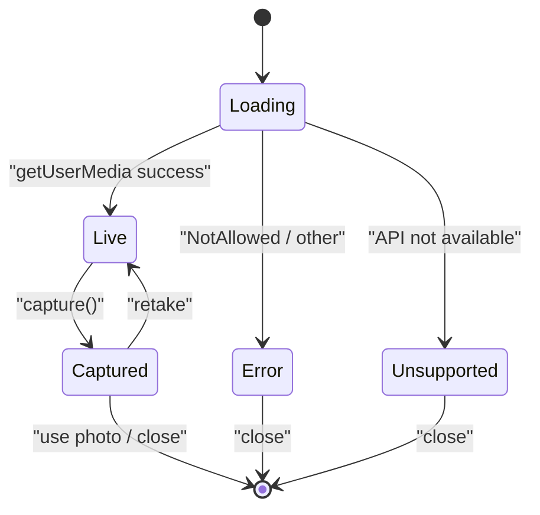
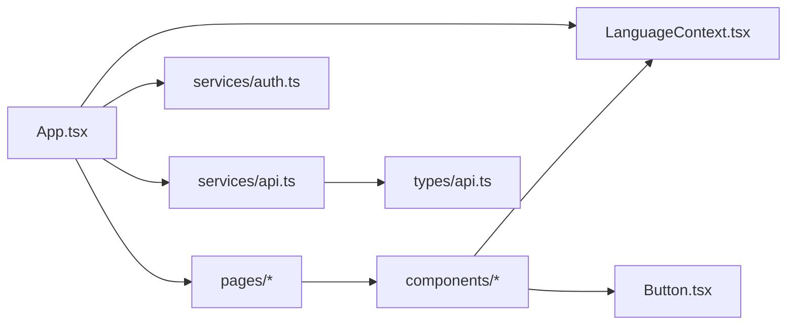

# Frontend Documentation

<cite>
**Referenced Files in This Document**
- [App.tsx](file://frontend/src/App.tsx)
- [main.tsx](file://frontend/src/main.tsx)
- [package.json](file://frontend/package.json)
- [LanguageContext.tsx](file://frontend/src/i18n/LanguageContext.tsx)
- [translations.ts](file://frontend/src/i18n/translations.ts)
- [api.ts](file://frontend/src/services/api.ts)
- [auth.ts](file://frontend/src/services/auth.ts)
- [ImageUploader.tsx](file://frontend/src/components/ImageUploader.tsx)
- [FollowUpChat.tsx](file://frontend/src/components/FollowUpChat.tsx)
- [CameraCapture.tsx](file://frontend/src/components/CameraCapture.tsx)
- [Button.tsx](file://frontend/src/components/Button.tsx)
- [UploadScreen.tsx](file://frontend/src/pages/UploadScreen.tsx)
- [api.ts (types)](file://frontend/src/types/api.ts)
- [global.css](file://frontend/src/styles/global.css)
- [tokens.css](file://frontend/src/styles/tokens.css)
</cite>

## Table of Contents
1. Introduction
2. Project Structure
3. Core Components
4. Architecture Overview
5. Detailed Component Analysis
6. Dependency Analysis
7. Performance Considerations
8. Troubleshooting Guide
9. Conclusion

## Introduction
This document explains the client-side implementation of FasalDoc’s React + Vite application. It covers the component architecture from pages to reusable components, state management with React hooks and context, centralized API integration and error handling, internationalization for English, Urdu, and Roman Urdu with RTL support, and styling using CSS tokens and global styles with responsive design patterns.

## Project Structure
The frontend is organized by feature and layer:
- Pages implement screen-level flows (e.g., Upload, Result, Follow-up).
- Components provide reusable UI elements (e.g., ImageUploader, CameraCapture, Button).
- Services encapsulate API calls and authentication.
- i18n provides language context and translations.
- Styles define design tokens and global layout rules.

**Diagram sources**
- [main.tsx:1-15](file://frontend/src/main.tsx#L1-L15)
- [App.tsx:1-336](file://frontend/src/App.tsx#L1-L336)
- [LanguageContext.tsx:1-67](file://frontend/src/i18n/LanguageContext.tsx#L1-L67)
- [translations.ts:1-666](file://frontend/src/i18n/translations.ts#L1-L666)
- [api.ts:1-99](file://frontend/src/services/api.ts#L1-L99)
- [auth.ts:1-126](file://frontend/src/services/auth.ts#L1-L126)
- [global.css:1-800](file://frontend/src/styles/global.css#L1-L800)
- [tokens.css:1-36](file://frontend/src/styles/tokens.css#L1-L36)

**Section sources**
- [package.json:1-23](file://frontend/package.json#L1-L23)
- [main.tsx:1-15](file://frontend/src/main.tsx#L1-L15)
- [App.tsx:1-336](file://frontend/src/App.tsx#L1-L336)

## Core Components
- App orchestrates routing via local state, manages user session, coordinates diagnosis flow, and composes screens and shared UI.
- LanguageProvider supplies current language, translation map, and text direction (LTR/RTL), persisting preference to localStorage.
- services/api.ts centralizes HTTP requests, validates images, and normalizes errors into a typed ApiError.
- services/auth.ts handles mock login/signup and session persistence in localStorage.
- Reusable components include ImageUploader, CameraCapture, FollowUpChat, Button, and others.

Key responsibilities:
- Stateful orchestration in App.tsx using useReducer and hooks.
- Internationalization via LanguageContext and translations.
- API abstraction with typed responses and consistent error handling.
- Authentication flow with local session storage.

**Section sources**
- [App.tsx:31-133](file://frontend/src/App.tsx#L31-L133)
- [LanguageContext.tsx:14-67](file://frontend/src/i18n/LanguageContext.tsx#L14-L67)
- [api.ts:1-99](file://frontend/src/services/api.ts#L1-L99)
- [auth.ts:10-126](file://frontend/src/services/auth.ts#L10-L126)

## Architecture Overview
The application follows a layered architecture:
- Presentation layer: Pages and components render UI and handle user interactions.
- State layer: App uses useReducer to manage navigation and workflow state; LanguageContext provides global i18n state.
- Service layer: api.ts and auth.ts encapsulate network and session logic.
- Data contracts: types/api.ts mirror backend models to ensure type safety.

**Diagram sources**
- [App.tsx:187-237](file://frontend/src/App.tsx#L187-L237)
- [api.ts:64-98](file://frontend/src/services/api.ts#L64-L98)

## Detailed Component Analysis

### App (Flow Orchestrator)
- Manages screen transitions and workflow state (upload, analyzing, result, follow-up).
- Integrates authentication checks on mount and routes users accordingly.
- Coordinates image validation and diagnosis lifecycle.
- Handles follow-up chat message flow and error mapping to localized messages.

**Diagram sources**
- [App.tsx:142-162](file://frontend/src/App.tsx#L142-L162)
- [App.tsx:178-237](file://frontend/src/App.tsx#L178-L237)
- [api.ts:64-98](file://frontend/src/services/api.ts#L64-L98)

**Section sources**
- [App.tsx:31-133](file://frontend/src/App.tsx#L31-L133)
- [App.tsx:135-336](file://frontend/src/App.tsx#L135-L336)

### Language Context (Internationalization)
- Provides current language code, translation map, and text direction.
- Persists language choice to localStorage and applies HTML lang/dir attributes and CSS classes for RTL support.
- Exposes a hook for consuming translations throughout the app.

**Diagram sources**
- [LanguageContext.tsx:14-67](file://frontend/src/i18n/LanguageContext.tsx#L14-L67)

**Section sources**
- [LanguageContext.tsx:1-67](file://frontend/src/i18n/LanguageContext.tsx#L1-67)
- [translations.ts:1-163](file://frontend/src/i18n/translations.ts#L1-L163)

### API Integration Layer
- Centralized HTTP client with environment-based base URL.
- Input validation helpers for images and questions mirroring backend constraints.
- Error parsing that maps HTTP status codes to typed ApiError instances with categories (network, validation, server).
- Two primary endpoints:
  - POST /diagnose: multipart image upload returning DiagnosisResponse.
  - POST /ask-followup: JSON body with question returning FollowupResponse.

**Diagram sources**
- [api.ts:11-99](file://frontend/src/services/api.ts#L11-L99)
- [api.ts (types):1-26](file://frontend/src/types/api.ts#L1-L26)

**Section sources**
- [api.ts:1-99](file://frontend/src/services/api.ts#L1-L99)
- [api.ts (types):1-26](file://frontend/src/types/api.ts#L1-L26)

### Authentication Service
- Local session management using localStorage.
- Mock login/signup for demo purposes; designed to be replaced with real endpoints later.
- Email validation helper and safe session retrieval.

**Diagram sources**
- [auth.ts:17-90](file://frontend/src/services/auth.ts#L17-L90)

**Section sources**
- [auth.ts:1-126](file://frontend/src/services/auth.ts#L1-126)

### ImageUploader
- Supports drag-and-drop, gallery selection, and camera capture.
- Displays preview with file name and size, and allows changing/removing the image.
- Integrates CameraCapture modal when supported; falls back to native capture input otherwise.

**Diagram sources**
- [ImageUploader.tsx:1-173](file://frontend/src/components/ImageUploader.tsx#L1-L173)
- [App.tsx:164-195](file://frontend/src/App.tsx#L164-L195)

**Section sources**
- [ImageUploader.tsx:1-173](file://frontend/src/components/ImageUploader.tsx#L1-L173)

### FollowUpChat
- Renders conversation history with farmer and assistant messages.
- Auto-scrolls to latest message and shows typing indicator while sending.
- Validates empty input and disables send during sending.

**Diagram sources**
- [FollowUpChat.tsx:1-92](file://frontend/src/components/FollowUpChat.tsx#L1-L92)
- [App.tsx:227-237](file://frontend/src/App.tsx#L227-L237)
- [api.ts:84-98](file://frontend/src/services/api.ts#L84-L98)

**Section sources**
- [FollowUpChat.tsx:1-92](file://frontend/src/components/FollowUpChat.tsx#L1-L92)

### CameraCapture
- Requests camera stream with environment-facing mode and captures frames to JPEG blobs.
- Manages states: loading, live, captured, error, unsupported.
- Ensures proper cleanup of media streams and object URLs.

**Diagram sources**
- [CameraCapture.tsx:1-200](file://frontend/src/components/CameraCapture.tsx#L1-L200)

**Section sources**
- [CameraCapture.tsx:1-200](file://frontend/src/components/CameraCapture.tsx#L1-L200)

### UploadScreen
- Composes ImageUploader and QuestionInput, displays privacy notice, and triggers diagnosis.
- Delegates validation and side effects to parent App.

**Section sources**
- [UploadScreen.tsx:1-67](file://frontend/src/pages/UploadScreen.tsx#L1-L67)

### Button
- Accessible button with variants and loading state, integrating spinner icon.

**Section sources**
- [Button.tsx:1-32](file://frontend/src/components/Button.tsx#L1-L32)

## Dependency Analysis
- App depends on:
  - i18n LanguageContext for localization.
  - services/api for diagnosis and follow-up.
  - services/auth for session checks and logout.
  - Pages and components for rendering.
- Components depend on:
  - LanguageContext for translated strings.
  - Shared UI components (Button, icons).
- Services are independent of UI and expose typed interfaces.

**Diagram sources**
- [App.tsx:1-336](file://frontend/src/App.tsx#L1-L336)
- [LanguageContext.tsx:1-67](file://frontend/src/i18n/LanguageContext.tsx#L1-L67)
- [api.ts:1-99](file://frontend/src/services/api.ts#L1-L99)
- [auth.ts:1-126](file://frontend/src/services/auth.ts#L1-L126)
- [Button.tsx:1-32](file://frontend/src/components/Button.tsx#L1-L32)
- [api.ts (types):1-26](file://frontend/src/types/api.ts#L1-L26)

**Section sources**
- [App.tsx:1-336](file://frontend/src/App.tsx#L1-L336)
- [api.ts:1-99](file://frontend/src/services/api.ts#L1-L99)

## Performance Considerations
- Avoid memory leaks by revoking object URLs when previews change or components unmount.
- Use efficient state updates with useReducer for complex workflows to prevent unnecessary re-renders.
- Keep API calls centralized to reduce duplicate fetch logic and enable caching strategies if needed.
- Prefer lazy loading for heavy components (e.g., camera modal) to improve initial load time.
- Minimize reflows by batching DOM updates and using refs for scroll-to-bottom behavior.

[No sources needed since this section provides general guidance]

## Troubleshooting Guide
Common issues and resolutions:
- Network errors: The API layer throws ApiError with kind 'network' when fetch fails; display a friendly message and prompt retry.
- Validation errors: Backend returns 400/422; parse detail and show localized validation messages.
- Server errors: Non-2xx responses without specific detail fall back to generic server error messages.
- Camera permission denied: CameraCapture switches to error state; guide users to allow permissions or fallback to file upload.
- Browser without camera support: CameraCapture detects unsupported APIs and suggests using upload instead.

**Section sources**
- [api.ts:46-98](file://frontend/src/services/api.ts#L46-L98)
- [CameraCapture.tsx:29-56](file://frontend/src/components/CameraCapture.tsx#L29-L56)
- [App.tsx:210-237](file://frontend/src/App.tsx#L210-L237)

## Conclusion
FasalDoc’s frontend combines a clear component hierarchy, robust state orchestration, centralized API integration, and comprehensive internationalization with RTL support. The design emphasizes accessibility, maintainability, and performance, providing a solid foundation for future enhancements such as real authentication endpoints and additional features.

[No sources needed since this section summarizes without analyzing specific files]