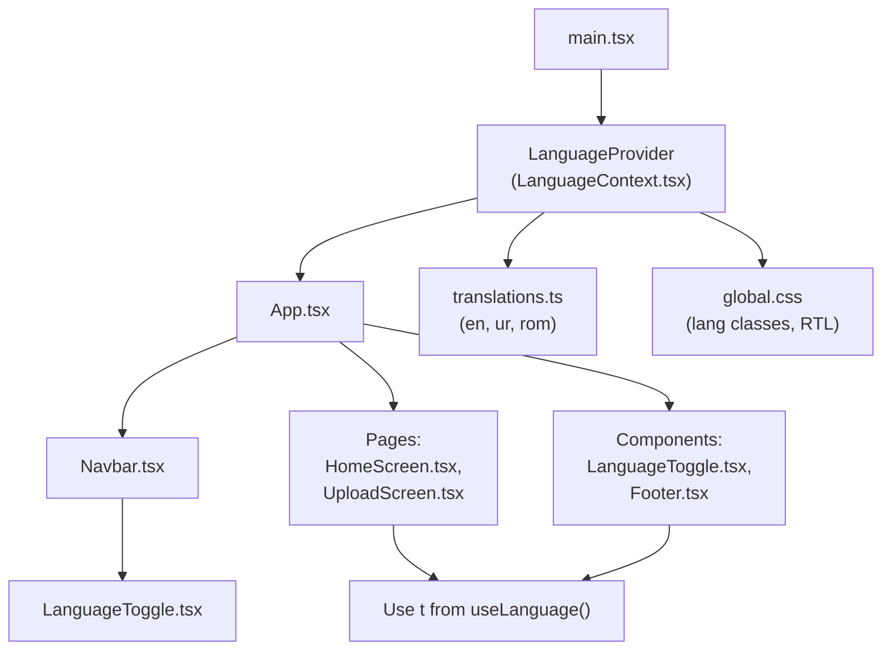
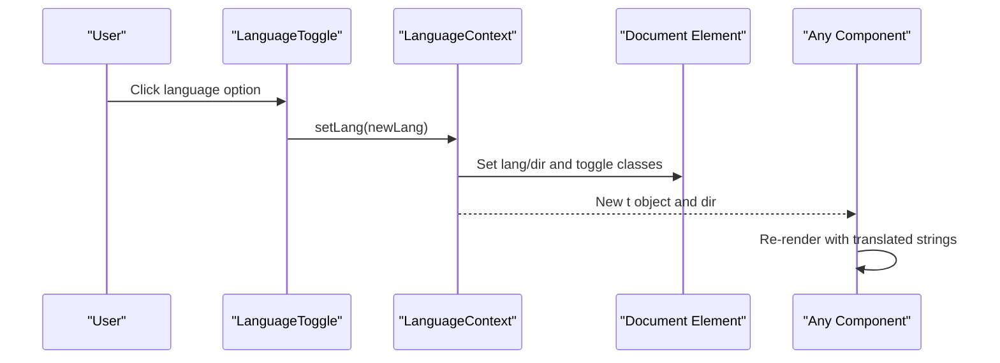
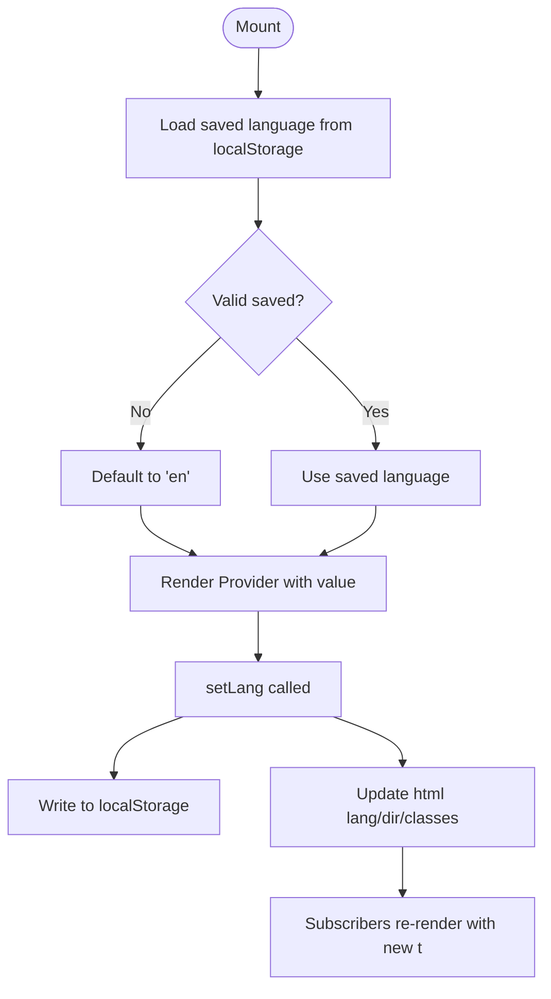
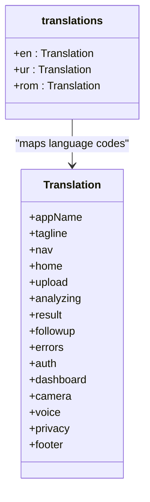
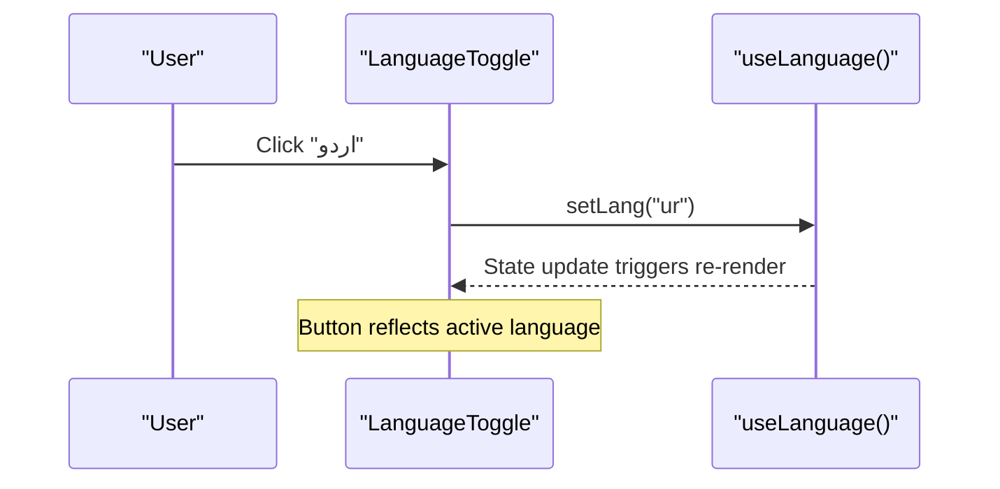
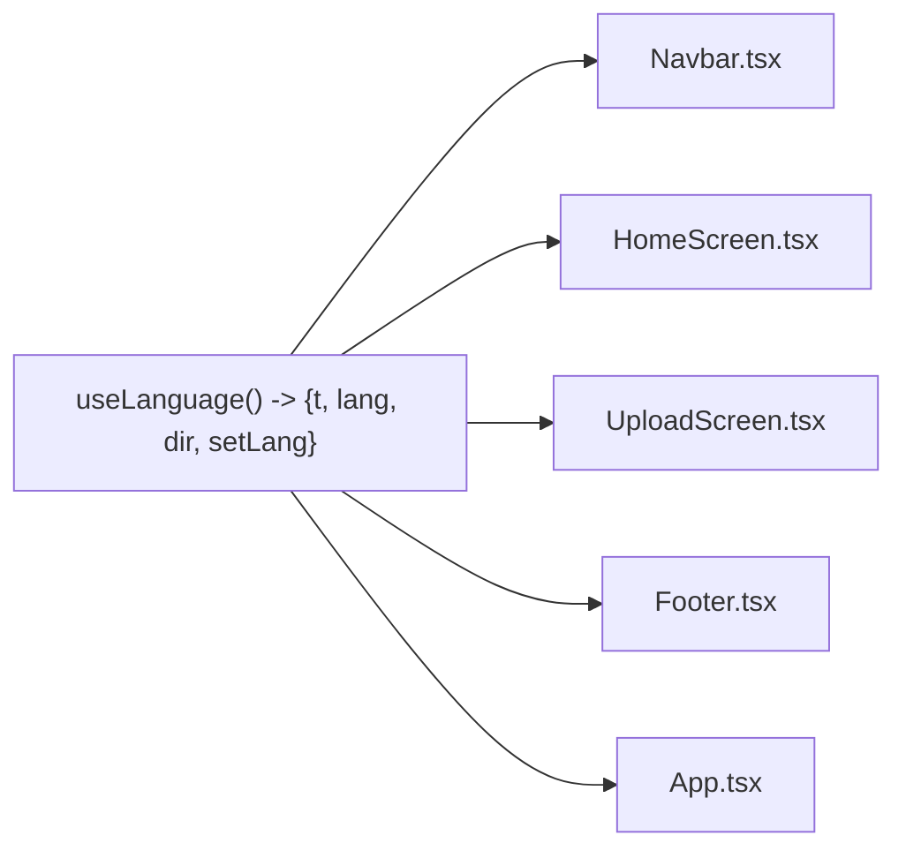
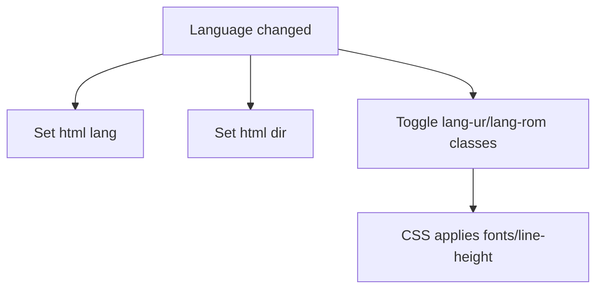
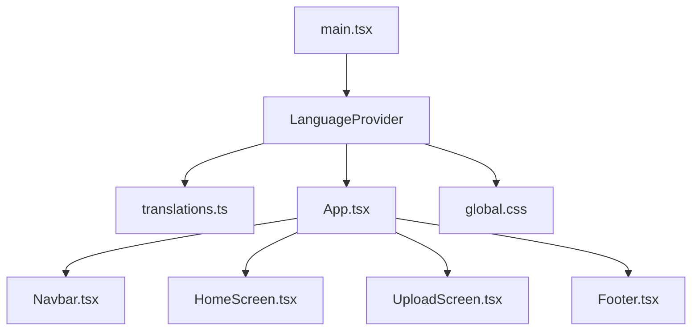

# Internationalization System

<cite>
**Referenced Files in This Document**
- [LanguageContext.tsx](file://frontend/src/i18n/LanguageContext.tsx)
- [translations.ts](file://frontend/src/i18n/translations.ts)
- [LanguageToggle.tsx](file://frontend/src/components/LanguageToggle.tsx)
- [App.tsx](file://frontend/src/App.tsx)
- [main.tsx](file://frontend/src/main.tsx)
- [Navbar.tsx](file://frontend/src/components/Navbar.tsx)
- [HomeScreen.tsx](file://frontend/src/pages/HomeScreen.tsx)
- [UploadScreen.tsx](file://frontend/src/pages/UploadScreen.tsx)
- [Footer.tsx](file://frontend/src/components/Footer.tsx)
- [global.css](file://frontend/src/styles/global.css)
</cite>

## Table of Contents
1. [Introduction](#introduction)
2. [Project Structure](#project-structure)
3. [Core Components](#core-components)
4. [Architecture Overview](#architecture-overview)
5. [Detailed Component Analysis](#detailed-component-analysis)
6. [Dependency Analysis](#dependency-analysis)
7. [Performance Considerations](#performance-considerations)
8. [Troubleshooting Guide](#troubleshooting-guide)
9. [Conclusion](#conclusion)
10. [Appendices](#appendices)

## Introduction
This document explains FasalDoc’s internationalization (i18n) system with a focus on multi-language support for English, Urdu, and Roman Urdu. It covers the LanguageContext provider pattern for global language state management, the translation structure, RTL text direction handling, dynamic language switching via the LanguageToggle component, and practical guidance for adding new translations, creating translatable components, and maintaining consistency across the application.

## Project Structure
The i18n implementation is centered in the frontend:
- Context and utilities live under src/i18n.
- UI components consume translations through a React context.
- CSS applies language-specific styles and RTL behavior.

**Diagram sources**
- [main.tsx:8-14](file://frontend/src/main.tsx#L8-L14)
- [LanguageContext.tsx:33-60](file://frontend/src/i18n/LanguageContext.tsx#L33-L60)
- [App.tsx:135-137](file://frontend/src/App.tsx#L135-L137)
- [Navbar.tsx:22-45](file://frontend/src/components/Navbar.tsx#L22-L45)
- [HomeScreen.tsx:19-33](file://frontend/src/pages/HomeScreen.tsx#L19-L33)
- [UploadScreen.tsx:29-63](file://frontend/src/pages/UploadScreen.tsx#L29-L63)
- [Footer.tsx:5-14](file://frontend/src/components/Footer.tsx#L5-L14)
- [translations.ts:164-665](file://frontend/src/i18n/translations.ts#L164-L665)
- [global.css:18-24](file://frontend/src/styles/global.css#L18-L24)

**Section sources**
- [main.tsx:8-14](file://frontend/src/main.tsx#L8-L14)
- [LanguageContext.tsx:33-60](file://frontend/src/i18n/LanguageContext.tsx#L33-L60)
- [translations.ts:164-665](file://frontend/src/i18n/translations.ts#L164-L665)
- [global.css:18-24](file://frontend/src/styles/global.css#L18-L24)

## Core Components
- LanguageContext and LanguageProvider: Provide global language state, current translations object, text direction, and persistence to localStorage.
- translations.ts: Centralized dictionary for all user-facing strings in three languages with a strict TypeScript interface.
- LanguageToggle: UI control to switch between supported languages.
- Consuming components: Navbar, HomeScreen, UploadScreen, Footer, and App demonstrate how to access translations via useLanguage().

Key responsibilities:
- Persist user’s preferred language across sessions.
- Apply correct HTML lang attribute and dir for accessibility and rendering.
- Add CSS classes to enable language-specific styling and RTL layout.
- Expose a typed translations object to all components.

**Section sources**
- [LanguageContext.tsx:14-66](file://frontend/src/i18n/LanguageContext.tsx#L14-L66)
- [translations.ts:1-162](file://frontend/src/i18n/translations.ts#L1-L162)
- [LanguageToggle.tsx:10-27](file://frontend/src/components/LanguageToggle.tsx#L10-L27)
- [Navbar.tsx:22-45](file://frontend/src/components/Navbar.tsx#L22-L45)
- [HomeScreen.tsx:19-33](file://frontend/src/pages/HomeScreen.tsx#L19-L33)
- [UploadScreen.tsx:29-63](file://frontend/src/pages/UploadScreen.tsx#L29-L63)
- [Footer.tsx:5-14](file://frontend/src/components/Footer.tsx#L5-L14)

## Architecture Overview
The i18n architecture follows a Provider/Consumer pattern:
- LanguageProvider wraps the app and supplies language state and translations.
- Components call useLanguage() to get the current translations and setter.
- LanguageToggle updates the language, which persists to localStorage and updates DOM attributes/classes.
- CSS uses language-specific selectors to adjust fonts and line heights; RTL is handled by setting dir and lang on the root element.

**Diagram sources**
- [LanguageToggle.tsx:10-27](file://frontend/src/components/LanguageToggle.tsx#L10-L27)
- [LanguageContext.tsx:33-60](file://frontend/src/i18n/LanguageContext.tsx#L33-L60)
- [LanguageContext.tsx:47-52](file://frontend/src/i18n/LanguageContext.tsx#L47-L52)

## Detailed Component Analysis

### LanguageContext and LanguageProvider
- Provides:
  - Current language code.
  - Translations object keyed by language.
  - Text direction (ltr/rtl).
  - Setter function to change language.
- Persistence:
  - Reads initial language from localStorage.
  - Writes updated language back to localStorage.
- DOM integration:
  - Sets documentElement.lang and .dir.
  - Toggles CSS classes for language-specific styling.
- Error handling:
  - Gracefully handles storage unavailability.

**Diagram sources**
- [LanguageContext.tsx:23-31](file://frontend/src/i18n/LanguageContext.tsx#L23-L31)
- [LanguageContext.tsx:33-59](file://frontend/src/i18n/LanguageContext.tsx#L33-L59)
- [LanguageContext.tsx:47-52](file://frontend/src/i18n/LanguageContext.tsx#L47-L52)

**Section sources**
- [LanguageContext.tsx:23-66](file://frontend/src/i18n/LanguageContext.tsx#L23-L66)

### Translation Structure
- Type-safe dictionary:
  - A single Translation interface defines all keys used across the app.
  - A Record maps each supported language code to a full Translation object.
- Supported languages:
  - en (English), ur (Urdu), rom (Roman Urdu).
- Content coverage:
  - Navigation, home screen, upload flow, analyzing states, results, follow-up chat, errors, authentication, dashboard, camera, voice input, privacy, footer.
- Pluralization:
  - The current structure does not include pluralization logic; messages are stored as plain strings. For plural forms, extend the Translation type and add localized variants or implement a formatter at consumption sites.

**Diagram sources**
- [translations.ts:1-162](file://frontend/src/i18n/translations.ts#L1-L162)
- [translations.ts:164-665](file://frontend/src/i18n/translations.ts#L164-L665)

**Section sources**
- [translations.ts:1-162](file://frontend/src/i18n/translations.ts#L1-L162)
- [translations.ts:164-665](file://frontend/src/i18n/translations.ts#L164-L665)

### LanguageToggle Component
- Renders a segmented control with options for EN, اردو, and Roman.
- Uses useLanguage() to read the active language and call setLang on click.
- Applies active state styling based on current language.
- Accessible: uses role="group", aria-label, and aria-pressed.

**Diagram sources**
- [LanguageToggle.tsx:4-27](file://frontend/src/components/LanguageToggle.tsx#L4-L27)
- [LanguageContext.tsx:36-43](file://frontend/src/i18n/LanguageContext.tsx#L36-L43)

**Section sources**
- [LanguageToggle.tsx:4-27](file://frontend/src/components/LanguageToggle.tsx#L4-L27)

### Using Translations in Components
- Components import useLanguage and destructure t to access nested keys like t.home.headline, t.upload.title, etc.
- Examples:
  - Navbar displays appName and nav labels.
  - HomeScreen renders hero text and steps using t.home.*.
  - UploadScreen shows titles, labels, placeholders, and privacy notice.
  - Footer shows disclaimer, privacy notice, and tagline.
  - App maps API error kinds to localized messages.

**Diagram sources**
- [Navbar.tsx:22-45](file://frontend/src/components/Navbar.tsx#L22-L45)
- [HomeScreen.tsx:19-33](file://frontend/src/pages/HomeScreen.tsx#L19-L33)
- [UploadScreen.tsx:29-63](file://frontend/src/pages/UploadScreen.tsx#L29-L63)
- [Footer.tsx:5-14](file://frontend/src/components/Footer.tsx#L5-L14)
- [App.tsx:164-176](file://frontend/src/App.tsx#L164-L176)

**Section sources**
- [Navbar.tsx:22-45](file://frontend/src/components/Navbar.tsx#L22-L45)
- [HomeScreen.tsx:19-33](file://frontend/src/pages/HomeScreen.tsx#L19-L33)
- [UploadScreen.tsx:29-63](file://frontend/src/pages/UploadScreen.tsx#L29-L63)
- [Footer.tsx:5-14](file://frontend/src/components/Footer.tsx#L5-L14)
- [App.tsx:164-176](file://frontend/src/App.tsx#L164-L176)

### RTL and Language-Specific Styling
- LanguageContext sets:
  - documentElement.lang to the selected language code (with special handling for Roman Urdu).
  - documentElement.dir to rtl for Urdu, ltr otherwise.
  - CSS classes lang-ur and lang-rom toggled based on selection.
- global.css:
  - Applies Urdu font family and increased line height when lang-ur is present.
  - Adjusts headline line height for Urdu.
  - Styles the language toggle and other UI elements consistently.

**Diagram sources**
- [LanguageContext.tsx:47-52](file://frontend/src/i18n/LanguageContext.tsx#L47-L52)
- [global.css:18-24](file://frontend/src/styles/global.css#L18-L24)
- [global.css:238-240](file://frontend/src/styles/global.css#L238-L240)

**Section sources**
- [LanguageContext.tsx:47-52](file://frontend/src/i18n/LanguageContext.tsx#L47-L52)
- [global.css:18-24](file://frontend/src/styles/global.css#L18-L24)
- [global.css:238-240](file://frontend/src/styles/global.css#L238-L240)

## Dependency Analysis
- main.tsx wraps the entire app with LanguageProvider so all descendants can consume translations.
- Components depend only on useLanguage(), keeping them decoupled from the provider implementation.
- translations.ts is a pure data module consumed by the provider and components.
- global.css depends on classes applied by LanguageContext to style per-language content.

**Diagram sources**
- [main.tsx:8-14](file://frontend/src/main.tsx#L8-L14)
- [LanguageContext.tsx:33-60](file://frontend/src/i18n/LanguageContext.tsx#L33-L60)
- [translations.ts:164-665](file://frontend/src/i18n/translations.ts#L164-L665)
- [App.tsx:135-137](file://frontend/src/App.tsx#L135-L137)
- [Navbar.tsx:22-45](file://frontend/src/components/Navbar.tsx#L22-L45)
- [HomeScreen.tsx:19-33](file://frontend/src/pages/HomeScreen.tsx#L19-L33)
- [UploadScreen.tsx:29-63](file://frontend/src/pages/UploadScreen.tsx#L29-L63)
- [Footer.tsx:5-14](file://frontend/src/components/Footer.tsx#L5-L14)
- [global.css:18-24](file://frontend/src/styles/global.css#L18-L24)

**Section sources**
- [main.tsx:8-14](file://frontend/src/main.tsx#L8-L14)
- [LanguageContext.tsx:33-60](file://frontend/src/i18n/LanguageContext.tsx#L33-L60)
- [translations.ts:164-665](file://frontend/src/i18n/translations.ts#L164-L665)

## Performance Considerations
- Memoization:
  - The provider memoizes the context value to avoid unnecessary re-renders when language or direction changes.
- Minimal DOM mutations:
  - Only lang, dir, and two classes are toggled on the root element on language change.
- Storage:
  - LocalStorage writes are wrapped in try/catch to prevent blocking UI if storage is unavailable.
- CSS:
  - Language-specific styles are applied via classes, avoiding heavy recalculations.

[No sources needed since this section provides general guidance]

## Troubleshooting Guide
- Language not persisting:
  - Check browser storage permissions; the provider writes to localStorage and falls back gracefully if unavailable.
- Wrong text direction:
  - Ensure LanguageContext sets dir correctly; Urdu should be rtl, others ltr. Verify that lang-ur class is applied when needed.
- Missing translations:
  - If a key is missing in a language, TypeScript will flag it at compile time due to the shared Translation interface.
- Runtime errors accessing translations:
  - Ensure components are rendered inside LanguageProvider; useLanguage throws if used outside the provider.

**Section sources**
- [LanguageContext.tsx:23-43](file://frontend/src/i18n/LanguageContext.tsx#L23-L43)
- [LanguageContext.tsx:62-66](file://frontend/src/i18n/LanguageContext.tsx#L62-L66)
- [translations.ts:1-162](file://frontend/src/i18n/translations.ts#L1-L162)

## Conclusion
FasalDoc’s i18n system is a lightweight, type-safe solution built around a React Context provider. It supports English, Urdu, and Roman Urdu with proper RTL handling and persistent user preferences. The centralized translation dictionary and consistent consumption pattern make it straightforward to add new strings and maintain consistency across the app.

[No sources needed since this section summarizes without analyzing specific files]

## Appendices

### How to Add a New Language
Steps:
1. Extend the Language union type to include the new code.
2. Add a new entry to the translations record with a complete Translation object.
3. Update LanguageContext to recognize and persist the new language code.
4. Update LanguageToggle options to include the new language label.
5. Add any necessary CSS rules for fonts or layout adjustments.

**Section sources**
- [translations.ts:1](file://frontend/src/i18n/translations.ts#L1)
- [translations.ts:164-665](file://frontend/src/i18n/translations.ts#L164-L665)
- [LanguageContext.tsx:23-31](file://frontend/src/i18n/LanguageContext.tsx#L23-L31)
- [LanguageToggle.tsx:4-8](file://frontend/src/components/LanguageToggle.tsx#L4-L8)

### How to Create a Translatable Component
Pattern:
- Import useLanguage from LanguageContext.
- Deconstruct t from the hook.
- Use nested keys like t.section.key to render strings.
- Keep all user-facing text in translations.ts; never hardcode strings in components.

Examples in the codebase:
- Navbar, HomeScreen, UploadScreen, Footer, and App all follow this pattern.

**Section sources**
- [Navbar.tsx:22-45](file://frontend/src/components/Navbar.tsx#L22-L45)
- [HomeScreen.tsx:19-33](file://frontend/src/pages/HomeScreen.tsx#L19-L33)
- [UploadScreen.tsx:29-63](file://frontend/src/pages/UploadScreen.tsx#L29-L63)
- [Footer.tsx:5-14](file://frontend/src/components/Footer.tsx#L5-L14)
- [App.tsx:164-176](file://frontend/src/App.tsx#L164-L176)

### Handling Pluralization
Current state:
- The translation structure stores plain strings; there is no built-in pluralization logic.

Recommendation:
- Extend the Translation interface to include plural-aware fields where needed.
- Implement a small formatter in components or a dedicated utility to select the correct plural form based on counts.
- Keep plural forms localized per language in translations.ts.

[No sources needed since this section provides general guidance]

### Maintaining Translation Consistency
Guidelines:
- Always add new keys to the Translation interface first to ensure all languages implement them.
- Mirror key names across languages to keep mapping simple.
- Review diffs when adding or editing translations to catch missing entries.
- Use the same semantic keys for related UI elements (e.g., t.upload.diagnose vs t.result.newDiagnosis).
- Test language switching end-to-end to verify all screens render correctly.

[No sources needed since this section provides general guidance]