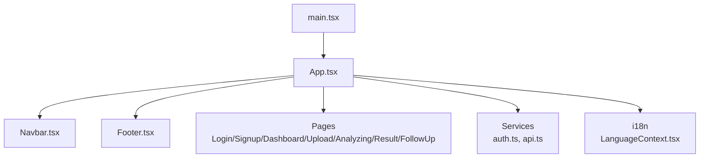
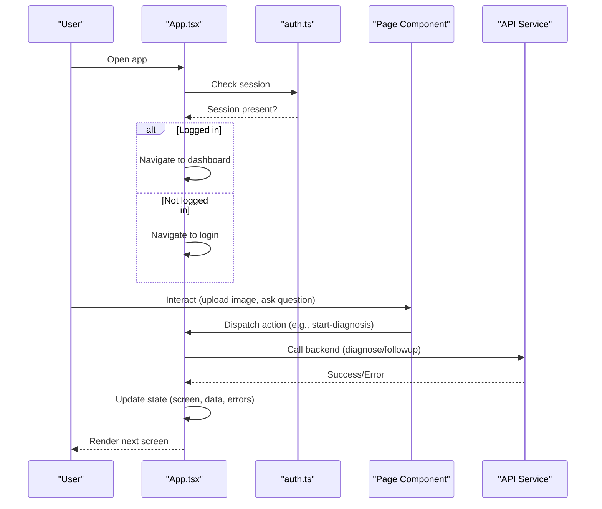
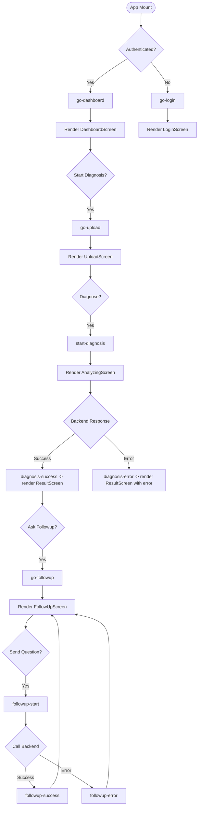
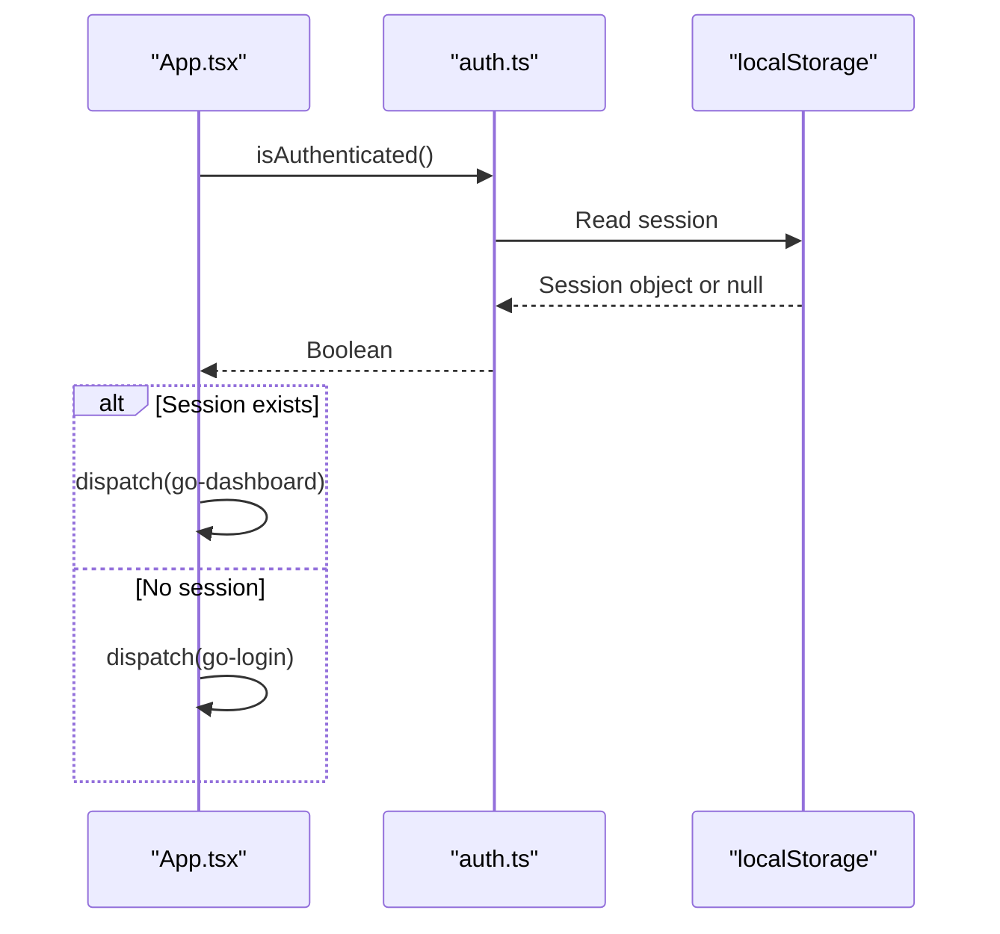
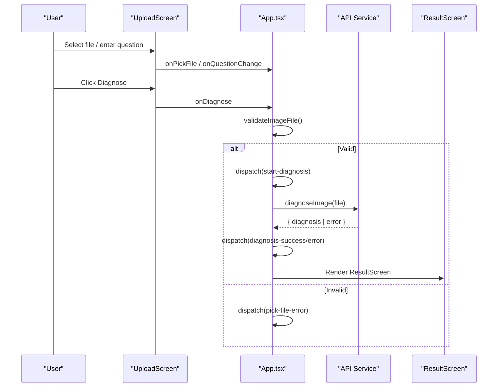
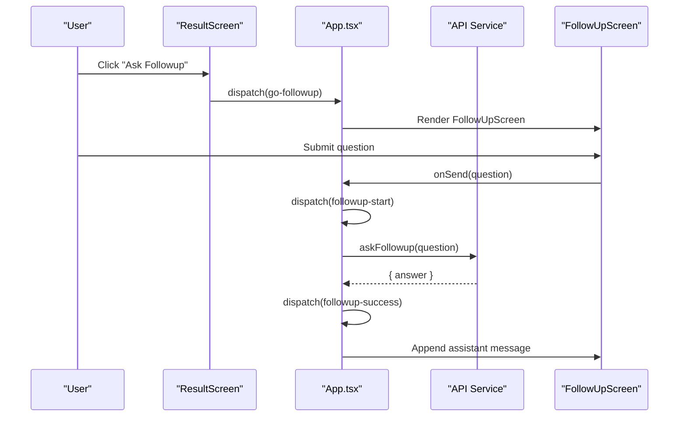
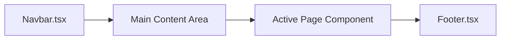
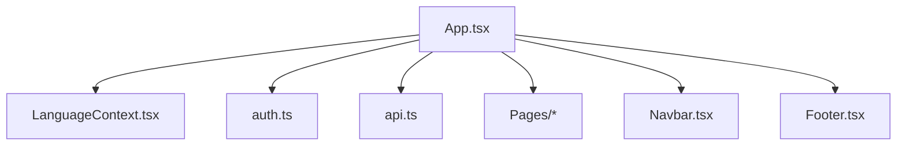

# React Application Structure

<cite>
**Referenced Files in This Document**
- [App.tsx](file://frontend/src/App.tsx)
- [main.tsx](file://frontend/src/main.tsx)
- [vite.config.ts](file://frontend/vite.config.ts)
- [package.json](file://frontend/package.json)
- [Navbar.tsx](file://frontend/src/components/Navbar.tsx)
- [Footer.tsx](file://frontend/src/components/Footer.tsx)
- [LoginScreen.tsx](file://frontend/src/pages/LoginScreen.tsx)
- [SignupScreen.tsx](file://frontend/src/pages/SignupScreen.tsx)
- [DashboardScreen.tsx](file://frontend/src/pages/DashboardScreen.tsx)
- [UploadScreen.tsx](file://frontend/src/pages/UploadScreen.tsx)
- [AnalyzingScreen.tsx](file://frontend/src/pages/AnalyzingScreen.tsx)
- [ResultScreen.tsx](file://frontend/src/pages/ResultScreen.tsx)
- [FollowUpScreen.tsx](file://frontend/src/pages/FollowUpScreen.tsx)
- [auth.ts](file://frontend/src/services/auth.ts)
- [LanguageContext.tsx](file://frontend/src/i18n/LanguageContext.tsx)
</cite>

## Table of Contents
1. [Introduction](#introduction)
2. [Project Structure](#project-structure)
3. [Core Components](#core-components)
4. [Architecture Overview](#architecture-overview)
5. [Detailed Component Analysis](#detailed-component-analysis)
6. [Dependency Analysis](#dependency-analysis)
7. [Performance Considerations](#performance-considerations)
8. [Troubleshooting Guide](#troubleshooting-guide)
9. [Conclusion](#conclusion)
10. [Appendices](#appendices)

## Introduction
This document explains the FasalDoc React application structure with a focus on the main application architecture. It covers how App.tsx orchestrates screens using state-based routing via useReducer, describes the screen flow (login, signup, dashboard, upload, analyzing, result, followup), outlines the application shell layout (Navbar, main content area, Footer), and documents the Vite configuration and build setup. It also provides guidance for adding new screens and managing application state transitions.

## Project Structure
The frontend is a modern React + TypeScript project built with Vite. The entry point renders the root component inside a language provider, which supplies internationalization context to all components.

**Diagram sources**
- [main.tsx:1-15](file://frontend/src/main.tsx#L1-L15)
- [App.tsx:1-336](file://frontend/src/App.tsx#L1-L336)
- [Navbar.tsx:1-61](file://frontend/src/components/Navbar.tsx#L1-L61)
- [Footer.tsx:1-19](file://frontend/src/components/Footer.tsx#L1-L19)
- [LanguageContext.tsx:1-67](file://frontend/src/i18n/LanguageContext.tsx#L1-L67)

**Section sources**
- [main.tsx:1-15](file://frontend/src/main.tsx#L1-L15)
- [package.json:1-23](file://frontend/package.json#L1-L23)
- [vite.config.ts:1-10](file://frontend/vite.config.ts#L1-L10)

## Core Components
- App.tsx: Root component that manages global UI state and routes between screens using useReducer. It composes the Navbar, main content area, and Footer, and coordinates authentication and diagnosis flows.
- Navbar.tsx: Header with brand, actions (new diagnosis, logout), and language toggle.
- Footer.tsx: Persistent footer with disclaimer and branding.
- LanguageContext.tsx: Provides i18n translations and direction (LTR/RTL) across the app.
- auth.ts: Local session management and mock login/signup using localStorage.

Key responsibilities:
- State-driven routing: App.tsx maintains a single source of truth for the current screen and related data (selected file, preview URL, question, diagnosis, messages).
- Side effects: On mount, App checks authentication and navigates accordingly; during analysis, it triggers API calls and updates state based on success or error.
- Shell layout: Navbar and Footer wrap the main content area where screens are conditionally rendered.

**Section sources**
- [App.tsx:29-133](file://frontend/src/App.tsx#L29-L133)
- [App.tsx:135-336](file://frontend/src/App.tsx#L135-L336)
- [Navbar.tsx:1-61](file://frontend/src/components/Navbar.tsx#L1-L61)
- [Footer.tsx:1-19](file://frontend/src/components/Footer.tsx#L1-L19)
- [LanguageContext.tsx:1-67](file://frontend/src/i18n/LanguageContext.tsx#L1-L67)
- [auth.ts:1-126](file://frontend/src/services/auth.ts#L1-L126)

## Architecture Overview
FasalDoc uses a state-based router pattern. Instead of a client-side router library, App.tsx holds the current screen name in its reducer state and conditionally renders the corresponding page component. This approach centralizes navigation logic and makes it easy to enforce guards (e.g., require authentication before accessing protected screens).

**Diagram sources**
- [App.tsx:142-151](file://frontend/src/App.tsx#L142-L151)
- [App.tsx:187-208](file://frontend/src/App.tsx#L187-L208)
- [App.tsx:227-237](file://frontend/src/App.tsx#L227-L237)
- [auth.ts:17-41](file://frontend/src/services/auth.ts#L17-L41)

## Detailed Component Analysis

### Screen Flow and State Management
App.tsx defines a union type for screens and a comprehensive reducer handling navigation, file selection, diagnosis lifecycle, and follow-up chat interactions.

- Screens: login, signup, dashboard, home, upload, analyzing, result, followup.
- Key state fields: screen, file, previewUrl, question, uploadError, diagnosis, diagnoseError, messages, sending, sendError.
- Navigation actions: go-login, go-signup, go-dashboard, go-home, go-upload, go-followup, reset.
- Data actions: pick-file, remove-file, set-question, start-diagnosis, diagnosis-success/error, followup-start/success/error.

**Diagram sources**
- [App.tsx:29-133](file://frontend/src/App.tsx#L29-L133)
- [App.tsx:142-151](file://frontend/src/App.tsx#L142-L151)
- [App.tsx:187-208](file://frontend/src/App.tsx#L187-L208)
- [App.tsx:227-237](file://frontend/src/App.tsx#L227-L237)
- [App.tsx:250-333](file://frontend/src/App.tsx#L250-L333)

**Section sources**
- [App.tsx:29-133](file://frontend/src/App.tsx#L29-L133)
- [App.tsx:135-336](file://frontend/src/App.tsx#L135-L336)

### Authentication and Session Handling
- On mount, App checks authentication via auth.ts and navigates to dashboard if a session exists; otherwise to login.
- Login and Signup use auth.ts functions that persist sessions in localStorage and validate inputs.
- Logout clears the session and navigates back to login.

**Diagram sources**
- [App.tsx:142-151](file://frontend/src/App.tsx#L142-L151)
- [auth.ts:17-41](file://frontend/src/services/auth.ts#L17-L41)

**Section sources**
- [App.tsx:142-151](file://frontend/src/App.tsx#L142-L151)
- [auth.ts:17-41](file://frontend/src/services/auth.ts#L17-L41)
- [LoginScreen.tsx:20-54](file://frontend/src/pages/LoginScreen.tsx#L20-L54)

### Upload and Diagnosis Flow
- UploadScreen collects an image file and optional question.
- App validates the file, sets preview URL, and triggers diagnosis when user submits.
- During analyzing, App calls the API service and updates state based on response.
- ResultScreen displays diagnosis details, confidence, advice, and options to retry or ask followup.

**Diagram sources**
- [App.tsx:164-208](file://frontend/src/App.tsx#L164-L208)
- [UploadScreen.tsx:19-67](file://frontend/src/pages/UploadScreen.tsx#L19-L67)
- [ResultScreen.tsx:18-170](file://frontend/src/pages/ResultScreen.tsx#L18-L170)

**Section sources**
- [UploadScreen.tsx:19-67](file://frontend/src/pages/UploadScreen.tsx#L19-L67)
- [App.tsx:164-208](file://frontend/src/App.tsx#L164-L208)
- [ResultScreen.tsx:18-170](file://frontend/src/pages/ResultScreen.tsx#L18-L170)

### Follow-Up Chat Flow
- From ResultScreen, users can ask follow-up questions.
- App manages message history and sending state, calling the API for each question and appending responses.

**Diagram sources**
- [App.tsx:227-237](file://frontend/src/App.tsx#L227-L237)
- [ResultScreen.tsx:131-137](file://frontend/src/pages/ResultScreen.tsx#L131-L137)
- [FollowUpScreen.tsx:1-200](file://frontend/src/pages/FollowUpScreen.tsx#L1-L200)

**Section sources**
- [App.tsx:227-237](file://frontend/src/App.tsx#L227-L237)
- [ResultScreen.tsx:131-137](file://frontend/src/pages/ResultScreen.tsx#L131-L137)
- [FollowUpScreen.tsx:1-200](file://frontend/src/pages/FollowUpScreen.tsx#L1-L200)

### Application Shell Layout
- Navbar: Displays brand, actions (new diagnosis, logout), and language toggle. Visibility controlled by props from App.
- Main content area: Renders the active screen based on App’s state.
- Footer: Shows disclaimer and branding.

**Diagram sources**
- [App.tsx:250-333](file://frontend/src/App.tsx#L250-L333)
- [Navbar.tsx:1-61](file://frontend/src/components/Navbar.tsx#L1-L61)
- [Footer.tsx:1-19](file://frontend/src/components/Footer.tsx#L1-L19)

**Section sources**
- [App.tsx:250-333](file://frontend/src/App.tsx#L250-L333)
- [Navbar.tsx:1-61](file://frontend/src/components/Navbar.tsx#L1-L61)
- [Footer.tsx:1-19](file://frontend/src/components/Footer.tsx#L1-L19)

## Dependency Analysis
App.tsx depends on:
- i18n: LanguageContext for translations and direction.
- Services: auth.ts for session management; api.ts for diagnosing images and asking follow-ups.
- Pages: All screen components for rendering different views.
- Components: Navbar, Footer, and shared UI elements.

**Diagram sources**
- [App.tsx:1-28](file://frontend/src/App.tsx#L1-L28)
- [LanguageContext.tsx:1-67](file://frontend/src/i18n/LanguageContext.tsx#L1-L67)
- [auth.ts:1-126](file://frontend/src/services/auth.ts#L1-L126)

**Section sources**
- [App.tsx:1-28](file://frontend/src/App.tsx#L1-L28)

## Performance Considerations
- Avoid unnecessary re-renders by keeping state minimal and using stable references for callbacks (e.g., useCallback for error mapping).
- Revoke object URLs for previews to prevent memory leaks when navigating away.
- Debounce or throttle heavy operations like image validation and API calls if needed.
- Keep reducer actions granular to avoid large state updates.

[No sources needed since this section provides general guidance]

## Troubleshooting Guide
Common issues and where to look:
- Authentication failures: Check auth.ts login/signup implementations and localStorage keys.
- Network errors: Inspect error mapping in App.tsx for ApiError kinds and ensure proper translation strings.
- File validation errors: Review validateImageFile usage and error codes in App.tsx.
- Memory leaks: Ensure preview URLs are revoked when changing or removing files.

**Section sources**
- [auth.ts:54-90](file://frontend/src/services/auth.ts#L54-L90)
- [auth.ts:96-125](file://frontend/src/services/auth.ts#L96-L125)
- [App.tsx:210-225](file://frontend/src/App.tsx#L210-L225)
- [App.tsx:164-185](file://frontend/src/App.tsx#L164-L185)
- [App.tsx:242-248](file://frontend/src/App.tsx#L242-L248)

## Conclusion
FasalDoc’s React application uses a clean, state-driven architecture centered around App.tsx and useReducer. This approach simplifies navigation, enforces consistent state transitions, and keeps side effects centralized. The shell layout (Navbar, main area, Footer) provides a consistent user experience across screens. With clear separation of concerns and modular components, adding new screens and features is straightforward.

[No sources needed since this section summarizes without analyzing specific files]

## Appendices

### Adding a New Screen
Steps to add a new screen:
1. Create a new page component under pages/.
2. Define a new screen string in App.tsx’s Screen type.
3. Add a corresponding action in the reducer to navigate to the new screen.
4. Conditionally render the new screen in App.tsx’s main content area.
5. If the screen requires authentication, guard navigation in App or within the screen itself.
6. Wire up any necessary services (auth, api) and update state via dispatch.

**Section sources**
- [App.tsx:29-133](file://frontend/src/App.tsx#L29-L133)
- [App.tsx:250-333](file://frontend/src/App.tsx#L250-L333)

### Managing Application State Transitions
Guidelines:
- Use explicit actions for every state change (navigation, data updates, errors).
- Keep side effects in App.tsx to centralize behavior and reduce duplication.
- Leverage refs for flags that should not trigger re-renders (e.g., diagnosisRan).
- Normalize error handling by mapping API errors to user-friendly messages.

**Section sources**
- [App.tsx:135-208](file://frontend/src/App.tsx#L135-L208)
- [App.tsx:210-237](file://frontend/src/App.tsx#L210-L237)

### Vite Configuration and Build Setup
- Development server runs on port 5173 with React plugin enabled.
- Scripts: dev (Vite), build (TypeScript build then Vite build), preview (Vite preview).
- Dependencies include React 19 and TypeScript tooling.

**Section sources**
- [vite.config.ts:1-10](file://frontend/vite.config.ts#L1-L10)
- [package.json:1-23](file://frontend/package.json#L1-L23)