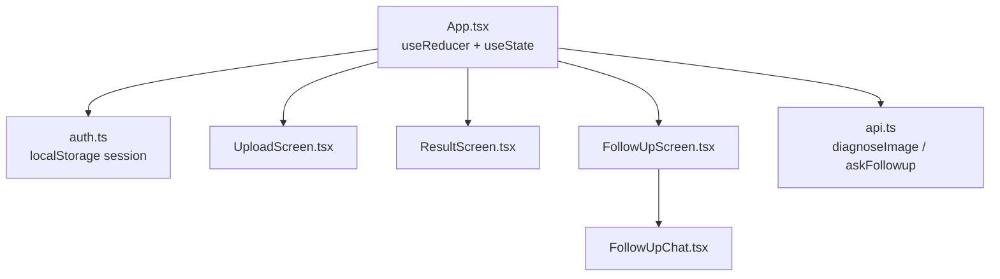
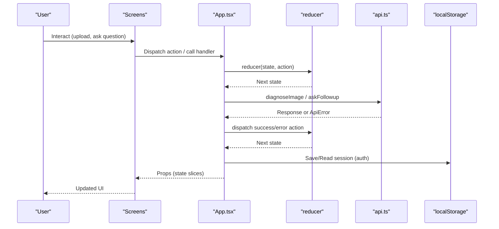
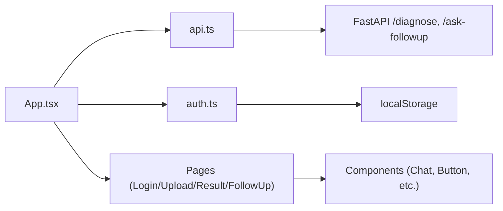
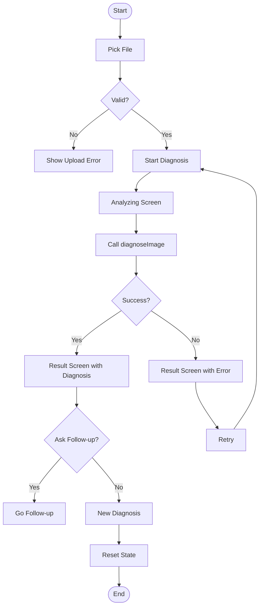
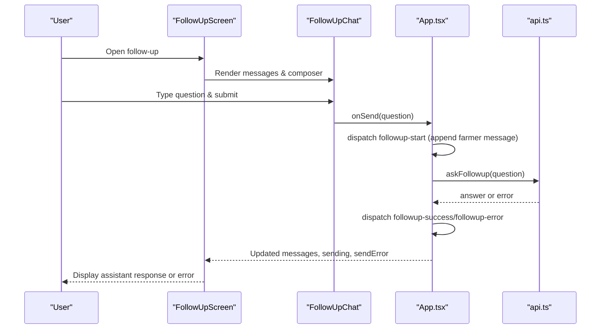

# State Management

<cite>
**Referenced Files in This Document**
- [App.tsx](file://frontend/src/App.tsx)
- [auth.ts](file://frontend/src/services/auth.ts)
- [api.ts](file://frontend/src/services/api.ts)
- [LoginScreen.tsx](file://frontend/src/pages/LoginScreen.tsx)
- [UploadScreen.tsx](file://frontend/src/pages/UploadScreen.tsx)
- [ResultScreen.tsx](file://frontend/src/pages/ResultScreen.tsx)
- [FollowUpScreen.tsx](file://frontend/src/pages/FollowUpScreen.tsx)
- [FollowUpChat.tsx](file://frontend/src/components/FollowUpChat.tsx)
- [api.ts (types)](file://frontend/src/types/api.ts)
</cite>

## Table of Contents
1. Introduction
2. Project Structure
3. Core Components
4. Architecture Overview
5. Detailed Component Analysis
6. Dependency Analysis
7. Performance Considerations
8. Troubleshooting Guide
9. Conclusion
10. Appendices

## Introduction
This document explains FasalDoc’s state management approach, which uses a centralized state pattern built on React hooks. The application maintains a single source of truth for UI and workflow state using useReducer in the root App component. It covers:
- Complex UI state for file uploads, diagnosis results, and chat messages
- Authentication state with localStorage persistence
- Action types and reducer logic for user interactions and API responses
- State transitions during diagnosis and follow-up conversation flows
- Guidance for extending the state management to new features

## Project Structure
The state management is centered in the root App component, which owns the global flow state via useReducer and coordinates authentication state with local storage through a dedicated auth service. Screens are presentational and receive props from the central state; they dispatch actions or call handlers that ultimately dispatch actions.

**Diagram sources**
- [App.tsx:135-335](file://frontend/src/App.tsx#L135-L335)
- [auth.ts:17-41](file://frontend/src/services/auth.ts#L17-L41)
- [api.ts:64-98](file://frontend/src/services/api.ts#L64-L98)

**Section sources**
- [App.tsx:31-133](file://frontend/src/App.tsx#L31-L133)
- [auth.ts:1-126](file://frontend/src/services/auth.ts#L1-L126)
- [api.ts:1-99](file://frontend/src/services/api.ts#L1-L99)

## Core Components
- Centralized Flow State: A single FlowState object tracks screen navigation, selected file, preview URL, question text, upload errors, diagnosis result, diagnosis error, chat messages, sending status, and send errors.
- Reducer: A pure function handling all action types to produce immutable next states.
- Authentication Service: Manages login/signup and persists the current user session in localStorage.
- API Service: Encapsulates network calls for diagnosis and follow-up questions, normalizing errors into typed ApiError instances.

Key responsibilities:
- App.tsx: Owns FlowState via useReducer, orchestrates side effects (API calls), and renders screens based on state.
- auth.ts: Provides isAuthenticated, getCurrentUser, login, signup, logout with localStorage persistence.
- api.ts: Validates images, sends requests to backend endpoints, and returns typed responses or throws ApiError.

**Section sources**
- [App.tsx:31-133](file://frontend/src/App.tsx#L31-L133)
- [auth.ts:17-41](file://frontend/src/services/auth.ts#L17-L41)
- [api.ts:28-44](file://frontend/src/services/api.ts#L28-L44)
- [api.ts:64-98](file://frontend/src/services/api.ts#L64-L98)

## Architecture Overview
The application follows a unidirectional data flow:
- User interactions trigger event handlers in screens.
- Handlers either update local UI state or dispatch actions to the central reducer.
- Side effects (network requests) are performed in App-level effects or handlers, then dispatch success/error actions.
- Screens re-render based on updated state.

**Diagram sources**
- [App.tsx:178-237](file://frontend/src/App.tsx#L178-L237)
- [api.ts:64-98](file://frontend/src/services/api.ts#L64-L98)
- [auth.ts:21-41](file://frontend/src/services/auth.ts#L21-L41)

## Detailed Component Analysis

### Centralized Flow State and Reducer
- State shape: Includes screen routing, file selection, preview URL, question input, upload/diagnosis/send errors, diagnosis result, chat messages array, and sending flag.
- Actions: Typed union covering navigation, file operations, question updates, diagnosis lifecycle, follow-up messaging, and reset.
- Reducer logic: Pure transformations ensuring immutability and clear separation of concerns. Each case returns a new state object with only necessary changes.

Highlights:
- File pick sets preview URL and clears upload errors.
- Diagnosis starts by switching to analyzing screen, then triggers API call in an effect when entering analyzing state.
- Success transitions to result screen with diagnosis; error shows error message on result screen.
- Follow-up chat appends farmer messages immediately, then adds assistant response upon success or displays error.

**Section sources**
- [App.tsx:31-133](file://frontend/src/App.tsx#L31-L133)

### Authentication State with localStorage Persistence
- Session key stored in localStorage under a constant key.
- getCurrentUser reads and validates session JSON; isAuthenticated checks presence.
- login and signup simulate network delays and persist sessions; signup also stores mock accounts for demo purposes.
- logout removes session from localStorage.

Integration points:
- On mount, App checks authentication and navigates to dashboard or login accordingly.
- LoginScreen calls login and passes the resulting user to App, which updates local user state and navigates.

**Section sources**
- [auth.ts:17-41](file://frontend/src/services/auth.ts#L17-L41)
- [auth.ts:54-90](file://frontend/src/services/auth.ts#L54-L90)
- [auth.ts:96-125](file://frontend/src/services/auth.ts#L96-L125)
- [App.tsx:142-162](file://frontend/src/App.tsx#L142-L162)
- [LoginScreen.tsx:20-54](file://frontend/src/pages/LoginScreen.tsx#L20-L54)

### API Integration and Error Handling
- Image validation mirrors backend constraints to provide immediate UX feedback before upload.
- diagnoseImage sends multipart form with image field name matching backend expectations.
- askFollowup sends JSON body with question field per backend contract.
- Errors are normalized into ApiError with kind classification (validation, network, server), enabling consistent error handling in UI.

Usage in App:
- diagnoseImage called when transitioning to analyzing screen; success/error dispatched accordingly.
- askFollowup called when sending follow-up questions; success/error handled similarly.

**Section sources**
- [api.ts:28-44](file://frontend/src/services/api.ts#L28-L44)
- [api.ts:64-98](file://frontend/src/services/api.ts#L64-L98)
- [App.tsx:187-237](file://frontend/src/App.tsx#L187-L237)

### Screen-Level State Coordination
- UploadScreen: Receives file, previewUrl, question, and error from App; delegates pick/remove/change/diagnose to App via callbacks.
- ResultScreen: Displays diagnosis details, confidence band, advice, and optional enrichment; provides actions to start follow-up or new diagnosis.
- FollowUpScreen: Shows context (image and diagnosis summary) and delegates message sending to App; receives messages, sending, and sendError from App.
- FollowUpChat: Local draft state for composing messages; scrolls to bottom on updates; submits via onSend prop.

**Section sources**
- [UploadScreen.tsx:8-67](file://frontend/src/pages/UploadScreen.tsx#L8-L67)
- [ResultScreen.tsx:9-170](file://frontend/src/pages/ResultScreen.tsx#L9-L170)
- [FollowUpScreen.tsx:6-54](file://frontend/src/pages/FollowUpScreen.tsx#L6-L54)
- [FollowUpChat.tsx:8-92](file://frontend/src/components/FollowUpChat.tsx#L8-L92)

### Data Types and Contracts
- DiagnosisResponse: filename, diagnosis, confidence, advice, needs_expert.
- FollowupRequest: question.
- FollowupResponse: question, answer.

These types ensure consistency between frontend state and backend API contracts.

**Section sources**
- [api.ts (types):1-26](file://frontend/src/types/api.ts#L1-L26)

## Dependency Analysis
- App depends on:
  - i18n LanguageContext for localized strings
  - Services: api.ts for network calls, auth.ts for authentication
  - Pages: LoginScreen, SignupScreen, DashboardScreen, HomeScreen, UploadScreen, AnalyzingScreen, ResultScreen, FollowUpScreen
  - Components: Navbar, Footer, ChatMessage
- Auth service depends on localStorage for persistence.
- API service depends on environment variable for base URL and backend endpoints.

**Diagram sources**
- [App.tsx:1-27](file://frontend/src/App.tsx#L1-L27)
- [api.ts:11-13](file://frontend/src/services/api.ts#L11-L13)
- [auth.ts:10-11](file://frontend/src/services/auth.ts#L10-L11)

**Section sources**
- [App.tsx:1-27](file://frontend/src/App.tsx#L1-L27)
- [api.ts:11-13](file://frontend/src/services/api.ts#L11-L13)
- [auth.ts:10-11](file://frontend/src/services/auth.ts#L10-L11)

## Performance Considerations
- Avoid unnecessary re-renders by keeping state minimal and derived where possible.
- Revoke previous preview URLs to prevent memory leaks when changing images.
- Use refs to guard against duplicate API calls (e.g., diagnosisRan).
- Debounce or throttle heavy operations if needed (not currently implemented).
- Keep reducer pure and avoid deep cloning unless necessary; current shallow spread is efficient for this state shape.

[No sources needed since this section provides general guidance]

## Troubleshooting Guide
Common issues and resolutions:
- Network errors during diagnosis or follow-up:
  - ApiError with kind 'network' indicates fetch failure; UI displays generic network error message.
  - Check backend availability and CORS settings if applicable.
- Validation errors:
  - Invalid image type or size triggers immediate client-side validation; ensure allowed types and size limits match backend.
  - Empty question prevents sending follow-up; validate before dispatching.
- Authentication failures:
  - Invalid credentials throw specific error; UI maps to localized message.
  - Ensure localStorage is available and not blocked by browser policies.

Where to inspect:
- Error mapping in App for diagnosis and follow-up.
- ApiError parsing in api.ts for backend error normalization.
- Auth error handling in LoginScreen and auth service.

**Section sources**
- [App.tsx:210-237](file://frontend/src/App.tsx#L210-L237)
- [api.ts:46-58](file://frontend/src/services/api.ts#L46-L58)
- [LoginScreen.tsx:41-54](file://frontend/src/pages/LoginScreen.tsx#L41-L54)

## Conclusion
FasalDoc employs a robust centralized state management strategy using React’s useReducer at the root level, complemented by local state in screens for transient inputs. Authentication is persisted via localStorage, providing seamless session continuity across reloads. The API service abstracts network communication and standardizes error handling, enabling consistent UI behavior. This architecture supports clear separation of concerns, predictable state transitions, and easy extensibility for new features such as additional workflows or enhanced diagnostics.

[No sources needed since this section summarizes without analyzing specific files]

## Appendices

### State Transitions During Diagnosis Workflow

**Diagram sources**
- [App.tsx:178-237](file://frontend/src/App.tsx#L178-L237)
- [api.ts:64-77](file://frontend/src/services/api.ts#L64-L77)

### Follow-up Conversation Flow

**Diagram sources**
- [App.tsx:227-237](file://frontend/src/App.tsx#L227-L237)
- [FollowUpScreen.tsx:16-50](file://frontend/src/pages/FollowUpScreen.tsx#L16-L50)
- [FollowUpChat.tsx:31-36](file://frontend/src/components/FollowUpChat.tsx#L31-L36)
- [api.ts:84-98](file://frontend/src/services/api.ts#L84-L98)

### Extending State Management for New Features
Guidelines:
- Define new fields in FlowState interface and initialize them in initialState.
- Add new action types to the Action union with required payload shapes.
- Implement reducer cases to handle transitions, ensuring immutability and clarity.
- If new side effects are needed, add useEffect or async handlers in App that dispatch appropriate actions.
- Update relevant screens to consume new state and expose handlers to dispatch actions.
- For API integrations, extend api.ts with new functions and types, and handle errors consistently.

Example patterns to follow:
- File upload: validate locally, set preview URL, clear errors on success.
- Async operation: show loading state, dispatch success/error actions based on response.
- Chat-like flows: append user messages immediately, then update with assistant response.

**Section sources**
- [App.tsx:31-133](file://frontend/src/App.tsx#L31-L133)
- [api.ts:28-44](file://frontend/src/services/api.ts#L28-L44)
- [api.ts:64-98](file://frontend/src/services/api.ts#L64-L98)