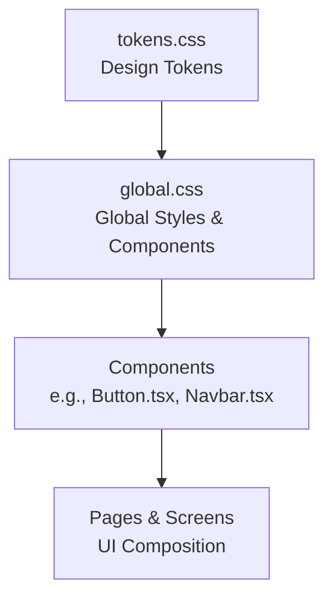
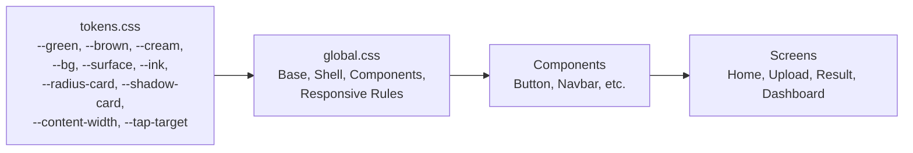
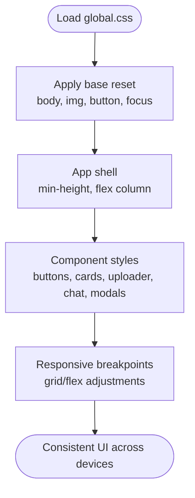
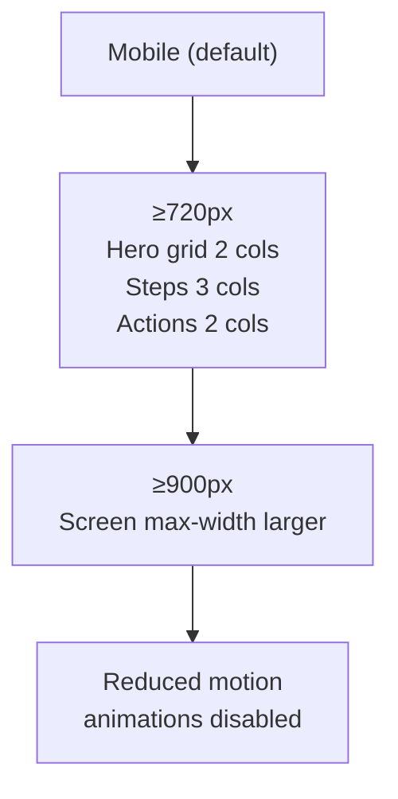
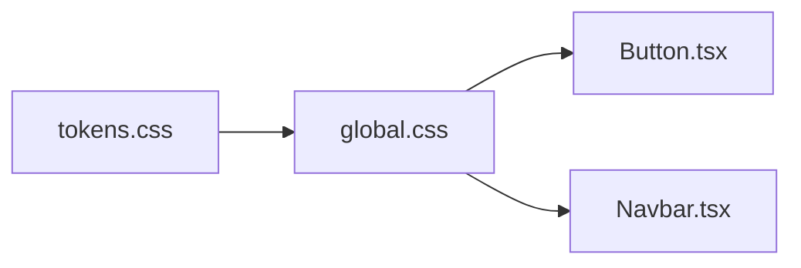

# Styling and Design System

<cite>
**Referenced Files in This Document**
- [tokens.css](file://frontend/src/styles/tokens.css)
- [global.css](file://frontend/src/styles/global.css)
- [Button.tsx](file://frontend/src/components/Button.tsx)
- [Navbar.tsx](file://frontend/src/components/Navbar.tsx)
</cite>

## Table of Contents
1. Introduction
2. Project Structure
3. Core Components
4. Architecture Overview
5. Detailed Component Analysis
6. Dependency Analysis
7. Performance Considerations
8. Troubleshooting Guide
9. Conclusion
10. Appendices

## Introduction
This document explains FasalDoc’s styling system with a focus on CSS architecture and design tokens. It covers global styles organization, CSS custom properties for consistent theming, responsive design patterns using CSS Grid and Flexbox for mobile-first layouts, the color palette, typography scale, spacing system, and guidance for creating responsive components, implementing dark mode support, and maintaining design consistency. It also provides examples for extending the design system with new tokens and components.

## Project Structure
The styling system is organized into two primary files:
- tokens.css: Centralized design tokens (colors, fonts, radii, shadows, content width, tap target).
- global.css: Global resets, base typography, layout shell, component styles, and responsive rules.

**Diagram sources**
- [tokens.css:1-36](file://frontend/src/styles/tokens.css#L1-L36)
- [global.css:1-80](file://frontend/src/styles/global.css#L1-L80)

**Section sources**
- [tokens.css:1-36](file://frontend/src/styles/tokens.css#L1-L36)
- [global.css:1-80](file://frontend/src/styles/global.css#L1-L80)

## Core Components
FasalDoc uses a small set of reusable UI primitives that rely on design tokens:
- Buttons: Variants are applied via class modifiers and styled by tokens.
- Navbar: Uses token-driven colors, spacing, and layout to maintain consistency across screens.

These components demonstrate how to compose UI from tokens without hardcoding values.

**Section sources**
- [Button.tsx:1-32](file://frontend/src/components/Button.tsx#L1-L32)
- [Navbar.tsx:1-61](file://frontend/src/components/Navbar.tsx#L1-L61)

## Architecture Overview
The styling architecture follows a clear separation of concerns:
- Design tokens define the visual language once.
- Global styles build semantic classes and components on top of tokens.
- Components consume tokens through utility classes and CSS variables.

**Diagram sources**
- [tokens.css:1-36](file://frontend/src/styles/tokens.css#L1-L36)
- [global.css:1-80](file://frontend/src/styles/global.css#L1-L80)

## Detailed Component Analysis

### Design Tokens
- Color palette: Greens, browns, cream, background/surface, ink tones, danger, amber.
- Typography: Latin and Urdu font stacks.
- Spacing and sizing: Content width and tap target size.
- Shape and depth: Card and control border radii; card and pop shadows.

These tokens ensure consistent theming across all components and screens.

**Section sources**
- [tokens.css:1-36](file://frontend/src/styles/tokens.css#L1-L36)

### Global Styles Organization
- Base reset and body: Uses tokens for background, text color, and font family.
- Focus management: Accessible focus ring using token color.
- Layout shell: App shell and main area use tokens for spacing and widths.
- Component styles: Buttons, cards, uploaders, chat, modals, and overlays are built with tokens for colors, borders, radii, and shadows.

**Diagram sources**
- [global.css:1-80](file://frontend/src/styles/global.css#L1-L80)
- [global.css:1599-1645](file://frontend/src/styles/global.css#L1599-L1645)

**Section sources**
- [global.css:1-80](file://frontend/src/styles/global.css#L1-L80)

### Responsive Design Patterns
- Mobile-first approach: Default styles target small screens; enhancements at breakpoints.
- Breakpoints:
  - min-width: 720px: Hero grid columns, steps grid, result actions grid, dashboard actions grid, auth padding.
  - min-width: 900px: Screen max-width increase.
  - Reduced motion: Disables animations for accessibility.
- Layout techniques:
  - CSS Grid: Used for hero, steps, result actions, dashboard actions.
  - Flexbox: Used for navbar, buttons, chat messages, overlays.

**Diagram sources**
- [global.css:1599-1645](file://frontend/src/styles/global.css#L1599-L1645)

**Section sources**
- [global.css:1599-1645](file://frontend/src/styles/global.css#L1599-L1645)

### Color Palette, Typography Scale, and Spacing System
- Colors:
  - Primary greens and accents for success states.
  - Browns and creams for warm neutrals and surfaces.
  - Ink tones for text hierarchy.
  - Danger and amber for warnings and alerts.
- Typography:
  - Latin stack optimized for readability.
  - Urdu stack for localized content.
- Spacing and sizing:
  - Consistent tap targets for touch-friendly interactions.
  - Card and control radii for cohesive shape language.
  - Shadows for elevation and focus.

These tokens are referenced throughout global styles to ensure consistency.

**Section sources**
- [tokens.css:1-36](file://frontend/src/styles/tokens.css#L1-L36)
- [global.css:1-80](file://frontend/src/styles/global.css#L1-L80)

### Creating Responsive Components
Guidelines:
- Use tokens for colors, spacing, and sizes.
- Prefer Flexbox for one-dimensional layouts and alignment.
- Use CSS Grid for multi-column layouts like hero or dashboards.
- Apply mobile-first defaults and enhance at breakpoints.
- Ensure accessible focus states and minimum tap targets.

Examples in codebase:
- Buttons: Token-driven variants and sizing.
- Navbar: Token-based brand, actions, and spacing.

**Section sources**
- [Button.tsx:1-32](file://frontend/src/components/Button.tsx#L1-L32)
- [Navbar.tsx:1-61](file://frontend/src/components/Navbar.tsx#L1-L61)
- [global.css:1599-1645](file://frontend/src/styles/global.css#L1599-L1645)

### Implementing Dark Mode Support
Current state:
- The codebase defines light-mode tokens and does not include a dark theme.

Recommended approach:
- Add a dark theme block under :root or a data attribute selector.
- Override tokens for background, surface, ink, and accent colors.
- Keep component styles token-driven so they adapt automatically.

Example pattern (conceptual):
- Define dark tokens for --bg, --surface, --ink, --accent, etc.
- Apply theme switcher logic to toggle attributes or classes.
- Ensure contrast and accessibility guidelines are met.

[No sources needed since this section provides general guidance]

### Maintaining Design Consistency
Best practices:
- Centralize all visual values in tokens.
- Reference tokens in global styles and avoid hardcoded values.
- Use semantic class names for components.
- Enforce consistent spacing, radii, and shadows via tokens.
- Validate accessibility with focus rings and reduced motion support.

**Section sources**
- [tokens.css:1-36](file://frontend/src/styles/tokens.css#L1-L36)
- [global.css:1-80](file://frontend/src/styles/global.css#L1-L80)

### Extending the Design System
To add new tokens:
- Define new variables in tokens.css under appropriate categories (colors, typography, spacing, shapes, shadows).
- Use these tokens in global.css for new components or updates.

To add new components:
- Create semantic class names in global.css.
- Compose layout with Flexbox/Grid and style with tokens.
- Ensure responsive behavior and accessibility.

Examples:
- New color: Add a token and reference it in component styles.
- New component: Follow existing patterns for structure and tokens.

**Section sources**
- [tokens.css:1-36](file://frontend/src/styles/tokens.css#L1-L36)
- [global.css:1-80](file://frontend/src/styles/global.css#L1-L80)

## Dependency Analysis
The styling system has minimal coupling:
- global.css depends on tokens.css via CSS custom properties.
- Components depend on global.css classes and tokens indirectly.

**Diagram sources**
- [tokens.css:1-36](file://frontend/src/styles/tokens.css#L1-L36)
- [global.css:1-80](file://frontend/src/styles/global.css#L1-L80)
- [Button.tsx:1-32](file://frontend/src/components/Button.tsx#L1-L32)
- [Navbar.tsx:1-61](file://frontend/src/components/Navbar.tsx#L1-L61)

**Section sources**
- [tokens.css:1-36](file://frontend/src/styles/tokens.css#L1-L36)
- [global.css:1-80](file://frontend/src/styles/global.css#L1-L80)
- [Button.tsx:1-32](file://frontend/src/components/Button.tsx#L1-L32)
- [Navbar.tsx:1-61](file://frontend/src/components/Navbar.tsx#L1-L61)

## Performance Considerations
- Use CSS variables for theming to avoid reflows when switching themes.
- Limit heavy animations; respect prefers-reduced-motion.
- Prefer native layout (Grid/Flexbox) for efficient rendering.
- Keep selectors simple and scoped to improve performance.

[No sources needed since this section provides general guidance]

## Troubleshooting Guide
Common issues and resolutions:
- Inconsistent colors or spacing: Ensure you are using tokens instead of hardcoded values.
- Broken layouts on certain screens: Verify responsive breakpoints and container constraints.
- Accessibility problems: Check focus-visible styles and tap target sizes.
- Animations causing discomfort: Respect prefers-reduced-motion settings.

**Section sources**
- [global.css:1599-1645](file://frontend/src/styles/global.css#L1599-L1645)

## Conclusion
FasalDoc’s styling system centers on a robust token layer and a clean global stylesheet that builds semantic, responsive components. By adhering to mobile-first principles, leveraging CSS Grid and Flexbox, and consistently referencing design tokens, the system ensures a cohesive, accessible, and scalable user interface. Extending the system involves adding tokens and following established patterns for components and responsive behavior.

[No sources needed since this section summarizes without analyzing specific files]

## Appendices

### Appendix A: Token Reference Summary
- Colors: Greens, browns, cream, backgrounds/surfaces, ink tones, danger, amber.
- Typography: Latin and Urdu font stacks.
- Spacing/Sizing: Content width and tap target.
- Shapes/Depth: Radii and shadows.

**Section sources**
- [tokens.css:1-36](file://frontend/src/styles/tokens.css#L1-L36)

### Appendix B: Responsive Breakpoints
- ≥720px: Multi-column grids for hero, steps, actions, dashboard.
- ≥900px: Larger screen max-width.
- Reduced motion: Disable animations for accessibility.

**Section sources**
- [global.css:1599-1645](file://frontend/src/styles/global.css#L1599-L1645)