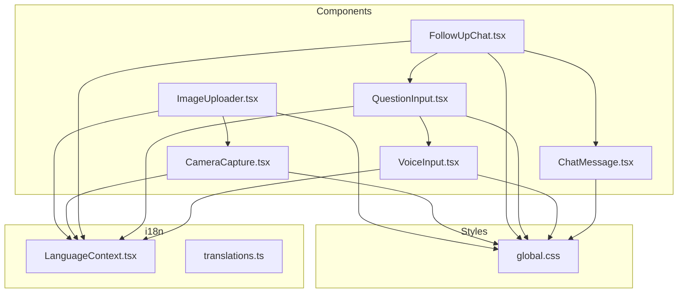
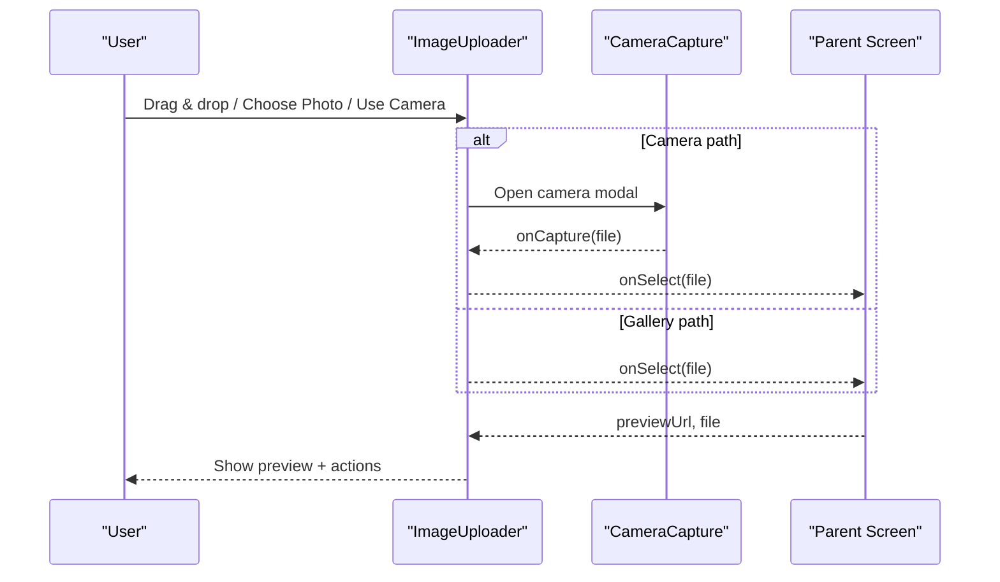
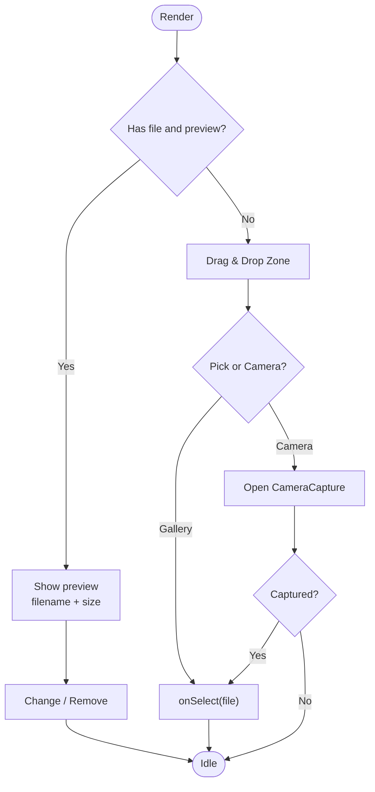
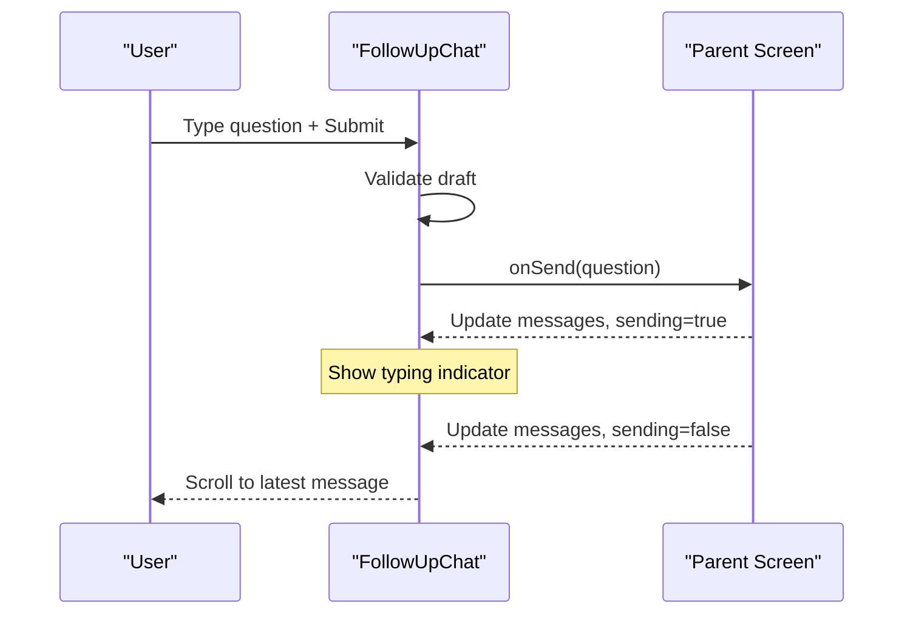
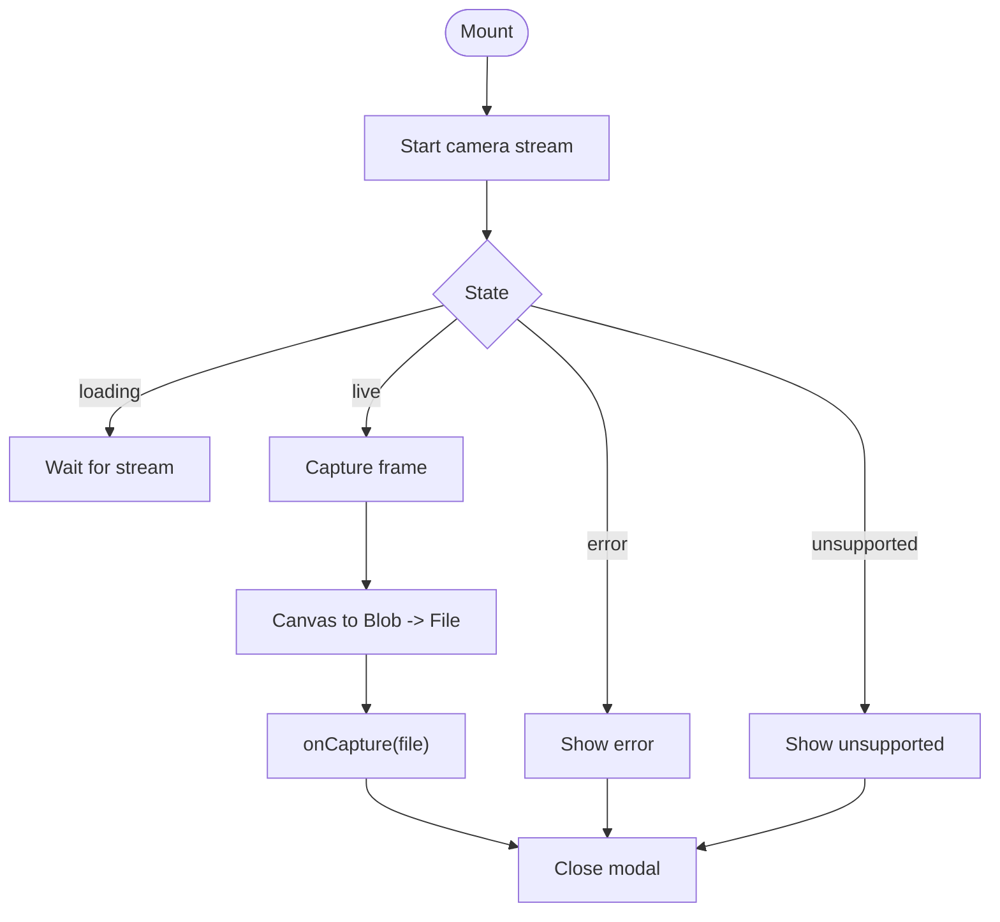
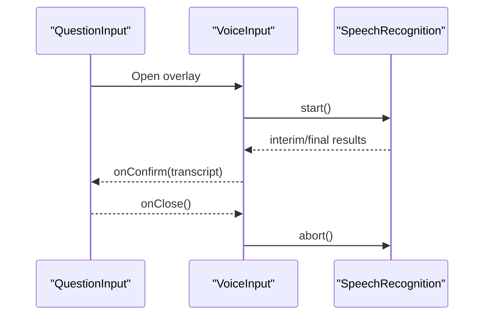
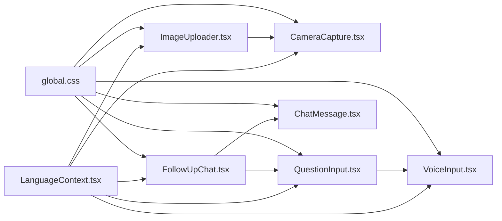

# UI Components

<cite>
**Referenced Files in This Document**
- [ImageUploader.tsx](file://frontend/src/components/ImageUploader.tsx)
- [CameraCapture.tsx](file://frontend/src/components/CameraCapture.tsx)
- [FollowUpChat.tsx](file://frontend/src/components/FollowUpChat.tsx)
- [VoiceInput.tsx](file://frontend/src/components/VoiceInput.tsx)
- [QuestionInput.tsx](file://frontend/src/components/QuestionInput.tsx)
- [ChatMessage.tsx](file://frontend/src/components/ChatMessage.tsx)
- [LanguageContext.tsx](file://frontend/src/i18n/LanguageContext.tsx)
- [translations.ts](file://frontend/src/i18n/translations.ts)
- [global.css](file://frontend/src/styles/global.css)
</cite>

## Table of Contents
1. [Introduction](#introduction)
2. [Project Structure](#project-structure)
3. [Core Components](#core-components)
4. [Architecture Overview](#architecture-overview)
5. [Detailed Component Analysis](#detailed-component-analysis)
6. [Dependency Analysis](#dependency-analysis)
7. [Performance Considerations](#performance-considerations)
8. [Troubleshooting Guide](#troubleshooting-guide)
9. [Conclusion](#conclusion)

## Introduction
This document explains the reusable UI components that power FasalDoc’s front-end, focusing on:
- ImageUploader: drag-and-drop file selection, preview, and camera integration
- FollowUpChat: interactive conversation with message history and real-time updates
- CameraCapture: mobile-first camera capture using Web APIs
- VoiceInput: speech-to-text overlay integrated into question input

You will find prop interfaces, event handling patterns, styling approaches, usage examples, and customization guidelines for each component.

## Project Structure
The components live under frontend/src/components and are styled via global CSS. Internationalization is provided through a LanguageContext and translations.

**Diagram sources**
- [ImageUploader.tsx:1-173](file://frontend/src/components/ImageUploader.tsx#L1-L173)
- [CameraCapture.tsx:1-200](file://frontend/src/components/CameraCapture.tsx#L1-L200)
- [FollowUpChat.tsx:1-92](file://frontend/src/components/FollowUpChat.tsx#L1-L92)
- [VoiceInput.tsx:1-197](file://frontend/src/components/VoiceInput.tsx#L1-L197)
- [QuestionInput.tsx:1-96](file://frontend/src/components/QuestionInput.tsx#L1-L96)
- [ChatMessage.tsx:1-22](file://frontend/src/components/ChatMessage.tsx#L1-L22)
- [LanguageContext.tsx:1-67](file://frontend/src/i18n/LanguageContext.tsx#L1-L67)
- [translations.ts:1-200](file://frontend/src/i18n/translations.ts#L1-L200)
- [global.css:335-452](file://frontend/src/styles/global.css#L335-L452)

**Section sources**
- [ImageUploader.tsx:1-173](file://frontend/src/components/ImageUploader.tsx#L1-L173)
- [FollowUpChat.tsx:1-92](file://frontend/src/components/FollowUpChat.tsx#L1-L92)
- [CameraCapture.tsx:1-200](file://frontend/src/components/CameraCapture.tsx#L1-L200)
- [VoiceInput.tsx:1-197](file://frontend/src/components/VoiceInput.tsx#L1-L197)
- [QuestionInput.tsx:1-96](file://frontend/src/components/QuestionInput.tsx#L1-L96)
- [ChatMessage.tsx:1-22](file://frontend/src/components/ChatMessage.tsx#L1-L22)
- [LanguageContext.tsx:1-67](file://frontend/src/i18n/LanguageContext.tsx#L1-L67)
- [translations.ts:1-200](file://frontend/src/i18n/translations.ts#L1-L200)
- [global.css:335-452](file://frontend/src/styles/global.css#L335-L452)

## Core Components
- ImageUploader: Provides drag-and-drop, gallery pick, camera capture, preview, and remove/change actions. Integrates with CameraCapture and uses i18n strings.
- FollowUpChat: Renders chat messages, typing indicator, error banner, and a composer form that delegates sending to parent via onSend.
- CameraCapture: Opens device camera stream, captures frames to a Blob/File, and returns it to the caller. Handles permission and unsupported states.
- VoiceInput: Wraps browser Speech Recognition API to transcribe voice input, supports editing transcript, and confirms or cancels.

**Section sources**
- [ImageUploader.tsx:6-173](file://frontend/src/components/ImageUploader.tsx#L6-L173)
- [FollowUpChat.tsx:8-92](file://frontend/src/components/FollowUpChat.tsx#L8-L92)
- [CameraCapture.tsx:6-200](file://frontend/src/components/CameraCapture.tsx#L6-L200)
- [VoiceInput.tsx:6-197](file://frontend/src/components/VoiceInput.tsx#L6-L197)

## Architecture Overview
The components follow a unidirectional data flow pattern:
- Parent components own state (e.g., selected image, chat messages) and pass props down.
- Child components emit events (callbacks) to notify parents of changes.
- Shared context provides language and directionality; styles are centralized.

**Diagram sources**
- [ImageUploader.tsx:27-46](file://frontend/src/components/ImageUploader.tsx#L27-L46)
- [ImageUploader.tsx:50-90](file://frontend/src/components/ImageUploader.tsx#L50-L90)
- [ImageUploader.tsx:92-167](file://frontend/src/components/ImageUploader.tsx#L92-L167)
- [CameraCapture.tsx:29-93](file://frontend/src/components/CameraCapture.tsx#L29-L93)

## Detailed Component Analysis

### ImageUploader
Purpose
- Accept images via drag-and-drop, file picker, or camera.
- Preview selected image with metadata (name, size).
- Provide change/remove actions.

Props
- file: File | null
- previewUrl: string | null
- disabled?: boolean
- onSelect: (file: File) => void
- onRemove: () => void

Key Behaviors
- Drag-and-drop: prevents default, toggles visual state, and calls onSelect with dropped file.
- Gallery pick: hidden input triggers OS picker; onChange forwards first file to onSelect.
- Camera: attempts getUserMedia; if unavailable, falls back to native capture input.
- Preview mode: shows image, filename, formatted size, and action buttons.

Event Handling
- onSelect: parent receives File to handle upload/validation.
- onRemove: parent clears state.

Styling
- Uses BEM-like classes from global.css for uploader container, preview, meta, and actions.
- Visual feedback on drag-over via modifier class.

Usage Example
- Render empty state with choose/camera buttons.
- When file is set, show preview with change/remove.
- Manage previewUrl by creating object URLs from File objects.

Customization Guidelines
- Adjust accepted formats by changing accept attribute.
- Extend validation by intercepting onSelect in parent to reject invalid files.
- Customize labels via i18n keys used by the component.

**Diagram sources**
- [ImageUploader.tsx:50-90](file://frontend/src/components/ImageUploader.tsx#L50-L90)
- [ImageUploader.tsx:92-167](file://frontend/src/components/ImageUploader.tsx#L92-L167)

**Section sources**
- [ImageUploader.tsx:6-173](file://frontend/src/components/ImageUploader.tsx#L6-L173)
- [global.css:335-452](file://frontend/src/styles/global.css#L335-L452)

### FollowUpChat
Purpose
- Display chat history with system greeting and user/system bubbles.
- Show typing indicator while sending.
- Provide a composer form to send new questions.

Props
- messages: ChatMessageData[]
- sending: boolean
- sendError: string | null
- initialDraft?: string
- onSend: (question: string) => void

Key Behaviors
- Auto-scrolls to bottom when messages or sending state changes.
- Submits trimmed draft and resets input after sending.
- Displays error banner when sendError is present.

Event Handling
- onSend: parent handles sending and updates messages/sending/error state.

Styling
- Chat layout and message bubbles use classes defined in global.css.
- Typing indicator uses animated dots.

Usage Example
- Maintain messages array in parent; append user and system messages.
- Toggle sending during async operations; clear sendError on success.

Customization Guidelines
- Replace ChatMessage rendering to add avatars or timestamps.
- Integrate with WebSocket or polling for real-time updates by updating messages prop.

**Diagram sources**
- [FollowUpChat.tsx:27-36](file://frontend/src/components/FollowUpChat.tsx#L27-L36)
- [FollowUpChat.tsx:38-92](file://frontend/src/components/FollowUpChat.tsx#L38-L92)

**Section sources**
- [FollowUpChat.tsx:8-92](file://frontend/src/components/FollowUpChat.tsx#L8-L92)
- [ChatMessage.tsx:3-22](file://frontend/src/components/ChatMessage.tsx#L3-L22)
- [global.css:464-519](file://frontend/src/styles/global.css#L464-L519)

### CameraCapture
Purpose
- Access device camera, display live stream, capture a frame, and return a File to the caller.

Props
- onCapture: (file: File) => void
- onClose: () => void

Key Behaviors
- Initializes camera stream with environment-facing camera and ideal resolution.
- Captures current video frame to canvas, converts to Blob, then wraps as File.
- Manages lifecycle: starts on mount, stops on unmount or close.
- Handles errors: permission denied, no device, generic errors.

Event Handling
- onCapture: emits captured File to parent.
- onClose: closes modal and releases resources.

Styling
- Modal overlay with header, viewport, and controls using global.css classes.

Usage Example
- Render as a modal triggered by ImageUploader or another entry point.
- On capture, pass the File to parent for upload or preview.

Customization Guidelines
- Adjust facingMode or resolution constraints for different devices.
- Add retake confirmation or cropping before emitting onCapture.

**Diagram sources**
- [CameraCapture.tsx:29-93](file://frontend/src/components/CameraCapture.tsx#L29-L93)
- [CameraCapture.tsx:119-199](file://frontend/src/components/CameraCapture.tsx#L119-L199)

**Section sources**
- [CameraCapture.tsx:6-200](file://frontend/src/components/CameraCapture.tsx#L6-L200)

### VoiceInput
Purpose
- Provide an accessible speech-to-text overlay integrated with QuestionInput.

Props
- onConfirm: (text: string) => void
- onClose: () => void

Key Behaviors
- Detects browser support for SpeechRecognition.
- Starts listening automatically on mount; supports interim results.
- Allows editing transcript before confirming or canceling.
- Cleans up recognition instance on unmount.

Event Handling
- onConfirm: sends final transcript to parent.
- onClose: aborts recognition and dismisses overlay.

Styling
- Overlay with header, mic area, status text, and actions using global.css classes.

Usage Example
- Triggered by microphone button in QuestionInput.
- On confirm, populate input field with transcript.

Customization Guidelines
- Adjust language mapping based on current locale.
- Add retry logic for transient errors.

**Diagram sources**
- [VoiceInput.tsx:40-115](file://frontend/src/components/VoiceInput.tsx#L40-L115)
- [QuestionInput.tsx:45-92](file://frontend/src/components/QuestionInput.tsx#L45-L92)

**Section sources**
- [VoiceInput.tsx:6-197](file://frontend/src/components/VoiceInput.tsx#L6-L197)
- [QuestionInput.tsx:1-96](file://frontend/src/components/QuestionInput.tsx#L1-L96)

## Dependency Analysis
- ImageUploader depends on CameraCapture for camera flows and on i18n for labels. It renders preview and actions using global CSS.
- FollowUpChat composes ChatMessage and QuestionInput, relying on i18n and global CSS for layout.
- QuestionInput integrates VoiceInput and uses i18n for hints and placeholders.
- CameraCapture and VoiceInput rely on browser APIs (mediaDevices.getUserMedia, SpeechRecognition) and i18n.
- All components consume LanguageContext for localized strings and directionality.

**Diagram sources**
- [LanguageContext.tsx:1-67](file://frontend/src/i18n/LanguageContext.tsx#L1-L67)
- [ImageUploader.tsx:1-173](file://frontend/src/components/ImageUploader.tsx#L1-L173)
- [CameraCapture.tsx:1-200](file://frontend/src/components/CameraCapture.tsx#L1-L200)
- [FollowUpChat.tsx:1-92](file://frontend/src/components/FollowUpChat.tsx#L1-L92)
- [QuestionInput.tsx:1-96](file://frontend/src/components/QuestionInput.tsx#L1-L96)
- [VoiceInput.tsx:1-197](file://frontend/src/components/VoiceInput.tsx#L1-L197)
- [ChatMessage.tsx:1-22](file://frontend/src/components/ChatMessage.tsx#L1-L22)
- [global.css:335-519](file://frontend/src/styles/global.css#L335-L519)

**Section sources**
- [LanguageContext.tsx:1-67](file://frontend/src/i18n/LanguageContext.tsx#L1-L67)
- [ImageUploader.tsx:1-173](file://frontend/src/components/ImageUploader.tsx#L1-L173)
- [FollowUpChat.tsx:1-92](file://frontend/src/components/FollowUpChat.tsx#L1-L92)
- [CameraCapture.tsx:1-200](file://frontend/src/components/CameraCapture.tsx#L1-L200)
- [VoiceInput.tsx:1-197](file://frontend/src/components/VoiceInput.tsx#L1-L197)
- [QuestionInput.tsx:1-96](file://frontend/src/components/QuestionInput.tsx#L1-L96)
- [ChatMessage.tsx:1-22](file://frontend/src/components/ChatMessage.tsx#L1-L22)
- [global.css:335-519](file://frontend/src/styles/global.css#L335-L519)

## Performance Considerations
- Avoid memory leaks: stop media tracks and revoke object URLs when closing CameraCapture.
- Debounce heavy operations in parent components (e.g., uploading large images) to prevent UI jank.
- Reuse refs for DOM elements to minimize re-renders.
- Keep message lists efficient; consider virtualization for very long histories in FollowUpChat.
- Limit camera resolution and quality to balance clarity and performance.

[No sources needed since this section provides general guidance]

## Troubleshooting Guide
Common issues and resolutions:
- Camera not available:
  - Ensure HTTPS context and browser permissions. The component sets unsupported/error states accordingly.
- Permission denied:
  - Prompt users to allow camera access; show error state with retry option.
- Speech Recognition not supported:
  - Detect feature availability and inform users; provide fallback text input.
- Drag-and-drop not working:
  - Verify that dragover/drop handlers prevent default behavior and that the drop zone is visible.
- Preview not showing:
  - Confirm that object URL is created from File and assigned to img src; revoke URLs on cleanup.

**Section sources**
- [CameraCapture.tsx:29-56](file://frontend/src/components/CameraCapture.tsx#L29-L56)
- [CameraCapture.tsx:154-170](file://frontend/src/components/CameraCapture.tsx#L154-L170)
- [VoiceInput.tsx:40-44](file://frontend/src/components/VoiceInput.tsx#L40-L44)
- [ImageUploader.tsx:96-106](file://frontend/src/components/ImageUploader.tsx#L96-L106)

## Conclusion
These components form a cohesive, reusable UI layer for FasalDoc:
- ImageUploader centralizes image intake with flexible inputs and preview.
- FollowUpChat delivers a responsive chat experience with clear state signaling.
- CameraCapture abstracts device camera complexities behind a simple interface.
- VoiceInput enables natural language input via speech recognition.

By following the prop contracts, event patterns, and styling conventions outlined here, you can integrate these components consistently across screens and customize them to meet evolving requirements.