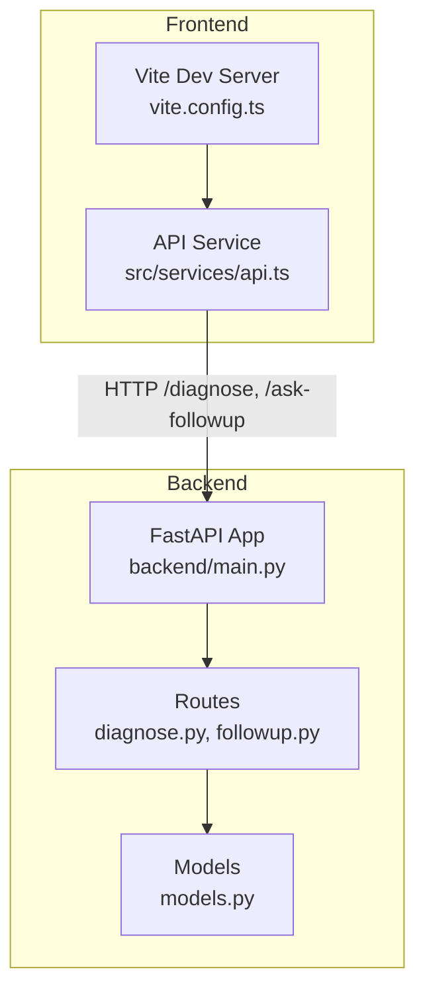
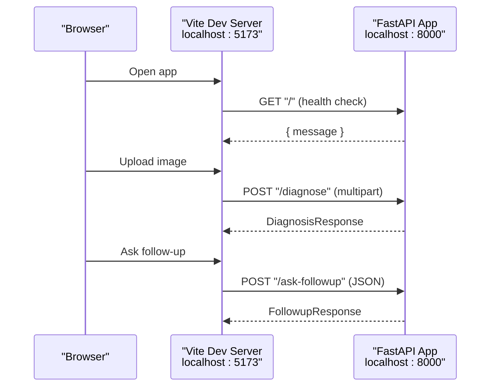
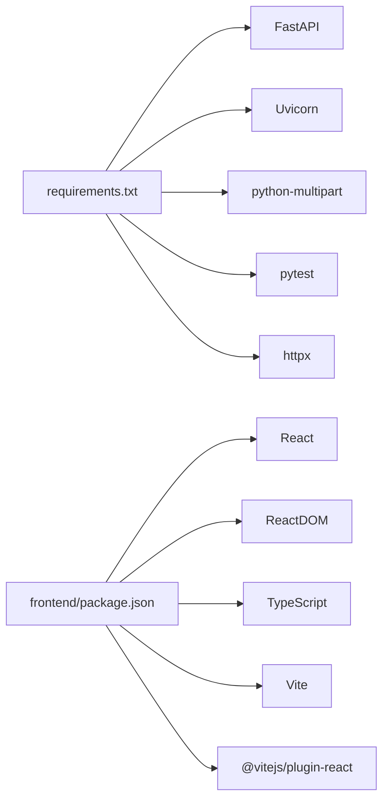

# Getting Started

<cite>
**Referenced Files in This Document**
- [README.md](file://README.md)
- [requirements.txt](file://requirements.txt)
- [backend/main.py](file://backend/main.py)
- [backend/routes/diagnose.py](file://backend/routes/diagnose.py)
- [backend/routes/followup.py](file://backend/routes/followup.py)
- [backend/models.py](file://backend/models.py)
- [frontend/package.json](file://frontend/package.json)
- [frontend/vite.config.ts](file://frontend/vite.config.ts)
- [frontend/README.md](file://frontend/README.md)
- [frontend/src/services/api.ts](file://frontend/src/services/api.ts)
</cite>

## Table of Contents
1. [Introduction](#introduction)
2. [Project Structure](#project-structure)
3. [Core Components](#core-components)
4. [Architecture Overview](#architecture-overview)
5. [Detailed Component Analysis](#detailed-component-analysis)
6. [Dependency Analysis](#dependency-analysis)
7. [Performance Considerations](#performance-considerations)
8. [Troubleshooting Guide](#troubleshooting-guide)
9. [Conclusion](#conclusion)
10. [Appendices](#appendices)

## Introduction
FasalDoc is a crop-disease diagnosis assistant with a FastAPI backend and a React/Vite frontend. The backend runs fully offline using mock responses until the real AI layer (Qwen/Alibaba Cloud) is configured. This guide helps you set up both backend and frontend locally, start development servers, and verify everything works end-to-end.

## Project Structure
At a high level:
- Backend: FastAPI app with routes for diagnosis and follow-up questions, models, and validators.
- Frontend: Vite + React application that calls the backend via a centralized API service.

**Diagram sources**
- [backend/main.py:9-38](file://backend/main.py#L9-L38)
- [backend/routes/diagnose.py:13-59](file://backend/routes/diagnose.py#L13-L59)
- [backend/routes/followup.py:10-39](file://backend/routes/followup.py#L10-L39)
- [backend/models.py:10-58](file://backend/models.py#L10-L58)
- [frontend/vite.config.ts:4-9](file://frontend/vite.config.ts#L4-L9)
- [frontend/src/services/api.ts:11-13](file://frontend/src/services/api.ts#L11-L13)

**Section sources**
- [README.md:7-15](file://README.md#L7-L15)

## Core Components
- Backend server entrypoint and CORS configuration
- Diagnosis route handling image uploads and validation
- Follow-up route handling JSON question payloads
- Frontend API client and environment-based base URL
- Development server configurations for backend and frontend

Key responsibilities:
- Backend exposes health, diagnosis, and follow-up endpoints.
- Frontend reads backend URL from an environment variable and communicates via fetch.
- Both sides validate inputs to provide consistent user experience.

**Section sources**
- [backend/main.py:9-38](file://backend/main.py#L9-L38)
- [backend/routes/diagnose.py:13-59](file://backend/routes/diagnose.py#L13-L59)
- [backend/routes/followup.py:10-39](file://backend/routes/followup.py#L10-L39)
- [frontend/src/services/api.ts:11-13](file://frontend/src/services/api.ts#L11-L13)
- [frontend/vite.config.ts:4-9](file://frontend/vite.config.ts#L4-L9)

## Architecture Overview
The runtime flow during development:
- Start the backend on port 8000.
- Start the frontend dev server on port 5173.
- Frontend requests are sent to the backend base URL configured via environment variable.

**Diagram sources**
- [frontend/src/services/api.ts:64-98](file://frontend/src/services/api.ts#L64-L98)
- [backend/routes/diagnose.py:13-59](file://backend/routes/diagnose.py#L13-L59)
- [backend/routes/followup.py:10-39](file://backend/routes/followup.py#L10-L39)
- [backend/main.py:40-44](file://backend/main.py#L40-L44)

## Detailed Component Analysis

### Prerequisites
- Python 3.10+
- Node.js 18+

These are required to run the backend and frontend respectively.

**Section sources**
- [README.md:17-20](file://README.md#L17-L20)

### Backend Setup and Run
1. Create and activate a virtual environment.
2. Install dependencies from requirements.
3. Configure optional environment variables (CORS origins, API keys).
4. Start the uvicorn server on port 8000.
5. Verify the health endpoint and API docs.

Notes:
- CORS defaults to allow the Vite dev server origins; override via environment variable if needed.
- The backend includes Swagger UI at /docs and OpenAPI spec at /openapi.json.

**Section sources**
- [README.md:22-67](file://README.md#L22-L67)
- [backend/main.py:19-35](file://backend/main.py#L19-L35)
- [requirements.txt:1-6](file://requirements.txt#L1-L6)

### Frontend Setup and Run
1. Navigate to the frontend directory.
2. Install dependencies.
3. Start the Vite dev server on port 5173.
4. Ensure the backend is running before starting the frontend.

Configuration:
- The frontend reads the backend base URL from an environment variable, defaulting to http://localhost:8000.
- The Vite dev server listens on port 5173 by default.

**Section sources**
- [README.md:69-78](file://README.md#L69-L78)
- [frontend/README.md:14-22](file://frontend/README.md#L14-L22)
- [frontend/package.json:6-9](file://frontend/package.json#L6-L9)
- [frontend/vite.config.ts:4-9](file://frontend/vite.config.ts#L4-L9)
- [frontend/src/services/api.ts:11-13](file://frontend/src/services/api.ts#L11-L13)

### Endpoints Summary
- GET / — Health check
- POST /diagnose — Multipart image upload returns diagnosis response
- POST /ask-followup — JSON question returns follow-up answer

These endpoints are defined in the backend and consumed by the frontend API service.

**Section sources**
- [README.md:80-87](file://README.md#L80-L87)
- [backend/routes/diagnose.py:13-59](file://backend/routes/diagnose.py#L13-L59)
- [backend/routes/followup.py:10-39](file://backend/routes/followup.py#L10-L39)
- [frontend/src/services/api.ts:64-98](file://frontend/src/services/api.ts#L64-L98)

## Dependency Analysis
- Backend depends on FastAPI, Uvicorn, multipart support, testing utilities, and HTTP client libraries.
- Frontend depends on React, ReactDOM, TypeScript, Vite, and the React plugin.

**Diagram sources**
- [requirements.txt:1-6](file://requirements.txt#L1-L6)
- [frontend/package.json:11-21](file://frontend/package.json#L11-L21)

**Section sources**
- [requirements.txt:1-6](file://requirements.txt#L1-L6)
- [frontend/package.json:11-21](file://frontend/package.json#L11-L21)

## Performance Considerations
- Keep image uploads under the enforced size limit to avoid unnecessary processing and errors.
- Use the backend’s built-in Swagger UI (/docs) to test endpoints quickly without the frontend.
- For local development, ensure only one instance of each server runs on its respective port to avoid conflicts.

[No sources needed since this section provides general guidance]

## Troubleshooting Guide
Common issues and resolutions:

- Cannot connect frontend to backend
  - Ensure the backend is running on http://localhost:8000 or set the correct base URL in the frontend environment variable.
  - Check CORS settings if you change the frontend origin or run it from another host.

- Port conflicts
  - If port 8000 or 5173 is already in use, stop the conflicting process or start services on different ports.

- Image upload rejected
  - Only JPEG, PNG, and WEBP images are accepted.
  - Images must be smaller than 10 MB.

- Empty or invalid input
  - Follow-up questions must be non-empty after trimming whitespace.
  - Ensure the uploaded file field name matches the expected form field.

- Verifying setup
  - Backend health: GET http://localhost:8000 should return a simple message.
  - API docs: Open http://localhost:8000/docs to explore and test endpoints.
  - Frontend: Open http://localhost:5173 and try uploading a valid image.

**Section sources**
- [backend/routes/diagnose.py:21-43](file://backend/routes/diagnose.py#L21-L43)
- [backend/routes/followup.py:18-23](file://backend/routes/followup.py#L18-L23)
- [backend/main.py:40-44](file://backend/main.py#L40-L44)
- [frontend/src/services/api.ts:28-44](file://frontend/src/services/api.ts#L28-L44)

## Conclusion
You now have the steps to install dependencies, configure environments, and start both the backend and frontend for local development. Use the health endpoint and Swagger UI to validate your setup, and refer to the troubleshooting tips if you encounter common issues. Once verified, you can proceed with building features or integrating the real AI layer as described in the repository documentation.

[No sources needed since this section summarizes without analyzing specific files]

## Appendices

### Quick Start Checklist
- Install Python 3.10+ and Node.js 18+.
- Create and activate a Python virtual environment.
- Install backend dependencies from requirements.
- Start the backend with uvicorn on port 8000.
- Install frontend dependencies and start the Vite dev server on port 5173.
- Verify backend health and open Swagger UI.
- Test image upload and follow-up question flows in the frontend.

**Section sources**
- [README.md:17-78](file://README.md#L17-L78)
- [frontend/README.md:14-22](file://frontend/README.md#L14-L22)