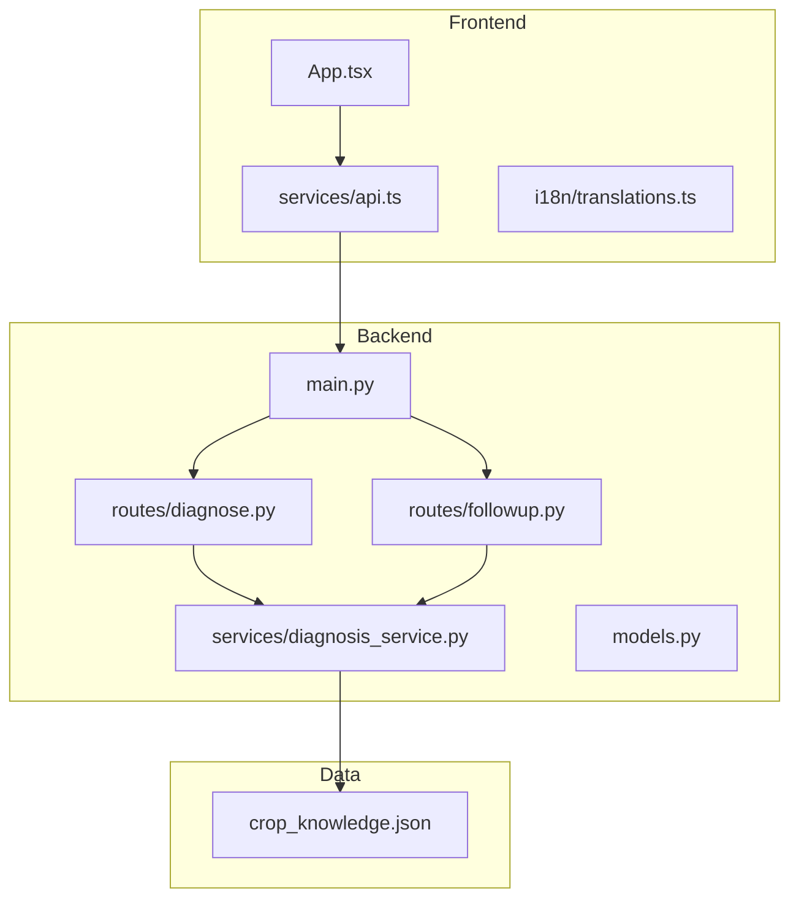
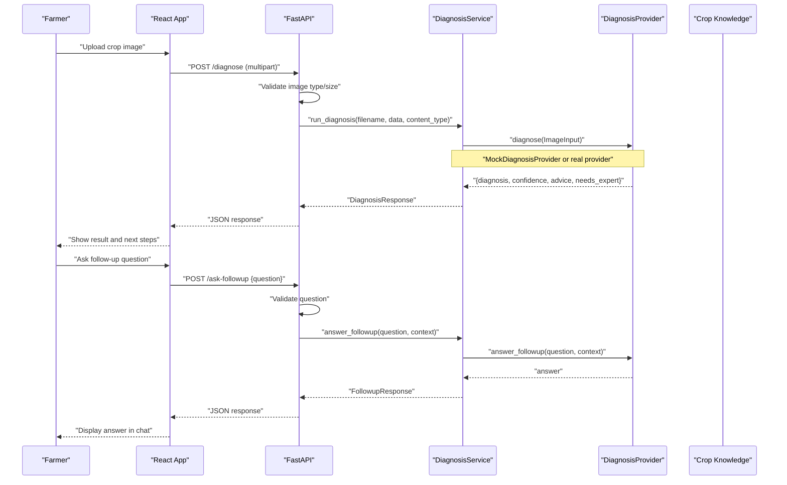
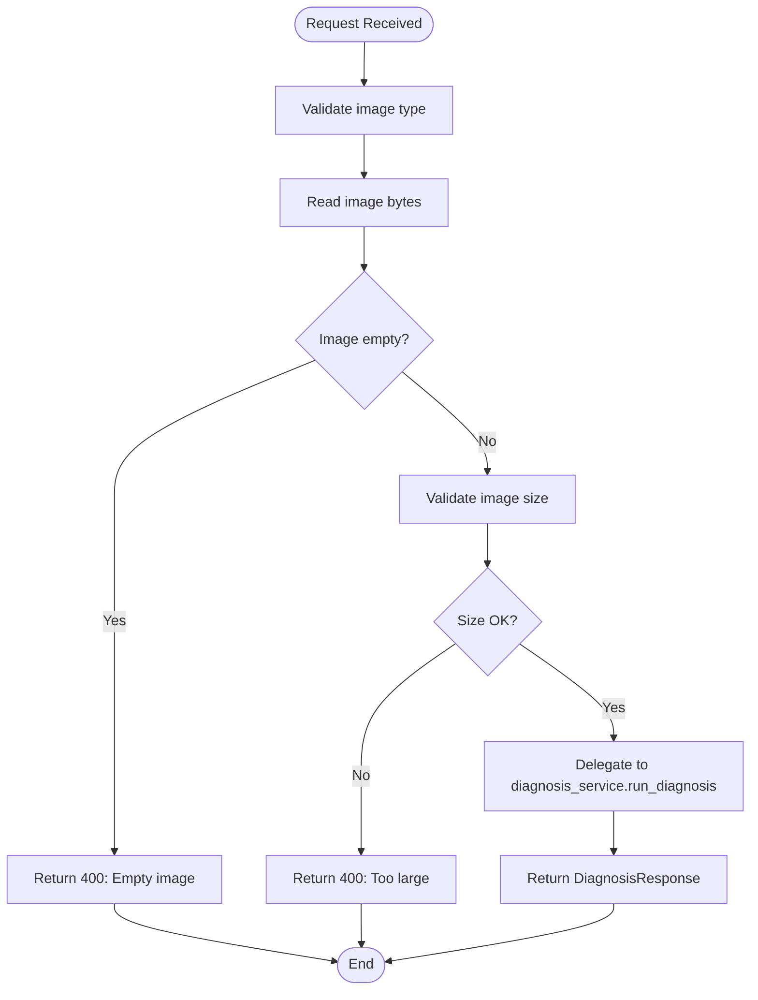
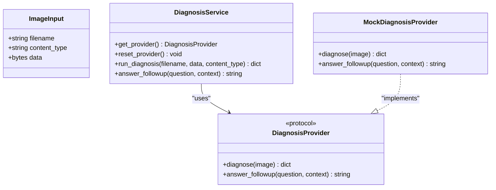
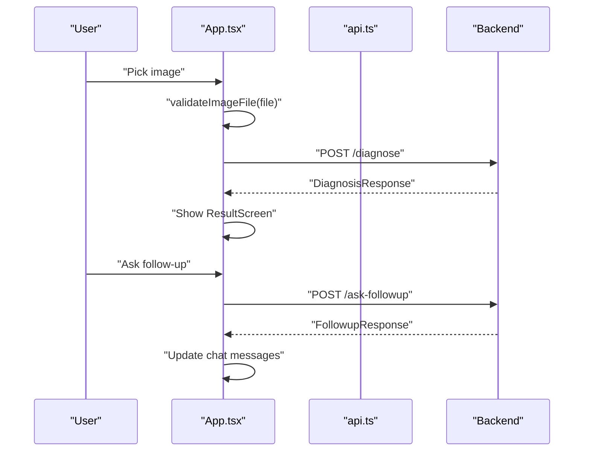
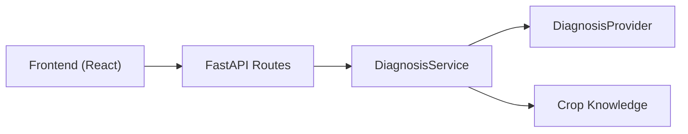

# Project Overview

<cite>
**Referenced Files in This Document**
- [README.md](file://README.md)
- [backend/main.py](file://backend/main.py)
- [backend/models.py](file://backend/models.py)
- [backend/routes/diagnose.py](file://backend/routes/diagnose.py)
- [backend/routes/followup.py](file://backend/routes/followup.py)
- [backend/services/diagnosis_service.py](file://backend/services/diagnosis_service.py)
- [frontend/src/App.tsx](file://frontend/src/App.tsx)
- [frontend/src/services/api.ts](file://frontend/src/services/api.ts)
- [frontend/src/i18n/translations.ts](file://frontend/src/i18n/translations.ts)
- [data/plant_disease_dataset/crop_knowledge.json](file://data/plant_disease_dataset/crop_knowledge.json)
</cite>

## Table of Contents
1. [Introduction](#introduction)
2. [Project Structure](#project-structure)
3. [Core Components](#core-components)
4. [Architecture Overview](#architecture-overview)
5. [Detailed Component Analysis](#detailed-component-analysis)
6. [Dependency Analysis](#dependency-analysis)
7. [Performance Considerations](#performance-considerations)
8. [Troubleshooting Guide](#troubleshooting-guide)
9. [Conclusion](#conclusion)

## Introduction
FasalDoc is an AI-powered crop disease diagnosis assistant designed for farmers and agricultural professionals. It is a full-stack web application that combines a FastAPI backend with a React frontend to provide automated crop disease detection, actionable advice, and a follow-up Q&A experience. The system currently runs fully offline using mock responses until the real AI provider (Qwen / Alibaba Cloud) is configured via environment variables.

Key goals:
- Help users upload images of crops and receive clear, understandable diagnoses and next steps.
- Offer a conversational follow-up Q&A to clarify symptoms, treatment, and prevention.
- Support multiple languages (English, Urdu, Roman Urdu) to reach local farming communities.
- Provide a secure, service-oriented backend with pluggable AI providers and robust error handling.

Target audience:
- Farmers seeking quick, practical guidance on visible crop problems.
- Agricultural extension workers and advisors who need consistent, evidence-based recommendations.

Conceptual overview for beginners:
- Upload a photo of your plant.
- FasalDoc analyzes the image and returns a diagnosis with confidence and recommended actions.
- Ask follow-up questions about the result to learn more about symptoms, treatment, and prevention.

Technical overview for developers:
- Frontend communicates with a FastAPI backend over HTTP.
- Backend routes validate inputs and delegate to a service layer.
- Service layer uses a DiagnosisProvider protocol; by default it falls back to MockDiagnosisProvider for offline mode.
- Real AI integration is isolated behind a factory method so routes remain unchanged when switching providers.

**Section sources**
- [README.md:1-106](file://README.md#L1-L106)
- [backend/main.py:9-17](file://backend/main.py#L9-L17)
- [backend/services/diagnosis_service.py:1-20](file://backend/services/diagnosis_service.py#L1-L20)

## Project Structure
The repository is organized into backend, frontend, data, tests, and documentation folders. The backend exposes REST endpoints for diagnosis and follow-up queries. The frontend implements a multi-screen user flow with authentication, image upload, analysis, results, and follow-up chat. Data includes a knowledge base for crops and diseases used to enrich results and support multilingual content.

**Diagram sources**
- [frontend/src/App.tsx:1-336](file://frontend/src/App.tsx#L1-L336)
- [frontend/src/services/api.ts:1-99](file://frontend/src/services/api.ts#L1-L99)
- [backend/main.py:1-45](file://backend/main.py#L1-L45)
- [backend/routes/diagnose.py:1-59](file://backend/routes/diagnose.py#L1-L59)
- [backend/routes/followup.py:1-40](file://backend/routes/followup.py#L1-L40)
- [backend/services/diagnosis_service.py:1-128](file://backend/services/diagnosis_service.py#L1-L128)
- [data/plant_disease_dataset/crop_knowledge.json:1-800](file://data/plant_disease_dataset/crop_knowledge.json#L1-L800)

**Section sources**
- [README.md:7-15](file://README.md#L7-L15)
- [backend/main.py:19-38](file://backend/main.py#L19-L38)
- [frontend/src/App.tsx:29-133](file://frontend/src/App.tsx#L29-L133)

## Core Components
- FastAPI application and CORS configuration for local development.
- Routes for diagnosis and follow-up queries with input validation and error handling.
- Service layer defining a stable DiagnosisProvider protocol and a MockDiagnosisProvider for offline mode.
- Pydantic models for request/response contracts shared between frontend and backend.
- React application managing screens, state, and API calls, including authentication and language toggling.
- Multilingual translations supporting English, Urdu, and Roman Urdu.
- Crop knowledge dataset providing structured information about plants, diseases, symptoms, treatments, and prevention.

Key capabilities:
- Image upload diagnosis with type and size validation.
- Follow-up Q&A with question validation and safe error handling.
- Pluggable AI provider pattern enabling seamless switch from mock to real AI without route changes.
- Offline mode ensuring the app works without external dependencies.

**Section sources**
- [backend/models.py:1-58](file://backend/models.py#L1-L58)
- [backend/routes/diagnose.py:13-59](file://backend/routes/diagnose.py#L13-L59)
- [backend/routes/followup.py:10-40](file://backend/routes/followup.py#L10-L40)
- [backend/services/diagnosis_service.py:40-128](file://backend/services/diagnosis_service.py#L40-L128)
- [frontend/src/services/api.ts:28-99](file://frontend/src/services/api.ts#L28-L99)
- [frontend/src/i18n/translations.ts:1-163](file://frontend/src/i18n/translations.ts#L1-L163)

## Architecture Overview
FasalDoc follows a service-oriented architecture with clear separation of concerns:
- Frontend screens orchestrate user flows and call centralized API helpers.
- Backend routes handle HTTP requests, validate inputs, and delegate to services.
- Services encapsulate business logic and abstract AI provider details behind a protocol.
- Data assets (knowledge base) inform responses and enrich UI content.

**Diagram sources**
- [frontend/src/App.tsx:187-237](file://frontend/src/App.tsx#L187-L237)
- [frontend/src/services/api.ts:64-99](file://frontend/src/services/api.ts#L64-L99)
- [backend/routes/diagnose.py:13-59](file://backend/routes/diagnose.py#L13-L59)
- [backend/routes/followup.py:10-40](file://backend/routes/followup.py#L10-L40)
- [backend/services/diagnosis_service.py:116-128](file://backend/services/diagnosis_service.py#L116-L128)

## Detailed Component Analysis

### Backend: FastAPI Application and Routing
- The FastAPI app registers CORS middleware for local development and mounts routers for diagnosis and follow-up.
- Health endpoint provides a simple status check.
- Routers enforce input validation and delegate to the service layer, ensuring internal errors are not leaked to clients.

**Diagram sources**
- [backend/routes/diagnose.py:13-59](file://backend/routes/diagnose.py#L13-L59)

**Section sources**
- [backend/main.py:19-45](file://backend/main.py#L19-L45)
- [backend/routes/diagnose.py:13-59](file://backend/routes/diagnose.py#L13-L59)
- [backend/routes/followup.py:10-40](file://backend/routes/followup.py#L10-L40)

### Backend: Service Layer and Pluggable AI Provider Pattern
- The service layer defines a DiagnosisProvider protocol with diagnose and answer_followup methods.
- A MockDiagnosisProvider satisfies the protocol and returns deterministic, contract-valid responses for offline mode.
- A provider factory selects the real provider if credentials are present; otherwise, it falls back to the mock.
- Route code remains unchanged when swapping providers, promoting maintainability and testability.

**Diagram sources**
- [backend/services/diagnosis_service.py:31-128](file://backend/services/diagnosis_service.py#L31-L128)

**Section sources**
- [backend/services/diagnosis_service.py:1-128](file://backend/services/diagnosis_service.py#L1-L128)

### Frontend: React Application Flow
- The app manages screen transitions, file selection, diagnosis execution, and follow-up chat.
- Centralized API service handles network calls, error parsing, and validation mirroring backend constraints.
- Authentication checks direct users to login/signup or dashboard based on session state.
- Language context enables multilingual UI strings across screens.

**Diagram sources**
- [frontend/src/App.tsx:178-237](file://frontend/src/App.tsx#L178-L237)
- [frontend/src/services/api.ts:64-99](file://frontend/src/services/api.ts#L64-L99)

**Section sources**
- [frontend/src/App.tsx:29-336](file://frontend/src/App.tsx#L29-L336)
- [frontend/src/services/api.ts:1-99](file://frontend/src/services/api.ts#L1-L99)

### Data: Crop Knowledge Base
- Structured JSON contains metadata, plants, diseases, symptoms, causes, treatments, prevention, and images.
- Supports bilingual content (English and Urdu) and includes disclaimers emphasizing educational use and consultation with local experts.
- Provides rich context for enhancing diagnosis results and informing follow-up answers.

**Section sources**
- [data/plant_disease_dataset/crop_knowledge.json:1-800](file://data/plant_disease_dataset/crop_knowledge.json#L1-L800)

## Dependency Analysis
- Frontend depends on backend endpoints for diagnosis and follow-up.
- Backend routes depend on service layer and validators; service layer depends on provider protocol and optional real provider module.
- Data assets are consumed by service logic to enrich responses and guide UI messaging.

**Diagram sources**
- [frontend/src/services/api.ts:1-99](file://frontend/src/services/api.ts#L1-L99)
- [backend/routes/diagnose.py:1-59](file://backend/routes/diagnose.py#L1-L59)
- [backend/routes/followup.py:1-40](file://backend/routes/followup.py#L1-L40)
- [backend/services/diagnosis_service.py:1-128](file://backend/services/diagnosis_service.py#L1-L128)

**Section sources**
- [backend/main.py:19-38](file://backend/main.py#L19-L38)
- [backend/services/diagnosis_service.py:80-105](file://backend/services/diagnosis_service.py#L80-L105)

## Performance Considerations
- Input validation occurs early in both frontend and backend to reduce unnecessary processing and network calls.
- Offline mode ensures responsiveness without external dependencies; real AI integration should be optimized for latency and caching where appropriate.
- Image size limits prevent excessive memory usage and slow uploads.
- Service layer caches provider instance to avoid repeated initialization overhead.

[No sources needed since this section provides general guidance]

## Troubleshooting Guide
Common issues and resolutions:
- Network errors: Ensure the backend is running and CORS allows the frontend origin.
- Validation errors: Confirm image type and size match allowed values; ensure question text is non-empty.
- Server errors: Internal exceptions are caught and returned as generic messages; check backend logs for root cause.
- Offline behavior: Without configured credentials, the app uses mock responses; set DASHSCOPE_API_KEY to enable real AI.

Operational tips:
- Use Swagger/OpenAPI docs at /docs and /openapi.json to inspect endpoints and payloads.
- Run tests locally to verify offline functionality without network calls.

**Section sources**
- [backend/routes/diagnose.py:21-59](file://backend/routes/diagnose.py#L21-L59)
- [backend/routes/followup.py:18-34](file://backend/routes/followup.py#L18-L34)
- [frontend/src/services/api.ts:46-99](file://frontend/src/services/api.ts#L46-L99)
- [README.md:50-67](file://README.md#L50-L67)

## Conclusion
FasalDoc delivers a practical, accessible tool for crop disease diagnosis tailored to farmers and agricultural professionals. Its service-oriented design, pluggable AI provider pattern, and offline-first approach ensure reliability and ease of integration. With multilingual support and a comprehensive knowledge base, the platform bridges technical implementation with user-centered outcomes. Developers can extend the system by implementing a real DiagnosisProvider while keeping routes unchanged, and users benefit from clear diagnostics, actionable advice, and a conversational follow-up experience.

[No sources needed since this section summarizes without analyzing specific files]