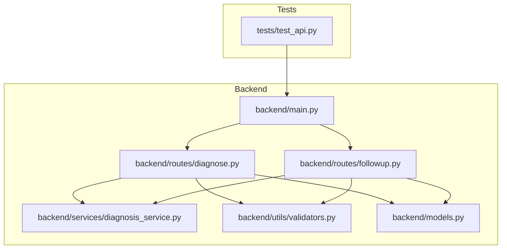
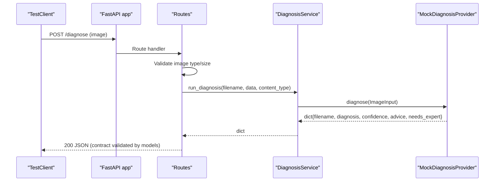
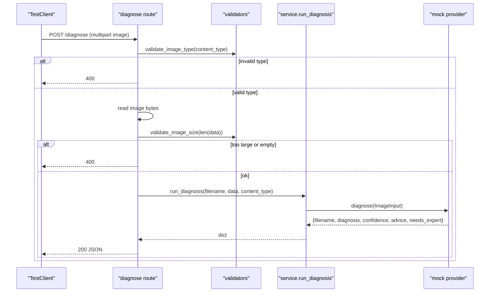
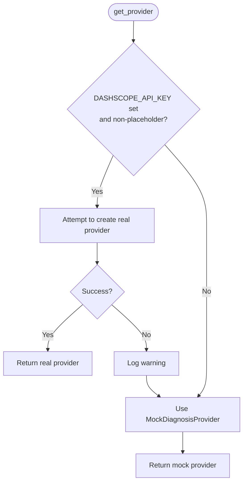
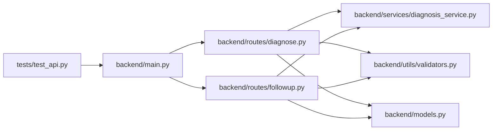

# Testing Strategy

<cite>
**Referenced Files in This Document**
- [test_api.py](file://tests/test_api.py)
- [main.py](file://backend/main.py)
- [diagnose.py](file://backend/routes/diagnose.py)
- [followup.py](file://backend/routes/followup.py)
- [diagnosis_service.py](file://backend/services/diagnosis_service.py)
- [validators.py](file://backend/utils/validators.py)
- [models.py](file://backend/models.py)
- [requirements.txt](file://requirements.txt)
- [Member5_Testing_Report.csv](file://documentation/Member5_Testing_Report.csv)
</cite>

## Table of Contents
1. Introduction
2. Project Structure
3. Core Components
4. Architecture Overview
5. Detailed Component Analysis
6. Dependency Analysis
7. Performance Considerations
8. Troubleshooting Guide
9. Conclusion
10. Appendices

## Introduction
This document explains FasalDoc’s testing strategy to ensure code quality and reliability. The project uses a pytest-based test suite that runs entirely offline, avoiding external dependencies and AI service calls. Tests cover FastAPI endpoints using TestClient, service-layer behavior with mocked providers, and utility validation functions. It also provides guidelines for writing effective tests, managing test data, asserting responses, extending the suite for new features, and maintaining coverage.

## Project Structure
The backend is organized into routes (FastAPI endpoints), a service layer (provider abstraction with offline mock), utilities (validators), and models (Pydantic schemas). The test suite lives under tests and exercises the API via FastAPI’s TestClient while ensuring no network calls are made.

**Diagram sources**
- [test_api.py:1-129](file://tests/test_api.py#L1-L129)
- [main.py:1-45](file://backend/main.py#L1-L45)
- [diagnose.py:1-59](file://backend/routes/diagnose.py#L1-L59)
- [followup.py:1-40](file://backend/routes/followup.py#L1-L40)
- [diagnosis_service.py:1-128](file://backend/services/diagnosis_service.py#L1-L128)
- [validators.py:1-19](file://backend/utils/validators.py#L1-L19)
- [models.py:1-58](file://backend/models.py#L1-L58)

**Section sources**
- [test_api.py:1-129](file://tests/test_api.py#L1-L129)
- [main.py:1-45](file://backend/main.py#L1-L45)

## Core Components
- FastAPI application and CORS configuration
- Endpoints for diagnosis and follow-up Q&A
- Service layer with provider abstraction and offline mock fallback
- Validators for image type/size and question content
- Pydantic models defining request/response contracts
- Offline-first pytest suite using TestClient

Key responsibilities:
- Routes validate inputs and delegate to the service layer.
- Service layer selects a real provider if configured; otherwise uses a deterministic mock.
- Validators enforce constraints on uploads and questions.
- Models define strict schemas used by routes and tests.

**Section sources**
- [main.py:1-45](file://backend/main.py#L1-L45)
- [diagnose.py:1-59](file://backend/routes/diagnose.py#L1-L59)
- [followup.py:1-40](file://backend/routes/followup.py#L1-L40)
- [diagnosis_service.py:1-128](file://backend/services/diagnosis_service.py#L1-L128)
- [validators.py:1-19](file://backend/utils/validators.py#L1-L19)
- [models.py:1-58](file://backend/models.py#L1-L58)

## Architecture Overview
The testing architecture ensures all tests run offline by design:
- Tests use FastAPI TestClient to exercise endpoints without starting a server process.
- The service layer falls back to a MockDiagnosisProvider when credentials are absent or construction fails.
- Validators and models provide deterministic input/output contracts.

**Diagram sources**
- [diagnose.py:13-59](file://backend/routes/diagnose.py#L13-L59)
- [diagnosis_service.py:116-123](file://backend/services/diagnosis_service.py#L116-L123)
- [diagnosis_service.py:55-73](file://backend/services/diagnosis_service.py#L55-L73)
- [models.py:10-31](file://backend/models.py#L10-L31)

## Detailed Component Analysis

### API Endpoint Tests
The test suite covers:
- Health endpoint returns expected message and status.
- Follow-up endpoint validates payload, rejects empty/whitespace-only questions, and returns structured responses.
- Diagnosis endpoint validates file type, rejects empty or oversized images, and returns contract-compliant JSON.
- OpenAPI docs availability and endpoint exposure.
- CORS allows local frontend origin.

These tests assert:
- Status codes for success and error cases.
- Response shape and field types/ranges.
- Environment-independent behavior via mock provider.

**Section sources**
- [test_api.py:16-103](file://tests/test_api.py#L16-L103)
- [main.py:40-45](file://backend/main.py#L40-L45)
- [followup.py:10-39](file://backend/routes/followup.py#L10-L39)
- [diagnose.py:13-59](file://backend/routes/diagnose.py#L13-L59)

#### Sequence: Diagnose Flow Under Test

**Diagram sources**
- [diagnose.py:13-59](file://backend/routes/diagnose.py#L13-L59)
- [validators.py:1-19](file://backend/utils/validators.py#L1-L19)
- [diagnosis_service.py:116-123](file://backend/services/diagnosis_service.py#L116-L123)
- [diagnosis_service.py:55-73](file://backend/services/diagnosis_service.py#L55-L73)

### Service Layer Testing with Mocked Providers
- The service exposes get_provider() and reset_provider() to control which provider is active during tests.
- When DASHSCOPE_API_KEY is missing or placeholder, the service uses MockDiagnosisProvider deterministically.
- Tests verify:
  - Provider selection falls back to mock without credentials.
  - run_diagnosis returns fields matching the model contract.
  - answer_followup returns a string.

**Diagram sources**
- [diagnosis_service.py:75-111](file://backend/services/diagnosis_service.py#L75-L111)
- [diagnosis_service.py:55-73](file://backend/services/diagnosis_service.py#L55-L73)

**Section sources**
- [diagnosis_service.py:55-128](file://backend/services/diagnosis_service.py#L55-L128)
- [test_api.py:114-129](file://tests/test_api.py#L114-L129)

### Utility Function Testing
Validators enforce:
- Allowed image MIME types.
- Maximum image size.
- Non-empty, non-whitespace-only questions.

Tests indirectly validate these behaviors through endpoint assertions (e.g., rejecting unsupported types, empty uploads, oversized files, and empty questions). To add direct unit tests for validators, create small functions that assert boolean outcomes for known inputs.

**Section sources**
- [validators.py:1-19](file://backend/utils/validators.py#L1-L19)
- [diagnose.py:21-43](file://backend/routes/diagnose.py#L21-L43)
- [followup.py:18-23](file://backend/routes/followup.py#L18-L23)
- [test_api.py:64-91](file://tests/test_api.py#L64-L91)

### Model-Based Assertions
Responses are validated against Pydantic models, ensuring:
- Field presence and types.
- Confidence within 0..1.
- Boolean flags for expert escalation.
- Echoed question and answer structure for follow-up.

Tests assert response keys and value ranges to guarantee contract compliance.

**Section sources**
- [models.py:10-58](file://backend/models.py#L10-L58)
- [test_api.py:54-62](file://tests/test_api.py#L54-L62)
- [test_api.py:35-39](file://tests/test_api.py#L35-L39)

## Dependency Analysis
The test suite depends on:
- FastAPI TestClient for HTTP-level testing.
- The application module to mount routers and middleware.
- The service layer to isolate business logic from network calls.

**Diagram sources**
- [test_api.py:1-129](file://tests/test_api.py#L1-L129)
- [main.py:1-45](file://backend/main.py#L1-L45)
- [diagnose.py:1-59](file://backend/routes/diagnose.py#L1-L59)
- [followup.py:1-40](file://backend/routes/followup.py#L1-L40)
- [diagnosis_service.py:1-128](file://backend/services/diagnosis_service.py#L1-L128)
- [validators.py:1-19](file://backend/utils/validators.py#L1-L19)
- [models.py:1-58](file://backend/models.py#L1-L58)

**Section sources**
- [requirements.txt:1-6](file://requirements.txt#L1-L6)
- [test_api.py:1-129](file://tests/test_api.py#L1-L129)

## Performance Considerations
- Keep tests fast and deterministic by relying on the mock provider.
- Avoid heavy payloads; tests already check upper bounds for image size.
- Reuse a single TestClient instance per module to reduce setup overhead.
- Reset provider state between tests to avoid cross-test pollution.

[No sources needed since this section provides general guidance]

## Troubleshooting Guide
Common issues and resolutions:
- External AI dependency errors: Ensure DASHSCOPE_API_KEY is unset or placeholder so the mock provider is used. Tests call reset_provider() to clear cached provider state.
- Unexpected 422 errors: Verify request payloads match Pydantic models (required fields, types, and constraints).
- CORS failures in local dev: Confirm Origin header matches allowed origins configured in main.
- Image upload rejections: Ensure content type is one of JPEG, PNG, WEBP and size is under the limit.

**Section sources**
- [diagnosis_service.py:75-111](file://backend/services/diagnosis_service.py#L75-L111)
- [test_api.py:114-118](file://tests/test_api.py#L114-L118)
- [main.py:19-35](file://backend/main.py#L19-L35)
- [diagnose.py:21-43](file://backend/routes/diagnose.py#L21-L43)
- [models.py:34-58](file://backend/models.py#L34-L58)

## Conclusion
FasalDoc’s testing strategy centers on an offline-first approach using pytest and FastAPI’s TestClient. The service layer’s provider abstraction guarantees deterministic behavior without external services. Tests validate endpoint contracts, error handling, and CORS behavior. By following the guidelines below, you can extend the suite confidently while preserving reliability and speed.

[No sources needed since this section summarizes without analyzing specific files]

## Appendices

### How to Run Tests
- Install dependencies listed in requirements.txt.
- Execute pytest from the repository root to run all tests under tests/.

**Section sources**
- [requirements.txt:1-6](file://requirements.txt#L1-L6)
- [test_api.py:1-129](file://tests/test_api.py#L1-L129)

### Guidelines for Writing Effective Tests
- Prefer integration-style endpoint tests with TestClient for user-facing flows.
- Isolate service-layer behavior by mocking or controlling provider selection.
- Assert both status codes and response shapes/types.
- Cover positive paths, negative paths (invalid types, empty bodies, oversized files), and edge cases (whitespace-only questions).
- Keep tests deterministic: do not rely on randomness or network calls.

**Section sources**
- [test_api.py:16-103](file://tests/test_api.py#L16-L103)
- [diagnosis_service.py:55-73](file://backend/services/diagnosis_service.py#L55-L73)

### Test Data Management
- Use minimal fake binary payloads for image uploads in tests.
- Define constants for reusable test fixtures (e.g., valid image tuple).
- For complex scenarios, consider parametrized tests over different inputs.

**Section sources**
- [test_api.py:13-14](file://tests/test_api.py#L13-L14)
- [test_api.py:64-86](file://tests/test_api.py#L64-L86)

### Assertion Patterns
- Validate status codes for success and error conditions.
- Assert exact response keys and value ranges (e.g., confidence in 0..1).
- For follow-up, assert the returned answer is a non-empty string.
- For OpenAPI, assert expected endpoints are present.

**Section sources**
- [test_api.py:18-25](file://tests/test_api.py#L18-L25)
- [test_api.py:54-62](file://tests/test_api.py#L54-L62)
- [test_api.py:100-102](file://tests/test_api.py#L100-L102)

### Extending the Test Suite for New Features
- Add new endpoint tests under tests/ mirroring existing patterns.
- If adding new providers, ensure they implement the same interface and update provider selection logic if needed.
- Update models if response/request contracts change, then adjust tests accordingly.
- Add validator tests for any new constraints.

**Section sources**
- [diagnosis_service.py:40-52](file://backend/services/diagnosis_service.py#L40-L52)
- [models.py:10-58](file://backend/models.py#L10-L58)
- [validators.py:1-19](file://backend/utils/validators.py#L1-L19)

### Maintaining Test Coverage
- Aim to cover all public endpoints and critical branches (validation, error handling).
- Include negative tests for each constraint (type, size, emptiness).
- Periodically review uncovered lines and add targeted tests.
- Keep provider reset logic in place to avoid state leakage across tests.

**Section sources**
- [test_api.py:114-118](file://tests/test_api.py#L114-L118)
- [diagnose.py:21-59](file://backend/routes/diagnose.py#L21-L59)
- [followup.py:18-39](file://backend/routes/followup.py#L18-L39)

### Examples of Common Scenarios
- Image upload validation:
  - Reject unsupported MIME types.
  - Reject empty uploads.
  - Reject oversized images.
- Error handling:
  - Return 400 for client input errors.
  - Return 422 for missing required fields.
  - Return 500 for unexpected internal errors.
- Edge cases:
  - Whitespace-only questions rejected.
  - CORS headers correct for local development origin.

**Section sources**
- [diagnose.py:21-59](file://backend/routes/diagnose.py#L21-L59)
- [followup.py:18-39](file://backend/routes/followup.py#L18-L39)
- [test_api.py:41-91](file://tests/test_api.py#L41-L91)
- [test_api.py:107-109](file://tests/test_api.py#L107-L109)

### Reporting and Tracking
A CSV report captures high-level test results and categories for traceability.

**Section sources**
- [Member5_Testing_Report.csv:1-8](file://documentation/Member5_Testing_Report.csv#L1-L8)